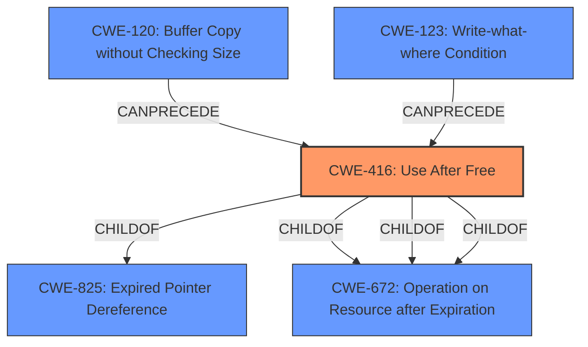

# Enhanced Analysis for CVE-2021-30591

# Summary
| CWE ID | CWE Name | Confidence | CWE Abstraction Level | CWE Vulnerability Mapping Label | CWE-Vulnerability Mapping Notes |
|---|---|---|---|---|---|
| CWE-416 | Use After Free | 1.0 | Variant | Allowed | Primary CWE |

## Evidence and Confidence

*   **Confidence Score:** 1.0
*   **Evidence Strength:** HIGH

## Relationship Analysis
The primary identified CWE is CWE-416 (**Use After Free**), which is a Variant level CWE. CWE-416 is a child of CWE-825 (**Expired Pointer Dereference**) and CWE-672 (**Operation on Resource after Expiration**). The 'CanPrecede' relationship shows how CWE-416 can be the result of other memory corruption issues like CWE-120 (**Buffer Copy without Checking Size**) and CWE-123 (**Write-what-where Condition**). Selecting the Variant, CWE-416, provides the best level of specificity.



## Vulnerability Chain
The vulnerability chain for this vulnerability is straightforward. The **root cause** is a **use-after-free** error (CWE-416) in the File System API. This **use-after-free** condition leads to heap corruption, which is the impact.

## Summary of Analysis
The analysis is based on the vulnerability description, which explicitly states "**use after free**" as the **root cause**. The CVE Reference Links Content Summary confirms this, stating, "The vulnerability is a use-after-free error in the File System API of the Chromium browser" and "The vulnerability occurs when the program tries to access a memory location that has already been freed". The primary CWE match from similar CVE descriptions is also CWE-416.

The Retriever Results also lists CWE-416 as the top combined result.

Therefore, the selection of CWE-416 is strongly supported by evidence and is at the appropriate level of specificity (Variant).

CWE-366 (**Race Condition within a Thread**) was considered, but it doesn't fit because the description focuses on accessing memory after it has been freed, rather than a race condition.

CWE-843 (**Access of Resource Using Incompatible Type**) was considered, but it is not as accurate as CWE-416 because the vulnerability is specifically a **use-after-free**, not a type confusion issue.

CWE-122 (**Heap-based Buffer Overflow**) was considered because the vulnerability leads to heap corruption, but the **root cause** is **use-after-free**, not a buffer overflow.

CWE-415 (**Double Free**) was also considered, but is not accurate because the vulnerability description specifies a **use-after-free** condition, not a double free.


## CWE Relationship Analysis

Current CWEs represent these abstraction levels: .


### Vulnerability Chain Analysis

**Chain starting from CWE-415:**
- 415 (Double Free) - ROOT


**Chain starting from CWE-123:**
- 123 (Write-what-where Condition) - ROOT


### CWE Relationship Diagram

```mermaid
graph TD
    classDef primary fill:#f96,stroke:#333,stroke-width:2px
    classDef secondary fill:#69f,stroke:#333
    classDef tertiary fill:#9e9,stroke:#333
```