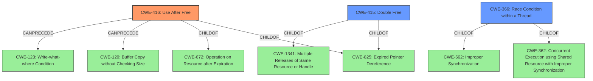

# Analysis Report for CVE-2021-30601

# Vulnerability Analysis Report: CVE-2021-30601

## Description


## Analysis (with Relationship Data)

# Summary
| CWE ID | CWE Name | Confidence | CWE Abstraction Level | CWE Vulnerability Mapping Label | CWE-Vulnerability Mapping Notes |
|---|---|---|---|---|---|
| CWE-416 | Use After Free | 1.0 | Variant | Allowed | Primary CWE |
| CWE-366 | Race Condition within a Thread | 0.4 | Base | Allowed | Secondary Candidate |
| CWE-415 | Double Free | 0.3 | Variant | Allowed | Secondary Candidate |

## Evidence and Confidence

*   **Confidence Score:** 0.9
*   **Evidence Strength:** HIGH

## Relationship Analysis
The primary CWE, CWE-416 **Use After Free**, is a variant of CWE-825 **Expired Pointer Dereference** and CWE-672 **Operation on Resource after Expiration**. This hierarchical relationship confirms that CWE-416 is a specific type of resource management error. The `CanPrecede` relationships to CWE-120 **Buffer Copy without Checking Size of Input** and CWE-123 **Write-what-where Condition** suggest potential attack vectors following a use-after-free vulnerability.

The secondary CWE, CWE-366 **Race Condition within a Thread**, is related to CWE-362 **Concurrent Execution using Shared Resource with Improper Synchronization** and CWE-662 **Improper Synchronization**. This indicates that concurrency issues might be present.

The other secondary CWE, CWE-415 **Double Free**, is a variant of CWE-825 **Expired Pointer Dereference** and CWE-1341 **Multiple Releases of Same Resource or Handle**. This indicates it's a memory management issue, but less likely than CWE-416.



## Vulnerability Chain
The vulnerability chain starts with a **Use after free** (CWE-416) in the Extensions API of Google Chrome. This **root cause** leads to potential heap corruption, which is the **impact**. An attacker can trigger this by convincing a user to install a malicious extension and then crafting a specific HTML page.

## Summary of Analysis
The initial analysis strongly points to CWE-416 **Use After Free** as the primary weakness, supported by the "**rootcause:** **Use after free**" key phrase and the "Root cause of vulnerability: Use-after-free vulnerability" statement in the CVE Reference Links Content Summary. The description of CWE-416 perfectly matches the vulnerability: "The product reuses or references memory after it has been freed." The impact, heap corruption, is a typical consequence of use-after-free.

The presence of "The Extensions API component in Chromium has a use-after-free flaw" further solidifies this assessment. The use of a crafted HTML page to trigger the vulnerability suggests a potential attack vector, but the core issue remains the **improper memory management**.

CWE-366 **Race Condition within a Thread** and CWE-415 **Double Free** were considered as secondary candidates due to their potential relationship with memory management issues, and their retriever scores. However, the evidence does not directly support these, making them less likely. The description mentions "heap corruption" as an impact, not a buffer overflow, so CWE-122 **Heap-based Buffer Overflow** is not appropriate.

The selection of CWE-416 is at the optimal level of specificity as it precisely describes the **Use after free** condition, which is the **root cause** of this vulnerability.

Relevant CWE Information:

# Enhanced Context (25 CWEs)

## CWE-416: Use After Free
**Abstraction:** Variant
**Status:** Stable

### Description
The product reuses or references memory after it has been freed. At some point afterward, the memory may be allocated again and saved in another pointer, while the original pointer references a location somewhere within the new allocation. Any operations using the original pointer are no longer valid because the memory "belongs" to the code that operates on the new pointer.

### Mapping Guidance
**Usage:** Allowed
**Rationale:** This CWE entry is at the Variant level of abstraction, which is a preferred level of abstraction for mapping to the root causes of vulnerabilities.

## CWE-366: Race Condition within a Thread
**Abstraction:** Base
**Status:** Draft

### Description
If two threads of execution use a resource simultaneously, there exists the possibility that resources may be used while invalid, in turn making the state of execution undefined.

### Mapping Guidance
**Usage:** Allowed
**Rationale:** This CWE entry is at the Base level of abstraction, which is a preferred level of abstraction for mapping to the root causes of vulnerabilities.

## CWE-415: Double Free
**Abstraction:** Variant
**Status:** Draft

### Description
The product calls free() twice on the same memory address, potentially leading to modification of unexpected memory locations.

### Mapping Guidance
**Usage:** Allowed
**Rationale:** This CWE entry is at the Variant level of abstraction, which is a preferred level of abstraction for mapping to the root causes of vulnerabilities.


## CWE Relationship Analysis

Current CWEs represent these abstraction levels: .


### Vulnerability Chain Analysis

**Chain starting from CWE-415:**
- 415 (Double Free) - ROOT


**Chain starting from CWE-662:**
- 662 (Improper Synchronization) - ROOT


### CWE Relationship Diagram

```mermaid
graph TD
    classDef primary fill:#f96,stroke:#333,stroke-width:2px
    classDef secondary fill:#69f,stroke:#333
    classDef tertiary fill:#9e9,stroke:#333
```


*Report generated on 2025-04-02 01:31:43*
