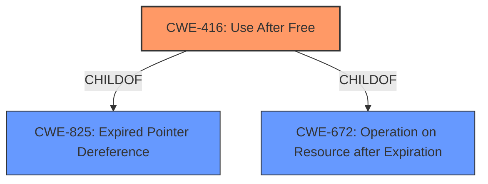

# Raw Analyzer Response for CVE-2021-30602

# Summary
| CWE ID | CWE Name | Confidence | CWE Abstraction Level | CWE Vulnerability Mapping Label | CWE-Vulnerability Mapping Notes |
|---|---|---|---|---|---|
| CWE-416 | Use After Free | 1.0 | Variant | Allowed | Primary CWE |

## Evidence and Confidence

*   **Confidence Score:** 1.0
*   **Evidence Strength:** HIGH

## Relationship Analysis
The primary relationship impacting the decision is the hierarchical structure, with CWE-416 being a Variant of higher-level Class CWEs. There is no direct parent-child relationship specified, but `CWE-416` is a `ChildOf` `CWE-825` (Expired Pointer Dereference) and `CWE-672` (Operation on Resource after Expiration). The retriever results also point to potential chain relationships (`CanPrecede`), but there isn't sufficient evidence in the description to support these. The abstraction level influenced the selection by favoring the more specific Variant CWE-416 over broader Class-level CWEs.

## Vulnerability Chain
The vulnerability chain is relatively simple:
  1. **ROOTCAUSE**: **Use after free** (CWE-416)
  2. Impact: Heap corruption

## Summary of Analysis
The initial analysis correctly identified the **use-after-free** condition as the primary weakness. The final decision to assign CWE-416 is strongly supported by the evidence provided.

The vulnerability description clearly states "Use after free in WebRTC" and the CVE Reference Links Content Summary confirms this, stating "A use after free vulnerability exists in the WebRTC functionality". This is direct evidence.
The root cause is further elaborated in the CVE Reference Links Content Summary: "The vulnerability occurs when garbage collection is triggered before an ICE candidate is fully processed, marking memory used by a Promise for collection. Subsequently, the execution of `AddIceCandidate` attempts to access the freed memory, causing a **use-after-free** condition."

The graph relationships, particularly the child-of relationships, reinforce that CWE-416 is the most specific and appropriate classification. The mapping guidance for CWE-416 explicitly allows its usage, further solidifying the selection.

The selection of CWE-416 is at the optimal level of specificity, being a Variant, which is preferred. There is no indication of other weaknesses or contributing factors based on the provided information.

Relevant CWE Information:

# Enhanced Context (25 CWEs)

## CWE-404: Improper Resource Shutdown or Release
**Abstraction Level**: Class
**Similarity Score**: 0.80
**Source**: dense

**Description**:
The product does not release or incorrectly releases a resource before it is made available for re-use.

**Mapping Guidance**:
- Usage: Allowed-with-Review
- Rationale: This CWE entry is a Class and might have Base-level children that would be more appropriate
This CWE was not selected as the root cause is the resource was freed, but still in use.

## CWE-226: Sensitive Information in Resource Not Removed Before Reuse
**Abstraction Level**: Base
**Similarity Score**: 0.79
**Source**: dense

**Description**:
The product releases a resource such as memory or a file so that it can be made available for reuse, but it does not clear or "zeroize" the information contained in the resource before the product performs a critical state transition or makes the resource available for reuse by other entities.

**Mapping Guidance**:
- Usage: Allowed
- Rationale: This CWE entry is at the Base level of abstraction, which is a preferred level of abstraction for mapping to the root causes of vulnerabilities.
This CWE was not selected as there is no mention of sensitive information in the vulnerability description.

## CWE-366: Race Condition within a Thread
**Abstraction Level**: Base
**Similarity Score**: 0.78
**Source**: dense

**Description**:
If two threads of execution use a resource simultaneously, there exists the possibility that resources may be used while invalid, in turn making the state of execution undefined.

**Mapping Guidance**:
- Usage: Allowed
- Rationale: This CWE entry is at the Base level of abstraction, which is a preferred level of abstraction for mapping to the root causes of vulnerabilities.
This CWE was not selected because while there is a mention of garbage collection, there is no mention of multiple threads.

## CWE-667: Improper Locking
**Abstraction Level**: Class
**Similarity Score**: 0.77
**Source**: dense

**Description**:
The product does not properly acquire or release a lock on a resource, leading to unexpected resource state changes and behaviors.

**Mapping Guidance**:
- Usage: Allowed-with-Review
- Rationale: This CWE entry is a Class and might have Base-level children that would be more appropriate
This CWE was not selected because there is no mention of improper locking in the vulnerability description.

## CWE-911: Improper Update of Reference Count
**Abstraction Level**: Base
**Similarity Score**: 0.77
**Source**: dense

**Description**:
The product uses a reference count to manage a resource, but it does not update or incorrectly updates the reference count.

**Mapping Guidance**:
- Usage: Allowed
- Rationale: This CWE entry is at the Base level of abstraction, which is a preferred level of abstraction for mapping to the root causes of vulnerabilities.
This CWE was not selected because there is no mention of reference count in the vulnerability description.

## CWE-415: Double Free
**Abstraction Level**: Variant
**Similarity Score**: 0.75
**Source**: dense

**Description**:
The product calls free() twice on the same memory address, potentially leading to modification of unexpected memory locations.

**Mapping Guidance**:
- Usage: Allowed
- Rationale: This CWE entry is at the Variant level of abstraction, which is a preferred level of abstraction for mapping to the root causes of vulnerabilities.
This CWE was not selected because the root cause is not a double free, but a use after free.

## CWE-362: Concurrent Execution using Shared Resource with Improper Synchronization ('Race Condition')
**Abstraction Level**: Class
**Similarity Score**: 0.75
**Source**: dense

**Description**:
The product contains a concurrent code sequence that requires temporary, exclusive access to a shared resource, but a timing window exists in which the shared resource can be modified by another code sequence operating concurrently.

**Mapping Guidance**:
- Usage: Allowed-with-Review
- Rationale: This CWE entry is a Class and might have Base-level children that would be more appropriate
This CWE was not selected because there is no mention of improper synchronization in the vulnerability description.

## CWE-664: Improper Control of a Resource Through its Lifetime
**Abstraction Level**: Pillar
**Similarity Score**: 0.75
**Source**: dense

**Description**:
The product does not maintain or incorrectly maintains control over a resource throughout its lifetime of creation, use, and release.

**Mapping Guidance**:
- Usage: Discouraged
- Rationale: This CWE entry is high-level when lower-level children are available.
This CWE was not selected because there is a lower-level child available, CWE-416.

## CWE-662: Improper Synchronization
**Abstraction Level**: Class
**Similarity Score**: 0.75
**Source**: dense

**Description**:
The product utilizes multiple threads or processes to allow temporary access to a shared resource that can only be exclusive to one process at a time, but it does not properly synchronize these actions, which might cause simultaneous accesses of this resource by multiple threads or processes.

**Mapping Guidance**:
- Usage: Discouraged
- Rationale: This CWE entry is a level-1 Class (i.e., a child of a Pillar). It might have lower-level children that would be more appropriate
This CWE was not selected because there is no mention of improper synchronization in the vulnerability description.

## CWE-772: Missing Release of Resource after Effective Lifetime
**Abstraction Level**: Base
**Similarity Score**: 0.74
**Source**: dense

**Description**:
The product does not release a resource after its effective lifetime has ended, i.e., after the resource is no longer needed.

**Mapping Guidance**:
- Usage: Allowed
- Rationale: This CWE entry is at the Base level of abstraction, which is a preferred level of abstraction for mapping to the root causes of vulnerabilities.
This CWE was not selected because the resource was freed, but still in use.

## CWE-362: Concurrent Execution using Shared Resource with Improper Synchronization ('Race Condition')
**Abstraction