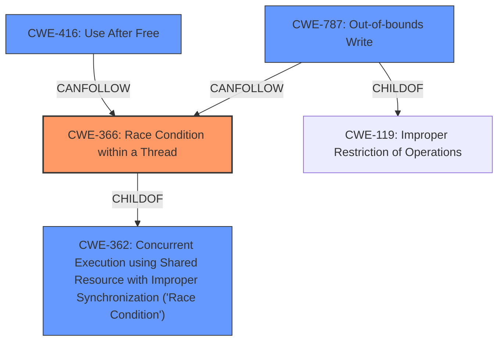

# Analysis Report for CVE-2021-30603

# Vulnerability Analysis Report: CVE-2021-30603

## Description


## Analysis (with Relationship Data)

# Summary
| CWE ID | CWE Name | Confidence | CWE Abstraction Level | CWE Vulnerability Mapping Label | CWE-Vulnerability Mapping Notes |
|---|---|---|---|---|---|
| CWE-366 | Race Condition within a Thread | 0.8 | Base | Allowed | Primary CWE |
| CWE-416 | Use After Free | 0.6 | Variant | Allowed | Secondary Candidate |
| CWE-787 | Out-of-bounds Write | 0.5 | Base | Allowed | Secondary Candidate |

## Evidence and Confidence

*   **Confidence Score:** 0.7
*   **Evidence Strength:** HIGH

## Relationship Analysis
The primary CWE is CWE-366, "Race Condition within a Thread," which is a base-level CWE. The vulnerability description explicitly mentions a **data race** condition. CWE-366 is a child of CWE-362 "Concurrent Execution using Shared Resource with Improper Synchronization ('Race Condition')", which is a class-level CWE. Given the specificity of a thread-level race condition in the description, CWE-366 is the more appropriate choice. The retriever also provides CWE-416 "Use After Free" and CWE-787 "Out-of-Bounds Write" which are potential impacts of the race condition. The final impact described is heap corruption which can be caused by out-of-bounds writes.



## Vulnerability Chain
The vulnerability chain starts with a **data race** condition (CWE-366) in the WebAudio component, which can lead to heap corruption. Heap corruption can be caused by use-after-free (CWE-416) or out-of-bounds write (CWE-787). Therefore the chain is: CWE-366 -> CWE-416/CWE-787.

## Summary of Analysis
The initial assessment identified the **data race** as the primary issue, aligning with CWE-366. The retriever results supported this by highlighting CWE-366, CWE-416, and CWE-787. The explicit mention of **data race** in the vulnerability description and CVE Reference Links Content Summary ("Race condition in WebAudio") strongly suggests CWE-366 as the root cause. The final impact is heap corruption, which is often caused by memory corruption issues like use-after-free or out-of-bounds write.

The selection of CWE-366 is at the optimal level of specificity because it directly reflects the **data race** condition within a thread. While CWE-362 is a broader class of race conditions, CWE-366 is more precise. CWE-416 and CWE-787 are included as secondary candidates because they represent potential consequences of the race condition leading to heap corruption.

# Relevant CWE Information:

The following CWEs were identified as potentially relevant to this vulnerability:

## CWE-366: Race Condition within a Thread
**Abstraction Level**: Base
**Similarity Score**: 0.79
**Source**: dense

**Description**:
If two threads of execution use a resource simultaneously, there exists the possibility that resources may be used while invalid, in turn making the state of execution undefined.

**Mapping Guidance**:
- Usage: Allowed
- Rationale: This CWE entry is at the Base level of abstraction, which is a preferred level of abstraction for mapping to the root causes of vulnerabilities.

## CWE-416: Use After Free
**Abstraction:** Variant
**Status:** Stable

### Description
The product reuses or references memory after it has been freed. At some point afterward, the memory may be allocated again and saved in another pointer, while the original pointer references a location somewhere within the new allocation. Any operations using the original pointer are no longer valid because the memory "belongs" to the code that operates on the new pointer.

### Mapping Guidance
**Usage:** Allowed
**Rationale:** This CWE entry is at the Variant level of abstraction, which is a preferred level of abstraction for mapping to the root causes of vulnerabilities.

### Observed Examples
- **CVE-2022-20141:** Chain: an operating system kernel has insufficent resource locking (CWE-413) leading to a use after free (CWE-416).
- **CVE-2022-2621:** Chain: two threads in a web browser use the same resource (CWE-366), but one of those threads can destroy the resource before the other has completed (CWE-416).
- **CVE-2021-0920:** Chain: mobile platform race condition (CWE-362) leading to use-after-free (CWE-416), as exploited in the wild per CISA KEV.

## CWE-787: Out-of-bounds Write
**Abstraction:** Base
**Description**:
The product writes data past the end, or before the beginning, of the intended buffer.

### Mapping Guidance
**Usage:** Allowed
**Rationale:** This CWE entry is at the Base level of abstraction, which is a preferred level of abstraction for mapping to the root causes of vulnerabilities.


## CWE Relationship Analysis

Current CWEs represent these abstraction levels: .


### Vulnerability Chain Analysis

**Chain starting from CWE-787:**
- 787 (Out-of-bounds Write) - ROOT


**Chain starting from CWE-416:**
- 416 (Use After Free) - ROOT


### CWE Relationship Diagram

```mermaid
graph TD
    classDef primary fill:#f96,stroke:#333,stroke-width:2px
    classDef secondary fill:#69f,stroke:#333
    classDef tertiary fill:#9e9,stroke:#333
```


*Report generated on 2025-04-02 13:50:24*
