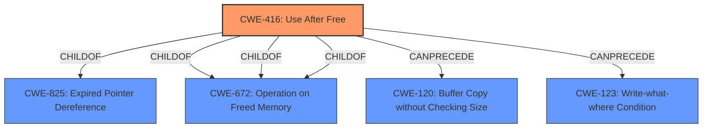

# Analysis Report for CVE-2021-30604

# Vulnerability Analysis Report: CVE-2021-30604

## Description


## Analysis (with Relationship Data)

# Summary
| CWE ID | CWE Name | Confidence | CWE Abstraction Level | CWE Vulnerability Mapping Label | CWE-Vulnerability Mapping Notes |
|---|---|---|---|---|---|
| CWE-416 | Use After Free | 1.0 | Variant | Allowed | Primary CWE |

## Evidence and Confidence

*   **Confidence Score:** 1.0
*   **Evidence Strength:** HIGH

## Relationship Analysis
The primary CWE is CWE-416 (**Use After Free**), which is a Variant. This is appropriate because the vulnerability is specifically a use-after-free. There are ChildOf relationships to CWE-825 and CWE-672. The CanPrecede relationships to CWE-120 and CWE-123 were considered, but they represent possible causes and not the core weakness itself.



## Vulnerability Chain
The vulnerability chain starts with a **use after free** (**CWE-416**) which leads to potential heap corruption.

## Summary of Analysis
The analysis is based on the provided evidence. The **Vulnerability Description** clearly states "**Use after free** in ANGLE". The **Vulnerability Description Key Phrases** confirms this with "**rootcause:** **Use after free**". The **CVE Reference Links Content Summary** further supports this with "**root_cause:** **Use after free**" and "**weaknesses:** [ "Use After Free" ]".

The relationship graph shows that CWE-416 is a variant, which is preferred, and its relationships don't change the assessment.

The primary CWE is CWE-416 (**Use After Free**), which is a Variant. This is appropriate because the vulnerability is specifically a use-after-free.

Relevant CWE Information:

# Enhanced Context (25 CWEs)

## CWE-404: Improper Resource Shutdown or Release
**Abstraction Level**: Class
**Similarity Score**: 0.82

This CWE was considered but not selected because it is a more general class of resource management issues. The provided vulnerability description specifically mentions "use after free," which is a more precise characterization.

## CWE-226: Sensitive Information in Resource Not Removed Before Reuse
**Abstraction Level**: Base
**Similarity Score**: 0.79

This CWE was not selected because the vulnerability is not about sensitive information being leaked, but about memory being accessed after it has been freed.

## CWE-366: Race Condition within a Thread
**Abstraction Level**: Base
**Similarity Score**: 0.79

This CWE was considered because race conditions can sometimes lead to use-after-free vulnerabilities. However, the description does not explicitly mention a race condition, making CWE-416 a more direct and appropriate mapping.

## CWE-667: Improper Locking
**Abstraction Level**: Class
**Similarity Score**: 0.78

This CWE was not selected because the vulnerability isn't directly related to locking mechanisms.

## CWE-662: Improper Synchronization
**Abstraction Level**: Class
**Similarity Score**: 0.76

Similar to CWE-667, this CWE isn't directly applicable as the primary issue isn't about synchronization.

## CWE-362: Concurrent Execution using Shared Resource with Improper Synchronization ('Race Condition')
**Abstraction Level**: Class
**Similarity Score**: 0.76

This CWE was considered but not chosen as it's a class and the specific vulnerability is a "use after free", not an improper synchronization.

## CWE-772: Missing Release of Resource after Effective Lifetime
**Abstraction Level**: Base
**Similarity Score**: 0.76

This CWE was not selected as it is related to missing resource release, not using a resource after it has been freed.

## CWE-664: Improper Control of a Resource Through its Lifetime
**Abstraction Level**: Pillar
**Similarity Score**: 0.75

This CWE is too high-level and doesn't accurately represent the specific vulnerability.

## CWE-911: Improper Update of Reference Count
**Abstraction Level**: Base
**Similarity Score**: 0.75

This CWE was not selected because the vulnerability isn't directly related to reference counting.

## CWE-367: Time-of-check Time-of-use (TOCTOU) Race Condition
**Abstraction Level**: Base
**Similarity Score**: 0.75

This CWE was not selected because there is no indication of a TOCTOU race condition in the description.

## CWE-415: Double Free
**Abstraction Level**: Variant
**Similarity Score**: 5224.29

This CWE was considered but not selected because the vulnerability is not a double free, but rather a use after free.

## CWE-123: Write-what-where Condition
**Abstraction Level**: base
**Similarity Score**: 5.03

This CWE was considered as a potential impact of the use-after-free, but not the root cause itself.

## CWE-120: Buffer Copy without Checking Size of Input ('Classic Buffer Overflow')
**Abstraction Level**: base
**Similarity Score**: 4.33

This CWE was not selected because the vulnerability is not a buffer overflow.

## CWE-787: Out-of-bounds Write
**Abstraction Level**: base
**Similarity Score**: 4.33

This CWE was considered due to the "heap corruption" impact, but the root cause is a use-after-free, making CWE-416 the more appropriate choice.

## CWE-476: NULL Pointer Dereference
**Abstraction Level**: base
**Similarity Score**: 4.33

This CWE was not selected because the vulnerability is not a null pointer dereference.

## CWE-252: Unchecked Return Value
**Abstraction Level**: base
**Similarity Score**: 4.33

This CWE was not selected because the vulnerability is not an unchecked return value.

## CWE-170: Improper Null Termination
**Abstraction Level**: base
**Similarity Score**: 4.33

This CWE was not selected because the vulnerability is not an improper null termination.


## CWE Relationship Analysis

Current CWEs represent these abstraction levels: .


### Vulnerability Chain Analysis

**Chain starting from CWE-787:**
- 787 (Out-of-bounds Write) - ROOT


**Chain starting from CWE-123:**
- 123 (Write-what-where Condition) - ROOT


### CWE Relationship Diagram

```mermaid
graph TD
    classDef primary fill:#f96,stroke:#333,stroke-width:2px
    classDef secondary fill:#69f,stroke:#333
    classDef tertiary fill:#9e9,stroke:#333
```


*Report generated on 2025-04-01 19:06:06*
