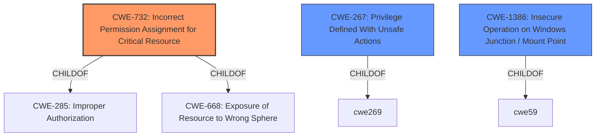

# Analysis for CVE-2021-30605

# Summary
| CWE ID  | CWE Name                                                        | Confidence | CWE Abstraction Level | CWE Vulnerability Mapping Label | CWE-Vulnerability Mapping Notes |
| :------- | :-------------------------------------------------------------- | :--------- | :---------------------- | :------------------------------ | :------------------------------ |
| CWE-732  | Incorrect Permission Assignment for Critical Resource           | 0.8        | Class                   | Allowed-with-Review             | Primary CWE                     |
| CWE-267  | Privilege Defined With Unsafe Actions                           | 0.6        | Base                    | Allowed                         | Secondary Candidate             |
| CWE-1386 | Insecure Operation on Windows Junction / Mount Point            | 0.5        | Base                    | Allowed                         | Secondary Candidate             |

## Evidence and Confidence

*   **Confidence Score:** 0.7
*   **Evidence Strength:** MEDIUM

## Relationship Analysis
The primary CWE, CWE-732 Incorrect Permission Assignment for Critical Resource, is a child of CWE-285 and CWE-668, indicating a hierarchical relationship. The vulnerability involves an **inappropriate implementation** leading to loosened DCOM access rights, which aligns with the concept of incorrect permission assignment. CWE-267, Privilege Defined With Unsafe Actions, is a potential secondary CWE because the **inappropriate implementation** could allow unsafe actions. CWE-1386 Insecure Operation on Windows Junction / Mount Point is another secondary CWE, although less likely, as it relates to potential redirection to unintended locations, which is less directly supported by the description, but the loosening of DCOM rights could allow this.

## Vulnerability Chain
The chain of events starts with an **inappropriate implementation** in the ChromeOS Readiness Tool installer, leading to loosened DCOM access rights. This, in turn, allows an attacker to potentially bypass discretionary access controls. The root cause is the **inappropriate implementation**, and the impact is the bypassing of access controls.

## Summary of Analysis
The analysis is primarily based on the vulnerability description, which indicates an **inappropriate implementation** that loosens DCOM access rights, leading to a bypass of discretionary access controls.

The vulnerability description states: "Inappropriate implementation in the ChromeOS Readiness Tool installer on Windows prior to 1.0.2.0 loosens DCOM access rights on two objects allowing an attacker to potentially bypass discretionary access controls."

CWE-732 aligns well because the vulnerability involves incorrect assignment of permissions for critical resources (DCOM objects). The relationship graph shows that CWE-732 is a child of CWE-285 and CWE-668, indicating a more specific type of access control issue. Although CWE-732 is a Class-level CWE, it is more descriptive than its parents.

CWE-267 is considered, as the loosened DCOM access rights could lead to unsafe actions. However, it is less specific than CWE-732.

CWE-1386 is also considered because it involves insecure operations related to junctions/mount points, but the description doesn't provide strong evidence for this.

The chosen CWEs are at an optimal level of specificity, with CWE-732 being the primary root cause and CWE-267 and CWE-1386 as potential secondary factors.

Relevant CWE Information:

# Enhanced Context (25 CWEs)

## CWE-59: Improper Link Resolution Before File Access ('Link Following')
**Abstraction Level**: Base
**Similarity Score**: 0.78
**Source**: dense

**Description**:
The product attempts to access a file based on the filename, but it does not properly prevent that filename from identifying a link or shortcut that resolves to an unintended resource.

**Mapping Guidance**:
- Usage: Allowed
- Rationale: This CWE entry is at the Base level of abstraction, which is a preferred level of abstraction for mapping to the root causes of vulnerabilities.

## CWE-41: Improper Resolution of Path Equivalence
**Abstraction Level**: Base
**Similarity Score**: 0.77
**Source**: dense

**Description**:
The product is vulnerable to file system contents disclosure through path equivalence. Path equivalence involves the use of special characters in file and directory names. The associated manipulations are intended to generate multiple names for the same object.

**Mapping Guidance**:
- Usage: Allowed
- Rationale: This CWE entry is at the Base level of abstraction, which is a preferred level of abstraction for mapping to the root causes of vulnerabilities.

## CWE-1289: Improper Validation of Unsafe Equivalence in Input
**Abstraction Level**: Base
**Similarity Score**: 0.77
**Source**: dense

**Description**:
The product receives an input value that is used as a resource identifier or other type of reference, but it does not validate or incorrectly validates that the input is equivalent to a potentially-unsafe value.

**Mapping Guidance**:
- Usage: Allowed
- Rationale: This CWE entry is at the Base level of abstraction, which is a preferred level of abstraction for mapping to the root causes of vulnerabilities.

## CWE-451: User Interface (UI) Misrepresentation of Critical Information
**Abstraction Level**: Class
**Similarity Score**: 0.76
**Source**: dense

**Description**:
The user interface (UI) does not properly represent critical information to the user, allowing the information - or its source - to be obscured or spoofed. This is often a component in phishing attacks.

**Mapping Guidance**:
- Usage: Allowed-with-Review
- Rationale: This CWE entry is a Class and might have Base-level children that would be more appropriate

## CWE-610: Externally Controlled Reference to a Resource in Another Sphere
**Abstraction Level**: Class
**Similarity Score**: 0.76
**Source**: dense

**Description**:
The product uses an externally controlled name or reference that resolves to a resource that is outside of the intended control sphere.

**Mapping Guidance**:
- Usage: Discouraged
- Rationale: This CWE entry is a level-1 Class (i.e., a child of a Pillar). It might have lower-level children that would be more appropriate

## CWE-668: Exposure of Resource to Wrong Sphere
**Abstraction Level**: Class
**Similarity Score**: 0.76
**Source**: dense

**Description**:
The product exposes a resource to the wrong control sphere, providing unintended actors with inappropriate access to the resource.

**Mapping Guidance**:
- Usage: Discouraged
- Rationale: CWE-668 is high-level and is often misused as a catch-all when lower-level CWE IDs might be applicable. It is sometimes used for low-information vulnerability reports [REF-1287]. It is a level-1 Class (i.e., a child of a Pillar). It is not useful for trend analysis.

## CWE-23: Relative Path Traversal
**Abstraction Level**: Base
**Similarity Score**: 0.75
**Source**: dense

**Description**:
The product uses external input to construct a pathname that should be within a restricted directory, but it does not properly neutralize sequences such as ".." that can resolve to a location that is outside of that directory.

**Mapping Guidance**:
- Usage: Allowed
- Rationale: This CWE entry is at the Base level of abstraction, which is a preferred level of abstraction for mapping to the root causes of vulnerabilities.

## CWE-184: Incomplete List of Disallowed Inputs
**Abstraction Level**: Base
**Similarity Score**: 0.75
**Source**: dense

**Description**:
The product implements a protection mechanism that relies on a list of inputs (or properties of inputs) that are not allowed by policy or otherwise require other action to neutralize before additional processing takes place, but the list is incomplete.

**Mapping Guidance**:
- Usage: Allowed
- Rationale: This CWE entry is at the Base level of abstraction, which is a preferred level of abstraction for mapping to the root causes of vulnerabilities.

## CWE-73: External Control of File Name or Path
**Abstraction Level**: Base
**Similarity Score**: 0.75
**Source**: dense

**Description**:
The product allows user input to control or influence paths or file names that are used in filesystem operations.

**Mapping Guidance**: