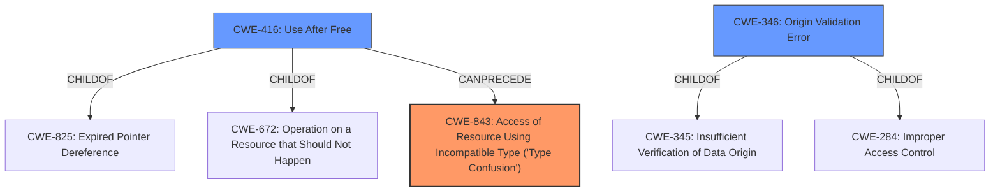

# Analysis Report for CVE-2021-30630

# Vulnerability Analysis Report: CVE-2021-30630

## Description


## Analysis (with Relationship Data)

# Summary
| CWE ID  | CWE Name                                                        | Confidence | CWE Abstraction Level | CWE Vulnerability Mapping Label | CWE-Vulnerability Mapping Notes |
| :-------- | :-------------------------------------------------------------- | :---------- | :-------------------- | :------------------------------ | :------------------------------ |
| CWE-843  | Access of Resource Using Incompatible Type ('Type Confusion') | 0.7         | Base                  | Primary                         | Allowed                         |
| CWE-416  | Use After Free                                                  | 0.6         | Variant               | Secondary                       | Allowed                         |
| CWE-346  | Origin Validation Error                                        | 0.4         | Class                 | Secondary                       | Allowed-with-Review           |

## Evidence and Confidence

*   **Confidence Score:** 0.7
*   **Evidence Strength:** MEDIUM

## Relationship Analysis

The primary CWE is CWE-843, "Access of Resource Using Incompatible Type." The secondary CWEs are CWE-416 "Use After Free" and CWE-346 "Origin Validation Error." CWE-843 is a base level CWE. CWE-416 is a variant of CWE-825 and CWE-672. CWE-346 is a class level CWE with children of CWE-345 and CWE-284.



## Vulnerability Chain

The vulnerability chain starts with an **inappropriate implementation** in the Blink component, potentially leading to type confusion. This could then lead to a use-after-free condition or an origin validation error, ultimately resulting in the leakage of cross-origin data.

## Summary of Analysis

The initial assessment pointed towards several potential CWEs, including CWE-346, CWE-416, and CWE-843. The final conclusion is that CWE-843 (Access of Resource Using Incompatible Type) is the most appropriate primary CWE, with CWE-416 (Use After Free) and CWE-346 (Origin Validation Error) as secondary CWEs.

The selection is heavily based on the vulnerability description and the CVE Reference Links Content Summary. The key phrase "**inappropriate implementation**" suggests a fundamental flaw in how Blink handles resource types. The description "allowed a remote attacker who had compromised the renderer process to leak cross-origin data via a crafted HTML page" suggests that an attacker is manipulating the type of data being accessed, aligning with the characteristics of CWE-843.

The graph relationships influenced the selection by providing context on how these CWEs can be related. For example, CWE-416 (Use After Free) can be a consequence of type confusion, further supporting its inclusion as a secondary CWE.

The selected CWEs are at the optimal level of specificity because they accurately represent the root cause and potential consequences of the vulnerability. CWE-843 is a Base level CWE, which is preferred for mapping root causes. CWE-416 is a Variant, providing more specific information about a potential consequence.

Relevant CWE Information:

# Enhanced Context (25 CWEs)

## CWE-843: Access of Resource Using Incompatible Type ('Type Confusion')

The vulnerability description mentions an **inappropriate implementation** which allowed leakage of cross-origin data via a crafted HTML page. This aligns with CWE-843 because it suggests that the attacker is manipulating the type of data being accessed or how it's being interpreted. The security implication is that an attacker can bypass security mechanisms by exploiting type confusion.
Confidence: 0.7

## CWE-416: Use After Free

The **inappropriate implementation** might result in memory being freed prematurely, leading to a use-after-free condition. This is plausible given the context of Blink and its memory management. The security implication is that an attacker can potentially execute arbitrary code by exploiting the dangling pointer.
Confidence: 0.6

## CWE-346: Origin Validation Error

The vulnerability description notes the leakage of cross-origin data. The **inappropriate implementation** could be related to improper validation of the origin of the data, leading to the leakage. The security implication is that an attacker can bypass the same-origin policy.
Confidence: 0.4

## Other CWEs Considered but Not Used:

CWE-120 (Buffer Copy without Checking Size of Input) and CWE-787 (Out-of-bounds Write) were considered due to the potential for memory corruption, but they were not selected because the description does not specifically mention a buffer overflow or out-of-bounds write. CWE-346 (Origin Validation Error) was considered but deemed less likely than type confusion, as the description focuses on **inappropriate implementation** rather than explicit origin validation. The retriever results included other CWEs such as CWE-451 (User Interface (UI) Misrepresentation of Critical Information), CWE-123 (Write-what-where Condition), CWE-122 (Heap-based Buffer Overflow), CWE-1021 (Improper Restriction of Rendered UI Layers or Frames), and CWE-40 (Path Traversal: '\\UNC\share\name\' (Windows UNC Share)), but these were determined to be less relevant based on the vulnerability description.


## CWE Relationship Analysis

Current CWEs represent these abstraction levels: .


### Vulnerability Chain Analysis

**Chain starting from CWE-787:**
- 787 (Out-of-bounds Write) - ROOT


**Chain starting from CWE-843:**
- 843 (Access of Resource Using Incompatible Type ('Type Confusion')) - ROOT


### CWE Relationship Diagram

```mermaid
graph TD
    classDef primary fill:#f96,stroke:#333,stroke-width:2px
    classDef secondary fill:#69f,stroke:#333
    classDef tertiary fill:#9e9,stroke:#333
```


*Report generated on 2025-04-02 04:05:21*
