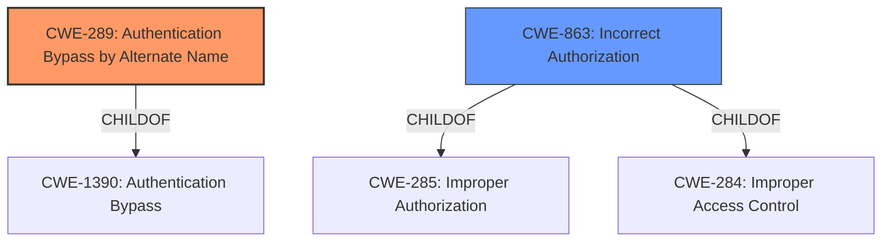

# Analysis Report for CVE-2021-30640

# Vulnerability Analysis Report: CVE-2021-30640

## Description


## Analysis (with Relationship Data)

# Summary

| CWE ID | CWE Name | Confidence | CWE Abstraction Level | CWE Vulnerability Mapping Label | CWE-Vulnerability Mapping Notes |
|---|---|---|---|---|---|
| CWE-289 | Authentication Bypass by Alternate Name | 0.9 | Base | Allowed | Primary CWE |
| CWE-863 | Incorrect Authorization | 0.6 | Class | Allowed-with-Review | Secondary Candidate |

## Evidence and Confidence

*   **Confidence Score:** 0.75
*   **Evidence Strength:** HIGH

## Relationship Analysis

The primary relationship influencing the selection is the hierarchical one. **CWE-289 (Authentication Bypass by Alternate Name)** is a child of **CWE-1390 (Authentication Bypass)**, providing a more specific classification than the parent. However, **CWE-863 (Incorrect Authorization)** is a related Class-level CWE that describes the general problem of authorization failures. These form the basis of selecting the most relevant CWE.



## Vulnerability Chain

The vulnerability chain starts with **improper validation** of user input, leading to the ability to **bypass authentication** using variations of a valid username. This ultimately allows an attacker to gain unauthorized access.

## Summary of Analysis

The initial analysis focused on identifying the root cause of the vulnerability, which is the ability to authenticate using variations of a valid username. The **CVE Reference Links Content Summary** indicates the root cause is "**Improper validation** of user input" which leads to "Authentication Bypass".

The Retriever results show **CWE-289 (Authentication Bypass by Alternate Name)** as a good match, and its description aligns well with the vulnerability description.

The final decision is based on the evidence provided in the CVE description and the supporting information from the retriever results. **CWE-289 (Authentication Bypass by Alternate Name)** is the optimal level of specificity, as it directly addresses the authentication bypass using alternate names.

Relevant CWE Information:

*   **CWE-289 (Authentication Bypass by Alternate Name)**: The vulnerability allows an attacker to authenticate using variations of a valid username. This aligns with the description of **CWE-289 (Authentication Bypass by Alternate Name)**, which focuses on bypassing authentication by not properly checking all possible names for a resource or actor.
*   **CWE-863 (Incorrect Authorization)**: This CWE is considered as a secondary candidate because while the vulnerability results in unauthorized access, the root cause is more specifically related to the authentication process rather than a general authorization failure.

Other CWEs Considered but Not Used:

*   **CWE-22 (Improper Limitation of a Pathname to a Restricted Directory ('Path Traversal'))**: While path traversal can lead to security vulnerabilities, it is not relevant to the described vulnerability, which focuses on authentication bypass.
*   **CWE-74 (Improper Neutralization of Special Elements in Output Used by a Downstream Component ('Injection'))**: Injection vulnerabilities are not the primary cause in this case. The vulnerability stems from improper validation of user input during authentication, not from injecting malicious code.
*   **CWE-917 (Improper Neutralization of Special Elements used in an Expression Language Statement ('Expression Language Injection'))**: EL injection is not relevant to the described vulnerability, which focuses on authentication bypass.
*   **CWE-116 (Improper Encoding or Escaping of Output)**: This CWE addresses encoding or escaping issues, which are not the primary cause of the authentication bypass in this vulnerability.
*   **CWE-923 (Improper Restriction of Communication Channel to Intended Endpoints)**: This CWE focuses on communication channel restrictions, which are not relevant to the described vulnerability.
*   **CWE-208 (Observable Timing Discrepancy)**: Timing discrepancies are not relevant to the described vulnerability, which focuses on authentication bypass.
*   **CWE-201 (Insertion of Sensitive Information Into Sent Data)**: Sensitive information being sent is not the main issue here. The focus is on authentication bypass.
*   **CWE-41 (Improper Resolution of Path Equivalence)**: The weakness has nothing to do with path equivalence.


## CWE Relationship Analysis

Current CWEs represent these abstraction levels: .


### Vulnerability Chain Analysis

**Chain starting from CWE-284:**
- 284 (Improper Access Control) - ROOT


**Chain starting from CWE-201:**
- 201 (Insertion of Sensitive Information Into Sent Data) - ROOT


### CWE Relationship Diagram

```mermaid
graph TD
    classDef primary fill:#f96,stroke:#333,stroke-width:2px
    classDef secondary fill:#69f,stroke:#333
    classDef tertiary fill:#9e9,stroke:#333
```


*Report generated on 2025-04-01 17:55:33*
