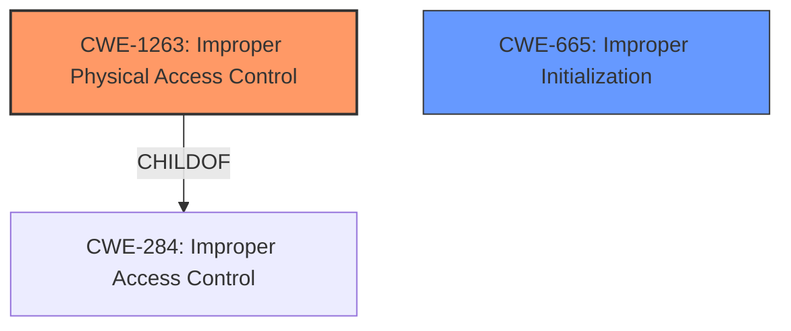

# Analysis for CVE-2021-30702

# Summary
| CWE ID  | CWE Name  | Confidence | CWE Abstraction Level | CWE Vulnerability Mapping Label | CWE-Vulnerability Mapping Notes |
|-----------------|---------------------------------------------------|-------------------|--------------------------|------------------------------------|-------------------------------------------------------------------------------------------------------------------------------------------------|
| CWE-1263 | Improper Physical Access Control | 0.8 | Class | Allowed-with-Review | This is the Primary CWE due to physical access and the ability to bypass Login Window, but it is a Class and may have a better fitting Base or Variant child. |
| CWE-665 | Improper Initialization | 0.4 | Class | Discouraged | Secondary candidate. The **logic issue** may be due to improper initialization, which leads to an unexpected state. |

## Evidence and Confidence

*   **Confidence Score:** 0.8
*   **Evidence Strength:** MEDIUM

## Relationship Analysis
The primary CWE is CWE-1263, which is a Class-level CWE. It has a child CWE-284, which may be a better fit. I considered CWE-665 as a secondary candidate because a **logic issue** could stem from an uninitialized resource.

## Vulnerability Chain
The vulnerability chain starts with a **logic issue**, leading to a bypass of the Login Window when an attacker has physical access.

## Summary of Analysis
The initial analysis focused on the fact that a person with physical access could bypass the login window. The **rootcause** was identified as a **logic issue**.

The evidence supporting this assessment comes directly from the provided vulnerability description: "A **logic issue** was addressed with improved state management... A person with physical access to a Mac may be able to bypass Login Window."

The relationship graph emphasizes the hierarchical nature of CWEs, specifically the parent-child relationship where CWE-1263 is a child of CWE-284.

The selected CWE, CWE-1263, is at the Class level of specificity. While it is recommended to choose a Base or Variant level CWE if possible, the provided information does not give enough detail to make a more specific selection.

Relevant CWE Information:

# Enhanced Context (25 CWEs)

## CWE-1263: Improper Physical Access Control
**Abstraction:** Class
**Similarity Score**: 0.468
**Source**: sparse

**Description**:
The product is designed with access restricted to certain information, but it does not sufficiently protect against an unauthorized actor with physical access to these areas.

**Mapping Guidance**:
- Usage: Allowed-with-Review
- Rationale: This CWE entry is a Class and might have Base-level children that would be more appropriate

## CWE-665: Improper Initialization
**Abstraction:** Class
**Similarity Score**: 0.283
**Source**: sparse

**Description**:
The product does not initialize or incorrectly initializes a resource, which might leave the resource in an unexpected state when it is accessed or used.

**Mapping Guidance**:
- Usage: Discouraged
- Rationale: This CWE entry is a level-1 Class (i.e., a child of a Pillar). It might have lower-level children that would be more appropriate

## CWE-1263: Improper Physical Access Control
**CWE-1263 (Improper Physical Access Control)**: This CWE applies because the vulnerability allows a person with physical access to bypass the Login Window. This indicates that the physical access controls are insufficient to prevent unauthorized access. While this is a class-level CWE, the provided information does not offer enough detail to select a more specific base or variant. The security implication is that an attacker with physical access can gain unauthorized access to the system, potentially leading to data theft, modification, or other malicious activities.
**CWE-665 (Improper Initialization)**: The **logic issue** could be due to improper initialization. This could leave a critical resource in an unexpected state, leading to the bypass. Since the **logic issue** was fixed with "improved state management" this may be a cause.