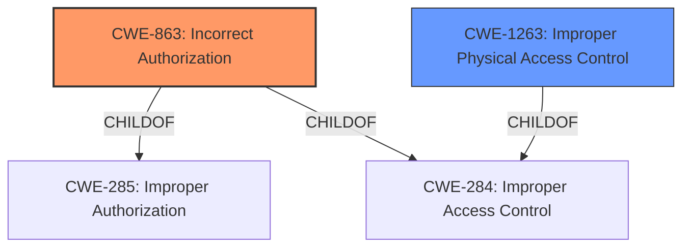

# Analysis Report for CVE-2021-30816

# Vulnerability Analysis Report: CVE-2021-30816

## Description


## Analysis (with Relationship Data)

# Summary
| CWE ID  | CWE Name | Confidence | CWE Abstraction Level | CWE Vulnerability Mapping Label | CWE-Vulnerability Mapping Notes |
|-----------------|---------------------------------------------------|------------|-----------------------|-----------------------------------|-----------------------------------|
| **CWE-863** | **Incorrect Authorization** | 0.9 | Class | Primary | Allowed-with-Review |
| CWE-1263 | Improper Physical Access Control | 0.7 | Class | Secondary | Allowed-with-Review |

## Evidence and Confidence

*   **Confidence Score:** 0.8
*   **Evidence Strength:** HIGH

## Relationship Analysis
The primary CWE is CWE-863, Incorrect Authorization. This is a Class-level CWE. CWE-863 is a child of CWE-285 (Improper Authorization) and CWE-284 (Improper Access Control). Since physical access is required, CWE-1263, Improper Physical Access Control, a child of CWE-284, is also considered. CWE-1263 is a peer of CWE-1191 (On-Chip Debug and Test Interface With Improper Access Control).



## Vulnerability Chain
The vulnerability chain starts with **improper permissions logic**, leading to an attacker with physical access being able to see private contact information.

## Summary of Analysis
The vulnerability description indicates that the root cause is **improper permissions logic**, which allows an attacker with physical access to view private contact information. The **rootcause** phrase strongly suggests an authorization issue.

The vulnerability description key phrases and CVE Reference Links Content Summary both point to **improper permissions logic**.

The Retriever Results show CWE-863 (Incorrect Authorization) and CWE-1263 (Improper Physical Access Control) as relevant.

CWE-863: Incorrect Authorization is a Class-level CWE that describes a scenario where the product performs an authorization check, but it is performed incorrectly. The vulnerability states the **improper permissions logic** directly aligns with this CWE.

CWE-1263: Improper Physical Access Control describes a scenario where the product does not sufficiently protect against an unauthorized actor with physical access to restricted information. Since the attacker requires physical access, this CWE is relevant.

While CWE-863 is a Class-level CWE, it is more specific than the Pillar-level CWE-284 (Improper Access Control). Using the guidance to select a more specific child CWE, CWE-863 is chosen as the primary CWE, and CWE-1263 is chosen as the secondary CWE due to the physical access requirement.

CWE-285 (Improper Authorization), CWE-284 (Improper Access Control) and CWE-20 (Improper Input Validation) were considered but not selected as the primary CWE. CWE-285 and CWE-284 are too high level, and the provided evidence does not point to input validation issues.

Relevant CWE Information:


## CWE Relationship Analysis

Current CWEs represent these abstraction levels: .


### Vulnerability Chain Analysis

**Chain starting from CWE-284:**
- 284 (Improper Access Control) - ROOT


**Chain starting from CWE-285:**
- 285 (Improper Authorization) - ROOT


### CWE Relationship Diagram

```mermaid
graph TD
    classDef primary fill:#f96,stroke:#333,stroke-width:2px
    classDef secondary fill:#69f,stroke:#333
    classDef tertiary fill:#9e9,stroke:#333
```


*Report generated on 2025-04-01 22:07:13*
