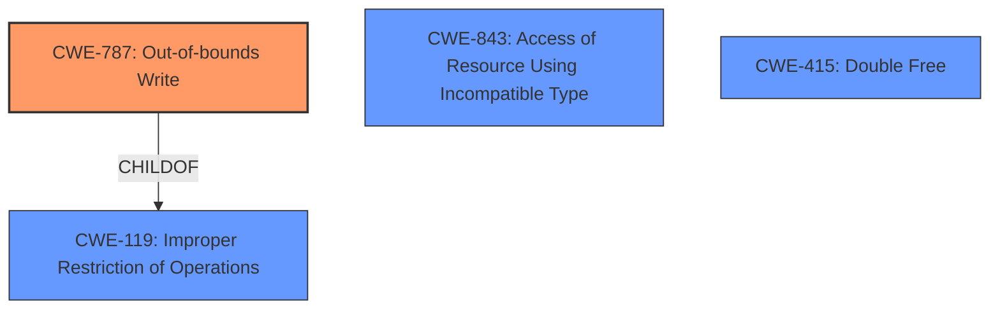

# Enhanced Analysis for CVE-2021-30838

# Summary
| CWE ID  | CWE Name                                                                       | Confidence | CWE Abstraction Level | CWE Vulnerability Mapping Label | CWE-Vulnerability Mapping Notes |
| :-------- | :----------------------------------------------------------------------------- | :--------- | :---------------------- | :------------------------------ | :------------------------------ |
| CWE-787 | Out-of-bounds Write                                                            | 0.9        | Base                    | Primary                         | Allowed                       |

## Evidence and Confidence

*   **Confidence Score:** 0.9
*   **Evidence Strength:** HIGH

## Relationship Analysis
The primary relationship considered was the parent-child relationship between CWE-787 and CWE-119. While CWE-119 is a broader category, the description explicitly mentions "memory corruption," which often results from writing outside the intended buffer. This pushes the analysis towards the more specific CWE-787. The relationships to other memory corruption CWEs such as CWE-415 Double Free and CWE-843 Access of Resource Using Incompatible Type ('Type Confusion') were considered but deemed less relevant as the initial weakness is an out-of-bounds write.



## Vulnerability Chain
The vulnerability chain starts with a **memory corruption** issue due to **insufficient memory handling**. This leads to an **out-of-bounds write** (CWE-787), which then allows a malicious application to execute arbitrary code with system privileges.

## Summary of Analysis
The initial assessment focused on the **memory corruption** issue. The "CVE Reference Links Content Summary" section explicitly mentions "Memory corruption due to insufficient memory handling" which aligns with the description of CWE-787: Out-of-bounds Write.

The relationship graph highlights how CWE-787 is a child of CWE-119 (Improper Restriction of Operations within the Bounds of a Memory Buffer). However, since the vulnerability description specifically discusses a **memory corruption** issue resulting from writing outside the intended buffer (due to insufficient memory handling), CWE-787 is the more precise choice.

The selection of CWE-787 is based on the following evidence:

*   The "Vulnerability Description Key Phrases" indicates a **memory corruption** **weakness**.
*   The "CVE Reference Links Content Summary" confirms that the root cause is a **memory corruption** issue due to **insufficient memory handling**.
*   The vulnerability allows a malicious application to execute arbitrary code with system privileges.

Based on this information, CWE-787 is the most appropriate and specific CWE.

Relevant CWE Information:

# Enhanced Context (25 CWEs)

## CWE-667: Improper Locking
**Abstraction Level**: Class
**Similarity Score**: 0.76
**Source**: dense

**Description**:
The product does not properly acquire or release a lock on a resource, leading to unexpected resource state changes and behaviors.
- *Not Selected*: This CWE is not directly related to the **memory corruption** described in the vulnerability.

## CWE-131: Incorrect Calculation of Buffer Size
**Abstraction Level**: Base
**Similarity Score**: 0.76
**Source**: dense

**Description**:
The product does not correctly calculate the size to be used when allocating a buffer, which could lead to a buffer overflow.
- *Not Selected*: There is no evidence in the description to suggest that the buffer size calculation is the root cause.

## CWE-1325: Improperly Controlled Sequential Memory Allocation
**Abstraction Level**: Base
**Similarity Score**: 0.75
**Source**: dense

**Description**:
The product manages a group of objects or resources and performs a separate memory allocation for each object, but it does not properly limit the total amount of memory that is consumed by all of the combined objects.
- *Not Selected*: The description does not provide any information about memory allocation limits being the root cause.

## CWE-680: Integer Overflow to Buffer Overflow
**Abstraction Level**: Compound
**Similarity Score**: 0.75
**Source**: dense

**Description**:
The product performs a calculation to determine how much memory to allocate, but an integer overflow can occur that causes less memory to be allocated than expected, leading to a buffer overflow.
- *Not Selected*: There is no indication of an integer overflow in the provided description.

## CWE-191: Integer Underflow (Wrap or Wraparound)
**Abstraction Level**: Base
**Similarity Score**: 0.75
**Source**: dense

**Description**:
The product subtracts one value from another, such that the result is less than the minimum allowable integer value, which produces a value that is not equal to the correct result.
- *Not Selected*: The description does not mention any integer underflow conditions.

## CWE-404: Improper Resource Shutdown or Release
**Abstraction Level**: Class
**Similarity Score**: 0.75
**Source**: dense

**Description**:
The product does not release or incorrectly releases a resource before it is made available for re-use.
- *Not Selected*: This CWE is not relevant to the **memory corruption** issue in this description.

## CWE-126: Buffer Over-read
**Abstraction Level**: Variant
**Similarity Score**: 0.74
**Source**: dense

**Description**:
The product reads from a buffer using buffer access mechanisms such as indexes or pointers that reference memory locations after the targeted buffer.
- *Not Selected*: The vulnerability is related to writing out of bounds, not reading.

## CWE-805: Buffer Access with Incorrect Length Value
**Abstraction Level**: Base
**Similarity Score**: 0.74
**Source**: dense

**Description**:
The product uses a sequential operation to read or write a buffer, but it uses an incorrect length value that causes it to access memory that is outside of the bounds of the buffer.
- *Not Selected*: While this is similar, CWE-787 is a more direct representation of the issue.

## CWE-366: Race Condition within a Thread
**Abstraction Level**: Base
**Similarity Score**: 0.74
**Source**: dense

**Description**:
If two threads of execution use a resource simultaneously, there exists the possibility that resources may be used while invalid, in turn making the state of execution undefined.
- *Not Selected*: There is no mention of race conditions in the description.

## CWE-681: Incorrect Conversion between Numeric Types
**Abstraction Level**: Base
**Similarity Score**: 0.74
**Source**: dense

**Description**:
When converting from one data type to another, such as long to integer, data can be omitted or translated in a way that produces unexpected values. If the resulting values are used in a sensitive context, then dangerous behaviors may occur.
- *Not Selected*: This is not mentioned or implied by the description.

## CWE-190: Integer Overflow or Wraparound
**Abstraction Level**: Base
**Similarity Score**: 6805.17
**Source**: sparse

**Description**:
The product performs a calculation that can
         produce an integer overflow or wraparound when the logic
         assumes that the resulting value will always be larger than
         the original value. This occurs when an integer value is
         incremented to a value that is too large to store in the
         associated representation. When this occurs, the value may
         become a very small or negative number.
- *Not Selected*: There is no indication of an integer overflow in the provided description.

## CWE-125: Out-of-bounds Read
**Abstraction Level**: Base
**Similarity Score**: 6742.63
**Source**: sparse

**Description**:
The product reads data past the end, or before the beginning, of the intended buffer.
- *Not Selected*: The vulnerability is related to writing out of bounds, not reading.

## CWE-667: Improper Locking
**Abstraction Level**: Class
**Similarity Score**: 6729.46
**Source**: sparse

**Description**:
The product does not properly acquire or release a lock on a resource, leading to unexpected resource state changes and behaviors.
- *Not Selected*: This CWE is not directly related to the **memory corruption** described in the vulnerability.

## CWE-362: Concurrent Execution using Shared Resource with Improper Synchronization ('Race Condition')
**Abstraction Level**: Class
**Similarity Score**: 6685.82
**Source**: sparse

**Description**:
The product contains a concurrent code sequence that requires temporary, exclusive access to a shared resource, but a timing window exists in which the shared resource can be modified by


## CWE Relationship Analysis

Current CWEs represent these abstraction levels: .


### Vulnerability Chain Analysis

**Chain starting from CWE-667:**
- 667 (Improper Locking) - ROOT


**Chain starting from CWE-787:**
- 787 (Out-of-bounds Write) - ROOT


### CWE Relationship Diagram

```mermaid
graph TD
    classDef primary fill:#f96,stroke:#333,stroke-width:2px
    classDef secondary fill:#69f,stroke:#333
    classDef tertiary fill:#9e9,stroke:#333
```