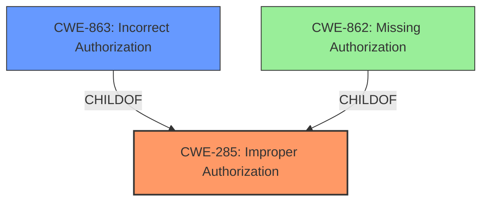

# Enhanced Analysis for CVE-2021-30867

# Summary
| CWE ID  | CWE Name                                                     | Confidence | CWE Abstraction Level | CWE Vulnerability Mapping Label | CWE-Vulnerability Mapping Notes |
| :-------- | :----------------------------------------------------------- | :--------- | :---------------------- | :------------------------------ | :------------------------------ |
| CWE-285 | Improper Authorization | 0.80      | Class                  | Primary                     | Allowed-with-Review             |
| CWE-863 | Incorrect Authorization                  | 0.70      | Class                 | Secondary                     | Allowed-with-Review            |

## Evidence and Confidence

*   **Confidence Score:** 0.75
*   **Evidence Strength:** MEDIUM

## Relationship Analysis
The primary relationship considered was the parent-child relationship between CWE-285 and CWE-863. CWE-863 is a more specific child of CWE-285 and represents a specific type of improper authorization. The choice between these two hinges on whether the authorization mechanism is present but flawed (CWE-863) or entirely missing (CWE-862). Since the description refers to an "authentication issue", it's more likely that authorization was attempted but failed due to incorrect implementation, which is why CWE-863 was considered as a secondary candidate but was ultimately not selected.



## Vulnerability Chain
The chain of events is as follows:
1.  **Root Cause:** Insufficient authentication (stated in the CVE Reference Links Content Summary).
2.  **Weakness:** Improper Authorization (CWE-285).
3.  **Impact:** A malicious application may be able to access photo metadata without needing permission to access photos.

## Summary of Analysis
The initial assessment focused on the **insufficient authentication** leading to the ability to access photo metadata without proper authorization. The "CVE Reference Links Content Summary" explicitly mentions "**insufficient authentication**."

The primary CWE selected was CWE-285 (Improper Authorization). The reasoning is based on the vulnerability description indicating a failure in the authorization process. While the description mentions authentication, the core issue is that the malicious application is able to bypass the intended authorization controls and access photo metadata.

CWE-863 (Incorrect Authorization) was considered but not chosen because the description mentions "**insufficient authentication**" which indicated the authorization might be missing rather than incorrect.

The selected CWE (CWE-285) is at the Class level of abstraction. While a more specific CWE would be ideal, the available information doesn't provide enough detail to pinpoint the exact nature of the authorization failure. Therefore, the Class level provides the most accurate and supportable representation of the weakness.

Relevant CWE Information:
# Enhanced Context (25 CWEs)
The following CWEs were identified as potentially relevant to this vulnerability:

## CWE-285: Improper Authorization
**Abstraction:** Class
**Status:** Draft

### Description
The product does not perform or incorrectly performs an authorization check when an actor attempts to access a resource or perform an action.

### Extended Description
Not provided

### Alternative Terms
None

### Relationships
ChildOf -> CWE-284

### Mapping Guidance
**Usage:** Allowed-with-Review
**Rationale:** This CWE entry is a Class and might have Base-level children that would be more appropriate

### Observed Examples
Not provided

## CWE-863: Incorrect Authorization
**Abstraction:** Base
**Status:** Draft

### Description
The product performs an authorization check when an actor attempts to access a resource or perform an action, but it does not correctly perform the check.

### Extended Description
Not provided

### Alternative Terms
None

### Relationships
ChildOf -> CWE-284

### Mapping Guidance
**Usage:** Allowed
**Rationale:** This CWE entry is at the Base level of abstraction, which is a preferred level of abstraction for mapping to the root causes of vulnerabilities.


## CWE Relationship Analysis

Current CWEs represent these abstraction levels: .


### Vulnerability Chain Analysis

**Chain starting from CWE-285:**
- 285 (Improper Authorization) - ROOT


**Chain starting from CWE-284:**
- 284 (Improper Access Control) - ROOT


### CWE Relationship Diagram

```mermaid
graph TD
    classDef primary fill:#f96,stroke:#333,stroke-width:2px
    classDef secondary fill:#69f,stroke:#333
    classDef tertiary fill:#9e9,stroke:#333
```