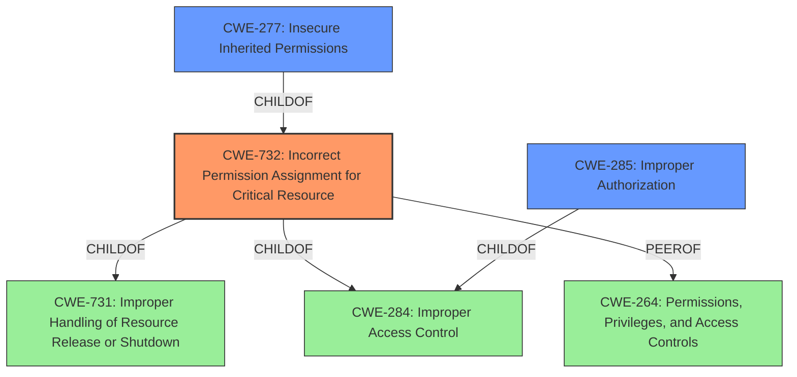

# Analysis Report for CVE-2021-30920

# Vulnerability Analysis Report: CVE-2021-30920

## Description


## Analysis (with Relationship Data)

# Summary
| CWE ID | CWE Name | Confidence | CWE Abstraction Level | CWE Vulnerability Mapping Label | CWE-Vulnerability Mapping Notes |
|---|---|---|---|---|---|
| CWE-732 | Incorrect Permission Assignment for Critical Resource | 0.9 | Base | Primary | Allowed |
| CWE-277 | Insecure Inherited Permissions | 0.7 | Variant | Secondary | Allowed |
| CWE-285 | Improper Authorization | 0.5 | Class | Secondary | Discouraged |

## Evidence and Confidence

*   **Confidence Score:** 0.9
*   **Evidence Strength:** HIGH

## Relationship Analysis
The primary CWE is CWE-732, which is a child of CWE-731 and CWE-284 and sibling of CWE-264. The vulnerability description explicitly mentions a "**permissions issue**", making CWE-732 the most appropriate choice due to its focus on incorrect permission assignments, and has a direct root cause match. CWE-277, Insecure Inherited Permissions is a variant of CWE-732 and represents a more specific case where permissions are inherited insecurely, and could be related. CWE-285, Improper Authorization is a class-level CWE that is a parent of both CWE-862 (Missing Authorization) and CWE-863 (Incorrect Authorization), which represent more specific authorization failures.



## Vulnerability Chain
The chain starts with a **permissions issue** (CWE-732), leading to a local attacker being able to read sensitive information.

## Summary of Analysis
The initial assessment identified a "**permissions issue**" as the root cause, leading to sensitive information disclosure. The final decision to map this to CWE-732 is based on the direct match between the vulnerability description and the CWE's focus on incorrect permission assignments for critical resources.

The vulnerability description states: "A **permissions issue** was addressed with improved validation. This issue is fixed in macOS Monterey 12.0.1. A local attacker may be able to read sensitive information." The CVE Reference Links Content Summary confirms: "Root cause of vulnerability: A permissions issue within the Sandbox component" and "Weaknesses/vulnerabilities present: Inadequate permission validation within the Sandbox component." This provides clear evidence for the selection of CWE-732.

CWE-732 is at the Base level of abstraction, which is the preferred level for mapping. The description of CWE-732 aligns directly with the **permissions issue** reported in the vulnerability.

Other CWEs considered but not used:

*   CWE-787 (Out-of-bounds Write): While this is a high-ranking CWE in the retriever results, there is no evidence in the vulnerability description to suggest memory corruption or out-of-bounds writes.
*   CWE-277 (Insecure Inherited Permissions): This is a more specific variant of permission issues, but the information isn't clear enough to say that the permissions are inherited.
*   CWE-285 (Improper Authorization): This CWE is also relevant but less specific than CWE-732, which directly addresses the permission assignment aspect.
*   CWE-20 (Improper Input Validation): This is too general and doesn't accurately reflect the root cause, which is a **permissions issue**.
*   CWE-347 (Improper Verification of Cryptographic Signature): This CWE is specific to cryptographic signatures, which is not relevant to the vulnerability description.
*   CWE-73 (External Control of File Name or Path): This CWE is related to path manipulation, which is not mentioned in the vulnerability description.
*   CWE-843 (Access of Resource Using Incompatible Type ('Type Confusion')): This CWE relates to type confusion, which is unrelated to the described vulnerability.
*   CWE-665 (Improper Initialization): There is no mention about uninitialized resource, so it does not fit.

**CWE-732: Incorrect Permission Assignment for Critical Resource**
*   **Explanation:** The vulnerability description explicitly mentions a "**permissions issue**," indicating that the software incorrectly assigned permissions to a critical resource. This allows a local attacker to bypass intended access restrictions and read sensitive information.
*   **Security Implications:** Incorrect permission assignments can lead to unauthorized access to sensitive data, privilege escalation, and other security breaches. In this case, a local attacker can read sensitive information due to the **permissions issue**.
*   **Relationship:** CWE-732 is a base-level CWE that falls under the broader category of Improper Access Control (CWE-284).
*   **Mapping Guidance:** The MITRE mapping guidance allows for the use of CWE-732, as it is at the base level of abstraction.

**CWE-277: Insecure Inherited Permissions**
*   **Explanation:** While the primary issue is an incorrect permission assignment, it's possible the incorrect permissions were inherited. If the system is setting up insecure permissions that are then inherited by other processes or files, that is a possible cause, but there is no proof given.
*   **Security Implications:** Leads to further propagation of misconfigured permissions.
*   **Relationship:** CWE-277 is a variant of CWE-732.
*   **Mapping Guidance:** The MITRE mapping guidance allows for the use of CWE-277, as it is at the variant level of abstraction.

**CWE-285: Improper Authorization**
*   **Explanation:** The vulnerability description explicitly mentions a "**permissions issue**" that leads to a local attacker being able to read sensitive information, this could be an authorization issue that the product does not perform or incorrectly performs an authorization check when an actor attempts to access a resource or perform an action.
*   **Security Implications:** Leads to unauthorized access to sensitive data.
*   **Relationship:** CWE-285 is a class-level CWE that falls under the broader category of Improper Access Control (CWE-284).
*   **Mapping Guidance:** The MITRE mapping guidance discourages the use of CWE-285 because it is high-level and lower-level CWEs can frequently be used instead such as CWE-862: Missing Authorization, CWE-863: Incorrect Authorization, CWE-732: Incorrect Permission Assignment for Critical Resource.


## CWE Relationship Analysis

Current CWEs represent these abstraction levels: .


### Vulnerability Chain Analysis

**Chain starting from CWE-732:**
- 732 (Incorrect Permission Assignment for Critical Resource) - ROOT


**Chain starting from CWE-787:**
- 787 (Out-of-bounds Write) - ROOT


### CWE Relationship Diagram

```mermaid
graph TD
    classDef primary fill:#f96,stroke:#333,stroke-width:2px
    classDef secondary fill:#69f,stroke:#333
    classDef tertiary fill:#9e9,stroke:#333
```


*Report generated on 2025-04-01 17:45:31*
