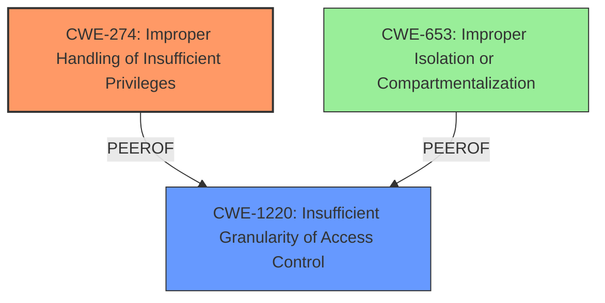

# Raw Analyzer Response for CVE-2021-30925

# Summary
| CWE ID | CWE Name | Confidence | CWE Abstraction Level | CWE Vulnerability Mapping Label | CWE-Vulnerability Mapping Notes |
|---|---|---|---|---|---|
| CWE-274 | Improper Handling of Insufficient Privileges | 0.7 | Base | Primary | Allowed |
| CWE-1220 | Insufficient Granularity of Access Control | 0.6 | Base | Secondary | Allowed |

## Evidence and Confidence

*   **Confidence Score:** 0.7
*   **Evidence Strength:** MEDIUM

## Relationship Analysis
The primary CWE, CWE-274 **Improper Handling of Insufficient Privileges**, reflects the core issue of the application not correctly handling situations where it lacks necessary permissions. The secondary CWE, CWE-1220 **Insufficient Granularity of Access Control**, highlights the access control mechanism lacking the required granularity. While many other CWEs were considered, these two best represent the specific nature of the vulnerability described.

## Vulnerability Chain
The vulnerability chain starts with the **insufficient permissions logic**, leading to the **improper handling of insufficient privileges**, and finally resulting in the ability of a **malicious application to bypass Privacy preferences**.

## Summary of Analysis
The analysis focused on identifying the root cause and the specific weakness that allowed the malicious application to bypass Privacy preferences. The evidence from the "CVE Reference Links Content Summary" section clearly indicates that the issue lies in the **insufficient permissions checks**. This directly maps to CWE-274 **Improper Handling of Insufficient Privileges**, as the application **does not handle or incorrectly handles when it has insufficient privileges to perform an operation**. The "Vulnerability Description" also points to the **impact:** bypass Privacy preferences. This bypass is possible because of the **lack of granularity in the access control**, which is addressed by CWE-1220 **Insufficient Granularity of Access Control**.

CWE-787 **Out-of-bounds Write**, CWE-843 **Access of Resource Using Incompatible Type ('Type Confusion')**, CWE-415 **Double Free**, CWE-123 **Write-what-where Condition**, CWE-125 **Out-of-bounds Read**, CWE-190 **Integer Overflow or Wraparound**, and CWE-22 **Improper Limitation of a Pathname to a Restricted Directory ('Path Traversal')** were considered but deemed less relevant as they describe different types of vulnerabilities that do not directly align with the described weakness. CWE-277 **Insecure Inherited Permissions** was considered but did not accurately reflect the vulnerability, as the issue is not with insecure permissions being inherited but rather with the handling of insufficient privileges at runtime. CWE-665 **Improper Initialization** and CWE-20 **Improper Input Validation** were deemed too general. CWE-347 **Improper Verification of Cryptographic Signature** was not relevant because there was no mention of cryptographic signatures in the vulnerability description. CWE-1263 **Improper Physical Access Control** was not relevant because the attack vector was a malicious application, not physical access.
CWE-1289, CWE-807, CWE-653, CWE-657, CWE-404, CWE-1220, CWE-183, CWE-345, CWE-1284, CWE-367, CWE-1341, CWE-770, CWE-416, and CWE-825 were also considered but did not fit the vulnerability as well as CWE-274 and CWE-1220.

CWE-274 and CWE-1220 are at the optimal level of specificity, as they directly address the root cause of the vulnerability based on the available evidence.