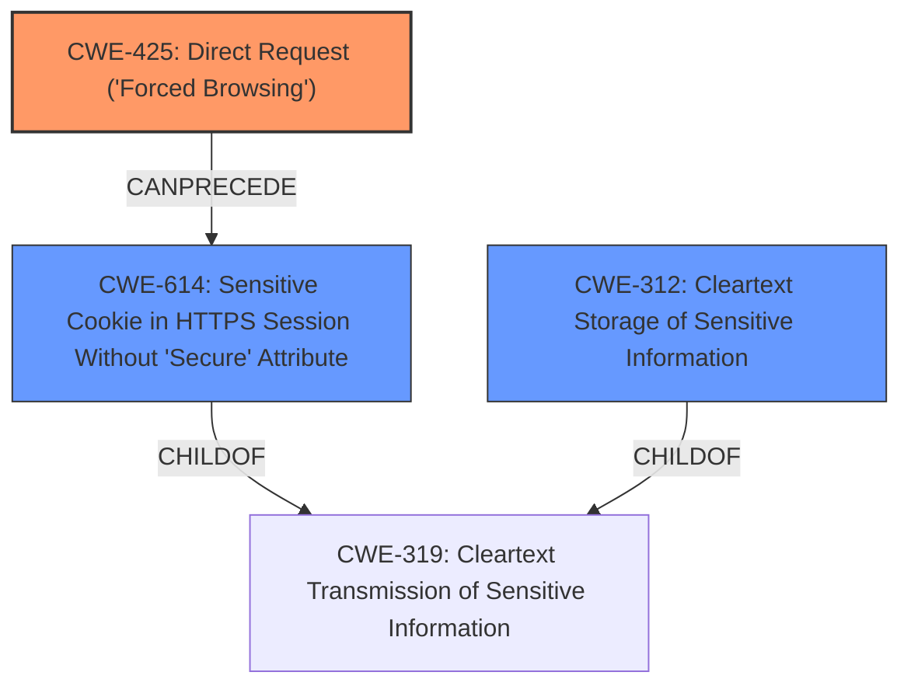

# Enhanced Analysis for CVE-2021-3113

# Summary
| CWE ID    | CWE Name                                                                                     | Confidence | CWE Abstraction Level | CWE Vulnerability Mapping Label | CWE-Vulnerability Mapping Notes |
| --------- | -------------------------------------------------------------------------------------------- | ---------- | --------------------- | ------------------------------- | ------------------------------- |
| CWE-425   | Direct Request ('Forced Browsing')                                                           | 0.95       | Base                  | Primary                         | Allowed                        |
| CWE-614   | Sensitive Cookie in HTTPS Session Without 'Secure' Attribute                                 | 0.80       | Variant               | Secondary                       | Allowed                        |
| CWE-312   | Cleartext Storage of Sensitive Information                                                   | 0.60       | Base                  | Secondary                       | Allowed                        |

## Evidence and Confidence

*   **Confidence Score:** 0.85
*   **Evidence Strength:** HIGH

## Relationship Analysis
The primary CWE is CWE-425, representing the **lack of authorization** for the `/session/list/allActiveSession` endpoint. This leads to a direct request vulnerability, where an attacker can access sensitive information without proper authentication. CWE-614 is related, as the **sensitive cookie** is exposed because of the direct request. It is a variant of CWE-319. CWE-312 is a weaker candidate because the cookie isn't necessarily being stored in cleartext, but is transmitted as such.



## Vulnerability Chain
1.  **Missing Authentication/Authorization (CWE-425):** The root cause is the **lack of authentication** for the `/session/list/allActiveSession` endpoint, allowing direct access.
2.  **Information Disclosure (CWE-614):** The direct request leads to the exposure of sensitive cookie information.
3.  **Privilege Escalation:** An attacker uses the cookie to create an admin user.

## Summary of Analysis
The initial analysis focused on identifying the root cause of the vulnerability. The key evidence is the ability to access the `/session/list/allActiveSession` endpoint without authentication, as stated in the "CVE Reference Links Content Summary": "The Netsia SEBA+ application's "Active Sessions" section allows HTTP requests without requiring a valid session cookie." This aligns directly with CWE-425, which describes a web application that "does not adequately enforce appropriate authorization on all restricted URLs, scripts, or files."

The secondary weakness is the exposure of session cookies in cleartext (CWE-614), which is a direct consequence of the **missing authentication**. The attacker can then use these cookies to gain unauthorized access, highlighting the importance of protecting cookies with the "Secure" attribute.

The relationship analysis reinforced the selection of CWE-425 as the primary cause, as it directly leads to the information disclosure. CWE-614 provides a more specific characterization of the data being exposed.

Other CWEs considered but not used:

*   CWE-807: Reliance on Untrusted Inputs in a Security Decision - While the application relies on session cookies, the primary issue isn't the reliance on untrusted input, but rather the **lack of authentication** to access the session list.
*   CWE-319: Cleartext Transmission of Sensitive Information - While related to CWE-614, CWE-614 provides a more specific description of the vulnerability related to the absence of the Secure attribute in HTTPS sessions.
* CWE-352: Cross-Site Request Forgery (CSRF) - Not applicable, the vulnerability is not about tricking a user into making a request.
* CWE-287: Improper Authentication - Too broad. CWE-425 describes the specific missing authorization.

The selected CWEs are at the optimal level of specificity because they accurately capture the root cause (CWE-425) and the immediate consequence (CWE-614) of the vulnerability, based on the provided evidence.


## CWE Relationship Analysis

Current CWEs represent these abstraction levels: .


### Vulnerability Chain Analysis

**Chain starting from CWE-614:**
- 614 (Sensitive Cookie in HTTPS Session Without 'Secure' Attribute) - ROOT


**Chain starting from CWE-312:**
- 312 (Cleartext Storage of Sensitive Information) - ROOT


### CWE Relationship Diagram

```mermaid
graph TD
    classDef primary fill:#f96,stroke:#333,stroke-width:2px
    classDef secondary fill:#69f,stroke:#333
    classDef tertiary fill:#9e9,stroke:#333
```