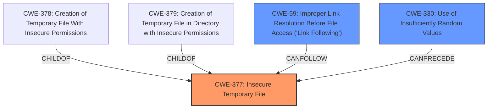

# Raw Analyzer Response for CVE-2021-31154

# Summary
| CWE ID | CWE Name | Confidence | CWE Abstraction Level | CWE Vulnerability Mapping Label | CWE-Vulnerability Mapping Notes |
|---|---|---|---|---|---|
| CWE-377 | Insecure Temporary File | 0.9 | Class | Allowed-with-Review | Primary CWE |
| CWE-59 | Improper Link Resolution Before File Access ('Link Following') | 0.8 | Base | Allowed | Secondary Candidate |
| CWE-330 | Use of Insufficiently Random Values | 0.6 | Class | Discouraged | Secondary Candidate |

## Evidence and Confidence

*   **Confidence Score:** 0.8
*   **Evidence Strength:** HIGH

## Relationship Analysis
The primary CWE identified is CWE-377, "Insecure Temporary File," which is a Class-level CWE. It has children such as CWE-378 and CWE-379, which are more specific Base-level CWEs. CWE-59, "Improper Link Resolution Before File Access ('Link Following')," is considered a secondary candidate due to the symlink attack vector. CWE-330, "Use of Insufficiently Random Values," is also a potential secondary candidate because the vulnerability involves **predictable temporary filenames**.

## Vulnerability Chain
The vulnerability chain starts with the **use of predictable temporary filenames**, leading to a symlink attack, and ultimately resulting in the attacker gaining full root privileges.
  - **Root Cause:** **Predictable temporary filenames**
  - **Weakness:** Insecure temporary file creation (CWE-377)
  - **Attack Vector:** Symlink attack
  - **Impact:** Gain full root privileges

## Summary of Analysis
The primary weakness is the **use of predictable temporary filenames**, which falls under the broader category of CWE-377, "Insecure Temporary File". The "CVE Reference Links Content Summary" explicitly states that the root cause is the predictable temporary file names and the lack of unpredictable file names created in a `mkstemp()` manner.

The vulnerability description states: "pleaseedit in please before 0.4 uses **predictable temporary filenames** in /tmp and the target directory. This allows a local attacker to gain full root privileges by staging a symlink attack."

CWE-377 is selected as the primary CWE because it directly addresses the creation and use of insecure temporary files. The symlink attack is a consequence of this insecure file creation.

CWE-59, "Improper Link Resolution Before File Access ('Link Following')," is a relevant secondary CWE because the vulnerability involves a symlink attack. The "CVE Reference Links Content Summary" mentions the missing `O_NOFOLLOW` flag when calling `openat()` and following symlinks in target directories.

CWE-330, "Use of Insufficiently Random Values," is also considered because the root cause is the **predictable temporary filenames**. However, it's a Class-level CWE and less specific than CWE-377.

The final decision is based on the evidence provided in the vulnerability description and the CVE reference, focusing on the root cause and the direct consequences of the weakness. CWE-377 is at an appropriate level of specificity, and the inclusion of CWE-59 and CWE-330 as secondary candidates provides a more complete picture of the vulnerability.

Relevant CWE Information:

# Enhanced Context (25 CWEs)
The following CWEs were identified as potentially relevant to this vulnerability:

## CWE-59: Improper Link Resolution Before File Access ('Link Following')
**Abstraction Level**: Base
**Similarity Score**: 0.82
**Source**: dense

**Description**:
The product attempts to access a file based on the filename, but it does not properly prevent that filename from identifying a link or shortcut that resolves to an unintended resource.

**Mapping Guidance**:
- Usage: Allowed
- Rationale: This CWE entry is at the Base level of abstraction, which is a preferred level of abstraction for mapping to the root causes of vulnerabilities.

## CWE-41: Improper Resolution of Path Equivalence
**Abstraction Level**: Base
**Similarity Score**: 0.80
**Source**: dense

**Description**:
The product is vulnerable to file system contents disclosure through path equivalence. Path equivalence involves the use of special characters in file and directory names. The associated manipulations are intended to generate multiple names for the same object.

**Mapping Guidance**:
- Usage: Allowed
- Rationale: This CWE entry is at the Base level of abstraction, which is a preferred level of abstraction for mapping to the root causes of vulnerabilities.

## CWE-61: UNIX Symbolic Link (Symlink) Following
**Abstraction Level**: Compound
**Similarity Score**: 0.79
**Source**: dense

**Description**:
The product, when opening a file or directory, does not sufficiently account for when the file is a symbolic link that resolves to a target outside of the intended control sphere. This could allow an attacker to cause the product to operate on unauthorized files.

**Mapping Guidance**:
- Usage: Allowed
- Rationale: This is a well-known Composite of multiple weaknesses that must all occur simultaneously, although it is attack-oriented in nature.

## CWE-23: Relative Path Traversal
**Abstraction Level**: Base
**Similarity Score**: 0.78
**Source**: dense

**Description**:
The product uses external input to construct a pathname that should be within a restricted directory, but it does not properly neutralize sequences such as ".." that can resolve to a location that is outside of that directory.

**Mapping Guidance**:
- Usage: Allowed
- Rationale: This CWE entry is at the Base level of abstraction, which is a preferred level of abstraction for mapping to the root causes of vulnerabilities.

## CWE-73: External Control of File Name or Path
**Abstraction Level**: Base
**Similarity Score**: 0.76
**Source**: dense

**Description**:
The product allows user input to control or influence paths or file names that are used in filesystem operations.

**Mapping Guidance**:
- Usage: Allowed
- Rationale: This CWE entry is at the Base level of abstraction, which is a preferred level of abstraction for mapping to the root causes of vulnerabilities.

## CWE-668: Exposure of Resource to Wrong Sphere
**Abstraction Level**: Class
**Similarity Score**: 0.76
**Source**: dense

**Description**:
The product exposes a resource to the wrong control sphere, providing unintended actors with inappropriate access to the resource.

**Mapping Guidance**:
- Usage: Discouraged
- Rationale: CWE-668 is high-level and is often misused as a catch-all when lower-level CWE IDs might be applicable. It is sometimes used for low-information vulnerability reports [REF-1287]. It is a level-1 Class (i.e., a child of a Pillar). It is not useful for trend analysis.

## CWE-552: Files or Directories Accessible to External Parties
**Abstraction Level**: Base
**Similarity Score**: 0.75
**Source**: dense

**Description**:
The product makes files or directories accessible to unauthorized actors, even though they should not be.

**Mapping Guidance**:
- Usage: Allowed
- Rationale: This CWE entry is at the Base level of abstraction, which is a preferred level of abstraction for mapping to the root causes of vulnerabilities.

## CWE-427: Uncontrolled Search Path Element
**Abstraction Level**: Base
**Similarity Score**: 0.74
**Source**: dense

**Description**:
The product uses a fixed or controlled search path to find resources, but one or more locations in that path can be under the control of unintended actors.

**Mapping Guidance**:
- Usage: Allowed
- Rationale: This CWE entry is at the Base level of abstraction, which is a preferred level of abstraction for mapping to the root causes of vulnerabilities.

## CWE-667: Improper Locking
**Abstraction Level**: Class
**Similarity Score**: 0.74
**Source**: dense

**Description**:
The product does not properly acquire or release a lock on a resource, leading to unexpected resource state changes and behaviors.

**Mapping Guidance**:
- Usage: Allowed-with-Review
- Rationale: This CWE entry is