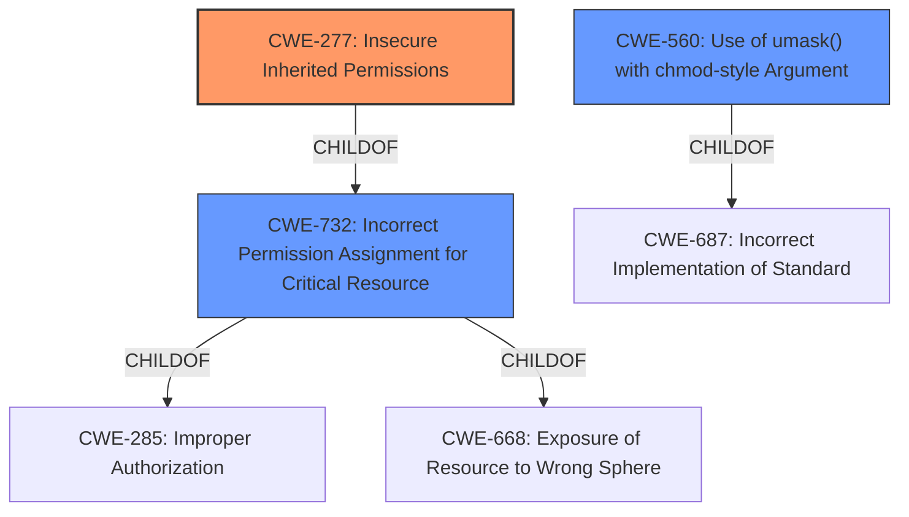

# Analysis Report for CVE-2021-31155

# Vulnerability Analysis Report: CVE-2021-31155

## Description


## Analysis (with Relationship Data)

# Summary
| CWE ID | CWE Name | Confidence | CWE Abstraction Level | CWE Vulnerability Mapping Label | CWE-Vulnerability Mapping Notes |
|---|---|---|---|---|---|
| CWE-277 | Insecure Inherited Permissions | 0.9 | Variant | Allowed | Primary CWE |
| CWE-732 | Incorrect Permission Assignment for Critical Resource | 0.7 | Class | Allowed-with-Review | Secondary Candidate |
| CWE-560 | Use of umask() with chmod-style Argument | 0.6 | Variant | Allowed | Secondary Candidate |

## Evidence and Confidence

*   **Confidence Score:** 0.8
*   **Evidence Strength:** HIGH

## Relationship Analysis
The primary CWE, CWE-277 (Insecure Inherited Permissions), is a Variant of CWE-732 (Incorrect Permission Assignment for Critical Resource), indicating a more specific type of permission issue. CWE-732 is a ChildOf CWE-285 and CWE-668. CWE-560 (Use of umask() with chmod-style Argument) is a Variant of CWE-687. These hierarchical relationships support the choice of CWE-277 as the most specific and relevant CWE, accurately capturing the vulnerability's root cause related to the **failure to normalize the umask**.



## Vulnerability Chain
The vulnerability chain starts with the **failure to normalize the umask**. This leads to the creation of directories with insecure permissions (CWE-277), which allows a local attacker to bypass password authentication and gain full root privileges.

## Summary of Analysis
The initial analysis focused on the **failure to normalize the umask** and its direct impact on directory permissions. The provided evidence from the "CVE Reference Links Content Summary" section confirms that the `please` utility creates the token directory `/var/run/pleaser/token` without properly sanitizing the process's umask. This allows a local attacker to gain full root privileges by manipulating the umask and creating world-writable token directories.

The selection of CWE-277 is primarily based on the evidence that the vulnerability stems from insecure permissions being inherited due to the **failure to normalize the umask**. This aligns perfectly with the CWE-277 description: "A product defines a set of insecure permissions that are inherited by objects that are created by the program."

CWE-732 was considered because it describes a general case of incorrect permission assignment. However, CWE-277 is a more specific variant that accurately reflects the inherited nature of the insecure permissions in this vulnerability.

CWE-560 was considered because it addresses the incorrect usage of the umask() function. While the description mentions "umask() with chmod-style Argument", the important part is that the umask is not normalized.

The hierarchical relationships between these CWEs support the choice of CWE-277 as the most specific and relevant option. It directly addresses the root cause of the vulnerability, which is the insecure inheritance of permissions due to the **failure to normalize the umask**.

Relevant CWE Information:

# Enhanced Context (25 CWEs)
The following CWEs were identified as potentially relevant to this vulnerability:

## CWE-41: Improper Resolution of Path Equivalence
**Abstraction Level**: Base
**Similarity Score**: 0.75
**Source**: dense

**Description**:
The product is vulnerable to file system contents disclosure through path equivalence. Path equivalence involves the use of special characters in file and directory names. The associated manipulations are intended to generate multiple names for the same object.

**Mapping Guidance**:
- Usage: Allowed
- Rationale: This CWE entry is at the Base level of abstraction, which is a preferred level of abstraction for mapping to the root causes of vulnerabilities.
**Why not selected**: Path equivalence is not a factor in this vulnerability.

## CWE-682: Incorrect Calculation
**Abstraction Level**: Pillar
**Similarity Score**: 0.75
**Source**: dense

**Description**:
The product performs a calculation that generates incorrect or unintended results that are later used in security-critical decisions or resource management.

**Mapping Guidance**:
- Usage: Discouraged
- Rationale: This CWE entry is extremely high-level, a Pillar. In many cases, lower-level children or descendants are more appropriate. However, sometimes this weakness is forced to be used due to the lack of in-depth weakness research. See Research Gaps.
**Why not selected**: This is too general and not specific to the vulnerability.

## CWE-59: Improper Link Resolution Before File Access ('Link Following')
**Abstraction Level**: Base
**Similarity Score**: 0.74
**Source**: dense

**Description**:
The product attempts to access a file based on the filename, but it does not properly prevent that filename from identifying a link or shortcut that resolves to an unintended resource.

**Mapping Guidance**:
- Usage: Allowed
- Rationale: This CWE entry is at the Base level of abstraction, which is a preferred level of abstraction for mapping to the root causes of vulnerabilities.
**Why not selected**: While symlinks are used as part of the attack, the root cause is related to permissions and the umask.

## CWE-667: Improper Locking
**Abstraction Level**: Class
**Similarity Score**: 0.74
**Source**: dense

**Description**:
The product does not properly acquire or release a lock on a resource, leading to unexpected resource state changes and behaviors.

**Mapping Guidance**:
- Usage: Allowed-with-Review
- Rationale: This CWE entry is a Class and might have Base-level children that would be more appropriate
**Why not selected**: Locking is not a factor in this vulnerability.

## CWE-1289: Improper Validation of Unsafe Equivalence in Input
**Abstraction Level**: Base
**Similarity Score**: 0.74
**Source**: dense

**Description**:
The product receives an input value that is used as a resource identifier or other type of reference, but it does not validate or incorrectly validates that the input is equivalent to a potentially-unsafe value.

**Mapping Guidance**:
- Usage: Allowed
- Rationale: This CWE entry is at the Base level of abstraction, which is a preferred level of abstraction for mapping to the root causes of vulnerabilities.
**Why not selected**: Input validation is not the primary issue in this vulnerability.

## CWE-193: Off-by-one Error
**Abstraction Level**: Base
**Similarity Score**: 0.74
**Source**: dense

**Description**:
A product calculates or uses an incorrect maximum or minimum value that is 1 more, or 1 less, than the correct value.

**Mapping Guidance**:
- Usage: Allowed
- Rationale: This CWE entry is at the Base level of abstraction, which is a preferred level of abstraction for mapping to the root causes of vulnerabilities.
**Why not selected**: Off-by-one errors are not a factor in this vulnerability.

## CWE-131: Incorrect Calculation of Buffer Size
**Abstraction Level**: Base
**Similarity Score**: 0.74
**Source**: dense

**Description**:
The product does not correctly calculate the size to be used when allocating a buffer, which could lead to a buffer overflow.

**Mapping Guidance**:
- Usage: Allowed
- Rationale: This CWE entry is at the Base level of abstraction, which is a preferred level of abstraction for mapping to the root causes of vulnerabilities.
**Why not selected**: Buffer size calculation is not a factor in this vulnerability.

## CWE-754: Improper Check for Unusual or Exceptional Conditions
**Abstraction Level**: Class
**Similarity Score**: 0.74
**Source**: dense

**Description**:
The product does not check or incorrectly checks for unusual or exceptional conditions that are not expected to occur frequently during day to day operation of the product.

**Mapping Guidance**:
- Usage: Allowed-with-Review
- Rationale: This CWE entry is a Class and might have Base-level children that would be more appropriate
**Why not selected**: Lack of checking for unusual conditions is not the primary issue.

## CWE-697: Incorrect Comparison
**Abstraction Level**: Pillar
**


## CWE Relationship Analysis

Current CWEs represent these abstraction levels: .


### Vulnerability Chain Analysis

**Chain starting from CWE-732:**
- 732 (Incorrect Permission Assignment for Critical Resource) - ROOT


**Chain starting from CWE-667:**
- 667 (Improper Locking) - ROOT


### CWE Relationship Diagram

```mermaid
graph TD
    classDef primary fill:#f96,stroke:#333,stroke-width:2px
    classDef secondary fill:#69f,stroke:#333
    classDef tertiary fill:#9e9,stroke:#333
```


*Report generated on 2025-04-02 04:03:37*
