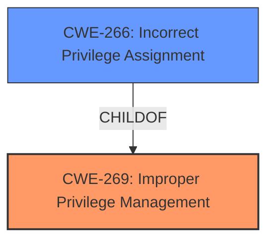

# Analysis Report for CVE-2021-31167

# Vulnerability Analysis Report: CVE-2021-31167

## Description


## Analysis (with Relationship Data)

# Summary
| CWE ID | CWE Name | Confidence | CWE Abstraction Level | CWE Vulnerability Mapping Label | CWE-Vulnerability Mapping Notes |
|---|---|---|---|---|---|
| CWE-269 | Improper Privilege Management | 0.6 | Class | Primary | Discouraged |
| CWE-266 | Incorrect Privilege Assignment | 0.4 | Base | Secondary | Allowed |

## Evidence and Confidence

*   **Confidence Score:** 0.6
*   **Evidence Strength:** LOW

## Relationship Analysis
The primary relationship that influenced the choice was the parent-child relationship between CWE-269 (Improper Privilege Management) and CWE-266 (Incorrect Privilege Assignment). CWE-269 is a class-level CWE that encompasses a broad range of privilege management issues, while CWE-266 is a base-level CWE that represents a specific type of privilege management issue, namely incorrect privilege assignment. The choice of CWE-269 as the primary CWE reflects the high-level nature of the vulnerability description, which mentions "Elevation of Privilege" without specifying the exact mechanism. The retriever results also suggest a strong match for CWE-266.



## Vulnerability Chain
The vulnerability chain starts with a **failure in privilege management** within the Windows Container Manager Service, leading to an **elevation of privilege**. The specific details of how privileges are mishandled are not provided.

## Summary of Analysis
The initial analysis focused on the "Elevation of Privilege" impact and the component involved, the "Container Manager Service." The primary CWE match suggested by similar CVE descriptions was CWE-NVD-noinfo, which is not useful. The Retriever Results indicated several potential CWEs related to privilege management.

The final decision was to map to CWE-269 (Improper Privilege Management) as the primary CWE, with CWE-266 (Incorrect Privilege Assignment) as a secondary CWE. This decision is based on the **impact** of the vulnerability, which is an **elevation of privilege**, and the fact that the vulnerability occurs within the Container Manager Service, which is responsible for managing container privileges.

The evidence supporting this mapping is weak, as the vulnerability description lacks specific details about the root cause. However, the chosen CWEs are at an appropriate level of abstraction given the available information. Further investigation would be needed to identify the precise mechanism by which privileges are mishandled. The choice of CWE-269 is consistent with the provided information.

Relevant CWE Information:

# Enhanced Context (25 CWEs)
The following CWEs were identified as potentially relevant to this vulnerability:

## CWE-266: Incorrect Privilege Assignment
**Abstraction Level**: Base
**Similarity Score**: 0.81
**Source**: dense

**Description**:
A product incorrectly assigns a privilege to a particular actor, creating an unintended sphere of control for that actor.

**Mapping Guidance**:
- Usage: Allowed
- Rationale: This CWE entry is at the Base level of abstraction, which is a preferred level of abstraction for mapping to the root causes of vulnerabilities.

## CWE-269: Improper Privilege Management
**Abstraction Level**: Class
**Status:** Draft

### Description
The product does not properly assign, modify, track, or check privileges for an actor, creating an unintended sphere of control for that actor.

### Extended Description
Not provided

### Alternative Terms
None

### Relationships
ChildOf -> CWE-284

### Mapping Guidance
**Usage:** Discouraged
**Rationale:** CWE-269 is commonly misused. It can be conflated with "privilege escalation," which is a technical impact that is listed in many low-information vulnerability reports [REF-1287]. It is not useful for trend analysis.
**Comments:** If an error or mistake allows privilege escalation, then use the CWE ID for that mistake. Avoid using CWE-269 when only phrases such as "privilege escalation" or "gain privileges" are available, as these indicate technical impact of the vulnerability - not the root cause weakness. If the root cause seems to be directly related to privileges, then examine the children of CWE-269 for additional hints, such as Execution with Unnecessary Privileges (CWE-250) or Incorrect Privilege Assignment (CWE-266).
**Reasons:**
- Frequent Misuse


## CWE Relationship Analysis

Current CWEs represent these abstraction levels: .


### Vulnerability Chain Analysis

**Chain starting from CWE-269:**
- 269 (Improper Privilege Management) - ROOT


**Chain starting from CWE-250:**
- 250 (Execution with Unnecessary Privileges) - ROOT


### CWE Relationship Diagram

```mermaid
graph TD
    classDef primary fill:#f96,stroke:#333,stroke-width:2px
    classDef secondary fill:#69f,stroke:#333
    classDef tertiary fill:#9e9,stroke:#333
```


*Report generated on 2025-04-01 17:48:19*
