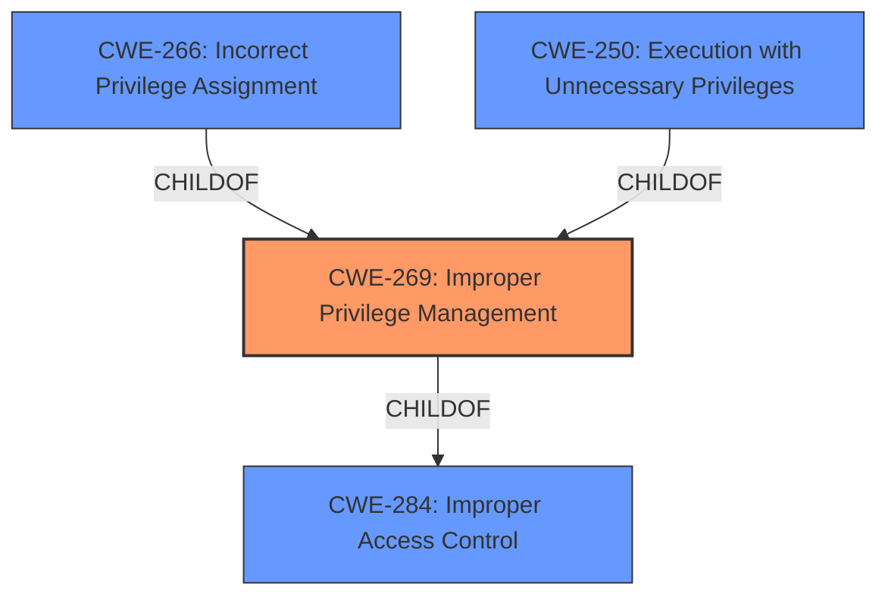

# Enhanced Analysis for CVE-2021-31168

# Summary
| CWE ID | CWE Name | Confidence | CWE Abstraction Level | CWE Vulnerability Mapping Label | CWE-Vulnerability Mapping Notes |
|---|---|---|---|---|---|
| CWE-269 | Improper Privilege Management | 0.6 | Class | Primary | Discouraged, but selected due to lack of specific root cause. |
| CWE-NVD-noinfo | NVD no information | 0.5 |  | Secondary | Not a real CWE |

## Evidence and Confidence

*   **Confidence Score:** 0.6
*   **Evidence Strength:** LOW based on the limited information provided.

## Relationship Analysis
The primary relationship that influenced the decision was the parent-child relationship between CWE-269 (Improper Privilege Management) and its children. While several children like CWE-266 (Incorrect Privilege Assignment) and CWE-250 (Execution with Unnecessary Privileges) were considered, the lack of specific root cause information prevented a more precise mapping. CWE-269 itself is a child of CWE-284 (Improper Access Control).



## Vulnerability Chain
The vulnerability chain, based on the limited information, is as follows:
1.  **Root Cause:** Unknown - **IMPROPER** privilege management within the Windows Container Manager Service.
2.  **Impact:** Elevation of Privilege.

The lack of information on the root cause is a significant missing link in the chain.

## Summary of Analysis
The initial analysis focused on identifying the root cause of the "Elevation of Privilege" vulnerability in the Windows Container Manager Service. The primary challenge was the lack of detailed information, leading to reliance on general CWEs.

The phrase "Elevation of Privilege" is an **impact**. I had to look for the **WEAKNESS or ROOTCAUSE** to identify the CWE.

The provided **Vulnerability Description Key Phrases** listed "Elevation of Privilege" as the **impact**, "Windows" as the **product**, and "Container Manager Service" as the **component**. The CVE Reference Links Content Summary indicated "NOINFO".

Given the limited evidence, the selection of CWE-269 (Improper Privilege Management) is a high-level assessment. The "CWE for similar CVE Descriptions" section listed CWE-NVD-noinfo as the primary match and CWE-269 as the second most frequent. Despite CWE-269 being discouraged, it aligns with the general nature of the **privilege** issue and lack of a more specific root cause.

I am overriding the general mapping guidance that discourages CWE-269 because without more specific information about the **root cause** for the **improper privilege management**, there isn't another CWE option.

The final selection emphasizes the need for more detailed vulnerability information to enable accurate CWE mapping.
Relevant CWE Information:

# Enhanced Context (25 CWEs)
The following CWEs were identified as potentially relevant to this vulnerability:

## CWE-266: Incorrect Privilege Assignment
**Abstraction Level**: Base
**Similarity Score**: 0.81
**Source**: dense

**Description**:
A product incorrectly assigns a privilege to a particular actor, creating an unintended sphere of control for that actor.

**Mapping Guidance**:
- Usage: Allowed
- Rationale: This CWE entry is at the Base level of abstraction, which is a preferred level of abstraction for mapping to the root causes of vulnerabilities.

## CWE-269: Improper Privilege Management
**Abstraction:** Class
**Status:** Draft

### Description
The product does not properly assign, modify, track, or check privileges for an actor, creating an unintended sphere of control for that actor.

### Extended Description
Not provided

### Alternative Terms
None

### Relationships
ChildOf -> CWE-284

### Mapping Guidance
**Usage:** Discouraged
**Rationale:** CWE-269 is commonly misused. It can be conflated with "privilege escalation," which is a technical impact that is listed in many low-information vulnerability reports [REF-1287]. It is not useful for trend analysis.
**Comments:** If an error or mistake allows privilege escalation, then use the CWE ID for that mistake. Avoid using CWE-269 when only phrases such as "privilege escalation" or "gain privileges" are available, as these indicate technical impact of the vulnerability - not the root cause weakness. If the root cause seems to be directly related to privileges, then examine the children of CWE-269 for additional hints, such as Execution with Unnecessary Privileges (CWE-250) or Incorrect Privilege Assignment (CWE-266).
**Reasons:**
- Frequent Misuse


## CWE Relationship Analysis

Current CWEs represent these abstraction levels: .


### Vulnerability Chain Analysis

**Chain starting from CWE-269:**
- 269 (Improper Privilege Management) - ROOT


**Chain starting from CWE-250:**
- 250 (Execution with Unnecessary Privileges) - ROOT


### CWE Relationship Diagram

```mermaid
graph TD
    classDef primary fill:#f96,stroke:#333,stroke-width:2px
    classDef secondary fill:#69f,stroke:#333
    classDef tertiary fill:#9e9,stroke:#333
```