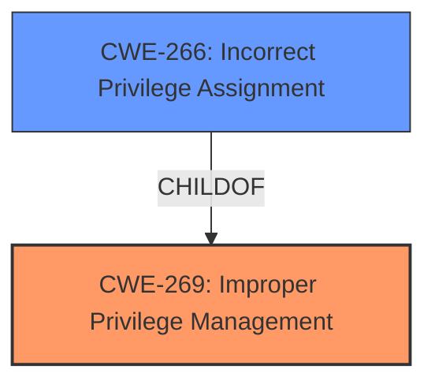

# Enhanced Analysis for CVE-2021-31169

# Summary
| CWE ID | CWE Name | Confidence | CWE Abstraction Level | CWE Vulnerability Mapping Label | CWE-Vulnerability Mapping Notes |
|---|---|---|---|---|---|
| CWE-269 | Improper Privilege Management | 0.6 | Class | Primary | Discouraged |
| CWE-266 | Incorrect Privilege Assignment | 0.5 | Base | Secondary | Allowed |

## Evidence and Confidence

*   **Confidence Score:** 0.6
*   **Evidence Strength:** LOW

## Relationship Analysis
The primary CWE is CWE-269, which is a Class-level CWE. CWE-266 is a child of CWE-269, representing a more specific case of improper privilege management. Choosing CWE-269 acknowledges the high-level nature of the available evidence.



## Vulnerability Chain
The vulnerability chain is short due to limited information.

Initial Flaw: **Improper Privilege Management** (CWE-269)
Impact: Elevation of Privilege.

## Summary of Analysis
The initial analysis focused on identifying the root cause of the "Elevation of Privilege" vulnerability in the Windows Container Manager Service. Given the limited details in the vulnerability description, the selection of CWEs involved careful consideration of the available evidence and the relationships between different CWEs.

The vulnerability description key phrases highlight "Elevation of Privilege," which suggests an issue related to privilege management. The primary CWE match suggested is CWE-NVD-noinfo, which indicates a lack of detailed information. The top CWEs listed include CWE-NVD-noinfo, CWE-269 (Improper Privilege Management), and CWE-362 (Race Condition).

The Retriever Results provide a list of candidate CWEs, with CWE-59 (Improper Link Resolution Before File Access) and CWE-266 (Incorrect Privilege Assignment) among the top matches. After reviewing the complete CWE specifications, I considered several candidates.

CWE-269 (Improper Privilege Management) is selected as the primary CWE. While the mapping guidance discourages its use due to frequent misuse and its high-level nature, the lack of detailed information about the specific mistake causing the privilege escalation makes it difficult to choose a more specific CWE. The vulnerability description clearly indicates an issue with privilege management within the Container Manager Service, making CWE-269 a reasonable, albeit general, choice.

CWE-266 (Incorrect Privilege Assignment) is considered as a secondary CWE, as it represents a more specific case of improper privilege management. However, without more details about how the privilege was incorrectly assigned, it is difficult to confidently assign this CWE.

Other CWEs considered but not used:

*   CWE-59, CWE-426, CWE-732, CWE-1386: These CWEs relate to file access and path manipulation, but there is no evidence in the vulnerability description to support these.
*   CWE-520: .NET Misconfiguration: Use of Impersonation - This is specific to .NET applications, and there's no indication that the vulnerability is related to .NET.
*   CWE-98, CWE-277, CWE-250: These CWEs are related to PHP, insecure inherited permissions, and unnecessary privileges, respectively. There is no clear evidence in the vulnerability description to support these.

The decision to use CWE-269 is based on the following evidence:

*   Vulnerability Description Key Phrases: "Elevation of Privilege" indicates an issue related to privilege management.

The confidence score is 0.6 due to the limited information available. A more detailed analysis of the vulnerability would be required to identify a more specific CWE.


## CWE Relationship Analysis

Current CWEs represent these abstraction levels: .


### Vulnerability Chain Analysis

**Chain starting from CWE-732:**
- 732 (Incorrect Permission Assignment for Critical Resource) - ROOT


**Chain starting from CWE-362:**
- 362 (Concurrent Execution using Shared Resource with Improper Synchronization ('Race Condition')) - ROOT


### CWE Relationship Diagram

```mermaid
graph TD
    classDef primary fill:#f96,stroke:#333,stroke-width:2px
    classDef secondary fill:#69f,stroke:#333
    classDef tertiary fill:#9e9,stroke:#333
```