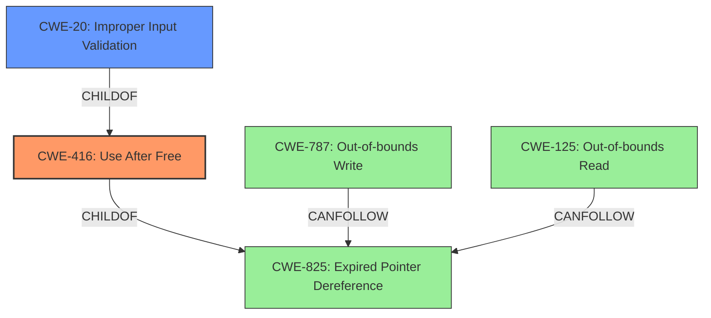

# Analysis for CVE-2021-31170

# Summary
| CWE ID | CWE Name | Confidence | CWE Abstraction Level | CWE Vulnerability Mapping Label | CWE-Vulnerability Mapping Notes |
|---|---|---|---|---|---|
| CWE-416 | Use After Free | 0.9 | Base | Primary | Allowed |
| CWE-20 | Improper Input Validation | 0.5 | Class | Secondary | Allowed |

## Evidence and Confidence

*   **Confidence Score:** 0.9
*   **Evidence Strength:** HIGH

## Relationship Analysis
The primary CWE is CWE-416, Use After Free. This is a base level CWE which is the preferred level of abstraction for mapping to the root causes of vulnerabilities. CWE-416 is a child of CWE-825, Expired Pointer Dereference. CWE-825 can be reached by the CANFOLLOW relationship from CWE-787, Out-of-bounds Write and CWE-125, Out-of-bounds Read.
CWE-20, Improper Input Validation, is a secondary cause.

## Vulnerability Chain
The vulnerability chain starts with a lack of validation (CWE-20), leading to a use-after-free condition (CWE-416) when handling Palette objects, which ultimately results in an elevation of privilege.

## Summary of Analysis
The vulnerability description clearly states that the root cause is a **use-after-free** condition when handling Palette objects due to a **lack of validation** of the object's existence before performing operations. The "CVE Reference Links Content Summary" section explicitly mentions "The vulnerability stems from a use-after-free condition when handling Palette objects due to a lack of validation of the object's existence before performing operations".

CWE-416 (Use After Free) directly addresses the core issue described in the vulnerability, which is the use of memory after it has been freed.
The evidence supports this classification with high confidence (0.9).

CWE-20 (Improper Input Validation) is considered as a secondary CWE because the description mentions a "lack of validation." This lack of validation contributes to the use-after-free condition. Confidence is lower (0.5) as there is no direct mention of the type of validation that is missing.

Other CWEs considered but not selected:

*   CWE-59, CWE-1386, CWE-367, CWE-782, CWE-61, CWE-266, CWE-1285: These CWEs relate to file access or privilege management, which are not directly relevant to the root cause of the vulnerability.
*   CWE-781: Relates to Improper Address Validation in IOCTL, but this vulnerability does not involve IOCTLs.
*   CWE-123: Write-what-where, this is an impact rather than a root cause.
*   CWE-732: Relates to incorrect permission assignment, not directly applicable to the use-after-free.
*   CWE-40: Relates to path traversal, not applicable here.
*   CWE-825: Expired Pointer Dereference, is a parent of CWE-416, so CWE-416 is more specific.

The selected CWEs are at the optimal level of specificity, addressing both the root cause (use-after-free) and a contributing factor (lack of validation).

Relevant CWE Information:

# Enhanced Context (25 CWEs)

## CWE-59: Improper Link Resolution Before File Access ('Link Following')
**Abstraction Level**: Base
**Similarity Score**: 0.81
**Source**: dense

**Description**:
The product attempts to access a file based on the filename, but it does not properly prevent that filename from identifying a link or shortcut that resolves to an unintended resource.

**Mapping Guidance**:
- Usage: Allowed
- Rationale: This CWE entry is at the Base level of abstraction, which is a preferred level of abstraction for mapping to the root causes of vulnerabilities.

## CWE-41: Improper Resolution of Path Equivalence
**Abstraction Level**: Base
**Similarity Score**: 0.80
**Source**: dense

**Description**:
The product is vulnerable to file system contents disclosure through path equivalence. Path equivalence involves the use of special characters in file and directory names. The associated manipulations are intended to generate multiple names for the same object.

**Mapping Guidance**:
- Usage: Allowed
- Rationale: This CWE entry is at the Base level of abstraction, which is a preferred level of abstraction for mapping to the root causes of vulnerabilities.

## CWE-73: External Control of File Name or Path
**Abstraction Level**: Base
**Similarity Score**: 0.79
**Source**: dense

**Description**:
The product allows user input to control or influence paths or file names that are used in filesystem operations.

**Mapping Guidance**:
- Usage: Allowed
- Rationale: This CWE entry is at the Base level of abstraction, which is a preferred level of abstraction for mapping to the root causes of vulnerabilities.

## CWE-23: Relative Path Traversal
**Abstraction Level**: Base
**Similarity Score**: 0.79
**Source**: dense

**Description**:
The product uses external input to construct a pathname that should be within a restricted directory, but it does not properly neutralize sequences such as ".." that can resolve to a location that is outside of that directory.

**Mapping Guidance**:
- Usage: Allowed
- Rationale: This CWE entry is at the Base level of abstraction, which is a preferred level of abstraction for mapping to the root causes of vulnerabilities.

## CWE-668: Exposure of Resource to Wrong Sphere
**Abstraction Level**: Class
**Similarity Score**: 0.78
**Source**: dense

**Description**:
The product exposes a resource to the wrong control sphere, providing unintended actors with inappropriate access to the resource.

**Mapping Guidance**:
- Usage: Discouraged
- Rationale: CWE-668 is high-level and is often misused as a catch-all when lower-level CWE IDs might be applicable. It is sometimes used for low-information vulnerability reports [REF-1287]. It is a level-1 Class (i.e., a child of a Pillar). It is not useful for trend analysis.

## CWE-427: Uncontrolled Search Path Element
**Abstraction Level**: Base
**Similarity Score**: 0.77
**Source**: dense

**Description**:
The product uses a fixed or controlled search path to find resources, but one or more locations in that path can be under the control of unintended actors.

**Mapping Guidance**:
- Usage: Allowed
- Rationale: This CWE entry is at the Base level of abstraction, which is a preferred level of abstraction for mapping to the root causes of vulnerabilities.

## CWE-782: Exposed IOCTL with Insufficient Access Control
**Abstraction Level**: Variant
**Similarity Score**: 0.76
**Source**: dense

**Description**:
The product implements an IOCTL with functionality that should be restricted, but it does not properly enforce access control for the IOCTL.

**Mapping Guidance**:
- Usage: Allowed
- Rationale: This CWE entry is at the Variant level of abstraction, which is a preferred level of abstraction for mapping to the root causes of vulnerabilities.

## CWE-552: Files or Directories Accessible to External Parties
**Abstraction Level**: Base
**Similarity Score**: 0.76
**Source**: dense

**Description**:
The product makes files or directories accessible to unauthorized actors, even though they should not be.

**Mapping Guidance**:
- Usage: Allowed
- Rationale: This CWE entry is at the Base level of abstraction, which is a preferred level of abstraction for mapping to the root causes of vulnerabilities.

## CWE-274: Improper Handling of Insufficient Privileges
**Abstraction Level**: Base
**Similarity Score**: 0.76
**Source**: dense

**Description**:
The product does not handle or incorrectly handles when it has insufficient privileges to perform an operation, leading to resultant weaknesses.

**Mapping Guidance**:
- Usage: Discouraged
- Rationale: This CWE entry could be deprecated in a future version of CWE