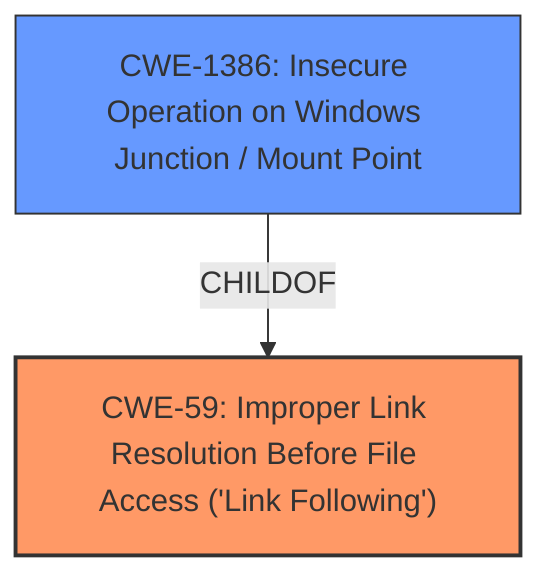

# Enhanced Analysis for CVE-2021-31187

# Summary
| CWE ID | CWE Name | Confidence | CWE Abstraction Level | CWE Vulnerability Mapping Label | CWE-Vulnerability Mapping Notes |
|---|---|---|---|---|---|
| CWE-59 | Improper Link Resolution Before File Access ('Link Following') | 0.9 | Base | Allowed | Primary CWE |
| CWE-1386 | Insecure Operation on Windows Junction / Mount Point | 0.8 | Base | Allowed | Secondary CWE |

## Evidence and Confidence

*   **Confidence Score:** 0.9
*   **Evidence Strength:** HIGH

## Relationship Analysis
The primary CWE identified is CWE-59, which describes the **improper handling of links before file access**. CWE-1386, a child of CWE-59, is also relevant as it specifies insecure operations on Windows junctions/mount points. This parent-child relationship highlights that CWE-1386 is a more specific case of CWE-59. The vulnerability description specifically mentions the creation of directory junctions as the **root cause**, making CWE-1386 a strong secondary candidate.



## Vulnerability Chain
The vulnerability chain starts with the **improper handling of directory junctions (CWE-1386 or CWE-59)**, leading to the ability to create files in arbitrary locations. This, in turn, allows an attacker to escalate privileges and execute code as SYSTEM.
  - **Root Cause:** Improper Link Resolution Before File Access ('Link Following') (CWE-59) / Insecure Operation on Windows Junction / Mount Point (CWE-1386)
  - **Impact:** Elevation of Privilege

## Summary of Analysis
The initial analysis and resulting conclusion are heavily based on the provided evidence, specifically the "CVE Reference Links Content Summary" which states: "The service can be abused to create a file in an arbitrary location by creating a directory junction." This directly points to a weakness related to link following or junction point handling.

CWE-59 is selected as the primary CWE due to its broad applicability to the **improper handling of links before file access**, and because CWE-1386 is a child of CWE-59, this makes CWE-59 the more appropriate primary root cause. However, the reference to directory junctions strongly suggests CWE-1386 as a relevant secondary CWE, as it is the Windows-specific implementation of link following.

The selected CWEs are at the optimal level of specificity because CWE-59 describes the general class of **link-following vulnerabilities**, while CWE-1386 describes the specific implementation related to Windows junctions and mount points.

# Enhanced Context (25 CWEs)
The following CWEs were identified as potentially relevant to this vulnerability:

## CWE-824: Access of Uninitialized Pointer
**Reason for not selecting**: Not relevant. The vulnerability is about improper handling of links, not uninitialized pointers.
## CWE-59: Improper Link Resolution Before File Access ('Link Following')
**Reason for selecting**: Vulnerability involves abusing directory junctions to create files in arbitrary locations. This aligns with improper link resolution.
## CWE-667: Improper Locking
**Reason for not selecting**: Not relevant. The vulnerability is about improper handling of links, not improper locking.
## CWE-41: Improper Resolution of Path Equivalence
**Reason for not selecting**: While related to path manipulation, the specific vulnerability involves directory junctions, making CWE-59 and CWE-1386 more appropriate.
## CWE-822: Untrusted Pointer Dereference
**Reason for not selecting**: Not relevant. The vulnerability is about improper handling of links, not untrusted pointer dereferences.
## CWE-404: Improper Resource Shutdown or Release
**Reason for not selecting**: Not relevant. The vulnerability is about improper handling of links, not resource shutdown.
## CWE-665: Improper Initialization
**Reason for not selecting**: Not relevant. The vulnerability is about improper handling of links, not initialization.
## CWE-226: Sensitive Information in Resource Not Removed Before Reuse
**Reason for not selecting**: Not relevant. The vulnerability is about improper handling of links, not sensitive information removal.
## CWE-252: Unchecked Return Value
**Reason for not selecting**: Not relevant. The vulnerability is about improper handling of links, not unchecked return values.
## CWE-131: Incorrect Calculation of Buffer Size
**Reason for not selecting**: Not relevant. The vulnerability is about improper handling of links, not buffer size calculation.
## CWE-59: Improper Link Resolution Before File Access ('Link Following')
**Reason for selecting**: Vulnerability involves abusing directory junctions to create files in arbitrary locations. This aligns with improper link resolution.
## CWE-1386: Insecure Operation on Windows Junction / Mount Point
**Reason for selecting**: The vulnerability description explicitly mentions abusing directory junctions, which is directly related to this CWE.
## CWE-367: Time-of-check Time-of-use (TOCTOU) Race Condition
**Reason for not selecting**: While a race condition could potentially exacerbate the vulnerability, it's not the primary weakness.
## CWE-61: UNIX Symbolic Link (Symlink) Following
**Reason for not selecting**: This is similar to CWE-59, but the vulnerability specifically mentions Windows directory junctions, making CWE-1386 a more appropriate secondary choice.
## CWE-252: Unchecked Return Value
**Reason for not selecting**: Not relevant. The vulnerability is about improper handling of links, not unchecked return values.
## CWE-123: Write-what-where Condition
**Reason for not selecting**: This could be a consequence of the vulnerability, but the **root cause** is the improper handling of links.
## CWE-416: Use After Free
**Reason for not selecting**: Not relevant. The vulnerability is about improper handling of links, not use-after-free.
## CWE-120: Buffer Copy without Checking Size of Input ('Classic Buffer Overflow')
**Reason for not selecting**: Not relevant. The vulnerability is about improper handling of links, not buffer overflows.
## CWE-825: Expired Pointer Dereference
**Reason for not selecting**: Not relevant. The vulnerability is about improper handling of links, not pointer dereferences.
## CWE-787: Out-of-bounds Write
**Reason for not selecting**: This could be a consequence of the vulnerability, but the **root cause** is the improper handling of links.
## CWE-1284: Improper Validation of Specified Quantity in Input
**Reason for not selecting**: Not relevant. The vulnerability is about improper handling of links, not input validation of quantities.
## CWE-190: Integer Overflow or Wraparound
**Reason for not selecting**: Not relevant. The vulnerability is about improper handling of links, not integer overflows.
## CWE-456: Missing Initialization of a Variable
**Reason for not selecting**: Not relevant. The vulnerability is about improper handling of links, not variable initialization.
## CWE-266: Incorrect Privilege Assignment
**Reason for not selecting**: While privilege escalation is the impact, the **root cause** is the improper handling of links.
## CWE-454: External Initialization of Trusted Variables or Data Stores
**Reason for not selecting**: Not relevant. The vulnerability is about improper handling of links, not external initialization.


## CWE Relationship Analysis

Current CWEs represent these abstraction levels: .


### Vulnerability Chain Analysis

**Chain starting from CWE-787:**
- 787 (Out-of-bounds Write) - ROOT


**Chain starting from CWE-123:**
- 123 (Write-what-where Condition) - ROOT


### CWE Relationship Diagram

```mermaid
graph TD
    classDef primary fill:#f96,stroke:#333,stroke-width:2px
    classDef secondary fill:#69f,stroke:#333
    classDef tertiary fill:#9e9,stroke:#333
```