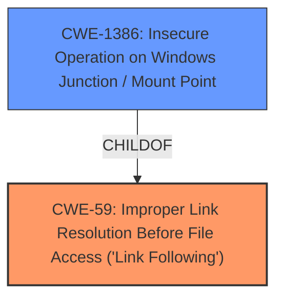

# Analysis for CVE-2021-31187

# Summary
| CWE ID | CWE Name | Confidence | CWE Abstraction Level | CWE Vulnerability Mapping Label | CWE-Vulnerability Mapping Notes |
|---|---|---|---|---|---|
| CWE-59 | Improper Link Resolution Before File Access ('Link Following') | 0.9 | Base | Allowed | Primary CWE |
| CWE-1386 | Insecure Operation on Windows Junction / Mount Point | 0.8 | Base | Allowed | Secondary CWE |

## Evidence and Confidence

*   **Confidence Score:** 0.9
*   **Evidence Strength:** HIGH

## Relationship Analysis
The primary CWE identified is CWE-59, which describes the **improper handling of links before file access**. CWE-1386, a child of CWE-59, is also relevant as it specifies insecure operations on Windows junctions/mount points. This parent-child relationship highlights that CWE-1386 is a more specific case of CWE-59. The vulnerability description specifically mentions the creation of directory junctions as the **root cause**, making CWE-1386 a strong secondary candidate.



## Vulnerability Chain
The vulnerability chain starts with the **improper handling of directory junctions (CWE-1386 or CWE-59)**, leading to the ability to create files in arbitrary locations. This, in turn, allows an attacker to escalate privileges and execute code as SYSTEM.
  - **Root Cause:** Improper Link Resolution Before File Access ('Link Following') (CWE-59) / Insecure Operation on Windows Junction / Mount Point (CWE-1386)
  - **Impact:** Elevation of Privilege

## Summary of Analysis
The initial analysis and resulting conclusion are heavily based on the provided evidence, specifically the "CVE Reference Links Content Summary" which states: "The service can be abused to create a file in an arbitrary location by creating a directory junction." This directly points to a weakness related to link following or junction point handling.

CWE-59 is selected as the primary CWE due to its broad applicability to the **improper handling of links before file access**, and because CWE-1386 is a child of CWE-59, this makes CWE-59 the more appropriate primary root cause. However, the reference to directory junctions strongly suggests CWE-1386 as a relevant secondary CWE, as it is the Windows-specific implementation of link following.

The selected CWEs are at the optimal level of specificity because CWE-59 describes the general class of **link-following vulnerabilities**, while CWE-1386 describes the specific implementation related to Windows junctions and mount points.

# Enhanced Context (25 CWEs)
The following CWEs were identified as potentially relevant to this vulnerability:

## CWE-824: Access of Uninitialized Pointer
**Reason for not selecting**: Not relevant. The vulnerability is about improper handling of links, not uninitialized pointers.
## CWE-59: Improper Link Resolution Before File Access ('Link Following')
**Reason for selecting**: Vulnerability involves abusing directory junctions to create files in arbitrary locations. This aligns with improper link resolution.
## CWE-667: Improper Locking
**Reason for not selecting**: Not relevant. The vulnerability is about improper handling of links, not improper locking.
## CWE-41: Improper Resolution of Path Equivalence
**Reason for not selecting**: While related to path manipulation, the specific vulnerability involves directory junctions, making CWE-59 and CWE-1386 more appropriate.
## CWE-822: Untrusted Pointer Dereference
**Reason for not selecting**: Not relevant. The vulnerability is about improper handling of links, not untrusted pointer dereferences.
## CWE-404: Improper Resource Shutdown or Release
**Reason for not selecting**: Not relevant. The vulnerability is about improper handling of links, not resource shutdown.
## CWE-665: Improper Initialization
**Reason for not selecting**: Not relevant. The vulnerability is about improper handling of links, not initialization.
## CWE-226: Sensitive Information in Resource Not Removed Before Reuse
**Reason for not selecting**: Not relevant. The vulnerability is about improper handling of links, not sensitive information removal.
## CWE-252: Unchecked Return Value
**Reason for not selecting**: Not relevant. The vulnerability is about improper handling of links, not unchecked return values.
## CWE-131: Incorrect Calculation of Buffer Size
**Reason for not selecting**: Not relevant. The vulnerability is about improper handling of links, not buffer size calculation.
## CWE-59: Improper Link Resolution Before File Access ('Link Following')
**Reason for selecting**: Vulnerability involves abusing directory junctions to create files in arbitrary locations. This aligns with improper link resolution.
## CWE-1386: Insecure Operation on Windows Junction / Mount Point
**Reason for selecting**: The vulnerability description explicitly mentions abusing directory junctions, which is directly related to this CWE.
## CWE-367: Time-of-check Time-of-use (TOCTOU) Race Condition
**Reason for not selecting**: While a race condition could potentially exacerbate the vulnerability, it's not the primary weakness.
## CWE-61: UNIX Symbolic Link (Symlink) Following
**Reason for not selecting**: This is similar to CWE-59, but the vulnerability specifically mentions Windows directory junctions, making CWE-1386 a more appropriate secondary choice.
## CWE-252: Unchecked Return Value
**Reason for not selecting**: Not relevant. The vulnerability is about improper handling of links, not unchecked return values.
## CWE-123: Write-what-where Condition
**Reason for not selecting**: This could be a consequence of the vulnerability, but the **root cause** is the improper handling of links.
## CWE-416: Use After Free
**Reason for not selecting**: Not relevant. The vulnerability is about improper handling of links, not use-after-free.
## CWE-120: Buffer Copy without Checking Size of Input ('Classic Buffer Overflow')
**Reason for not selecting**: Not relevant. The vulnerability is about improper handling of links, not buffer overflows.
## CWE-825: Expired Pointer Dereference
**Reason for not selecting**: Not relevant. The vulnerability is about improper handling of links, not pointer dereferences.
## CWE-787: Out-of-bounds Write
**Reason for not selecting**: This could be a consequence of the vulnerability, but the **root cause** is the improper handling of links.
## CWE-1284: Improper Validation of Specified Quantity in Input
**Reason for not selecting**: Not relevant. The vulnerability is about improper handling of links, not input validation of quantities.
## CWE-190: Integer Overflow or Wraparound
**Reason for not selecting**: Not relevant. The vulnerability is about improper handling of links, not integer overflows.
## CWE-456: Missing Initialization of a Variable
**Reason for not selecting**: Not relevant. The vulnerability is about improper handling of links, not variable initialization.
## CWE-266: Incorrect Privilege Assignment
**Reason for not selecting**: While privilege escalation is the impact, the **root cause** is the improper handling of links.
## CWE-454: External Initialization of Trusted Variables or Data Stores
**Reason for not selecting**: Not relevant. The vulnerability is about improper handling of links, not external initialization.

# Enhanced Query for CVE-2021-31187

## Vulnerability Description
Windows WalletService Elevation of Privilege Vulnerability

### Vulnerability Description Key Phrases
- **product:** Windows
- **component:** WalletService

### CWE for similar CVE Descriptions
### Primary CWE Match
CWE-NVD-noinfo

#### Top CWEs
- CWE-NVD-noinfo (Count: 284)
- CWE-269 (Count: 58)
- CWE-362 (Count: 29)

## CVE Reference Links Content Summary
```
{
  "Root cause of vulnerability": "The vulnerability exists within WalletService.",
  "Weaknesses/vulnerabilities present": "The service can be abused to create a file in an arbitrary location by creating a directory junction.",
  "Impact of exploitation": "An attacker can leverage this vulnerability to escalate privileges and execute code in the context of SYSTEM.",
  "Attack vectors": "Local attacker must first obtain the ability to execute low-privileged code on the target system.",
  "Required attacker capabilities/position": "The attacker must be able to execute low-privileged code on the target system."
}
```

## Retriever Results

### Top Combined Results

| Rank | CWE ID | Name | Abstraction | Usage  | Retrievers | Individual Scores |
|------|--------|------|-------------|-------|------------|-------------------|
| 1 | 59 | Improper Link Resolution Before File Access ('Link Following') | Base | Allowed | sparse | 0.020 |
| 2 | 1386 | Insecure Operation on Windows Junction / Mount Point | Base | Allowed | sparse | 0.015 |
| 3 | 123 | Write-what-where Condition | Base | Allowed | sparse | 0.015 |
| 4 | 266 | Incorrect Privilege Assignment | Base | Allowed | sparse | 0.014 |
| 5 | 40 | Path Traversal: '\\UNC\share\name\' (Windows UNC Share) | Variant | Allowed | sparse | 0.014 |
| 6 | 520 | .NET Misconfiguration: Use of Impersonation | Variant | Allowed | dense | 0.536 |
| 7 | 416 | Use After Free | Variant | Allowed | graph | 0.002 |
| 8 | 454 | External Initialization of Trusted Variables or Data Stores | Base | Allowed | sparse | 0.013 |
| 9 | 127 | Buffer Under-read | Variant | Allowed | sparse | 0.013 |
| 10 | 825 | Expired Pointer Dereference | Base | Allowed | sparse | 0.013 |


# Complete CWE Specifications


## CWE-59: Improper Link Resolution Before File Access ('Link Following')
**Abstraction:** Base
**Status:** Draft

### Description
The product attempts to access a file based on the filename, but it does not properly prevent that filename from identifying a link or shortcut that resolves to an unintended resource.

### Extended Description
Not provided

### Alternative Terms
insecure temporary file: Some people use the phrase "insecure temporary file" when referring to a link following weakness, but other weaknesses can produce insecure temporary files without any symlink involvement at all.
Zip Slip: "Zip slip" is an attack that uses file archives (e.g., ZIP, tar, rar, etc.) that contain filenames with path traversal sequences that cause the files to be written outside of the directory under which the archive is expected to be extracted [REF-1282]. It is most commonly used for relative path traversal (CWE-23) and link following (CWE-59).

### Relationships
ChildOf -> CWE-706
ChildOf -> CWE-706

### Mapping Guidance
**Usage:** Allowed
**Rationale:** This CWE entry is at the Base level of abstraction, which is a preferred level of abstraction for mapping to the root causes of vulnerabilities.
**Comments:** Carefully read both the name and description to ensure that this mapping is an appropriate fit. Do not try to 'force' a mapping to a lower-level Base/Variant simply to comply with this preferred level of abstraction.
**Reasons:**
- Acceptable-Use


### Additional Notes
**[Theoretical]** 

Link following vulnerabilities are Multi-factor Vulnerabilities (MFV). They are the combination of multiple elements: file or directory permissions, filename predictability, race conditions, and in some cases, a design limitation in which there is no mechanism for performing atomic file creation operations.


Some potential factors are race conditions, permissions, and predictability.


### Observed Examples
- **CVE-1999-1386:** Some versions of Perl follow symbolic links when running with the -e option, which allows local users to overwrite arbitrary files via a symlink attack.
- **CVE-2000-1178:** Text editor follows symbolic links when creating a rescue copy during an abnormal exit, which allows local users to overwrite the files of other users.
- **CVE-2004-0217:** Antivirus update allows local users to create or append to arbitrary files via a symlink attack on a logfile.


## CWE-1386: Insecure Operation on Windows Junction / Mount Point
**Abstraction:** Base
**Status:** Incomplete

### Description
The product opens a file or directory, but it does not properly prevent the name from being associated with a junction or mount point to a destination that is outside of the intended control sphere.

### Extended Description


Depending on the intended action being performed, this could allow an attacker to cause the product to read, write, delete, or otherwise operate on unauthorized files.


In Windows, NTFS5 allows for file system objects called reparse points. Applications can create a hard link from one directory to another directory, called a junction point. They can also create a mapping from a directory to a drive letter, called a mount point. If a file is used by a privileged program, but it can be replaced with a hard link to a sensitive file (e.g., AUTOEXEC.BAT), an attacker could excalate privileges. When the process opens the file, the attacker can assume the privileges of that process, tricking the privileged process to read, modify, or delete the sensitive file, preventing the program from accurately processing data. Note that one can also point to registries and semaphores.


### Alternative Terms
None

### Relationships
ChildOf -> CWE-59

### Mapping Guidance
**Usage:** Allowed
**Rationale:** This CWE entry is at the Base level of abstraction, which is a preferred level of abstraction for mapping to the root causes of vulnerabilities.
**Comments:** Carefully read both the name and description to ensure that this mapping is an appropriate fit. Do not try to 'force' a mapping to a lower-level Base/Variant simply to comply with this preferred level of abstraction.
**Reasons:**
- Acceptable-Use


### Additional Notes
**[Terminology]** Symbolic links, hard links, junctions, and mount points can be confusing terminology, as there are differences in how they operate between UNIX-based systems and Windows, and there are interactions between them.

**[Maintenance]** This entry is still under development and will continue to see updates and content improvements.


### Observed Examples
- **CVE-2021-26426:** Privileged service allows attackers to delete unauthorized files using a directory junction, leading to arbitrary code execution as SYSTEM.
- **CVE-2020-0863:** By creating a mount point and hard links, an attacker can abuse a service to allow users arbitrary file read permissions.
- **CVE-2019-1161:** Chain: race condition (CWE-362) in anti-malware product allows deletion of files by creating a junction (CWE-1386) and using hard links during the time window in which a temporary file is created and deleted.


## CWE-123: Write-what-where Condition
**Abstraction:** Base
**Status:** Draft

### Description
Any condition where the attacker has the ability to write an arbitrary value to an arbitrary location, often as the result of a buffer overflow.

### Extended Description
Not provided

### Alternative Terms
None

### Relationships
ChildOf -> CWE-787
ChildOf -> CWE-119
ChildOf -> CWE-119

### Mapping Guidance
**Usage:** Allowed
**Rationale:** This CWE entry is at the Base level of abstraction, which is a preferred level of abstraction for mapping to the root causes of vulnerabilities.
**Comments:** Carefully read both the name and description to ensure that this mapping is an appropriate fit. Do not try to 'force' a mapping to a lower-level Base/Variant simply to comply with this preferred level of abstraction.
**Reasons:**
- Acceptable-Use


### Observed Examples
- **CVE-2022-21668:** Chain: Python library does not limit the resources used to process images that specify a very large number of bands (CWE-1284), leading to excessive memory consumption (CWE-789) or an integer overflow (CWE-190).
- **CVE-2022-0545:** Chain: 3D renderer has an integer overflow (CWE-190) leading to write-what-where condition (CWE-123) using a crafted image.


## CWE-266: Incorrect Privilege Assignment
**Abstraction:** Base
**Status:** Draft

### Description
A product incorrectly assigns a privilege to a particular actor, creating an unintended sphere of control for that actor.

### Extended Description
Not provided

### Alternative Terms
None

### Relationships
ChildOf -> CWE-269
CanAlsoBe -> CWE-286

### Mapping Guidance
**Usage:** Allowed
**Rationale:** This CWE entry is at the Base level of abstraction, which is a preferred level of abstraction for mapping to the root causes of vulnerabilities.
**Comments:** Carefully read both the name and description to ensure that this mapping is an appropriate fit. Do not try to 'force' a mapping to a lower-level Base/Variant simply to comply with this preferred level of abstraction.
**Reasons:**
- Acceptable-Use


### Observed Examples
- **CVE-1999-1193:** untrusted user placed in unix "wheel" group
- **CVE-2005-2741:** Product allows users to grant themselves certain rights that can be used to escalate privileges.
- **CVE-2005-2496:** Product uses group ID of a user instead of the group, causing it to run with different privileges. This is resultant from some other unknown issue.


## CWE-40: Path Traversal: '\\UNC\share\name\' (Windows UNC Share)
**Abstraction:** Variant
**Status:** Draft

### Description
The product accepts input that identifies a Windows UNC share ('\\UNC\share\name') that potentially redirects access to an unintended location or arbitrary file.

### Extended Description
Not provided

### Alternative Terms
None

### Relationships
ChildOf -> CWE-36

### Mapping Guidance
**Usage:** Allowed
**Rationale:** This CWE entry is at the Variant level of abstraction, which is a preferred level of abstraction for mapping to the root causes of vulnerabilities.
**Comments:** Carefully read both the name and description to ensure that this mapping is an appropriate fit. Do not try to 'force' a mapping to a lower-level Base/Variant simply to comply with this preferred level of abstraction.
**Reasons:**
- Acceptable-Use


### Observed Examples
- **CVE-2001-0687:** FTP server allows a remote attacker to retrieve privileged web server system information by specifying arbitrary paths in the UNC format (\\computername\sharename).


## CWE-520: .NET Misconfiguration: Use of Impersonation
**Abstraction:** Variant
**Status:** Incomplete

### Description
Allowing a .NET application to run at potentially escalated levels of access to the underlying operating and file systems can be dangerous and result in various forms of attacks.

### Extended Description
.NET server applications can optionally execute using the identity of the user authenticated to the client. The intention of this functionality is to bypass authentication and access control checks within the .NET application code. Authentication is done by the underlying web server (Microsoft Internet Information Service IIS), which passes the authenticated token, or unauthenticated anonymous token, to the .NET application. Using the token to impersonate the client, the application then relies on the settings within the NTFS directories and files to control access. Impersonation enables the application, on the server running the .NET application, to both execute code and access resources in the context of the authenticated and authorized user.

### Alternative Terms
None

### Relationships
ChildOf -> CWE-266

### Mapping Guidance
**Usage:** Allowed
**Rationale:** This CWE entry is at the Variant level of abstraction, which is a preferred level of abstraction for mapping to the root causes of vulnerabilities.
**Comments:** Carefully read both the name and description to ensure that this mapping is an appropriate fit. Do not try to 'force' a mapping to a lower-level Base/Variant simply to comply with this preferred level of abstraction.
**Reasons:**
- Acceptable-Use


## CWE-416: Use After Free
**Abstraction:** Variant
**Status:** Stable

### Description
The product reuses or references memory after it has been freed. At some point afterward, the memory may be allocated again and saved in another pointer, while the original pointer references a location somewhere within the new allocation. Any operations using the original pointer are no longer valid because the memory "belongs" to the code that operates on the new pointer.

### Extended Description
Not provided

### Alternative Terms
Dangling pointer: a pointer that no longer points to valid memory, often after it has been freed
UAF: commonly used acronym for Use After Free
Use-After-Free

### Relationships
ChildOf -> CWE-825
ChildOf -> CWE-672
ChildOf -> CWE-672
ChildOf -> CWE-672
CanPrecede -> CWE-120
CanPrecede -> CWE-123

### Mapping Guidance
**Usage:** Allowed
**Rationale:** This CWE entry is at the Variant level of abstraction, which is a preferred level of abstraction for mapping to the root causes of vulnerabilities.
**Comments:** Carefully read both the name and description to ensure that this mapping is an appropriate fit. Do not try to 'force' a mapping to a lower-level Base/Variant simply to comply with this preferred level of abstraction.
**Reasons:**
- Acceptable-Use


### Observed Examples
- **CVE-2022-20141:** Chain: an operating system kernel has insufficent resource locking (CWE-413) leading to a use after free (CWE-416).
- **CVE-2022-2621:** Chain: two threads in a web browser use the same resource (CWE-366), but one of those threads can destroy the resource before the other has completed (CWE-416).
- **CVE-2021-0920:** Chain: mobile platform race condition (CWE-362) leading to use-after-free (CWE-416), as exploited in the wild per CISA KEV.


## CWE-454: External Initialization of Trusted Variables or Data Stores
**Abstraction:** Base
**Status:** Draft

### Description
The product initializes critical internal variables or data stores using inputs that can be modified by untrusted actors.

### Extended Description
A product system should be reluctant to trust variables that have been initialized outside of its trust boundary, especially if they are initialized by users. The variables may have been initialized incorrectly. If an attacker can initialize the variable, then they can influence what the vulnerable system will do.

### Alternative Terms
None

### Relationships
ChildOf -> CWE-1419
CanAlsoBe -> CWE-456

### Mapping Guidance
**Usage:** Allowed
**Rationale:** This CWE entry is at the Base level of abstraction, which is a preferred level of abstraction for mapping to the root causes of vulnerabilities.
**Comments:** Carefully read both the name and description to ensure that this mapping is an appropriate fit. Do not try to 'force' a mapping to a lower-level Base/Variant simply to comply with this preferred level of abstraction.
**Reasons:**
- Acceptable-Use


### Additional Notes
**[Relationship]** Overlaps Missing variable initialization, especially in PHP.

**[Applicable Platform]** 

This is often found in PHP due to register_globals and the common practice of storing library/include files under the web document root so that they are available using a direct request.


### Observed Examples
- **CVE-2022-43468:** WordPress module sets internal variables based on external inputs, allowing false reporting of the number of views
- **CVE-2000-0959:** Does not clear dangerous environment variables, enabling symlink attack.
- **CVE-2001-0033:** Specify alternate configuration directory in environment variable, enabling untrusted path.


## CWE-127: Buffer Under-read
**Abstraction:** Variant
**Status:** Draft

### Description
The product reads from a buffer using buffer access mechanisms such as indexes or pointers that reference memory locations prior to the targeted buffer.

### Extended Description
This typically occurs when the pointer or its index is decremented to a position before the buffer, when pointer arithmetic results in a position before the beginning of the valid memory location, or when a negative index is used. This may result in exposure of sensitive information or possibly a crash.

### Alternative Terms
None

### Relationships
ChildOf -> CWE-125
ChildOf -> CWE-786

### Mapping Guidance
**Usage:** Allowed
**Rationale:** This CWE entry is at the Variant level of abstraction, which is a preferred level of abstraction for mapping to the root causes of vulnerabilities.
**Comments:** Carefully read both the name and description to ensure that this mapping is an appropriate fit. Do not try to 'force' a mapping to a lower-level Base/Variant simply to comply with this preferred level of abstraction.
**Reasons:**
- Acceptable-Use


### Additional Notes
**[Research Gap]** Under-studied.


### Observed Examples
- **CVE-2021-40985:** HTML conversion package has a buffer under-read, allowing a crash


## CWE-825: Expired Pointer Dereference
**Abstraction:** Base
**Status:** Incomplete

### Description
The product dereferences a pointer that contains a location for memory that was previously valid, but is no longer valid.

### Extended Description
When a product releases memory, but it maintains a pointer to that memory, then the memory might be re-allocated at a later time. If the original pointer is accessed to read or write data, then this could cause the product to read or modify data that is in use by a different function or process. Depending on how the newly-allocated memory is used, this could lead to a denial of service, information exposure, or code execution.

### Alternative Terms
Dangling pointer

### Relationships
ChildOf -> CWE-119
ChildOf -> CWE-119
ChildOf -> CWE-119
ChildOf -> CWE-672
CanPrecede -> CWE-125
CanPrecede -> CWE-787

### Mapping Guidance
**Usage:** Allowed
**Rationale:** This CWE entry is at the Base level of abstraction, which is a preferred level of abstraction for mapping to the root causes of vulnerabilities.
**Comments:** Carefully read both the name and description to ensure that this mapping is an appropriate fit. Do not try to 'force' a mapping to a lower-level Base/Variant simply to comply with this preferred level of abstraction.
**Reasons:**
- Acceptable-Use


### Additional Notes
**[Maintenance]** There are close relationships between incorrect pointer dereferences and other weaknesses related to buffer operations. There may not be sufficient community agreement regarding these relationships. Further study is needed to determine when these relationships are chains, composites, perspective/layering, or other types of relationships. As of September 2010, most of the relationships are being captured as chains.

**[Terminology]** Many weaknesses related to pointer dereferences fall under the general term of "memory corruption" or "memory safety." As of September 2010, there is no commonly-used terminology that covers the lower-level variants.


### Observed Examples
- **CVE-2008-5013:** access of expired memory address leads to arbitrary code execution
- **CVE-2010-3257:** stale pointer issue leads to denial of service and possibly other consequences
- **CVE-2008-0062:** Chain: a message having an unknown message type may cause a reference to uninitialized memory resulting in a null pointer dereference (CWE-476) or dangling pointer (CWE-825), possibly crashing the system or causing heap corruption.

