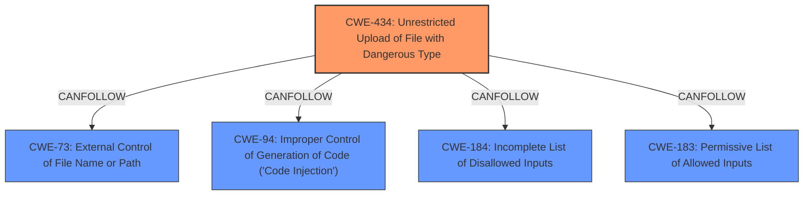

# Enhanced Analysis for CVE-2021-31198

# Summary
| CWE ID | CWE Name | Confidence | CWE Abstraction Level | CWE Vulnerability Mapping Label | CWE-Vulnerability Mapping Notes |
|---|---|---|---|---|---|
| CWE-434 | Unrestricted Upload of File with Dangerous Type | 0.7 | Base | Primary CWE | Allowed |
| CWE-73 | External Control of File Name or Path | 0.6 | Base | Secondary Candidate | Allowed |
| CWE-94 | Improper Control of Generation of Code ('Code Injection') | 0.5 | Base | Secondary Candidate | Allowed-with-Review |

## Evidence and Confidence

*   **Confidence Score:** 0.7
*   **Evidence Strength:** MEDIUM

## Relationship Analysis
The primary CWE is CWE-434. CWE-434 can follow CWE-184 (Incomplete List of Disallowed Inputs) or CWE-183 (Permissive List of Allowed Inputs). CWE-73 (External Control of File Name or Path) and CWE-94 (Improper Control of Generation of Code ('Code Injection')) are related because an attacker might upload a file with a dangerous type (CWE-434) to a location they control (CWE-73), and this file, when executed, can lead to code injection (CWE-94).



## Vulnerability Chain
The vulnerability chain starts with an **improper validation of user-supplied data** in the Microsoft Exchange Server OAB service, leading to an **arbitrary file write** (CWE-434). The attacker can control the file name or path (CWE-73). By uploading a file with a dangerous type (e.g., a script or executable), the attacker can achieve **remote code execution** (CWE-94) in the context of the SYSTEM user.

## Summary of Analysis
The initial assessment points to a vulnerability stemming from **insufficient validation of user-provided data**, allowing for **arbitrary file writes** in the Microsoft Exchange Server OAB service, as indicated in the CVE Reference Links Content Summary. The core issue is the ability to write arbitrary files to OAB folders due to this **lack of validation**. This leads to Remote Code Execution (RCE).

The primary CWE is CWE-434 (Unrestricted Upload of File with Dangerous Type) because the root cause involves uploading a file without proper restrictions, ultimately leading to the dangerous consequence of arbitrary code execution. The vulnerability description explicitly mentions the ability to write arbitrary files, which aligns with the core concept of CWE-434.

CWE-73 (External Control of File Name or Path) is a related issue as it describes the attacker's ability to control the file name or path, amplifying the risk associated with the unrestricted file upload.

CWE-94 (Improper Control of Generation of Code ('Code Injection')) is considered as the ultimate impact of the vulnerability, as the attacker leverages the file upload to achieve code execution.

The relationships between these CWEs further strengthen the rationale for their selection. CWE-434 can lead to CWE-73 and CWE-94, creating a chain of exploitation.

The decision is based on the evidence in the CVE Reference Links Content Summary. The evidence is reasonably strong.

Relevant CWE Information:

# Enhanced Context (25 CWEs)
The following CWEs were identified as potentially relevant to this vulnerability:

## CWE-434: Unrestricted Upload of File with Dangerous Type
**Abstraction Level**: base

**Description**:
CWE-434: Unrestricted Upload of File with Dangerous Type

**Mapping Guidance**:
- Usage: Allowed
- Rationale: This CWE entry is at the Base level of abstraction, which is a preferred level of abstraction for mapping to the root causes of vulnerabilities.

**Relationships**:
- CANFOLLOW -> CWE-73
- CANFOLLOW -> CWE-184
- CANFOLLOW -> CWE-183
- PEEROF -> CWE-430
- PEEROF -> CWE-436

## CWE-73: External Control of File Name or Path
**Abstraction Level**: Base

**Description**:
The product allows user input to control or influence paths or file names that are used in filesystem operations.

**Mapping Guidance**:
- Usage: Allowed
- Rationale: This CWE entry is at the Base level of abstraction, which is a preferred level of abstraction for mapping to the root causes of vulnerabilities.

## CWE-94: Improper Control of Generation of Code ('Code Injection')
**Abstraction Level**: Base

**Description**:
The product constructs all or part of a code segment using externally-influenced input from an upstream component, but it does not neutralize or incorrectly neutralizes special elements that could modify the syntax or behavior of the intended code segment.

**Mapping Guidance**:
- Usage: Allowed-with-Review
- Rationale: This entry is frequently misused for vulnerabilities with a technical impact of "code execution," which does not by itself indicate a root cause weakness, since dozens of weaknesses can enable code execution.


## CWE Relationship Analysis

Current CWEs represent these abstraction levels: .


### Vulnerability Chain Analysis

**Chain starting from CWE-73:**
- 73 (External Control of File Name or Path) - ROOT


**Chain starting from CWE-434:**
- 434 (Unrestricted Upload of File with Dangerous Type) - ROOT


### CWE Relationship Diagram

```mermaid
graph TD
    classDef primary fill:#f96,stroke:#333,stroke-width:2px
    classDef secondary fill:#69f,stroke:#333
    classDef tertiary fill:#9e9,stroke:#333
```