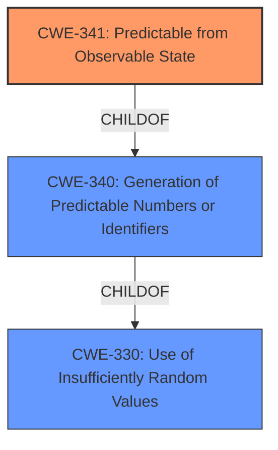

# Analysis for CVE-2021-31228

# Summary
| CWE ID | CWE Name | Confidence | CWE Abstraction Level | CWE Vulnerability Mapping Label | CWE-Vulnerability Mapping Notes |
|---|---|---|---|---|---|
| CWE-341 | Predictable from Observable State | 0.9 | Base | Allowed | Primary CWE |
| CWE-340 | Generation of Predictable Numbers or Identifiers | 0.7 | Class | Allowed-with-Review | Secondary Candidate |
| CWE-330 | Use of Insufficiently Random Values | 0.6 | Class | Discouraged | Secondary Candidate |

## Evidence and Confidence

*   **Confidence Score:** 0.9
*   **Evidence Strength:** HIGH

## Relationship Analysis
The primary CWE selected is CWE-341 (Predictable from Observable State), which is a Base level CWE and a child of CWE-340 (Generation of Predictable Numbers or Identifiers). CWE-340, in turn, is a Class level CWE and a child of CWE-330 (Use of Insufficiently Random Values). The vulnerability involves the use of time of day to generate DNS query source ports, making them predictable. This aligns well with CWE-341, as the predictability stems directly from observable system state (time).

## Vulnerability Chain
The vulnerability chain starts with the **incorrect** generation of DNS query source ports, specifically that they are **predictable** because they are based on the time of day and have too few bits. This predictability allows an attacker to send forged DNS response packets, leading to DNS cache poisoning.

Root Cause: **Predictable** DNS query source ports (CWE-341)
Impact: Forged DNS response packets accepted, leading to DNS cache poisoning.

## Summary of Analysis
The initial analysis and resulting conclusion are strongly supported by the evidence provided in the vulnerability description and CVE reference links. The key phrase is that data is **predictable** because it is based on the time of day and has too few bits.

The relationship analysis highlights the hierarchical structure of the CWEs, with CWE-341 being the most specific and relevant Base-level CWE. While CWE-340 and CWE-330 are also related, they are higher-level Class CWEs and thus less specific.

The selection of CWE-341 is justified by its direct alignment with the vulnerability's root cause: the DNS query source ports are **predictable** based on an observable state (time of day). This predictability enables the attacker to forge DNS responses.

The selected CWEs are at the optimal level of specificity, with CWE-341 providing the most accurate representation of the weakness. The retriever results also support the relevance of CWE-340 and CWE-330, but they are considered secondary due to their higher abstraction level.

Relevant CWE Information:

# Enhanced Context (25 CWEs)
The following CWEs were identified as potentially relevant to this vulnerability:

## CWE-330: Use of Insufficiently Random Values
**Abstraction Level**: Class
**Similarity Score**: 0.77
**Source**: dense

**Description**:
The product uses insufficiently random numbers or values in a security context that depends on unpredictable numbers.

**Mapping Guidance**:
- Usage: Discouraged
- Rationale: This CWE entry is a level-1 Class (i.e., a child of a Pillar). It might have lower-level children that would be more appropriate

## CWE-340: Generation of Predictable Numbers or Identifiers
**Abstraction Level**: Class
**Similarity Score**: 0.77
**Source**: dense

**Description**:
The product uses a scheme that generates numbers or identifiers that are more predictable than required.

**Mapping Guidance**:
- Usage: Allowed-with-Review
- Rationale: This CWE entry is a Class and might have Base-level children that would be more appropriate

## CWE-341: Predictable from Observable State
**Abstraction Level**: Base
**Similarity Score**: 0.77
**Source**: dense

**Description**:
A number or object is predictable based on observations that the attacker can make about the state of the system or network, such as time, process ID, etc.

**Mapping Guidance**:
- Usage: Allowed
- Rationale: This CWE entry is at the Base level of abstraction, which is a preferred level of abstraction for mapping to the root causes of vulnerabilities.

CWE-341 is the primary CWE because the **predictability** stems from an observable state (time of day). The other candidates (CWE-330, CWE-340) are Class-level CWEs and thus less specific.