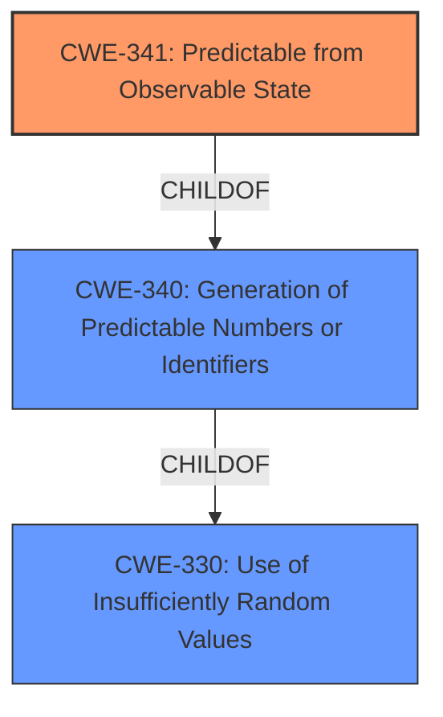

# Analysis for CVE-2021-31228

# Summary
| CWE ID | CWE Name | Confidence | CWE Abstraction Level | CWE Vulnerability Mapping Label | CWE-Vulnerability Mapping Notes |
|---|---|---|---|---|---|
| CWE-341 | Predictable from Observable State | 0.9 | Base | Allowed | Primary CWE |
| CWE-340 | Generation of Predictable Numbers or Identifiers | 0.7 | Class | Allowed-with-Review | Secondary Candidate |
| CWE-330 | Use of Insufficiently Random Values | 0.6 | Class | Discouraged | Secondary Candidate |

## Evidence and Confidence

*   **Confidence Score:** 0.9
*   **Evidence Strength:** HIGH

## Relationship Analysis
The primary CWE selected is CWE-341 (Predictable from Observable State), which is a Base level CWE and a child of CWE-340 (Generation of Predictable Numbers or Identifiers). CWE-340, in turn, is a Class level CWE and a child of CWE-330 (Use of Insufficiently Random Values). The vulnerability involves the use of time of day to generate DNS query source ports, making them predictable. This aligns well with CWE-341, as the predictability stems directly from observable system state (time).

## Vulnerability Chain
The vulnerability chain starts with the **incorrect** generation of DNS query source ports, specifically that they are **predictable** because they are based on the time of day and have too few bits. This predictability allows an attacker to send forged DNS response packets, leading to DNS cache poisoning.

Root Cause: **Predictable** DNS query source ports (CWE-341)
Impact: Forged DNS response packets accepted, leading to DNS cache poisoning.

## Summary of Analysis
The initial analysis and resulting conclusion are strongly supported by the evidence provided in the vulnerability description and CVE reference links. The key phrase is that data is **predictable** because it is based on the time of day and has too few bits.

The relationship analysis highlights the hierarchical structure of the CWEs, with CWE-341 being the most specific and relevant Base-level CWE. While CWE-340 and CWE-330 are also related, they are higher-level Class CWEs and thus less specific.

The selection of CWE-341 is justified by its direct alignment with the vulnerability's root cause: the DNS query source ports are **predictable** based on an observable state (time of day). This predictability enables the attacker to forge DNS responses.

The selected CWEs are at the optimal level of specificity, with CWE-341 providing the most accurate representation of the weakness. The retriever results also support the relevance of CWE-340 and CWE-330, but they are considered secondary due to their higher abstraction level.

Relevant CWE Information:

# Enhanced Context (25 CWEs)
The following CWEs were identified as potentially relevant to this vulnerability:

## CWE-330: Use of Insufficiently Random Values
**Abstraction Level**: Class
**Similarity Score**: 0.77
**Source**: dense

**Description**:
The product uses insufficiently random numbers or values in a security context that depends on unpredictable numbers.

**Mapping Guidance**:
- Usage: Discouraged
- Rationale: This CWE entry is a level-1 Class (i.e., a child of a Pillar). It might have lower-level children that would be more appropriate

## CWE-340: Generation of Predictable Numbers or Identifiers
**Abstraction Level**: Class
**Similarity Score**: 0.77
**Source**: dense

**Description**:
The product uses a scheme that generates numbers or identifiers that are more predictable than required.

**Mapping Guidance**:
- Usage: Allowed-with-Review
- Rationale: This CWE entry is a Class and might have Base-level children that would be more appropriate

## CWE-341: Predictable from Observable State
**Abstraction Level**: Base
**Similarity Score**: 0.77
**Source**: dense

**Description**:
A number or object is predictable based on observations that the attacker can make about the state of the system or network, such as time, process ID, etc.

**Mapping Guidance**:
- Usage: Allowed
- Rationale: This CWE entry is at the Base level of abstraction, which is a preferred level of abstraction for mapping to the root causes of vulnerabilities.

CWE-341 is the primary CWE because the **predictability** stems from an observable state (time of day). The other candidates (CWE-330, CWE-340) are Class-level CWEs and thus less specific.

# Enhanced Query for CVE-2021-31228

## Vulnerability Description
An issue was discovered in HCC embedded InterNiche 4.0.1. This vulnerability allows the attacker to predict a DNS querys source port in order to send forged DNS response packets that will be accepted as valid answers to the DNS clients requests (without sniffing the specific request). Data is predictable because it is based on the time of day, and has too few bits.

### Vulnerability Description Key Phrases
- **impact:** send forged DNS response packets
- **product:** HCC embedded InterNiche
- **version:** 4.0.1

## CVE Reference Links Content Summary
Based on the provided documents, here's a breakdown of the vulnerability information related to CVE-2021-31228:

**Root Cause of Vulnerability:**

*   The vulnerability lies in the NicheStack's DNS client. Specifically, the source port of DNS queries is predictable.

**Weaknesses/Vulnerabilities Present:**

*   **Predictable Source Port:** The DNS client uses a predictable algorithm when generating source ports for DNS queries, allowing an attacker to anticipate the source port used in a request.

**Impact of Exploitation:**

*   **DNS Cache Poisoning:** By predicting the source port and crafting a forged DNS response packet, an attacker can successfully inject malicious records into the DNS cache of a vulnerable device. This can redirect users to malicious websites or services controlled by the attacker.

**Attack Vectors:**

*   **Network-based Attack:** Exploitation occurs over the network by sending specially crafted DNS responses to a vulnerable device.

**Required Attacker Capabilities/Position:**

*   **Network Access:** The attacker needs to be able to intercept or send network traffic to the vulnerable device. This could be on the same local network or possibly from the internet if the device is exposed.
*   **DNS Knowledge:** The attacker must have a good understanding of the DNS protocol, specifically how DNS requests and responses work and how to create valid packets.
*  **Timing:**  The attacker needs to send the malicious response before the legitimate one arrives. Due to the predictable nature of the source ports, the attacker can send the spoofed response packet quickly after the legitimate request.

**Additional Notes:**

*   The vulnerability is part of a larger set of vulnerabilities collectively called "INFRA:HALT" discovered in the NicheStack TCP/IP stack.
*   The affected versions include all NicheStack versions prior to 4.3 (including NicheLite).
*   The vulnerability is categorized as having a CVSS v3.1 score of 4.0 which is considered low.
*  HCC Embedded has released patches for the issue, but these may need to be obtained via request.
* The vulnerability is fixed in the `in_httpsvr` module version 1.7.
*   Mitigation strategies include disabling the DNS client if not needed and using internal DNS servers, though this may not be fully effective because of other DNS spoofing vulnerabilities in the stack.

This information is consistent with the general description of CVE-2021-31228, but offers more detail into the root cause and impacts, specifically regarding how a predictable source port allows for DNS cache poisoning.

## Retriever Results

### Top Combined Results

| Rank | CWE ID | Name | Abstraction | Usage  | Retrievers | Individual Scores |
|------|--------|------|-------------|-------|------------|-------------------|
| 1 | 340 | Generation of Predictable Numbers or Identifiers | Class | Allowed-with-Review | sparse | 0.195 |
| 2 | 330 | Use of Insufficiently Random Values | Class | Discouraged | sparse | 0.129 |
| 3 | 346 | Origin Validation Error | Class | Allowed-with-Review | sparse | 0.121 |
| 4 | 923 | Improper Restriction of Communication Channel to Intended Endpoints | Class | Allowed-with-Review | sparse | 0.117 |
| 5 | 341 | Predictable from Observable State | Base | Allowed | sparse | 0.117 |
| 6 | 350 | Reliance on Reverse DNS Resolution for a Security-Critical Action | Variant | Allowed | dense | 0.557 |
| 7 | 1275 | Sensitive Cookie with Improper SameSite Attribute | Variant | Allowed | graph | 0.002 |
| 8 | 291 | Reliance on IP Address for Authentication | Variant | Allowed | sparse | 0.113 |
| 9 | 295 | Improper Certificate Validation | Base | Allowed | sparse | 0.113 |
| 10 | 201 | Insertion of Sensitive Information Into Sent Data | Base | Allowed | sparse | 0.111 |

# Complete CWE Specifications

## CWE-340: Generation of Predictable Numbers or Identifiers
**Abstraction:** Class
**Status:** Incomplete

### Description
The product uses a scheme that generates numbers or identifiers that are more predictable than required.

### Extended Description
Not provided

### Alternative Terms
None

### Relationships
ChildOf -> CWE-330
CanPrecede -> CWE-384

### Mapping Guidance
**Usage:** Allowed-with-Review
**Rationale:** This CWE entry is a Class and might have Base-level children that would be more appropriate
**Comments:** Examine children of this entry to see if there is a better fit
**Reasons:**
- Abstraction

### Additional Notes
**[Maintenance]** As of CWE 4.5, terminology related to randomness, entropy, and predictability can vary widely. Within the developer and other communities, "randomness" is used heavily. However, within cryptography, "entropy" is distinct, typically implied as a measurement. There are no commonly-used definitions, even within standards documents and cryptography papers. Future versions of CWE will attempt to define these terms and, if necessary, distinguish between them in ways that are appropriate for different communities but do not reduce the usability of CWE for mapping, understanding, or other scenarios.

### Observed Examples
- **CVE-2022-29330:** Product for administering PBX systems uses predictable identifiers and timestamps for filenames (CWE-340) which allows attackers to access files via direct request (CWE-425).
- **CVE-2001-1141:** PRNG allows attackers to use the output of small PRNG requests to determine the internal state information, which could be used by attackers to predict future pseudo-random numbers.
- **CVE-1999-0074:** Listening TCP ports are sequentially allocated, allowing spoofing attacks.

## CWE-330: Use of Insufficiently Random Values
**Abstraction:** Class
**Status:** Stable

### Description
The product uses insufficiently random numbers or values in a security context that depends on unpredictable numbers.

### Extended Description
When product generates predictable values in a context requiring unpredictability, it may be possible for an attacker to guess the next value that will be generated, and use this guess to impersonate another user or access sensitive information.

### Alternative Terms
None

### Relationships
ChildOf -> CWE-693
CanPrecede -> CWE-804

### Mapping Guidance
**Usage:** Discouraged
**Rationale:** This CWE entry is a level-1 Class (i.e., a child of a Pillar). It might have lower-level children that would be more appropriate
**Comments:** Examine children of this entry to see if there is a better fit
**Reasons:**
- Abstraction

### Additional Notes
**[Relationship]** This can be primary to many other weaknesses such as cryptographic errors, authentication errors, symlink following, information leaks, and others.

**[Maintenance]** As of CWE 4.3, CWE-330 and its descendants are being investigated by the CWE crypto team to identify gaps related to randomness and unpredictability, as well as the relationships between randomness and cryptographic primitives. This "subtree analysis" might result in the addition or deprecation of existing entries; the reorganization of relationships in some views, e.g. the research view (CWE-1000); more consistent use of terminology; and/or significant modifications to related entries.

**[Maintenance]** As of CWE 4.5, terminology related to randomness, entropy, and predictability can vary widely. Within the developer and other communities, "randomness" is used heavily. However, within cryptography, "entropy" is distinct, typically implied as a measurement. There are no commonly-used definitions, even within standards documents and cryptography papers. Future versions of CWE will attempt to define these terms and, if necessary, distinguish between them in ways that are appropriate for different communities but do not reduce the usability of CWE for mapping, understanding, or other scenarios.

### Observed Examples
- **CVE-2021-3692:** PHP framework uses mt_rand() function (Marsenne Twister) when generating tokens
- **CVE-2020-7010:** Cloud application on Kubernetes generates passwords using a weak random number generator based on deployment time.
- **CVE-2009-3278:** Crypto product uses rand() library function to generate a recovery key, making it easier to conduct brute force attacks.

## CWE-346: Origin Validation Error
**Abstraction:** Class
**Status:** Draft

### Description
The product does not properly verify that the source of data or communication is valid.

### Extended Description
Not provided

### Alternative Terms
None

### Relationships
ChildOf -> CWE-345
ChildOf -> CWE-345
ChildOf -> CWE-284

### Mapping Guidance
**Usage:** Allowed-with-Review
**Rationale:** This CWE entry is a Class and might have Base-level children that would be more appropriate
**Comments:** Examine children of this entry to see if there is a better fit
**Reasons:**
- Abstraction

### Additional Notes
**[Maintenance]** This entry has some significant overlap with other CWE entries and may need some clarification. See terminology notes.

**[Terminology]** The "Origin Validation Error" term was originally used in a 1995 thesis [REF-324]. Although not formally defined, an issue is considered to be an origin validation error if either (1) "an object [accepts] input from an unauthorized subject," or (2) "the system [fails] to properly or completely authenticate a subject." A later section says that an origin validation error can occur when the system (1) "does not properly authenticate a user or process" or (2) "does not properly authenticate the shared data or libraries." The only example provided in the thesis (covered by OSVDB:57615) involves a setuid program running command-line arguments without dropping privileges. So, this definition (and its examples in the thesis) effectively cover other weaknesses such as CWE-287 (Improper Authentication), CWE-285 (Improper Authorization), and CWE-250 (Execution with Unnecessary Privileges). There appears to be little usage of this term today, except in the SecurityFocus vulnerability database, where the term is used for a variety of issues, including web-browser problems that allow violation of the Same Origin Policy and improper validation of the source of an incoming message.

### Observed Examples
- **CVE-2000-1218:** DNS server can accept DNS updates from hosts that it did not query, leading to cache poisoning
- **CVE-2005-0877:** DNS server can accept DNS updates from hosts that it did not query, leading to cache poisoning
- **CVE-2001-1452:** DNS server caches glue records received from non-delegated name servers

## CWE-923: Improper Restriction of Communication Channel to Intended Endpoints
**Abstraction:** Class
**Status:** Incomplete

### Description
The product establishes a communication channel to (or from) an endpoint for privileged or protected operations, but it does not properly ensure that it is communicating with the correct endpoint.

### Extended Description

Attackers might be able to spoof the intended endpoint from a different system or process, thus gaining the same level of access as the intended endpoint.

While this issue frequently involves authentication between network-based clients and servers, other types of communication channels and endpoints can have this weakness.

### Alternative Terms
None

### Relationships
ChildOf -> CWE-284

### Mapping Guidance
**Usage:** Allowed-with-Review
**Rationale:** This CWE entry is a Class and might have Base-level children that would be more appropriate
**Comments:** Examine children of this entry to see if there is a better fit
**Reasons:**
- Abstraction

### Observed Examples
- **CVE-2022-30319:** S-bus functionality in a home automation product performs access control using an IP allowlist, which can be bypassed by a forged IP address.
- **CVE-2022-22547:** A troubleshooting tool exposes a web server on a random port between 9000-65535 that could be used for information gathering
- **CVE-2022-4390:** A WAN interface on a router has firewall restrictions enabled for IPv4, but it does not for IPv6, which is enabled by default

## CWE-341: Predictable from Observable State
**Abstraction:** Base
**Status:** Draft

### Description
A number or object is predictable based on observations that the attacker can make about the state of the system or network, such as time, process ID, etc.

### Extended Description
Not provided

### Alternative Terms
None

### Relationships
ChildOf -> CWE-340

### Mapping Guidance
**Usage:** Allowed
**Rationale:** This CWE entry is at the Base level of abstraction, which is a preferred level of abstraction for mapping to the root causes of vulnerabilities.
**Comments:** Carefully read both the name and description to ensure that this mapping is an appropriate fit. Do not try to 'force' a mapping to a lower-level Base/Variant simply to comply with this preferred level of abstraction.
**Reasons:**
- Acceptable-Use

### Additional Notes
**[Maintenance]** As of CWE 4.5, terminology related to randomness, entropy, and predictability can vary widely. Within the developer and other communities, "randomness" is used heavily. However, within cryptography, "entropy" is distinct, typically implied as a measurement. There are no commonly-used definitions, even within standards documents and cryptography papers. Future versions of CWE will attempt to define these terms and, if necessary, distinguish between them in ways that are appropriate for different communities but do not reduce the usability of CWE for mapping, understanding, or other scenarios.

### Observed Examples
- **CVE-2002-0389:** Mail server stores private mail messages with predictable filenames in a world-executable directory, which allows local users to read private mailing list archives.
- **CVE-2001-1141:** PRNG allows attackers to use the output of small PRNG requests to determine the internal state information, which could be used by attackers to predict future pseudo-random numbers.
- **CVE-2000-0335:** DNS resolver library uses predictable IDs, which allows a local attacker to spoof DNS query results.

## CWE-350: Reliance on Reverse DNS Resolution for a Security-Critical Action
**Abstraction:** Variant
**Status:** Draft

### Description
The product performs reverse DNS resolution on an IP address to obtain the hostname and make a security decision, but it does not properly ensure that the IP address is truly associated with the hostname.

### Extended Description

Since DNS names can be easily spoofed or misreported, and it may be difficult for the product to detect if a trusted DNS server has been compromised, DNS names do not constitute a valid authentication mechanism.

When the product performs a reverse DNS resolution for an IP address, if an attacker controls the DNS server for that IP address, then the attacker can cause the server to return an arbitrary hostname. As a result, the attacker may be able to bypass authentication, cause the wrong hostname to be recorded in log files to hide activities, or perform other attacks.

Attackers can spoof DNS names by either (1) compromising a DNS server and modifying its records (sometimes called DNS cache poisoning), or (2) having legitimate control over a DNS server associated with their IP address.

### Alternative Terms
None

### Relationships
ChildOf -> CWE-290
ChildOf -> CWE-807
CanPrecede -> CWE-923

### Mapping Guidance
**Usage:** Allowed
**Rationale:** This CWE entry is at the Variant level of abstraction, which is a preferred level of abstraction for mapping to the root causes of vulnerabilities.
**Comments:** Carefully read both the name and description to ensure that this mapping is an appropriate fit. Do not try to 'force' a mapping to a lower-level Base/Variant simply to comply with this preferred level of abstraction.
**Reasons:**
- Acceptable-Use

### Additional Notes
**[Maintenance]** CWE-350, CWE-247, and CWE-292 were merged into CWE-350 in CWE 2.5. CWE-247 was originally derived from Seven Pernicious Kingdoms, CWE-350 from PLOVER, and CWE-292 from CLASP. All taxonomies focused closely on the use of reverse DNS for authentication of incoming requests.

### Observed Examples
- **CVE-2001-1488:** Does not do double-reverse lookup to prevent DNS spoofing.
- **CVE-2001-1500:** Does not verify reverse-resolved hostnames in DNS.
- **CVE-2000-1221:** Authentication bypass using spoofed reverse-resolved DNS hostnames.

## CWE-1275: Sensitive Cookie with Improper SameSite Attribute
**Abstraction:** Variant
**Status:** Incomplete

### Description
The SameSite attribute for sensitive cookies is not set, or an insecure value is used.

### Extended Description
The SameSite attribute controls how cookies are sent for cross-domain requests. This attribute may have three values: 'Lax', 'Strict', or 'None'. If the 'None' value is used, a website may create a cross-domain POST HTTP request to another website, and the browser automatically adds cookies to this request. This may lead to Cross-Site-Request-Forgery (CSRF) attacks if there are no additional protections in place (such as Anti-CSRF tokens).

### Alternative Terms
None

### Relationships
ChildOf -> CWE-923
CanPrecede -> CWE-352

### Mapping Guidance
**Usage:** Allowed
**Rationale:** This CWE entry is at the Variant level of abstraction, which is a preferred level of abstraction for mapping to the root causes of vulnerabilities.
**Comments:** Carefully read both the name and description to ensure that this mapping is an appropriate fit. Do not try to 'force' a mapping to a lower-level Base/Variant simply to comply with this preferred level of abstraction.
**Reasons:**
- Acceptable-Use

### Observed Examples
- **CVE-2022-24045:** Web application for a room automation system has client-side JavaScript that sets a sensitive cookie without the SameSite security attribute, allowing the cookie to be sniffed

## CWE-291: Reliance on IP Address for Authentication
**Abstraction:** Variant
**Status:** Incomplete

### Description
The product uses an IP address for authentication.

### Extended Description
IP addresses can be easily spoofed. Attackers can forge the source IP address of the packets they send, but response packets will return to the forged IP address. To see the response packets, the attacker has to sniff the traffic between the victim machine and the forged IP address. In order to accomplish the required sniffing, attackers typically attempt to locate themselves on the same subnet as the victim machine. Attackers may be able to circumvent this requirement by using source routing, but source routing is disabled across much of the Internet today. In summary, IP address verification can be a useful part of an authentication scheme, but it should not be the single factor required for authentication.

### Alternative Terms
None

### Relationships
ChildOf -> CWE-290
ChildOf -> CWE-923
ChildOf -> CWE-471

### Mapping Guidance
**Usage:** Allowed
**Rationale:** This CWE entry is at the Variant level of abstraction, which is a preferred level of abstraction for mapping to the root causes of vulnerabilities.
**Comments:** Carefully read both the name and description to ensure that this mapping is an appropriate fit. Do not try to 'force' a mapping to a lower-level Base/Variant simply to comply with this preferred level of abstraction.
**Reasons:**
- Acceptable-Use

### Observed Examples
- **CVE-2022-30319:** S-bus functionality in a home automation product performs access control using an IP allowlist, which can be bypassed by a forged IP address.

## CWE-295: Improper Certificate Validation
**Abstraction:** Base
**Status:** Draft

### Description
The product does not validate, or incorrectly validates, a certificate.

### Extended Description
When a certificate is invalid or malicious, it might allow an attacker to spoof a trusted entity by interfering in the communication path between the host and client. The product might connect to a malicious host while believing it is a trusted host, or the product might be deceived into accepting spoofed data that appears to originate from a trusted host.

### Alternative Terms
None

### Relationships
ChildOf -> CWE-287
ChildOf -> CWE-287
PeerOf -> CWE-322

### Mapping Guidance
**Usage:** Allowed
**Rationale:** This CWE entry is at the Base level of abstraction, which is a preferred level of abstraction for mapping to the root causes of vulnerabilities.
**Comments:** Carefully read both the name and description to ensure that this mapping is an appropriate fit. Do not try to 'force' a mapping to a lower-level Base/Variant simply to comply with this preferred level of abstraction.
**Reasons:**
- Acceptable-Use

### Observed Examples
- **CVE-2019-12496:** A Go framework for robotics, drones, and IoT devices skips verification of root CA certificates by default.
- **CVE-2014-1266:** chain: incorrect "goto" in Apple SSL product bypasses certificate validation, allowing Adversary-in-the-Middle (AITM) attack (Apple "goto fail" bug). CWE-705 (Incorrect Control Flow Scoping) -> CWE-561 (Dead Code) -> CWE-295 (Improper Certificate Validation) -> CWE-393 (Return of Wrong Status Code) -> CWE-300 (Channel Accessible by Non-Endpoint).
- **CVE-2021-22909:** Chain: router's firmware update procedure uses curl with "-k" (insecure) option that disables certificate validation (CWE-295), allowing adversary-in-the-middle (AITM) compromise with a malicious firmware image (CWE-494).

## CWE-201: Insertion of Sensitive Information Into Sent Data
**Abstraction:** Base
**Status:** Draft

### Description
The code transmits data to another actor, but a portion of the data includes sensitive information that should not be accessible to that actor.

### Extended Description
Not provided

### Alternative Terms
None

### Relationships
ChildOf -> CWE-200
CanAlsoBe -> CWE-209
CanAlsoBe -> CWE-202

### Mapping Guidance
**Usage:** Allowed
**Rationale:** This CWE entry is at the Base level of abstraction, which is a preferred level of abstraction for mapping to the root causes of vulnerabilities.
**Comments:** Carefully read both the name and description to ensure that this mapping is an appropriate fit. Do not try to 'force' a mapping to a lower-level Base/Variant simply to comply with this preferred level of abstraction.
**Reasons:**
- Acceptable-Use

### Additional Notes
**[Other]** Sensitive information could include data that is sensitive in and of itself (such as credentials or private messages), or otherwise useful in the further exploitation of the system (such as internal file system structure).

### Observed Examples
- **CVE-2022-0708:** Collaboration platform does not clear team emails in a response, allowing leak of email addresses

