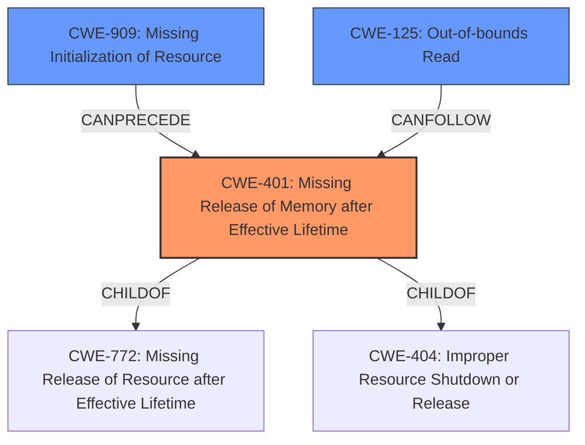

# Raw Analyzer Response for CVE-2021-31256

# Summary
| CWE ID  | CWE Name                                           | Confidence | CWE Abstraction Level | CWE Vulnerability Mapping Label | CWE-Vulnerability Mapping Notes |
| :-------- | :------------------------------------------------- | :--------- | :-------------------- | :------------------------------ | :------------------------------ |
| CWE-401 | Missing Release of Memory after Effective Lifetime | 0.9        | Variant               | Allowed                       | Primary CWE                     |
| CWE-909 | Missing Initialization of Resource               | 0.6        | Class                 | Allowed-with-Review           | Secondary Candidate             |
| CWE-125 | Out-of-bounds Read                              | 0.5        | Base                  | Allowed                       | Secondary Candidate             |

## Evidence and Confidence

*   **Confidence Score:** 0.8
*   **Evidence Strength:** HIGH

## Relationship Analysis
The primary CWE selected is CWE-401, which is a variant of CWE-772 (Missing Release of Resource after Effective Lifetime) and CWE-404 (Improper Resource Shutdown or Release). CWE-909, a class-level CWE, represents the **missing initialization** aspect, potentially leading to the **memory leak**. CWE-125, an out-of-bounds read could be a consequence of using uninitialized memory, although the description focuses more on the **missing release** aspect.

## Vulnerability Chain
The vulnerability chain starts with the **missing initialization** of memory resources (CWE-909). This leads to a **memory leak** (CWE-401) because the allocated memory is not properly released after use, which can potentially lead to information exposure or denial of service. An **out-of-bounds read** (CWE-125) could also occur if the uninitialized memory contains unexpected values that are then used as indices or pointers.

## Summary of Analysis
The initial analysis identified a **memory leak** due to improper memory management in GPAC's MP4Box. The provided evidence supports the selection of CWE-401 (Missing Release of Memory after Effective Lifetime) as the primary CWE. This is because the core issue is the failure to release allocated memory, leading to a **memory leak**.

The evidence from the "CVE Reference Links Content Summary" section clearly states: "The lack of initialization of allocated memory chunks can lead to the leakage of previous data present in those chunks and overall memory issues." This directly supports the selection of CWE-401.

CWE-909 (Missing Initialization of Resource) was considered as a contributing factor, as the lack of initialization can lead to the **memory leak**. However, the primary weakness is the **failure to release** the memory, making CWE-401 the more accurate representation. CWE-125 (Out-of-bounds Read) was considered as a potential consequence, but the description focuses more on the **memory leak** itself, not the out-of-bounds read.

The selected CWEs are at the optimal level of specificity, with CWE-401 being a variant that directly addresses the **memory leak** issue.

Relevant CWE Information:

# Enhanced Context (25 CWEs)

## CWE-822: Untrusted Pointer Dereference
**Abstraction Level**: Base
**Similarity Score**: 0.80
**Source**: dense

**Description**:
The product obtains a value from an untrusted source, converts this value to a pointer, and dereferences the resulting pointer.
**Why Not Used:** This CWE is not directly related to the **memory leak** issue. The vulnerability description does not indicate the dereferencing of untrusted pointers.

## CWE-824: Access of Uninitialized Pointer
**Abstraction Level**: Base
**Similarity Score**: 0.78
**Source**: dense

**Description**:
The product accesses or uses a pointer that has not been initialized.
**Why Not Used:** While **missing initialization** is a potential factor, the core issue is the **failure to release memory**, which is better captured by CWE-401.

## CWE-823: Use of Out-of-range Pointer Offset
**Abstraction Level**: Base
**Similarity Score**: 0.78
**Source**: dense

**Description**:
The product performs pointer arithmetic on a valid pointer, but it uses an offset that can point outside of the intended range of valid memory locations for the resulting pointer.
**Why Not Used:** The vulnerability description does not indicate pointer arithmetic or out-of-range pointer offsets.

## CWE-226: Sensitive Information in Resource Not Removed Before Reuse
**Abstraction Level**: Base
**Similarity Score**: 0.77
**Source**: dense

**Description**:
The product releases a resource such as memory or a file so that it can be made available for reuse, but it does not clear or "zeroize" the information contained in the resource before the product performs a critical state transition or makes the resource available for reuse by other entities.
**Why Not Used:** The vulnerability description focuses on the **failure to release memory**, not the failure to clear sensitive information before reuse.

## CWE-909: Missing Initialization of Resource
**Abstraction Level**: Class
**Similarity Score**: 0.77
**Source**: dense

**Description**:
The product does not initialize a critical resource.
**Why Used:** This is a secondary CWE candidate because the lack of initialization can contribute to the **memory leak**. However, it's not the primary cause.

## CWE-131: Incorrect Calculation of Buffer Size
**Abstraction Level**: Base
**Similarity Score**: 0.77
**Source**: dense

**Description**:
The product does not correctly calculate the size to be used when allocating a buffer, which could lead to a buffer overflow.
**Why Not Used:** The vulnerability description does not indicate incorrect calculation of buffer size.

## CWE-125: Out-of-bounds Read
**Abstraction Level**: Base
**Similarity Score**: 0.77
**Source**: dense

**Description**:
The product reads data past the end, or before the beginning, of the intended buffer.
**Why Used:** This is a secondary CWE candidate because an out-of-bounds read could occur if uninitialized memory contains unexpected values.

## CWE-191: Integer Underflow (Wrap or Wraparound)
**Abstraction Level**: Base
**Similarity Score**: 0.77
**Source**: dense

**Description**:
The product subtracts one value from another, such that the result is less than the minimum allowable integer value, which produces a value that is not equal to the correct result.
**Why Not Used:** The vulnerability description does not indicate integer underflow.

## CWE-126: Buffer Over-read
**Abstraction Level**: Variant
**Similarity Score**: 0.77
**Source**: dense

**Description**:
The product reads from a buffer using buffer access mechanisms such as indexes or pointers that reference memory locations after the targeted buffer.
**Why Not Used:** This is a more specific case of out-of-bounds read, but the description focuses on the **memory leak**, not the over-read.

## CWE-667: Improper Locking
**Abstraction Level**: Class
**Similarity Score**: 0.77
**Source**: dense

**Description**:
The product does not properly acquire or release a lock on a resource, leading to unexpected resource state changes and behaviors.
**Why Not Used:** The vulnerability description does not indicate improper locking.

## CWE-190: Integer Overflow or Wraparound
**Abstraction Level**: Base
**Similarity Score**: 6430.53
**Source**: sparse

**Description**:
The product performs a calculation that can
         produce an integer overflow or wraparound when the logic
         assumes that the resulting value will always be larger than
         the original value. This occurs when an integer value is
         incremented to a value that is too large to store in the
         associated representation. When this occurs, the value may
         become a very small or negative number.
**Why Not Used:** The vulnerability description does not indicate integer overflow.

## CWE-1284: Improper Validation of Specified Quantity in Input
**Abstraction Level**: Base
**Similarity Score**: 5741.04
**Source**: