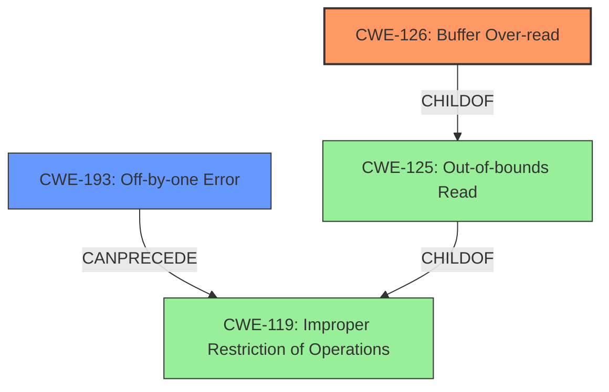

# Enhanced Analysis for CVE-2021-31261

# Summary
| CWE ID  | CWE Name                                                     | Confidence | CWE Abstraction Level | CWE Vulnerability Mapping Label | CWE-Vulnerability Mapping Notes |
| :-------- | :----------------------------------------------------------- | :---------- | :----------------------- | :------------------------------ | :------------------------------ |
| CWE-126   | Buffer Over-read                                             | 0.9        | Variant                 | Primary                         | Allowed                       |
| CWE-193   | Off-by-one Error                                             | 0.7         | Base                 | Secondary                        | Allowed                       |

## Evidence and Confidence

*   **Confidence Score:** 0.8
*   **Evidence Strength:** HIGH

## Relationship Analysis
The primary relationship influencing the decision is the parent-child relationship between CWE-125 (Out-of-bounds Read) and CWE-126 (Buffer Over-read), where CWE-126 is a variant of CWE-125. The vulnerability description explicitly mentions a "**buffer over-read**," making CWE-126 the more specific and appropriate choice. CWE-193 (Off-by-one Error) can precede CWE-119 (Improper Restriction of Operations within the Bounds of a Memory Buffer) and is associated with the **rootcause**. The abstraction levels were considered, favoring the more specific variant (CWE-126) and base (CWE-193) levels.



## Vulnerability Chain
The vulnerability chain starts with a potential **off by one error**, leading to a **buffer over-read**. The final impact is a memory read.
1.  **Off-by-one Error (CWE-193):** (Possible Root Cause) An incorrect calculation or usage of a maximum/minimum value.
2.  **Buffer Over-read (CWE-126):** Reading data past the end of the intended buffer.
3.  **Memory Read (Impact):** Sensitive information is exposed due to the over-read.

## Summary of Analysis
The initial analysis, supported by the vulnerability description and CVE reference, clearly points to a **buffer over-read** condition in the `gf_hinter_track_new` function of GPAC. The "**rootcause**" is identified as an "**off by one error**".

The evidence from the vulnerability description includes the phrase "**buffer over-read**." This is direct evidence supporting the selection of CWE-126.

The graph relationships reinforced the selection of CWE-126 as the primary CWE due to its specificity as a variant of CWE-125. CWE-193 was chosen as a secondary CWE due to the **rootcause** being an "**off by one error**."

The selected CWEs are at the optimal level of specificity because they accurately represent the weakness and its root cause, aligning with the provided evidence and MITRE's mapping guidance.

Relevant CWE Information:

# Enhanced Context (25 CWEs)

## CWE-126: Buffer Over-read
**Abstraction Level**: Variant
**Similarity Score**: 0.78
**Source**: dense

**Description**:
The product reads from a buffer using buffer access mechanisms such as indexes or pointers that reference memory locations after the targeted buffer.

**Mapping Guidance**:
- Usage: Allowed
- Rationale: This CWE entry is at the Variant level of abstraction, which is a preferred level of abstraction for mapping to the root causes of vulnerabilities.

## CWE-193: Off-by-one Error
**Abstraction Level**: Base
**Similarity Score**: 6139.60
**Source**: sparse

**Description**:
A product calculates or uses an incorrect maximum or minimum value that is 1 more, or 1 less, than the correct value.

**Mapping Guidance**:
- Usage: Allowed
- Rationale: This CWE entry is at the Base level of abstraction, which is a preferred level of abstraction for mapping to the root causes of vulnerabilities.

## CWE-125: Out-of-bounds Read
**Abstraction Level**: Base
**Similarity Score**: 6354.28
**Source**: sparse

**Description**:
The product reads data past the end, or before the beginning, of the intended buffer.

**Mapping Guidance**:
- Usage: Allowed
- Rationale: This CWE entry is at the Base level of abstraction, which is a preferred level of abstraction for mapping to the root causes of vulnerabilities.


## CWE Relationship Analysis

Current CWEs represent these abstraction levels: .


### Vulnerability Chain Analysis

**Chain starting from CWE-125:**
- 125 (Out-of-bounds Read) - ROOT


**Chain starting from CWE-126:**
- 126 (Buffer Over-read) - ROOT


### CWE Relationship Diagram

```mermaid
graph TD
    classDef primary fill:#f96,stroke:#333,stroke-width:2px
    classDef secondary fill:#69f,stroke:#333
    classDef tertiary fill:#9e9,stroke:#333
```