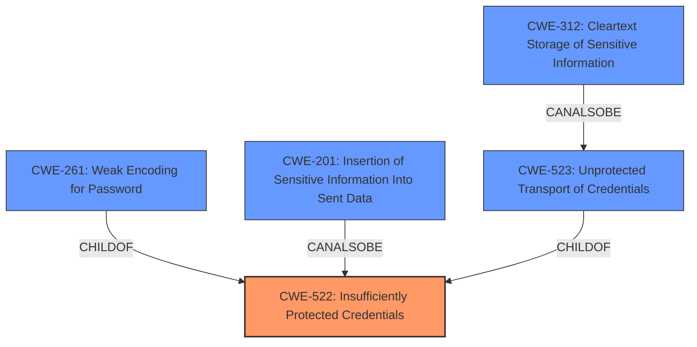

# Analysis for CVE-2021-3131

# Summary
| CWE ID  | CWE Name                                                      | Confidence | CWE Abstraction Level | CWE Vulnerability Mapping Label | CWE-Vulnerability Mapping Notes |
| :-------- | :------------------------------------------------------------ | :--------- | :---------------------- | :------------------------------ | :------------------------------ |
| CWE-522   | Insufficiently Protected Credentials                          | 1          | Base                    | Primary                         | Allowed                       |
| CWE-201   | Insertion of Sensitive Information Into Sent Data             | 0.7        | Base                    | Secondary                       | Allowed                       |
| CWE-312   | Cleartext Storage of Sensitive Information                  | 0.6        | Base                    | Secondary                       | Allowed                       |
| CWE-523   | Unprotected Transport of Credentials                          | 0.5        | Base                    | Secondary                       | Allowed                       |
| CWE-261   | Weak Encoding for Password                                    | 0.4        | Base                    | Secondary                       | Allowed                       |

## Evidence and Confidence

*   **Confidence Score:** 0.8
*   **Evidence Strength:** HIGH

## Relationship Analysis
The primary weakness, CWE-522 [CWE-522: Insufficiently Protected Credentials], is directly related to the core issue of transmitting credentials in a weakly encoded format. CWE-201 [CWE-201: Insertion of Sensitive Information Into Sent Data] is related since the credentials are included in the URL. CWE-312 [CWE-312: Cleartext Storage of Sensitive Information] is related because although the credentials are not stored in cleartext, they are transmitted in a form that is easily decoded. CWE-523 [CWE-523: Unprotected Transport of Credentials] is related because the credentials are sent over the URL. CWE-261 [CWE-261: Weak Encoding for Password] addresses the usage of weak encoding schemes.



## Vulnerability Chain
The vulnerability chain starts with the **INSUFFICIENT PROTECTION** of credentials, leading to the transmission of base64 encoded credentials in the URL. This results in the **IMPACT** of potential information disclosure.

## Summary of Analysis
The primary CWE is CWE-522 [CWE-522: Insufficiently Protected Credentials] because the core issue is the lack of proper protection for sensitive credentials. The vulnerability description explicitly states that the web server sends base64 encoded credentials in the URL parameter, which falls under the definition of insufficient protection. The "CVE Reference Links Content Summary" confirms this by stating "**Weaknesses/vulnerabilities present**: CWE-522 Insufficiently Protected Credentials. The credentials are not properly protected by being transmitted in base64 encoding via the URL."

CWE-201 [CWE-201: Insertion of Sensitive Information Into Sent Data] is a secondary CWE, as the vulnerability involves including sensitive information (credentials) in the data being sent (the URL). The retriever results indicate a similarity score of 0.032.

CWE-312 [CWE-312: Cleartext Storage of Sensitive Information] is considered, although the credentials aren't stored in cleartext, they are transmitted in a weakly encoded format which is similar. The retriever results indicate a similarity score of 0.035.

CWE-523 [CWE-523: Unprotected Transport of Credentials] is a related weakness since the credentials are sent over the URL. The retriever results indicate a similarity score of 0.501.

CWE-261 [CWE-261: Weak Encoding for Password] is also considered because base64 encoding is a weak encoding scheme. The retriever results indicate a similarity score of 0.070.

Other CWEs such as CWE-601, CWE-41, CWE-23, CWE-472, CWE-212, CWE-538, CWE-74, CWE-451, CWE-807, CWE-177, and CWE-178 were considered but deemed less relevant as they address different types of weaknesses (e.g., URL redirection, path traversal, improper input handling, case sensitivity issues).

The final decision is based on a combination of the vulnerability description, the CVE reference summary, and the retriever results, prioritizing CWE-522 as the primary weakness and CWE-201, CWE-312, CWE-523 and CWE-261 as secondary weaknesses. The selected CWEs are at the appropriate level of specificity, accurately representing the vulnerability's root cause and potential impact.

# Enhanced Query for CVE-2021-3131

## Vulnerability Description
The Web server in 1CEnterprise 8 before 8.3.17.1851 sends base64 encoded credentials in the creds URL parameter.

### Vulnerability Description Key Phrases
- **impact:** send base64 encoded credentials
- **product:** 1CEnterprise
- **version:** 8 before 8.3.17.1851
- **component:** Web server

## CVE Reference Links Content Summary
```
{
  "Root cause of vulnerability": "The web server sends base64 encoded credentials in the 'creds' URL parameter.",
  "Weaknesses/vulnerabilities present": "CWE-522 Insufficiently Protected Credentials. The credentials are not properly protected by being transmitted in base64 encoding via the URL.",
  "Impact of exploitation": "Information Disclosure of credentials.",
  "Attack vectors": "URL parameter. An attacker can potentially obtain credentials by intercepting or observing network traffic or logs that contain the vulnerable URL.",
  "Required attacker capabilities/position": "An attacker must be able to access the network traffic or logs containing the URL with the base64 encoded credentials."
}
```

## Retriever Results

### Top Combined Results

| Rank | CWE ID | Name | Abstraction | Usage  | Retrievers | Individual Scores |
|------|--------|------|-------------|-------|------------|-------------------|
| 1 | 261 | Weak Encoding for Password | Base | Allowed | sparse | 0.070 |
| 2 | 174 | Double Decoding of the Same Data | Variant | Allowed | sparse | 0.036 |
| 3 | 472 | External Control of Assumed-Immutable Web Parameter | Base | Allowed | sparse | 0.036 |
| 4 | 312 | Cleartext Storage of Sensitive Information | Base | Allowed | sparse | 0.035 |
| 5 | 41 | Improper Resolution of Path Equivalence | Base | Allowed | sparse | 0.033 |
| 6 | 523 | Unprotected Transport of Credentials | Base | Allowed | dense | 0.501 |
| 7 | 178 | Improper Handling of Case Sensitivity | Base | Allowed | graph | 0.003 |
| 8 | 158 | Improper Neutralization of Null Byte or NUL Character | Variant | Allowed | sparse | 0.033 |
| 9 | 201 | Insertion of Sensitive Information Into Sent Data | Base | Allowed | sparse | 0.032 |
| 10 | 601 | URL Redirection to Untrusted Site ('Open Redirect') | Base | Allowed | sparse | 0.032 |


# Complete CWE Specifications


## CWE-261: Weak Encoding for Password
**Abstraction:** Base
**Status:** Incomplete

### Description
Obscuring a password with a trivial encoding does not protect the password.

### Extended Description
Password management issues occur when a password is stored in plaintext in an application's properties or configuration file. A programmer can attempt to remedy the password management problem by obscuring the password with an encoding function, such as base 64 encoding, but this effort does not adequately protect the password.

### Alternative Terms
None

### Relationships
ChildOf -> CWE-522

### Mapping Guidance
**Usage:** Allowed
**Rationale:** This CWE entry is at the Base level of abstraction, which is a preferred level of abstraction for mapping to the root causes of vulnerabilities.
**Comments:** Carefully read both the name and description to ensure that this mapping is an appropriate fit. Do not try to 'force' a mapping to a lower-level Base/Variant simply to comply with this preferred level of abstraction.
**Reasons:**
- Acceptable-Use


### Additional Notes
**[Other]** 

The "crypt" family of functions uses weak cryptographic algorithms and should be avoided. It may be present in some projects for compatibility.


## CWE-174: Double Decoding of the Same Data
**Abstraction:** Variant
**Status:** Draft

### Description
The product decodes the same input twice, which can limit the effectiveness of any protection mechanism that occurs in between the decoding operations.

### Extended Description
Not provided

### Alternative Terms
None

### Relationships
ChildOf -> CWE-172
ChildOf -> CWE-675

### Mapping Guidance
**Usage:** Allowed
**Rationale:** This CWE entry is at the Variant level of abstraction, which is a preferred level of abstraction for mapping to the root causes of vulnerabilities.
**Comments:** Carefully read both the name and description to ensure that this mapping is an appropriate fit. Do not try to 'force' a mapping to a lower-level Base/Variant simply to comply with this preferred level of abstraction.
**Reasons:**
- Acceptable-Use


### Additional Notes
**[Research Gap]** Probably under-studied.


### Observed Examples
- **CVE-2004-1315:** Forum software improperly URL decodes the highlight parameter when extracting text to highlight, which allows remote attackers to execute arbitrary PHP code by double-encoding the highlight value so that special characters are inserted into the result.
- **CVE-2004-1939:** XSS protection mechanism attempts to remove "/" that could be used to close tags, but it can be bypassed using double encoded slashes (%252F)
- **CVE-2001-0333:** Directory traversal using double encoding.


## CWE-472: External Control of Assumed-Immutable Web Parameter
**Abstraction:** Base
**Status:** Draft

### Description
The web application does not sufficiently verify inputs that are assumed to be immutable but are actually externally controllable, such as hidden form fields.

### Extended Description


If a web product does not properly protect assumed-immutable values from modification in hidden form fields, parameters, cookies, or URLs, this can lead to modification of critical data. Web applications often mistakenly make the assumption that data passed to the client in hidden fields or cookies is not susceptible to tampering. Improper validation of data that are user-controllable can lead to the application processing incorrect, and often malicious, input.


For example, custom cookies commonly store session data or persistent data across sessions. This kind of session data is normally involved in security related decisions on the server side, such as user authentication and access control. Thus, the cookies might contain sensitive data such as user credentials and privileges. This is a dangerous practice, as it can often lead to improper reliance on the value of the client-provided cookie by the server side application.


### Alternative Terms
Assumed-Immutable Parameter Tampering

### Relationships
ChildOf -> CWE-642
ChildOf -> CWE-471

### Mapping Guidance
**Usage:** Allowed
**Rationale:** This CWE entry is at the Base level of abstraction, which is a preferred level of abstraction for mapping to the root causes of vulnerabilities.
**Comments:** Carefully read both the name and description to ensure that this mapping is an appropriate fit. Do not try to 'force' a mapping to a lower-level Base/Variant simply to comply with this preferred level of abstraction.
**Reasons:**
- Acceptable-Use


### Additional Notes
**[Relationship]** This is a primary weakness for many other weaknesses and functional consequences, including XSS, SQL injection, path disclosure, and file inclusion.

**[Theoretical]** This is a technology-specific MAID problem.


### Observed Examples
- **CVE-2002-0108:** Forum product allows spoofed messages of other users via hidden form fields for name and e-mail address.
- **CVE-2000-0253:** Shopping cart allows price modification via hidden form field.
- **CVE-2000-0254:** Shopping cart allows price modification via hidden form field.


## CWE-312: Cleartext Storage of Sensitive Information
**Abstraction:** Base
**Status:** Draft

### Description
The product stores sensitive information in cleartext within a resource that might be accessible to another control sphere.

### Extended Description


Because the information is stored in cleartext (i.e., unencrypted), attackers could potentially read it. Even if the information is encoded in a way that is not human-readable, certain techniques could determine which encoding is being used, then decode the information.


When organizations adopt cloud services, it can be easier for attackers to access the data from anywhere on the Internet.


In some systems/environments such as cloud, the use of "double encryption" (at both the software and hardware layer) might be required, and the developer might be solely responsible for both layers, instead of shared responsibility with the administrator of the broader system/environment.


### Alternative Terms
None

### Relationships
ChildOf -> CWE-311
ChildOf -> CWE-311
ChildOf -> CWE-922

### Mapping Guidance
**Usage:** Allowed
**Rationale:** This CWE entry is at the Base level of abstraction, which is a preferred level of abstraction for mapping to the root causes of vulnerabilities.
**Comments:** Carefully read both the name and description to ensure that this mapping is an appropriate fit. Do not try to 'force' a mapping to a lower-level Base/Variant simply to comply with this preferred level of abstraction.
**Reasons:**
- Acceptable-Use


### Additional Notes
**[Terminology]** Different people use "cleartext" and "plaintext" to mean the same thing: the lack of encryption. However, within cryptography, these have more precise meanings. Plaintext is the information just before it is fed into a cryptographic algorithm, including already-encrypted text. Cleartext is any information that is unencrypted, although it might be in an encoded form that is not easily human-readable (such as base64 encoding).


### Observed Examples
- **CVE-2022-30275:** Remote Terminal Unit (RTU) uses a driver that relies on a password stored in plaintext.
- **CVE-2009-2272:** password and username stored in cleartext in a cookie
- **CVE-2009-1466:** password stored in cleartext in a file with insecure permissions


## CWE-41: Improper Resolution of Path Equivalence
**Abstraction:** Base
**Status:** Incomplete

### Description
The product is vulnerable to file system contents disclosure through path equivalence. Path equivalence involves the use of special characters in file and directory names. The associated manipulations are intended to generate multiple names for the same object.

### Extended Description
Path equivalence is usually employed in order to circumvent access controls expressed using an incomplete set of file name or file path representations. This is different from path traversal, wherein the manipulations are performed to generate a name for a different object.

### Alternative Terms
None

### Relationships
ChildOf -> CWE-706

### Mapping Guidance
**Usage:** Allowed
**Rationale:** This CWE entry is at the Base level of abstraction, which is a preferred level of abstraction for mapping to the root causes of vulnerabilities.
**Comments:** Carefully read both the name and description to ensure that this mapping is an appropriate fit. Do not try to 'force' a mapping to a lower-level Base/Variant simply to comply with this preferred level of abstraction.
**Reasons:**
- Acceptable-Use


### Additional Notes
**[Relationship]** Some of these manipulations could be effective in path traversal issues, too.


### Observed Examples
- **CVE-2000-1114:** Source code disclosure using trailing dot
- **CVE-2002-1986:** Source code disclosure using trailing dot
- **CVE-2004-2213:** Source code disclosure using trailing dot or trailing encoding space "%20"


## CWE-523: Unprotected Transport of Credentials
**Abstraction:** Base
**Status:** Incomplete

### Description
Login pages do not use adequate measures to protect the user name and password while they are in transit from the client to the server.

### Extended Description
Not provided

### Alternative Terms
None

### Relationships
ChildOf -> CWE-522
CanAlsoBe -> CWE-312

### Mapping Guidance
**Usage:** Allowed
**Rationale:** This CWE entry is at the Base level of abstraction, which is a preferred level of abstraction for mapping to the root causes of vulnerabilities.
**Comments:** Carefully read both the name and description to ensure that this mapping is an appropriate fit. Do not try to 'force' a mapping to a lower-level Base/Variant simply to comply with this preferred level of abstraction.
**Reasons:**
- Acceptable-Use


## CWE-178: Improper Handling of Case Sensitivity
**Abstraction:** Base
**Status:** Incomplete

### Description
The product does not properly account for differences in case sensitivity when accessing or determining the properties of a resource, leading to inconsistent results.

### Extended Description


Improperly handled case sensitive data can lead to several possible consequences, including:


  - case-insensitive passwords reducing the size of the key space, making brute force attacks easier

  - bypassing filters or access controls using alternate names

  - multiple interpretation errors using alternate names.


### Alternative Terms
None

### Relationships
ChildOf -> CWE-706
ChildOf -> CWE-706
CanPrecede -> CWE-433
CanPrecede -> CWE-289

### Mapping Guidance
**Usage:** Allowed
**Rationale:** This CWE entry is at the Base level of abstraction, which is a preferred level of abstraction for mapping to the root causes of vulnerabilities.
**Comments:** Carefully read both the name and description to ensure that this mapping is an appropriate fit. Do not try to 'force' a mapping to a lower-level Base/Variant simply to comply with this preferred level of abstraction.
**Reasons:**
- Acceptable-Use


### Additional Notes
**[Research Gap]** These are probably under-studied in Windows and Mac environments, where file names are case-insensitive and thus are subject to equivalence manipulations involving case.


### Observed Examples
- **CVE-2000-0499:** Application server allows attackers to bypass execution of a jsp page and read the source code using an upper case JSP extension in the request.
- **CVE-2000-0497:** The server is case sensitive, so filetype handlers treat .jsp and .JSP as different extensions. JSP source code may be read because .JSP defaults to the filetype "text".
- **CVE-2000-0498:** The server is case sensitive, so filetype handlers treat .jsp and .JSP as different extensions. JSP source code may be read because .JSP defaults to the filetype "text".


## CWE-158: Improper Neutralization of Null Byte or NUL Character
**Abstraction:** Variant
**Status:** Incomplete

### Description
The product receives input from an upstream component, but it does not neutralize or incorrectly neutralizes NUL characters or null bytes when they are sent to a downstream component.

### Extended Description
As data is parsed, an injected NUL character or null byte may cause the product to believe the input is terminated earlier than it actually is, or otherwise cause the input to be misinterpreted. This could then be used to inject potentially dangerous input that occurs after the null byte or otherwise bypass validation routines and other protection mechanisms.

### Alternative Terms
None

### Relationships
ChildOf -> CWE-138

### Mapping Guidance
**Usage:** Allowed
**Rationale:** This CWE entry is at the Variant level of abstraction, which is a preferred level of abstraction for mapping to the root causes of vulnerabilities.
**Comments:** Carefully read both the name and description to ensure that this mapping is an appropriate fit. Do not try to 'force' a mapping to a lower-level Base/Variant simply to comply with this preferred level of abstraction.
**Reasons:**
- Acceptable-Use


### Additional Notes
**[Relationship]** This can be a factor in multiple interpretation errors, other interaction errors, filename equivalence, etc.


### Observed Examples
- **CVE-2008-1284:** NUL byte in theme name causes directory traversal impact to be worse
- **CVE-2005-2008:** Source code disclosure using trailing null.
- **CVE-2005-3293:** Source code disclosure using trailing null.


## CWE-201: Insertion of Sensitive Information Into Sent Data
**Abstraction:** Base
**Status:** Draft

### Description
The code transmits data to another actor, but a portion of the data includes sensitive information that should not be accessible to that actor.

### Extended Description
Not provided

### Alternative Terms
None

### Relationships
ChildOf -> CWE-200
CanAlsoBe -> CWE-209
CanAlsoBe -> CWE-202

### Mapping Guidance
**Usage:** Allowed
**Rationale:** This CWE entry is at the Base level of abstraction, which is a preferred level of abstraction for mapping to the root causes of vulnerabilities.
**Comments:** Carefully read both the name and description to ensure that this mapping is an appropriate fit. Do not try to 'force' a mapping to a lower-level Base/Variant simply to comply with this preferred level of abstraction.
**Reasons:**
- Acceptable-Use


### Additional Notes
**[Other]** Sensitive information could include data that is sensitive in and of itself (such as credentials or private messages), or otherwise useful in the further exploitation of the system (such as internal file system structure).


### Observed Examples
- **CVE-2022-0708:** Collaboration platform does not clear team emails in a response, allowing leak of email addresses


## CWE-601: URL Redirection to Untrusted Site ('Open Redirect')
**Abstraction:** Base
**Status:** Draft

### Description
The web application accepts a user-controlled input that specifies a link to an external site, and uses that link in a redirect.

### Extended Description
Not provided

### Alternative Terms
Open Redirect
Cross-site Redirect
Cross-domain Redirect
Unvalidated Redirect

### Relationships
ChildOf -> CWE-610
ChildOf -> CWE-610

### Mapping Guidance
**Usage:** Allowed
**Rationale:** This CWE entry is at the Base level of abstraction, which is a preferred level of abstraction for mapping to the root causes of vulnerabilities.
**Comments:** Carefully read both the name and description to ensure that this mapping is an appropriate fit. Do not try to 'force' a mapping to a lower-level Base/Variant simply to comply with this preferred level of abstraction.
**Reasons:**
- Acceptable-Use


### Additional Notes
**[Other]** Whether this issue poses a vulnerability will be subject to the intended behavior of the application. For example, a search engine might intentionally provide redirects to arbitrary URLs.


### Observed Examples
- **CVE-2005-4206:** URL parameter loads the URL into a frame and causes it to appear to be part of a valid page.
- **CVE-2008-2951:** An open redirect vulnerability in the search script in the software allows remote attackers to redirect users to arbitrary web sites and conduct phishing attacks via a URL as a parameter to the proper function.
- **CVE-2008-2052:** Open redirect vulnerability in the software allows remote attackers to redirect users to arbitrary web sites and conduct phishing attacks via a URL in the proper parameter.

