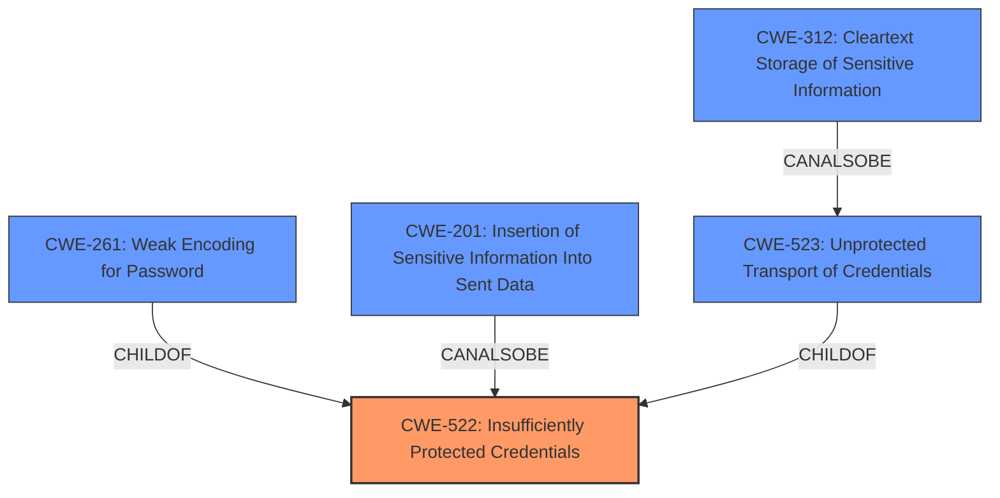

# Analysis Report for CVE-2021-3131

# Vulnerability Analysis Report: CVE-2021-3131

## Description


## Analysis (with Relationship Data)

# Summary
| CWE ID  | CWE Name                                                      | Confidence | CWE Abstraction Level | CWE Vulnerability Mapping Label | CWE-Vulnerability Mapping Notes |
| :-------- | :------------------------------------------------------------ | :--------- | :---------------------- | :------------------------------ | :------------------------------ |
| CWE-522   | Insufficiently Protected Credentials                          | 1          | Base                    | Primary                         | Allowed                       |
| CWE-201   | Insertion of Sensitive Information Into Sent Data             | 0.7        | Base                    | Secondary                       | Allowed                       |
| CWE-312   | Cleartext Storage of Sensitive Information                  | 0.6        | Base                    | Secondary                       | Allowed                       |
| CWE-523   | Unprotected Transport of Credentials                          | 0.5        | Base                    | Secondary                       | Allowed                       |
| CWE-261   | Weak Encoding for Password                                    | 0.4        | Base                    | Secondary                       | Allowed                       |

## Evidence and Confidence

*   **Confidence Score:** 0.8
*   **Evidence Strength:** HIGH

## Relationship Analysis
The primary weakness, CWE-522 [CWE-522: Insufficiently Protected Credentials], is directly related to the core issue of transmitting credentials in a weakly encoded format. CWE-201 [CWE-201: Insertion of Sensitive Information Into Sent Data] is related since the credentials are included in the URL. CWE-312 [CWE-312: Cleartext Storage of Sensitive Information] is related because although the credentials are not stored in cleartext, they are transmitted in a form that is easily decoded. CWE-523 [CWE-523: Unprotected Transport of Credentials] is related because the credentials are sent over the URL. CWE-261 [CWE-261: Weak Encoding for Password] addresses the usage of weak encoding schemes.



## Vulnerability Chain
The vulnerability chain starts with the **INSUFFICIENT PROTECTION** of credentials, leading to the transmission of base64 encoded credentials in the URL. This results in the **IMPACT** of potential information disclosure.

## Summary of Analysis
The primary CWE is CWE-522 [CWE-522: Insufficiently Protected Credentials] because the core issue is the lack of proper protection for sensitive credentials. The vulnerability description explicitly states that the web server sends base64 encoded credentials in the URL parameter, which falls under the definition of insufficient protection. The "CVE Reference Links Content Summary" confirms this by stating "**Weaknesses/vulnerabilities present**: CWE-522 Insufficiently Protected Credentials. The credentials are not properly protected by being transmitted in base64 encoding via the URL."

CWE-201 [CWE-201: Insertion of Sensitive Information Into Sent Data] is a secondary CWE, as the vulnerability involves including sensitive information (credentials) in the data being sent (the URL). The retriever results indicate a similarity score of 0.032.

CWE-312 [CWE-312: Cleartext Storage of Sensitive Information] is considered, although the credentials aren't stored in cleartext, they are transmitted in a weakly encoded format which is similar. The retriever results indicate a similarity score of 0.035.

CWE-523 [CWE-523: Unprotected Transport of Credentials] is a related weakness since the credentials are sent over the URL. The retriever results indicate a similarity score of 0.501.

CWE-261 [CWE-261: Weak Encoding for Password] is also considered because base64 encoding is a weak encoding scheme. The retriever results indicate a similarity score of 0.070.

Other CWEs such as CWE-601, CWE-41, CWE-23, CWE-472, CWE-212, CWE-538, CWE-74, CWE-451, CWE-807, CWE-177, and CWE-178 were considered but deemed less relevant as they address different types of weaknesses (e.g., URL redirection, path traversal, improper input handling, case sensitivity issues).

The final decision is based on a combination of the vulnerability description, the CVE reference summary, and the retriever results, prioritizing CWE-522 as the primary weakness and CWE-201, CWE-312, CWE-523 and CWE-261 as secondary weaknesses. The selected CWEs are at the appropriate level of specificity, accurately representing the vulnerability's root cause and potential impact.


## CWE Relationship Analysis

Current CWEs represent these abstraction levels: .


### Vulnerability Chain Analysis

**Chain starting from CWE-41:**
- 41 (Improper Resolution of Path Equivalence) - ROOT


**Chain starting from CWE-312:**
- 312 (Cleartext Storage of Sensitive Information) - ROOT


### CWE Relationship Diagram

```mermaid
graph TD
    classDef primary fill:#f96,stroke:#333,stroke-width:2px
    classDef secondary fill:#69f,stroke:#333
    classDef tertiary fill:#9e9,stroke:#333
```


*Report generated on 2025-04-02 09:45:18*
