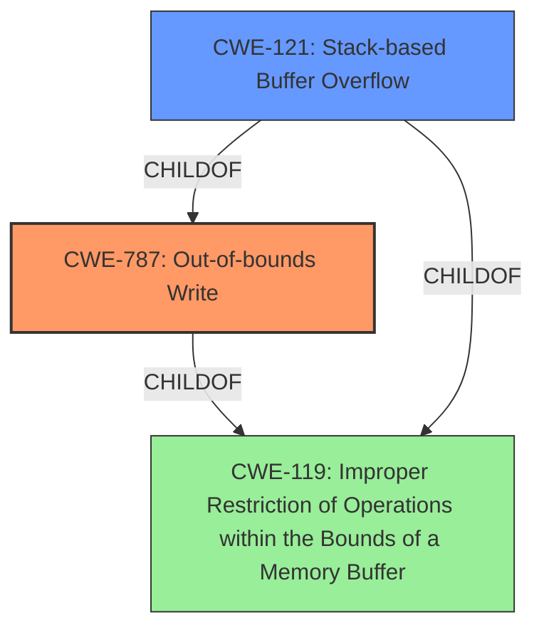

# Raw Analyzer Response for CVE-2021-31315

# Summary
| CWE ID | CWE Name | Confidence | CWE Abstraction Level | CWE Vulnerability Mapping Label | CWE-Vulnerability Mapping Notes |
|---|---|---|---|---|---|
| CWE-787 | Out-of-bounds Write | 1.0 | Base | Allowed | Primary CWE |
| CWE-121 | Stack-based Buffer Overflow | 0.8 | Variant | Allowed | Secondary Candidate |
| CWE-119 | Improper Restriction of Operations within the Bounds of a Memory Buffer | 0.6 | Class | Allowed | Secondary Candidate |

## Evidence and Confidence

*   **Confidence Score:** 0.9
*   **Evidence Strength:** HIGH

## Relationship Analysis
The primary CWE, CWE-787, is a base-level weakness describing an out-of-bounds write. CWE-121, Stack-based Buffer Overflow, is a variant of CWE-787, specifying the location of the buffer. CWE-119, Improper Restriction of Operations within the Bounds of a Memory Buffer, is a parent class of both CWE-787 and CWE-121, representing a more general category of memory safety issues. The vulnerability is a stack-based buffer overflow, making CWE-787 the most specific and appropriate choice as the primary CWE, with CWE-121 as a secondary candidate because it specifies the stack location.

## Vulnerability Chain
The vulnerability chain starts with the **improper** bounds checking in the `blit` function, leading to a **stack-based buffer overflow**, which allows a remote attacker to **access Telegram's stack memory out-of-bounds**. This out-of-bounds write is the root cause that enables the attacker to potentially execute arbitrary code or cause a denial of service.

## Summary of Analysis
The initial assessment, supported by the vulnerability description, CVE reference links, and retriever results, points to a memory corruption issue. The **Vulnerability Description Key Phrases** section highlights "**Stack Based Overflow**" as the primary weakness. The **CVE Reference Links Content Summary** confirms that **insufficient bounds checking** results in an out-of-bounds memory access due to negative offsets.

CWE-787 (Out-of-bounds Write) is selected as the primary CWE because it accurately describes the core weakness: the software writes data beyond the intended buffer. The CVE reference link specifically mentions that the `x` variable can become negative and be used as an offset which becomes an out-of-bounds write in the line `uchar *ptr = buffer + x`. The retriever results also list CWE-787 as a potential match, and it is the primary CWE match for similar CVE Descriptions.

CWE-121 (Stack-based Buffer Overflow) is considered a secondary candidate because the vulnerability is explicitly described as a stack-based overflow. This information adds specificity to the location of the overflow, making it a variant of CWE-787.

CWE-119 (Improper Restriction of Operations within the Bounds of a Memory Buffer) is a class-level CWE that describes a more general category of memory safety issues. While applicable, it is less specific than CWE-787 and CWE-121.

CWE-190 (Integer Overflow or Wraparound) was considered based on the retriever results. However, the primary issue is not an integer overflow, but rather an out-of-bounds write caused by improper bounds checking and potentially negative offsets being used as indices.

The selected CWEs are at the optimal level of specificity because they accurately describe the root cause of the vulnerability (CWE-787) and provide additional context about the location of the buffer (CWE-121). The evidence from the vulnerability description and CVE reference links strongly supports this classification.

Relevant CWE Information:

# Enhanced Context (25 CWEs)
The following CWEs were identified as potentially relevant to this vulnerability:

## CWE-191: Integer Underflow (Wrap or Wraparound)
**Abstraction Level**: Base
**Similarity Score**: 0.77
**Source**: dense

**Description**:
The product subtracts one value from another, such that the result is less than the minimum allowable integer value, which produces a value that is not equal to the correct result.

**Mapping Guidance**:
- Usage: Allowed
- Rationale: This CWE entry is at the Base level of abstraction, which is a preferred level of abstraction for mapping to the root causes of vulnerabilities.

## CWE-1289: Improper Validation of Unsafe Equivalence in Input
**Abstraction Level**: Base
**Similarity Score**: 0.76
**Source**: dense

**Description**:
The product receives an input value that is used as a resource identifier or other type of reference, but it does not validate or incorrectly validates that the input is equivalent to a potentially-unsafe value.

**Mapping Guidance**:
- Usage: Allowed
- Rationale: This CWE entry is at the Base level of abstraction, which is a preferred level of abstraction for mapping to the root causes of vulnerabilities.

## CWE-131: Incorrect Calculation of Buffer Size
**Abstraction Level**: Base
**Similarity Score**: 0.76
**Source**: dense

**Description**:
The product does not correctly calculate the size to be used when allocating a buffer, which could lead to a buffer overflow.

**Mapping Guidance**:
- Usage: Allowed
- Rationale: This CWE entry is at the Base level of abstraction, which is a preferred level of abstraction for mapping to the root causes of vulnerabilities.

## CWE-125: Out-of-bounds Read
**Abstraction Level**: Base
**Similarity Score**: 0.75
**Source**: dense

**Description**:
The product reads data past the end, or before the beginning, of the intended buffer.

**Mapping Guidance**:
- Usage: Allowed
- Rationale: This CWE entry is at the Base level of abstraction, which is a preferred level of abstraction for mapping to the root causes of vulnerabilities.

## CWE-681: Incorrect Conversion between Numeric Types
**Abstraction Level**: Base
**Similarity Score**: 0.75
**Source**: dense

**Description**:
When converting from one data type to another, such as long to integer, data can be omitted or translated in a way that produces unexpected values. If the resulting values are used in a sensitive context, then dangerous behaviors may occur.

**Mapping Guidance**:
- Usage: Allowed
- Rationale: This CWE entry is at the Base level of abstraction, which is a preferred level of abstraction for mapping to the root causes of vulnerabilities.

## CWE-197: Numeric Truncation Error
**Abstraction Level**: Base
**Similarity Score**: 0.75
**Source**: dense

**Description**:
Truncation errors occur when a primitive is cast to a primitive of a smaller size and data is lost in the conversion.

**Mapping Guidance**:
- Usage: Allowed
- Rationale: This CWE entry is at the Base level of abstraction, which is a preferred level of abstraction for mapping to the root causes of vulnerabilities.

## CWE-805: Buffer Access with Incorrect Length Value
**Abstraction Level**: Base
**Similarity Score**: 0.74
**Source**: dense

**Description**:
The product uses a sequential operation to read or write a buffer, but it uses an incorrect length value that causes it to access memory that is outside of the bounds of the buffer.

**Mapping Guidance**:
- Usage: Allowed
- Rationale: This CWE entry is at the Base level of abstraction, which is a preferred level of abstraction for mapping to the root causes of vulnerabilities.

## CWE-193: Off-by-one Error
**Abstraction Level**: Base
**Similarity Score**: 0.74
**Source**: dense

**Description**:
A product calculates or uses an incorrect maximum or minimum value that is 1 more, or 1 less, than the correct value.

**Mapping Guidance**:
- Usage: Allowed
- Rationale: This CWE entry is at the Base level of abstraction, which is a preferred level of abstraction for mapping to the root causes of vulnerabilities.

## CWE-129: Improper Validation of Array Index
**Abstraction Level**: Variant
**Similarity Score**: 0.74
**Source**: dense

**Description**:
The product uses untrusted input when calculating or using an array index, but the product does not validate or incorrectly validates the index to ensure the index references a valid position within the array.

**Mapping Guidance**:
- Usage: Allowed
- Rationale: This CWE entry