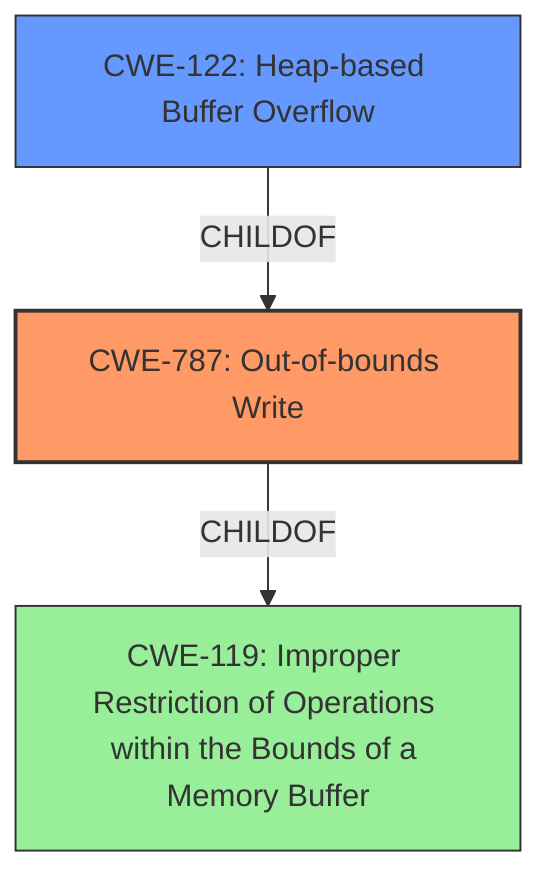

# Analysis Report for CVE-2021-31320

# Vulnerability Analysis Report: CVE-2021-31320

## Description


## Analysis (with Relationship Data)

# Summary
| CWE ID | CWE Name | Confidence | CWE Abstraction Level | CWE Vulnerability Mapping Label | CWE-Vulnerability Mapping Notes |
|---|---|---|---|---|---|
| CWE-787 | Out-of-bounds Write | 1.0 | Base | Allowed | Primary CWE |
| CWE-122 | Heap-based Buffer Overflow | 0.8 | Variant | Allowed | Secondary Candidate |

## Evidence and Confidence

*   **Confidence Score:** 0.9
*   **Evidence Strength:** HIGH

## Relationship Analysis
The primary CWE is CWE-787 **Out-of-bounds Write** which is a base level CWE. CWE-122 **Heap-based Buffer Overflow** is a variant of CWE-787 and is also considered since the vulnerability is specifically a heap overflow. CWE-787 is child of CWE-119 **Improper Restriction of Operations within the Bounds of a Memory Buffer** which is a class level CWE, and is too high level so is not selected.



## Vulnerability Chain
The chain of events is as follows:
1.  **Root Cause:** **Heap buffer overflow** due to **inaccurate boundary checks** within the `VGradientCache::generateGradientColorTable` function.
2.  **Weakness:** The `while` loop lacks proper validation, leading to an out-of-bounds write.
3.  **Impact:** Heap memory corruption, potentially leading to arbitrary code execution.

## Summary of Analysis
The initial analysis correctly identified the **heap buffer overflow**. The primary weakness is the **out-of-bounds write**, which is a direct result of the missing boundary check.

The evidence provided explicitly states: "The vulnerability is a heap-based buffer overflow in the `VGradientCache::generateGradientColorTable` function" and "An incorrectly bounded `while` loop does not check if the index `pos` exceeds the size of `colorTable` array leading to an out-of-bounds write."

Given the direct evidence of the **out-of-bounds write**, and the fact that it is the direct result of the missing boundary check, CWE-787 is the most appropriate primary CWE. CWE-122 is considered a secondary CWE because the overflow occurs on the heap.

CWE-119 **Improper Restriction of Operations within the Bounds of a Memory Buffer** is a Class level CWE and is too high level. The mapping guidance for CWE-119 says "CWE-119 is commonly misused in low-information vulnerability reports when lower-level CWEs could be used instead, or when more details about the vulnerability are available." Therefore it is not selected.

CWE-190 **Integer Overflow or Wraparound** was considered but the description does not indicate an integer overflow is present. The problem is related to the size of the buffer not being properly validated against the index in the `while` loop.

CWE-193 **Off-by-one Error** was considered but the vulnerability isn't necessarily one byte off, but rather it's writing past the end of the buffer due to a missing check.

CWE-1284 **Improper Validation of Specified Quantity in Input** was considered but does not fit since the quantity isn't being specified in the input, but is **incorrectly** calculated within the function.

CWE-787 is the most specific and accurate representation of the vulnerability, making it the optimal choice.

Relevant CWE Information:

# Enhanced Context (25 CWEs)

## CWE-787: Out-of-bounds Write
**Abstraction Level**: Base
**Similarity Score**: 3.30
**Source**: graph

**Description**:
CWE-787: Out-of-bounds Write

**Mapping Guidance**:
- Usage: Allowed
- Rationale: This CWE entry is at the Base level of abstraction, which is a preferred level of abstraction for mapping to the root causes of vulnerabilities.


## CWE Relationship Analysis

Current CWEs represent these abstraction levels: .


### Vulnerability Chain Analysis

**Chain starting from CWE-787:**
- 787 (Out-of-bounds Write) - ROOT


**Chain starting from CWE-193:**
- 193 (Off-by-one Error) - ROOT


### CWE Relationship Diagram

```mermaid
graph TD
    classDef primary fill:#f96,stroke:#333,stroke-width:2px
    classDef secondary fill:#69f,stroke:#333
    classDef tertiary fill:#9e9,stroke:#333
```


*Report generated on 2025-04-02 08:57:26*
