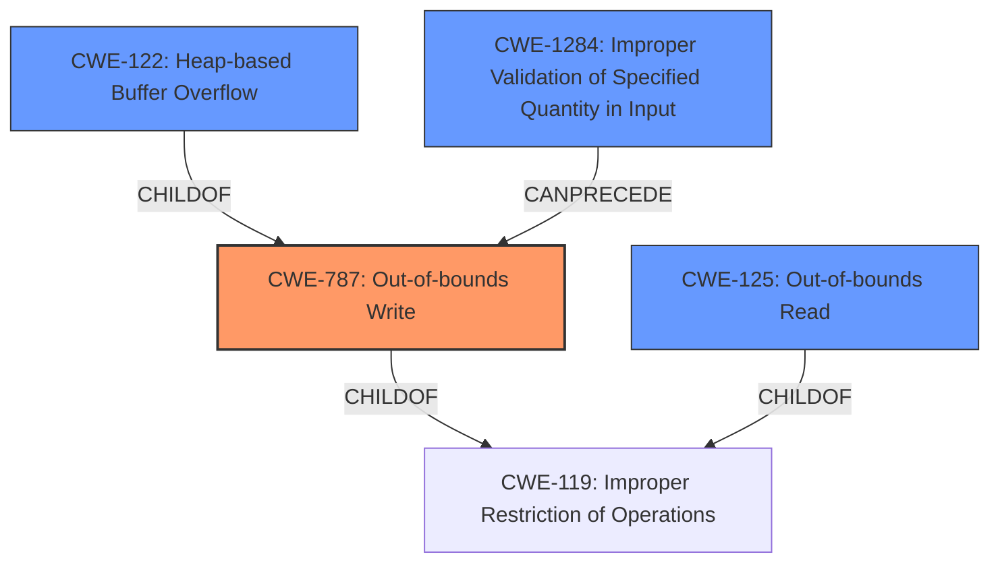

# Raw Analyzer Response for CVE-2021-31323

# Summary
| CWE ID    | CWE Name                                                              | Confidence | CWE Abstraction Level | CWE Vulnerability Mapping Label | CWE-Vulnerability Mapping Notes |
| :-------- | :-------------------------------------------------------------------- | :--------- | :-------------------- | :------------------------------ | :------------------------------ |
| CWE-787   | Out-of-bounds Write                                                     | 1.0        | Base                  | Primary                         | Allowed                         |
| CWE-122   | Heap-based Buffer Overflow                                                | 0.9        | Variant               | Secondary                       | Allowed                         |
| CWE-125   | Out-of-bounds Read                                                      | 0.7        | Base                  | Secondary                       | Allowed                         |
| CWE-1284  | Improper Validation of Specified Quantity in Input                     | 0.6        | Base                  | Secondary                       | Allowed                         |

## Evidence and Confidence

*   **Confidence Score:** 0.9
*   **Evidence Strength:** HIGH

## Relationship Analysis
The primary weakness is identified as CWE-787 **Out-of-bounds Write**, a base-level CWE, due to the **heap buffer overflow** leading to writing beyond allocated memory. The relationship to CWE-122 **Heap-based Buffer Overflow**, a variant, helps clarify the specific memory area affected. CWE-125 **Out-of-bounds Read** is also considered as the root cause includes an out-of-bounds read. CWE-1284 **Improper Validation of Specified Quantity in Input** represents the **lack of input validation** on the number of dashes, which enables the overflow.

## Vulnerability Chain
The vulnerability chain starts with **improper input validation** (CWE-1284), leading to an **out-of-bounds read** and then a **heap buffer overflow** (CWE-122) which results in an **out-of-bounds write** (CWE-787).

## Summary of Analysis
The initial analysis identified a **Heap Buffer Overflow**, which directly corresponds to an **out-of-bounds write** condition. The CVE Reference Links Content Summary provides evidence of **out-of-bounds read access** because the number of dashes in the animated sticker is not verified, triggering the **heap buffer overflow** when a crafted sticker with more dashes is processed. This confirms the primary weakness as CWE-787 **Out-of-bounds Write**, with CWE-122 **Heap-based Buffer Overflow** providing more specificity. CWE-125 **Out-of-bounds Read** is also included because the root cause includes an out-of-bounds read. CWE-1284 **Improper Validation of Specified Quantity in Input** represents the lack of input validation on the number of dashes. The selected CWEs are at the optimal level of specificity, providing a clear understanding of the vulnerability's root cause and potential impact.

Relevant CWE Information:

# Enhanced Context (25 CWEs)

## CWE-131: Incorrect Calculation of Buffer Size
**Abstraction Level**: Base
**Similarity Score**: 0.78
**Source**: dense

**Description**:
The product does not correctly calculate the size to be used when allocating a buffer, which could lead to a buffer overflow.

**Mapping Guidance**:
- Usage: Allowed
- Rationale: This CWE entry is at the Base level of abstraction, which is a preferred level of abstraction for mapping to the root causes of vulnerabilities.

*Reason for not selecting*: While a buffer overflow is present, the root cause is not an incorrect calculation of the buffer size, but rather a failure to validate the number of dashes.

## CWE-191: Integer Underflow (Wrap or Wraparound)
**Abstraction Level**: Base
**Similarity Score**: 0.78
**Source**: dense

**Description**:
The product subtracts one value from another, such that the result is less than the minimum allowable integer value, which produces a value that is not equal to the correct result.

**Mapping Guidance**:
- Usage: Allowed
- Rationale: This CWE entry is at the Base level of abstraction, which is a preferred level of abstraction for mapping to the root causes of vulnerabilities.

*Reason for not selecting*: Integer underflow is not indicated in the description.

## CWE-125: Out-of-bounds Read
**Abstraction Level**: Base
**Similarity Score**: 0.77
**Source**: dense

**Description**:
The product reads data past the end, or before the beginning, of the intended buffer.

**Mapping Guidance**:
- Usage: Allowed
- Rationale: This CWE entry is at the Base level of abstraction, which is a preferred level of abstraction for mapping to the root causes of vulnerabilities.

*Reason for selecting*: The CVE description states "The issue stems from an out-of-bounds read access because the actual number of dashes in the animated sticker is not verified before accessing heap memory."

## CWE-126: Buffer Over-read
**Abstraction Level**: Variant
**Similarity Score**: 0.76
**Source**: dense

**Description**:
The product reads from a buffer using buffer access mechanisms such as indexes or pointers that reference memory locations after the targeted buffer.

**Mapping Guidance**:
- Usage: Allowed
- Rationale: This CWE entry is at the Variant level of abstraction, which is a preferred level of abstraction for mapping to the root causes of vulnerabilities.

*Reason for not selecting*: While an out-of-bounds read is present (CWE-125), the description is not specific enough to classify it as an over-read.

## CWE-190: Integer Overflow or Wraparound
**Abstraction Level**: Base
**Similarity Score**: 0.76
**Source**: dense

**Description**:
The product performs a calculation that can
         produce an integer overflow or wraparound when the logic
         assumes that the resulting value will always be larger than
         the original value. This occurs when an integer value is
         incremented to a value that is too large to store in the
         associated representation. When this occurs, the value may
         become a very small or negative number.

**Mapping Guidance**:
- Usage: Allowed
- Rationale: This CWE entry is at the Base level of abstraction, which is a preferred level of abstraction for mapping to the root causes of vulnerabilities.

*Reason for not selecting*: Integer overflow is not indicated in the description.

## CWE-193: Off-by-one Error
**Abstraction Level**: Base
**Similarity Score**: 0.76
**Source**: dense

**Description**:
A product calculates or uses an incorrect maximum or minimum value that is 1 more, or 1 less, than the correct value.

**Mapping Guidance**:
- Usage: Allowed
- Rationale: This CWE entry is at the Base level of abstraction, which is a preferred level of abstraction for mapping to the root causes of vulnerabilities.

*Reason for not selecting*: While the number of dashes is incorrect, it's not described as an off-by-one error.

## CWE-789: Memory Allocation with Excessive Size Value
**Abstraction Level**: Variant
**Similarity Score**: 0.76
**Source**: dense

**Description**:
The product allocates memory based on an untrusted, large size value, but it does not ensure that the size is within expected limits, allowing arbitrary amounts of memory to be allocated.

**Mapping Guidance**:
- Usage: Allowed
- Rationale: This CWE entry is at the Variant level of abstraction, which is a preferred level of abstraction for mapping to the root causes of vulnerabilities.

*Reason for not selecting*: While the size is influenced by the number of dashes, the root cause is not an excessive size value, but rather a failure to validate the number of dashes.

## CWE-805: Buffer Access with Incorrect Length Value
**Abstraction Level**: Base
**Similarity Score**: 0.75
**Source**: dense

**Description**:
The product uses a sequential operation to read or write a buffer, but it uses an incorrect length value that causes it to access memory that is outside of the bounds of the buffer.

**Mapping Guidance**:
- Usage: Allowed
- Rationale: This CWE entry