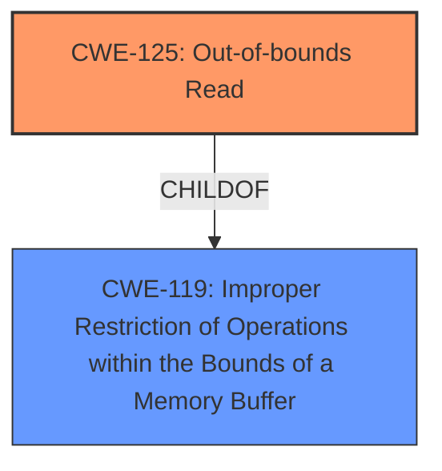

# Raw Analyzer Response for CVE-2021-31348

# Summary
| CWE ID | CWE Name | Confidence | CWE Abstraction Level | CWE Vulnerability Mapping Label | CWE-Vulnerability Mapping Notes |
|---|---|---|---|---|---|
| CWE-125 | Out-of-bounds Read | 1.0 | Base | Allowed | Primary CWE. Matches the vulnerability description of an **out-of-bounds read** after an **incorrect memory handling** issue. |
| CWE-119 | Improper Restriction of Operations within the Bounds of a Memory Buffer | 0.7 | Class | Discouraged | Secondary CWE. This is a more general case of out-of-bounds access, but CWE-125 is more specific. |

## Evidence and Confidence

*   **Confidence Score:** 1.0
*   **Evidence Strength:** HIGH

## Relationship Analysis
The primary CWE is CWE-125 (**Out-of-bounds Read**), which is a child of CWE-119 (**Improper Restriction of Operations within the Bounds of a Memory Buffer**). The vulnerability description explicitly mentions an out-of-bounds read, making CWE-125 the most appropriate and specific choice. CWE-119 is a more general classification and is discouraged when a more specific CWE is available.

## Vulnerability Chain
The vulnerability chain starts with **incorrect memory handling**, leading to an **out-of-bounds read**.

## Summary of Analysis
The initial analysis identified the **out-of-bounds read** as the key weakness. The retriever results and the vulnerability description both strongly support this classification. The relationship analysis confirms that CWE-125 is a more specific child of CWE-119 and is thus a better fit. The mapping guidance for CWE-119 discourages its use when a more specific CWE is available. Therefore, CWE-125 is selected as the primary CWE.

The vulnerability description states: "The function ezxml_parse_str() performs **incorrect memory handling** while parsing crafted XML files (**out-of-bounds read** after a certain strcspn failure)." The CVE Reference Links Content Summary states: "Incorrect memory handling within the `ezxml_parse_str()` function... Out-of-bounds read vulnerability."

This assessment is based on the provided evidence. The graph relationships confirmed that CWE-125 is more specific. The selected CWE is at the optimal level of specificity because it directly reflects the reported weakness.

Relevant CWE Information:

# Enhanced Context (25 CWEs)
The following CWEs were identified as potentially relevant to this vulnerability:

## CWE-191: Integer Underflow (Wrap or Wraparound)
**Abstraction Level**: Base
**Similarity Score**: 0.79
**Source**: dense

**Description**:
The product subtracts one value from another, such that the result is less than the minimum allowable integer value, which produces a value that is not equal to the correct result.
**Not Used:** There is no evidence of an Integer Underflow.

## CWE-131: Incorrect Calculation of Buffer Size
**Abstraction Level**: Base
**Similarity Score**: 0.79
**Source**: dense

**Description**:
The product does not correctly calculate the size to be used when allocating a buffer, which could lead to a buffer overflow.
**Not Used:** Although the vulnerability has to do with memory handling, there is no mention of any incorrect buffer size calculation.

## CWE-125: Out-of-bounds Read
**Abstraction Level**: Base
**Similarity Score**: 0.79
**Source**: dense

**Description**:
The product reads data past the end, or before the beginning, of the intended buffer.
**Used:** The **weakness** is an **out-of-bounds read**.

## CWE-129: Improper Validation of Array Index
**Abstraction Level**: Variant
**Similarity Score**: 0.78
**Source**: dense

**Description**:
The product uses untrusted input when calculating or using an array index, but the product does not validate or incorrectly validates the index to ensure the index references a valid position within the array.
**Not Used:** There is no evidence of an improper validation of an array index.

## CWE-126: Buffer Over-read
**Abstraction Level**: Variant
**Similarity Score**: 0.78
**Source**: dense

**Description**:
The product reads from a buffer using buffer access mechanisms such as indexes or pointers that reference memory locations after the targeted buffer.
**Not Used:** Although this is an out-of-bounds read, CWE-125 is more general and is a better fit.

## CWE-197: Numeric Truncation Error
**Abstraction Level**: Base
**Similarity Score**: 0.77
**Source**: dense

**Description**:
Truncation errors occur when a primitive is cast to a primitive of a smaller size and data is lost in the conversion.
**Not Used:** There is no evidence of a numeric truncation error.

## CWE-805: Buffer Access with Incorrect Length Value
**Abstraction Level**: Base
**Similarity Score**: 0.77
**Source**: dense

**Description**:
The product uses a sequential operation to read or write a buffer, but it uses an incorrect length value that causes it to access memory that is outside of the bounds of the buffer.
**Not Used:** There is no evidence of an incorrect length value.

## CWE-252: Unchecked Return Value
**Abstraction Level**: Base
**Similarity Score**: 0.77
**Source**: dense

**Description**:
The product does not check the return value from a method or function, which can prevent it from detecting unexpected states and conditions.
**Not Used:** There is no evidence of an unchecked return value.

## CWE-119: Improper Restriction of Operations within the Bounds of a Memory Buffer
**Abstraction Level**: Class
**Similarity Score**: 0.77
**Source**: dense

**Description**:
The product performs operations on a memory buffer, but it reads from or writes to a memory location outside the buffer's intended boundary. This may result in read or write operations on unexpected memory locations that could be linked to other variables, data structures, or internal program data.
**Used:** The vulnerability description states that there is an **out-of-bounds read**. This is a more general case of out-of-bounds access, but CWE-125 is more specific.

## CWE-789: Memory Allocation with Excessive Size Value
**Abstraction Level**: Variant
**Similarity Score**: 0.77
**Source**: dense

**Description**:
The product allocates memory based on an untrusted, large size value, but it does not ensure that the size is within expected limits, allowing arbitrary amounts of memory to be allocated.
**Not Used:** There is no evidence of an excessive size value.

## CWE-190: Integer Overflow or Wraparound
**Abstraction Level**: Base
**Similarity Score**: 6006.15
**Source**: sparse

**Description**:
The product performs a calculation that can
         produce an integer overflow or wraparound when the logic
         assumes that the resulting value will always be larger than
         the original value. This occurs when an integer value is
         incremented to a value that is too large to store in the
         associated representation. When this occurs, the value may
         become a very small or negative number.
**Not Used:** There is no evidence of an integer overflow or wraparound.

## CWE-170: Improper Null Termination
**Abstraction Level**: base
**Similarity Score**: 5.03
**Source**: graph

**Description**:
CWE-170: Improper Null Termination
**Not Used:** There is no evidence of an improper null termination.

## CWE-128: Wrap-around Error
**Abstraction Level**: base
**Similarity Score**: 5.03
**Source**: graph

**Description**:
CWE-128: Wrap-around Error
**Not Used:** There is no evidence of an wrap-around error.

## CWE-195: Signed to Unsigned Conversion Error
**Abstraction Level**: variant
**Similarity Score**: 4.53
**Source**: graph

**Description**:
CWE-195: Signed to Unsigned Conversion Error
**Not Used:** There is no evidence of a signed to unsigned conversion error.

## CWE-823: Use of Out-of-range Pointer Offset
**Abstraction Level**: base
**Similarity Score**: 4.33
**Source**: graph

**Description**:
CWE-823: Use of Out-of-range Pointer Offset
**Not Used:** There is no evidence of use of an out-of-range pointer offset.

## CWE-787: Out-of-bounds Write
**Abstraction Level**: base
**Similarity Score**: