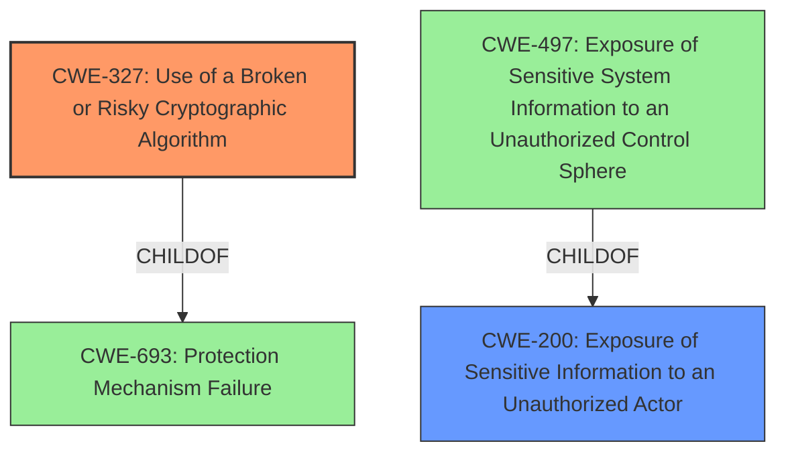

# Analysis for CVE-2021-31352

# Summary
| CWE ID | CWE Name | Confidence | CWE Abstraction Level | CWE Vulnerability Mapping Label | CWE-Vulnerability Mapping Notes |
|---|---|---|---|---|---|
| CWE-327 | Use of a Broken or Risky Cryptographic Algorithm | 1.0 | Class | Allowed-with-Review | Primary CWE |
| CWE-200 | Exposure of Sensitive Information to an Unauthorized Actor | 0.6 | Class | Discouraged | Secondary Candidate |

## Evidence and Confidence

*   **Confidence Score:** 0.8
*   **Evidence Strength:** HIGH

## Relationship Analysis
The primary CWE selected is CWE-327, "Use of a Broken or Risky Cryptographic Algorithm," which is a class-level CWE. While it would be ideal to find a more specific base or variant CWE, the description focuses on the use of **weak ciphers** for NETCONF over SSH, which directly aligns with the general concept of using a flawed cryptographic approach. CWE-327 is a child of CWE-693 "Protection Mechanism Failure". CWE-200 "Exposure of Sensitive Information to an Unauthorized Actor" is a class-level CWE that represents the impact of the **weakness**, but not the root cause. It is the parent of CWE-497 "Exposure of Sensitive System Information to an Unauthorized Control Sphere".

## Vulnerability Chain
The vulnerability chain starts with the **use of weak ciphers** (CWE-327), leading to the potential for a remote attacker to intercept network data and **obtain sensitive information** (CWE-200). The root cause is the inadequate cryptographic algorithm, and the impact is the **exposure** of sensitive data.

## Summary of Analysis
The initial analysis identified CWE-327 as the primary candidate due to the explicit mention of **weak ciphers** in the vulnerability description. The retriever results also ranked CWE-327 as the top combined result. The vulnerability description states: "An **Information Exposure** vulnerability in Juniper Networks SRC Series devices configured for NETCONF over SSH permits the negotiation of **weak ciphers**, which could allow a remote attacker to **obtain sensitive information**."

CWE-200 was considered, but ultimately deemed less appropriate because it represents the impact (**information exposure**) rather than the root cause (**weak ciphers**). While the vulnerability description highlights information exposure, the underlying issue is the cryptographic **weakness**.

The decision to use CWE-327 is based on the evidence directly pointing to the **use of weak ciphers**, and the retriever results ranking it as the most relevant CWE. The "Mapping Guidance" for CWE-327 advises examining child entries for a better fit, but no child entry is more specific to the **use of weak ciphers** in NETCONF over SSH. Therefore, CWE-327 is the most appropriate at the Class level.

Relevant CWE Information:

# Enhanced Context (25 CWEs)

## CWE-226: Sensitive Information in Resource Not Removed Before Reuse
**Abstraction Level**: Base
**Similarity Score**: 0.80
**Source**: dense
Did not select because the vulnerability does not involve the reuse of resources with sensitive information.

## CWE-497: Exposure of Sensitive System Information to an Unauthorized Control Sphere
**Abstraction Level**: Base
**Similarity Score**: 0.78
**Source**: dense
Did not select because the vulnerability does not involve the exposure of system-level information specifically.

## CWE-538: Insertion of Sensitive Information into Externally-Accessible File or Directory
**Abstraction Level**: Base
**Similarity Score**: 0.78
**Source**: dense
Did not select because the vulnerability does not involve the insertion of sensitive information into files or directories.

## CWE-213: Exposure of Sensitive Information Due to Incompatible Policies
**Abstraction Level**: Base
**Similarity Score**: 0.77
**Source**: dense
Did not select because the vulnerability does not involve incompatible policies regarding information sensitivity.

## CWE-668: Exposure of Resource to Wrong Sphere
**Abstraction Level**: Class
**Similarity Score**: 0.76
**Source**: dense
Did not select because it's a high-level CWE, and CWE-327 provides a more specific classification.

## CWE-200: Exposure of Sensitive Information to an Unauthorized Actor
**Abstraction Level**: Class
**Similarity Score**: 0.76
**Source**: dense
Considered, but not selected as primary because it represents the impact (information exposure) rather than the root cause (**weak ciphers**).

## CWE-319: Cleartext Transmission of Sensitive Information
**Abstraction Level**: Base
**Similarity Score**: 0.76
**Source**: dense
Did not select because the vulnerability involves the negotiation of weak ciphers, not necessarily cleartext transmission.

## CWE-312: Cleartext Storage of Sensitive Information
**Abstraction Level**: Base
**Similarity Score**: 0.76
**Source**: dense
Did not select because the vulnerability does not involve the storage of sensitive information in cleartext.

## CWE-203: Observable Discrepancy
**Abstraction Level**: Base
**Similarity Score**: 0.76
**Source**: dense
Did not select because the vulnerability does not involve observable discrepancies in timing or behavior.

## CWE-212: Improper Removal of Sensitive Information Before Storage or Transfer
**Abstraction Level**: Base
**Similarity Score**: 0.76
**Source**: dense
Did not select because the vulnerability does not involve the improper removal of sensitive information.

## CWE-203: Observable Discrepancy
**Abstraction Level**: Base
**Similarity Score**: 6830.79
**Source**: sparse
See above analysis.

## CWE-327: Use of a Broken or Risky Cryptographic Algorithm
**Abstraction Level**: Class
**Similarity Score**: 6830.53
**Source**: sparse
Selected as the primary CWE due to the direct relationship with the **use of weak ciphers**.

## CWE-200: Exposure of Sensitive Information to an Unauthorized Actor
**Abstraction Level**: Class
**Similarity Score**: 6812.75
**Source**: sparse
See above analysis.

## CWE-1240: Use of a Cryptographic Primitive with a Risky Implementation
**Abstraction Level**: Base
**Similarity Score**: 6556.40
**Source**: sparse
Considered, but CWE-327 is more general and accurately captures the issue of **weak ciphers**.

## CWE-497: Exposure of Sensitive System Information to an Unauthorized Control Sphere
**Abstraction Level**: Base
**Similarity Score**: 6553.69
**Source**: sparse
See above analysis.

## CWE-208: Observable Timing Discrepancy
**Abstraction Level**: base
**Similarity Score**: 4.33
**Source**: graph
Not related to timing discrepancies.

## CWE-385: Covert Timing Channel
**Abstraction Level**: base
**Similarity Score**: 4.33
**Source**: graph
Not related to covert timing channels.

## CWE-1284: Improper Validation of Specified Quantity in Input
**Abstraction Level**: base
**Similarity Score**: 4.33
**Source**: graph
Not related to improper validation of quantity.

## CWE-410: Insufficient Resource Pool
**Abstraction Level**: base
**Similarity Score**: 4.33
**Source**: graph
Not related to resource pool exhaustion.

## CWE-201: Insertion of Sensitive Information Into Sent Data
**Abstraction Level**: base
**Similarity Score**: 4.33
**Source**: graph
Not related to insertion of sensitive data.

## CWE-789: Memory Allocation with Excessive Size Value
**Abstraction Level**: variant
**Similarity Score**: 3.88
**Source**: graph
Not related to memory allocation size.

## CWE-770: Allocation of Resources Without Limits or Throttling
**Abstraction Level**: base
**Similarity Score**: 3.49
**Source**: graph
Not related to resource allocation limits.

## CWE-190: Integer Overflow or Wraparound
**Abstraction Level**: base
**Similarity Score**: 3.42
**Source**: graph
Not related to integer overflows.

## CWE-32