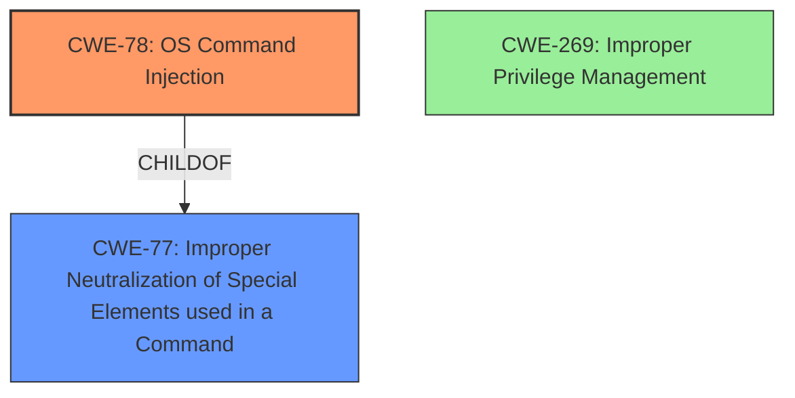

# Analysis for CVE-2021-31356

# Summary
| CWE ID | CWE Name | Confidence | CWE Abstraction Level | CWE Vulnerability Mapping Label | CWE-Vulnerability Mapping Notes |
|---|---|---|---|---|---|
| CWE-78 | Improper Neutralization of Special Elements used in an OS Command ('OS Command Injection') | 1.0 | Base | Allowed | Primary CWE |
| CWE-269 | Improper Privilege Management | 0.6 | Class | Discouraged | Secondary Candidate |

## Evidence and Confidence

*   **Confidence Score:** 0.8
*   **Evidence Strength:** HIGH

## Relationship Analysis
The primary relationship influencing the decision is the hierarchical one, with CWE-78 as a more specific child of CWE-77. While CWE-269 is a potential secondary weakness, it's discouraged for direct mapping.

## Vulnerability Chain
The vulnerability chain starts with the **command injection vulnerability** (CWE-78), which allows an attacker to bypass access protections and execute arbitrary shell commands.

## Summary of Analysis
The initial analysis identified a **command injection vulnerability** as the root cause, leading to the ability to bypass access controls and execute arbitrary commands. This aligns strongly with CWE-78.

The evidence from the "Vulnerability Description Key Phrases" includes "**rootcause:** **command injection vulnerability**" and "**impact:** bypass configured access protections and execute arbitrary shell commands".

The "Primary CWE Match" from "CWE for similar CVE Descriptions" is CWE-78.

The Retriever Results also list CWE-78 as a high-ranking candidate.

CWE-78 is at the Base level of abstraction, which is preferred.

The selected CWE, CWE-78, is at the optimal level of specificity because it directly addresses the **command injection vulnerability**, which is the root cause described.

Relevant CWE Information:

# Enhanced Context (25 CWEs)

## CWE-78: Improper Neutralization of Special Elements used in an OS Command ('OS Command Injection')
**Abstraction Level**: Base

**CWE-78**: The product constructs all or part of an OS command using externally-influenced input from an upstream component, but it does not neutralize or incorrectly neutralizes special elements that could modify the intended OS command when it is sent to a downstream component.

This vulnerability description matches the CWE description of CWE-78 because the attacker is able to inject commands.

## CWE-269: Improper Privilege Management
**Abstraction Level**: Class

**CWE-269**: The product does not properly assign, modify, track, or check privileges for an actor, creating an unintended sphere of control for that actor.

The vulnerability allows an attacker to bypass command authorization restrictions assigned to their specific user account and execute commands that are available to the privilege level for which the user is assigned. This could be loosely interpreted as a privilege management issue. However, CWE-269 is discouraged because more specific CWEs should be used. The root cause here is the **command injection vulnerability** (CWE-78).