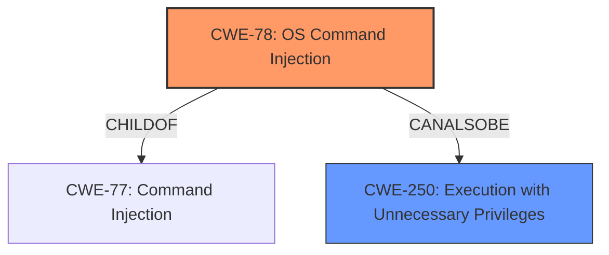

# Enhanced Analysis for CVE-2021-31357

# Summary
| CWE ID | CWE Name | Confidence | CWE Abstraction Level | CWE Vulnerability Mapping Label | CWE-Vulnerability Mapping Notes |
|---|---|---|---|---|---|
| CWE-78 | Improper Neutralization of Special Elements used in an OS Command ('OS Command Injection') | 1.0 | Base | Allowed | Primary CWE |
| CWE-250 | Execution with Unnecessary Privileges | 0.7 | Base | Allowed | Secondary CWE |

## Evidence and Confidence

*   **Confidence Score:** 0.9
*   **Evidence Strength:** HIGH

## Relationship Analysis
The primary weakness is CWE-78 (OS Command Injection), which is a base-level CWE and a child of CWE-77 (Command Injection). CWE-78 describes the specific case where the injected command is an OS command. The vulnerability description indicates that arbitrary shell commands can be executed, aligning with CWE-78. CWE-250 is included because the vulnerability involves bypassing intended restrictions on command execution, suggesting that the tcpdump command processing might have been running with unnecessary privileges, which amplified the impact of the injection vulnerability.



## Vulnerability Chain
The vulnerability chain starts with a **command injection** vulnerability in tcpdump command processing which allows an attacker to bypass configured access protections to execute arbitrary shell commands. This leads to bypassing command authorization restrictions and executing commands available to unrestricted admin users.

## Summary of Analysis
The initial analysis correctly identifies the presence of a **command injection** vulnerability. The vulnerability allows bypassing command authorization restrictions by allowing full access to the shell. This is a direct **command injection** (**weakness: command injection**) into the OS, making CWE-78 the most appropriate primary CWE. The ability to bypass command authorization restrictions suggests that the component may have been running with excessive privileges, exacerbating the vulnerability.

*   **CWE-78**: This is the primary CWE because the vulnerability description explicitly states a **command injection** vulnerability allowing execution of arbitrary shell commands. "A **command injection** vulnerability in tcpdump command processing on Juniper Networks Junos OS Evolved allows an attacker with authenticated CLI access to be able to bypass configured access protections to execute arbitrary shell commands within the context of the current user." This aligns perfectly with the description of CWE-78, which is "Improper Neutralization of Special Elements used in an OS Command ('OS Command Injection')." The abstraction level is Base, which is preferred.
*   **CWE-250**: This is a secondary CWE because the vulnerability allows bypassing command authorization restrictions. "The vulnerability allows an attacker to bypass command authorization restrictions assigned to their specific user account and execute commands that are available to the privilege level for which the user is assigned." This suggests that the tcpdump command processing might be running with unnecessary privileges, amplifying the impact of the injection vulnerability.

CWE-77 was considered but not selected as the primary CWE because CWE-78 (OS Command Injection) is a more specific child of CWE-77, and the vulnerability description clearly indicates OS command execution.

CWE-269 was considered but deemed less accurate because the core issue is not directly related to the assignment or management of privileges, but rather the ability to inject commands.

The final selection of CWE-78 and CWE-250 provides the optimal level of specificity. CWE-78 directly reflects the **command injection** vulnerability, and CWE-250 highlights the role of unnecessary privileges in exacerbating the impact.

Relevant CWE Information:

# Enhanced Context (25 CWEs)
The following CWEs were identified as potentially relevant to this vulnerability:

## CWE-1289: Improper Validation of Unsafe Equivalence in Input
**Abstraction Level**: Base
**Similarity Score**: 0.79
**Source**: dense

**Description**:
The product receives an input value that is used as a resource identifier or other type of reference, but it does not validate or incorrectly validates that the input is equivalent to a potentially-unsafe value.

**Mapping Guidance**:
- Usage: Allowed
- Rationale: This CWE entry is at the Base level of abstraction, which is a preferred level of abstraction for mapping to the root causes of vulnerabilities.


## CWE-184: Incomplete List of Disallowed Inputs
**Abstraction Level**: Base
**Similarity Score**: 0.77
**Source**: dense

**Description**:
The product implements a protection mechanism that relies on a list of inputs (or properties of inputs) that are not allowed by policy or otherwise require other action to neutralize before additional processing takes place, but the list is incomplete.

**Mapping Guidance**:
- Usage: Allowed
- Rationale: This CWE entry is at the Base level of abstraction, which is a preferred level of abstraction for mapping to the root causes of vulnerabilities.


## CWE-41: Improper Resolution of Path Equivalence
**Abstraction Level**: Base
**Similarity Score**: 0.76
**Source**: dense

**Description**:
The product is vulnerable to file system contents disclosure through path equivalence. Path equivalence involves the use of special characters in file and directory names. The associated manipulations are intended to generate multiple names for the same object.

**Mapping Guidance**:
- Usage: Allowed
- Rationale: This CWE entry is at the Base level of abstraction, which is a preferred level of abstraction for mapping to the root causes of vulnerabilities.


## CWE-138: Improper Neutralization of Special Elements
**Abstraction Level**: Class
**Similarity Score**: 0.76
**Source**: dense

**Description**:
The product receives input from an upstream component, but it does not neutralize or incorrectly neutralizes special elements that could be interpreted as control elements or syntactic markers when they are sent to a downstream component.

**Mapping Guidance**:
- Usage: Discouraged
- Rationale: This CWE entry is a level-1 Class (i.e., a child of a Pillar). It might have lower-level children that would be more appropriate


## CWE-74: Improper Neutralization of Special Elements in Output Used by a Downstream Component ('Injection')
**Abstraction Level**: Class
**Similarity Score**: 0.76
**Source**: dense

**Description**:
The product constructs all or part of a command, data structure, or record using externally-influenced input from an upstream component, but it does not neutralize or incorrectly neutralizes special elements that could modify how it is parsed or interpreted when it is sent to a downstream component.

**Mapping Guidance**:
- Usage: Discouraged
- Rationale: CWE-74 is high-level and often misused when lower-level weaknesses are more appropriate.


## CWE-183: Permissive List of Allowed Inputs
**Abstraction Level**: Base
**Similarity Score**: 0.76
**Source**: dense

**Description**:
The product implements a protection mechanism that relies on a list of inputs (or properties of inputs) that are explicitly allowed by policy because the inputs are assumed to be safe, but the list is too permissive - that is, it allows an input that is unsafe, leading to resultant weaknesses.

**Mapping Guidance**:
- Usage: Allowed
- Rationale: This CWE entry is at the Base level of abstraction, which is a preferred level of abstraction for mapping to the root causes of vulnerabilities.


## CWE-73: External Control of File Name or Path
**Abstraction Level**: Base
**Similarity Score**: 0.76
**Source**: dense

**Description**:
The product allows user input to control or influence paths or file names that are used in filesystem operations.

**Mapping Guidance**:
- Usage: Allowed
- Rationale: This CWE entry is at the Base level of abstraction, which is a preferred level of abstraction for mapping to the root causes of vulnerabilities.


## CWE-807: Reliance on Untrusted Inputs in a Security Decision
**Abstraction Level**: Base
**Similarity Score**: 0.75
**Source**: dense

**Description**:
The product uses a protection mechanism that relies on the existence or values of an input, but the input can be modified by an untrusted actor in a way that bypasses the protection mechanism.

**Mapping Guidance**:
- Usage: Allowed
- Rationale: This CWE entry is at the Base level of abstraction, which is a preferred level of abstraction for mapping to the root causes of vulnerabilities.


## CWE-23: Relative Path Traversal
**Abstraction Level**: Base
**Similarity Score**: 0.75
**Source**: dense

**Description**:
The product uses external input to construct a pathname that should be within a restricted directory, but it does not properly neutralize sequences such as ".." that can resolve to a location that is outside of that directory.

**Mapping Guidance**:
- Usage: Allowed
- Rationale: This CWE entry is at the Base level of abstraction, which is a preferred level of abstraction for mapping to the root causes of vulnerabilities.


## CWE-1286: Improper Validation of Syntactic


## CWE Relationship Analysis

Current CWEs represent these abstraction levels: .


### Vulnerability Chain Analysis

**Chain starting from CWE-1286:**
- 1286 (Improper Validation of Syntactic Correctness of Input) - ROOT


**Chain starting from CWE-41:**
- 41 (Improper Resolution of Path Equivalence) - ROOT


### CWE Relationship Diagram

```mermaid
graph TD
    classDef primary fill:#f96,stroke:#333,stroke-width:2px
    classDef secondary fill:#69f,stroke:#333
    classDef tertiary fill:#9e9,stroke:#333
```