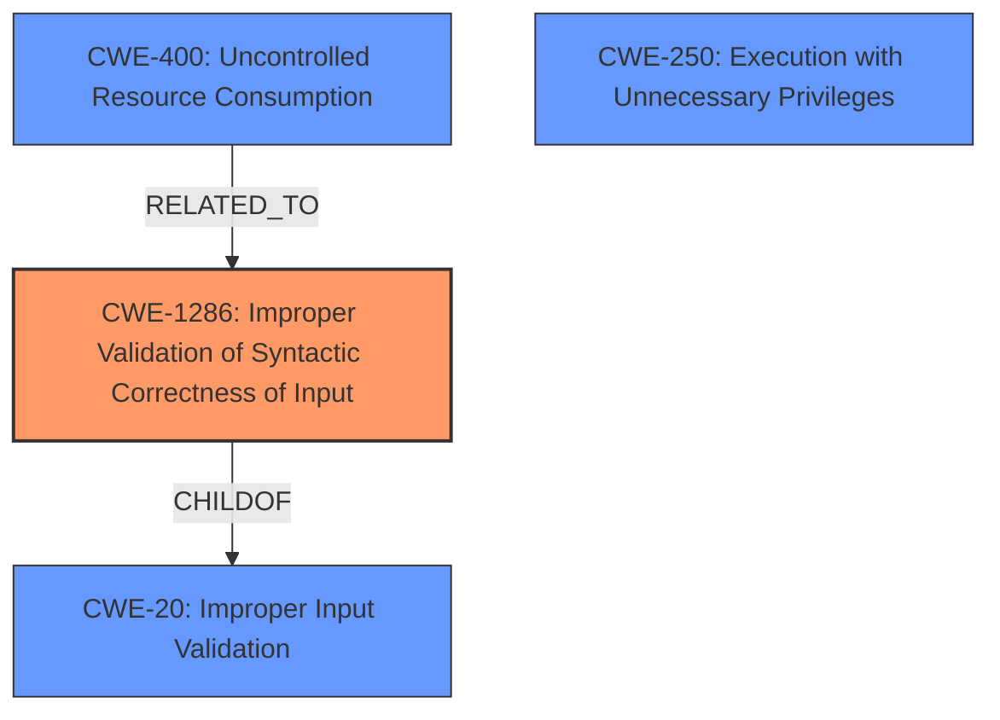

# Enhanced Analysis for CVE-2021-31359

# Summary
| CWE ID    | CWE Name                                                        | Confidence | CWE Abstraction Level | CWE Vulnerability Mapping Label | CWE-Vulnerability Mapping Notes |
| :-------- | :-------------------------------------------------------------- | :--------- | :-------------------- | :------------------------------ | :------------------------------ |
| CWE-1286  | Improper Validation of Syntactic Correctness of Input           | 0.8        | Base                  | Primary CWE                     | Allowed                       |
| CWE-400  | Uncontrolled Resource Consumption           | 0.6        | Class                  | Secondary Candidate                  | Discouraged                      |
| CWE-250   | Execution with Unnecessary Privileges                           | 0.5        | Base                  | Secondary Candidate                  | Allowed                       |

## Evidence and Confidence

*   **Confidence Score:** 0.7
*   **Evidence Strength:** MEDIUM

## Relationship Analysis
The primary CWE is CWE-1286 **Improper Validation of Syntactic Correctness of Input**, which is a child of CWE-20 **Improper Input Validation**. While the immediate impact is resource consumption (DoS), the root cause stems from failing to properly validate the syntax of the input to the DHCP daemon.
CWE-400 **Uncontrolled Resource Consumption** is a class-level CWE that is related because the improper input validation leads to excessive resource consumption.
CWE-250 **Execution with Unnecessary Privileges** is included as a local low-privilege user is able to execute commands as root.



## Vulnerability Chain
The vulnerability chain starts with a local low-privileged user providing malicious input. The jdhcpd process **fails to properly validate the syntax** of this input (CWE-1286). This leads to a crash and denial of service, or potentially the execution of arbitrary commands as root. The continued processing of this input sustains the Denial of Service (DoS) condition. This leads to **Uncontrolled Resource Consumption** (CWE-400) and **Execution with Unnecessary Privileges** (CWE-250).

## Summary of Analysis
The initial assessment identified CWE-1286 **Improper Validation of Syntactic Correctness of Input** as the primary weakness, with CWE-400 **Uncontrolled Resource Consumption** and CWE-250 **Execution with Unnecessary Privileges** as secondary weaknesses. This conclusion is based on the vulnerability description stating that **malicious input** causes the jdhcpd process to crash or execute arbitrary commands. The **lack of proper input validation** is the root cause that allows this to happen.

> A local privilege escalation vulnerability in Juniper Networks Junos OS and Junos OS Evolved allows a local, low-privileged user to cause the Juniper DHCP daemon (jdhcpd) process to crash, resulting in a Denial of Service (DoS), or execute arbitrary commands as root. Continued processing of malicious input will repeatedly crash the system and sustain the Denial of Service (DoS) condition.

CWE-1286 is at the Base level of abstraction, which is the preferred level for mapping. It accurately describes the weakness where the product receives input that is expected to be well-formed but **does not validate or incorrectly validates** that the input complies with the syntax.

CWE-400 is a Class-level CWE and is related as the improper input validation results in a denial-of-service condition as a result of the resource consumption. The guidance for CWE-400 is Discouraged due to its high level of abstraction.

CWE-250 is a Base-level CWE that indicates the process runs with higher privileges than necessary which amplifies the consequences of the vulnerability.

The final selection is based on the available evidence and the desire to map to the most specific and accurate CWE.


## CWE Relationship Analysis

Current CWEs represent these abstraction levels: .


### Vulnerability Chain Analysis

**Chain starting from CWE-400:**
- 400 (Uncontrolled Resource Consumption) - ROOT


**Chain starting from CWE-1286:**
- 1286 (Improper Validation of Syntactic Correctness of Input) - ROOT


### CWE Relationship Diagram

```mermaid
graph TD
    classDef primary fill:#f96,stroke:#333,stroke-width:2px
    classDef secondary fill:#69f,stroke:#333
    classDef tertiary fill:#9e9,stroke:#333
```