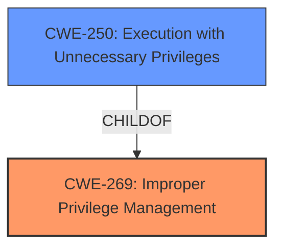

# Analysis Report for CVE-2021-31360

# Vulnerability Analysis Report: CVE-2021-31360

## Description


## Analysis (with Relationship Data)

# Summary
| CWE ID | CWE Name | Confidence | CWE Abstraction Level | CWE Vulnerability Mapping Label | CWE-Vulnerability Mapping Notes |
|---|---|---|---|---|---|
| CWE-269 | Improper Privilege Management | 0.9 | Class | Primary | Allowed-with-Review |
| CWE-250 | Execution with Unnecessary Privileges | 0.7 | Base | Secondary | Allowed |

## Evidence and Confidence

*   **Confidence Score:** 0.8
*   **Evidence Strength:** HIGH

## Relationship Analysis
The primary CWE is CWE-269, which is a Class-level CWE. CWE-250, Execution with Unnecessary Privileges, is a Base-level CWE and a child of CWE-269. The vulnerability description indicates an **improper privilege management** issue, which aligns with CWE-269. If more details were available, then CWE-250 could have been selected instead since the vulnerability allowed a low-privileged user to overwrite files as root.



## Vulnerability Chain
The chain of events starts with **improper privilege management** (CWE-269), which leads to a low-privileged user being able to overwrite local files as root, resulting in a potential system integrity issue or Denial of Service (DoS).

## Summary of Analysis
The initial assessment strongly points to CWE-269, given the explicit mention of "**improper privilege management**" in the vulnerability description. The description also indicates that a low-privileged user can overwrite local files as root, leading to a DoS.

The retriever results also list CWE-269 as the top match. The mapping guidance for CWE-269 states that it is commonly misused and should be avoided when only phrases such as "privilege escalation" or "gain privileges" are available. However, in this case, the vulnerability description uses the term "**improper privilege management**", and the issue allows a low-privileged user to overwrite files as root, which aligns well with the definition of CWE-269. CWE-250 could be selected as a secondary match since the impact is a low-privileged user executing with higher privileges.

CWE-269 is at the Class level of abstraction, and CWE-250 is at the Base level. The evidence supports the selection of CWE-269 as the primary CWE. The evidence from the description is the phrase "**improper privilege management**".

Relevant CWE Information:

# Enhanced Context (25 CWEs)

## CWE-269: Improper Privilege Management
**Abstraction:** Class
**Status:** Draft

### Description
The product does not properly assign, modify, track, or check privileges for an actor, creating an unintended sphere of control for that actor.

### Extended Description
Not provided

### Alternative Terms
None

### Relationships
ChildOf -> CWE-284

### Mapping Guidance
**Usage:** Discouraged
**Rationale:** CWE-269 is commonly misused. It can be conflated with "privilege escalation," which is a technical impact that is listed in many low-information vulnerability reports [REF-1287]. It is not useful for trend analysis.
**Comments:** If an error or mistake allows privilege escalation, then use the CWE ID for that mistake. Avoid using CWE-269 when only phrases such as "privilege escalation" or "gain privileges" are available, as these indicate technical impact of the vulnerability - not the root cause weakness. If the root cause seems to be directly related to privileges, then examine the children of CWE-269 for additional hints, such as Execution with Unnecessary Privileges (CWE-250) or Incorrect Privilege Assignment (CWE-266).
**Reasons:**
- Frequent Misuse

## CWE-250: Execution with Unnecessary Privileges
**Abstraction:** Base
**Status:** Draft

### Description
The product performs an operation at a privilege level that is higher than the minimum level required, which creates new weaknesses or amplifies the consequences of other weaknesses.

### Extended Description
New weaknesses can be exposed because running with extra privileges, such as root or Administrator, can disable the normal security checks being performed by the operating system or surrounding environment. Other pre-existing weaknesses can turn into security vulnerabilities if they occur while operating at raised privileges.

### Alternative Terms
None

### Relationships
ChildOf -> CWE-269
ChildOf -> CWE-657

### Mapping Guidance
**Usage:** Allowed
**Rationale:** This CWE entry is at the Base level of abstraction, which is a preferred level of abstraction for mapping to the root causes of vulnerabilities.

### Observed Examples
- **CVE-2007-4217:** FTP client program on a certain OS runs with setuid privileges and has a buffer overflow. Most clients do not need extra privileges, so an overflow is not a vulnerability for those clients.
- **CVE-2008-1877:** Program runs with privileges and calls another program with the same privileges, which allows read of arbitrary files.
- **CVE-2007-5159:** OS incorrectly installs a program with setuid privileges, allowing users to gain privileges.

## Other CWEs Considered

*   **CWE-664:** Improper Control of a Resource Through its Lifetime - This is a high-level Pillar and not specific enough for this vulnerability.
*   **CWE-1286:** Improper Validation of Syntactic Correctness of Input - This is related to input validation and not directly related to privilege management.
*   **CWE-401:** Missing Release of Memory after Effective Lifetime - This is related to memory management and not privilege management.
*   **CWE-78:** Improper Neutralization of Special Elements used in an OS Command ('OS Command Injection') - This is related to command injection and not privilege management.
*   **CWE-73:** External Control of File Name or Path - This is related to file path manipulation and not privilege management.
*   **CWE-1285:** Improper Validation of Specified Index, Position, or Offset in Input - This is related to input validation and not privilege management.
*   **CWE-754:** Improper Check for Unusual or Exceptional Conditions - This is a class and might have base-level children that would be more appropriate but this does not appear to be the best fit.
*   **CWE-755:** Improper Handling of Exceptional Conditions - This is related to exception handling and not privilege management.


## CWE Relationship Analysis

Current CWEs represent these abstraction levels: .


### Vulnerability Chain Analysis

**Chain starting from CWE-754:**
- 754 (Improper Check for Unusual or Exceptional Conditions) - ROOT


**Chain starting from CWE-657:**
- 657 (Violation of Secure Design Principles) - ROOT


### CWE Relationship Diagram

```mermaid
graph TD
    classDef primary fill:#f96,stroke:#333,stroke-width:2px
    classDef secondary fill:#69f,stroke:#333
    classDef tertiary fill:#9e9,stroke:#333
```


*Report generated on 2025-04-02 09:31:47*
