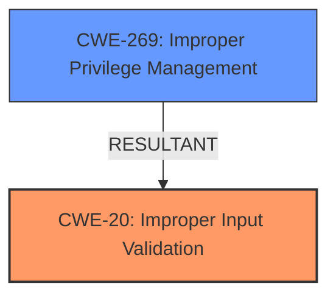

# Raw Analyzer Response for CVE-2021-31372

# Summary

| CWE ID  | CWE Name                                                                  | Confidence | CWE Abstraction Level | CWE Vulnerability Mapping Label | CWE-Vulnerability Mapping Notes |
| :------- | :------------------------------------------------------------------------ | :--------- | :---------------------- | :------------------------------ | :------------------------------ |
| CWE-20   | Improper Input Validation                                                 | 0.9        | Class                   | Primary                         | Allowed                       |
| CWE-269  | Improper Privilege Management                                             | 0.5        | Class                   | Secondary                       | Discouraged                     |

## Evidence and Confidence

*   **Confidence Score:** 0.7
*   **Evidence Strength:** MEDIUM

## Relationship Analysis

The primary relationship influencing the CWE selection is the parent-child relationship where CWE-20 **Improper Input Validation** is a child of higher-level categories and is often a root cause. Although CWE-269 **Improper Privilege Management** is present as an impact, it is being flagged as secondary. The vulnerability starts with **improper input validation** (CWE-20) which then leads to the attacker being able to escalate their privileges (CWE-269).

## Vulnerability Chain

The chain of events starts with **Improper Input Validation** (CWE-20), which allows a locally authenticated attacker to escalate their privileges to root (CWE-269).

## Summary of Analysis

The initial assessment identified **Improper Input Validation** as the root cause, leading to privilege escalation. The analysis is based on the vulnerability description, which states "**Improper Input Validation** vulnerability in J-Web of Juniper Networks Junos OS allows a locally authenticated J-Web attacker to escalate their privileges to root over the target device." This statement directly identifies the root cause as **improper input validation** and the impact as privilege escalation.

The graph relationships highlight that **improper input validation** can lead to other weaknesses and is often a root cause.

CWE-20 is at the Class level, which is the most appropriate level of specificity given the information available. The description clearly indicates a failure to validate input, making CWE-20 the most accurate choice. Other CWEs were considered but deemed less appropriate because they represent either more specific scenarios not directly supported by the evidence (e.g., specific types of input validation failures) or higher-level categories that lack the necessary detail.

Relevant CWE Information:

# Enhanced Context (25 CWEs)

## CWE-664: Improper Control of a Resource Through its Lifetime
**Abstraction Level**: Pillar
**Similarity Score**: 0.77
**Source**: dense
**Description**: The product does not maintain or incorrectly maintains control over a resource throughout its lifetime of creation, use, and release.
**Mapping Guidance**:
- Usage: Discouraged
- Rationale: This CWE entry is high-level when lower-level children are available.
This is too broad.

## CWE-653: Improper Isolation or Compartmentalization
**Abstraction Level**: Class
**Similarity Score**: 0.76
**Source**: dense
**Description**: The product does not properly compartmentalize or isolate functionality, processes, or resources that require different privilege levels, rights, or permissions.
**Mapping Guidance**:
- Usage: Allowed
- Rationale: This CWE entry is at the Base level of abstraction, which is a preferred level of abstraction for mapping to the root causes of vulnerabilities.
The description does not suggest a failure of compartmentalization.

## CWE-404: Improper Resource Shutdown or Release
**Abstraction Level**: Class
**Similarity Score**: 0.76
**Source**: dense
**Description**: The product does not release or incorrectly releases a resource before it is made available for re-use.
**Mapping Guidance**:
- Usage: Allowed-with-Review
- Rationale: This CWE entry is a Class and might have Base-level children that would be more appropriate
This is not related to resource shutdown or release.

## CWE-226: Sensitive Information in Resource Not Removed Before Reuse
**Abstraction Level**: Base
**Similarity Score**: 0.75
**Source**: dense
**Description**: The product releases a resource such as memory or a file so that it can be made available for reuse, but it does not clear or "zeroize" the information contained in the resource before the product performs a critical state transition or makes the resource available for reuse by other entities.
**Mapping Guidance**:
- Usage: Allowed
- Rationale: This CWE entry is at the Base level of abstraction, which is a preferred level of abstraction for mapping to the root causes of vulnerabilities.
This is not about sensitive information exposure.

## CWE-1250: Improper Preservation of Consistency Between Independent Representations of Shared State
**Abstraction Level**: Base
**Similarity Score**: 0.75
**Source**: dense
**Description**: The product has or supports multiple distributed components or sub-systems that are each required to keep their own local copy of shared data - such as state or cache - but the product does not ensure that all local copies remain consistent with each other.
**Mapping Guidance**:
- Usage: Allowed
- Rationale: This CWE entry is at the Base level of abstraction, which is a preferred level of abstraction for mapping to the root causes of vulnerabilities.
This is not relevant to consistency issues.

## CWE-274: Improper Handling of Insufficient Privileges
**Abstraction Level**: Base
**Similarity Score**: 0.75
**Source**: dense
**Description**: The product does not handle or incorrectly handles when it has insufficient privileges to perform an operation, leading to resultant weaknesses.
**Mapping Guidance**:
- Usage: Discouraged
- Rationale: This CWE entry could be deprecated in a future version of CWE.
The description says the **improper input validation** leads to escalation of privileges, so it starts with a user that doesn't have privileges.

## CWE-691: Insufficient Control Flow Management
**Abstraction Level**: Pillar
**Similarity Score**: 0.75
**Source**: dense
**Description**: The code does not sufficiently manage its control flow during execution, creating conditions in which the control flow can be modified in unexpected ways.
**Mapping Guidance**:
- Usage: Discouraged
- Rationale: This CWE entry is extremely high-level, a Pillar. However, classification research is limited for weaknesses of this type, so there can be gaps or organizational difficulties within CWE that force use of this weakness, even at such a high level of abstraction.
This is too broad.

## CWE-668: Exposure of Resource to Wrong Sphere
**Abstraction Level**: Class
**Similarity Score**: 0.75
**Source**: dense
**Description**: The product exposes a resource to the wrong control sphere, providing unintended actors with inappropriate access to the resource.
**Mapping Guidance**:
- Usage: Discouraged
- Rationale: CWE-668 is high-level and is often misused as a catch-all when lower-level CWE IDs might be applicable. It is sometimes used for low-information vulnerability reports [REF-1287]. It is a level-1 Class (i.e., a child of a Pillar). It is not useful for trend analysis.
This is too broad and related to resource exposure.

## CWE-667: Improper Locking
**Abstraction Level**: Class
**Similarity Score**: 0.74
**Source**: dense
**Description**: The product does not properly acquire or release a lock on a resource, leading to unexpected resource state changes and behaviors.
**Mapping Guidance**:
- Usage: Allowed-with-Review
- Rationale: This CWE entry is a Class and might have Base-level children that would be more appropriate
This is not related to locking issues.

## CWE-754: Improper Check for Unusual or Exceptional Conditions
**Abstraction Level**: Class
**Similarity Score**: 0.74
**Source**: dense
**Description**: The product does not check or incorrectly checks for unusual or exceptional conditions that are not expected to occur frequently during day to day operation of the product.
**Mapping Guidance**:
- Usage: Allowed-with-Review
- Rationale: This CWE entry is a Class and might have Base-level children that would be more appropriate
This is not about unusual conditions.

## CWE-754: Improper Check for Unusual or Exceptional Conditions
**Abstraction Level**: Class
**Similarity Score**: 5931.37
**Source**: sparse
**Description**: The product does not check or incorrectly checks for unusual or exceptional conditions that are not expected to occur frequently during day to day operation of the product.
**Mapping Guidance**:
- Usage: Allowed-with-Review
- Rationale: This CWE entry is a Class and might have Base-level children that would be more appropriate
This is not about unusual conditions.

## CWE-1250: Improper Preservation of Consistency Between Independent Representations of Shared State
**Abstraction Level**: Base
**Similarity Score**: 5783