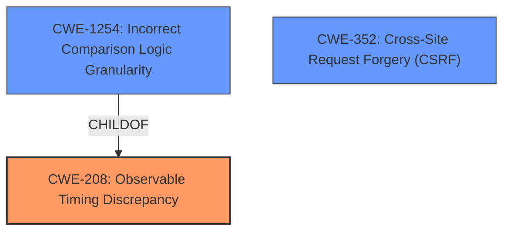

# Analysis for CVE-2021-31403

# Summary
| CWE ID    | CWE Name                                                                  | Confidence | CWE Abstraction Level | CWE Vulnerability Mapping Label | CWE-Vulnerability Mapping Notes |
| :-------- | :------------------------------------------------------------------------ | :--------- | :-------------------- | :------------------------------ | :------------------------------ |
| CWE-208   | Observable Timing Discrepancy                                             | 1.0        | Base                  | Primary CWE                     | Allowed                       |
| CWE-1254  | Incorrect Comparison Logic Granularity                                    | 0.8        | Base                  | Secondary Candidate             | Allowed                       |
| CWE-352   | Cross-Site Request Forgery (CSRF)                                       | 0.5        | Compound              | Secondary Candidate             | Allowed                       |

## Evidence and Confidence

*   **Confidence Score:** 0.9
*   **Evidence Strength:** HIGH

## Relationship Analysis
The primary CWE selected is CWE-208 **Observable Timing Discrepancy**, which directly addresses the **non-constant-time comparison** of CSRF tokens. CWE-1254 **Incorrect Comparison Logic Granularity** is a child of CWE-208 and represents a finer-grained explanation of the timing discrepancy. However, the description of the vulnerability focuses on the observable timing difference rather than the specifics of the comparison logic itself. CWE-352 **Cross-Site Request Forgery (CSRF)** is related, but the core issue is the timing side channel that allows an attacker to guess the CSRF token, not necessarily the absence of CSRF protection.

## Vulnerability Chain
The vulnerability chain starts with the **non-constant-time comparison** of CSRF tokens (CWE-208), leading to an **observable timing discrepancy**. This allows an attacker to **guess a security token**, ultimately potentially leading to Cross-Site Request Forgery (CWE-352) if the attacker successfully uses the guessed token to perform actions on behalf of a legitimate user.

## Summary of Analysis
The initial analysis identified CWE-208 **Observable Timing Discrepancy** as the most appropriate primary CWE based on the **root cause** "**Non-constant-time comparison of CSRF tokens**" and the resulting ability for an "**attacker to guess a security token via timing attack**". This is directly supported by the Vulnerability Description Key Phrases and CVE Reference Links Content Summary. The Retriever Results also ranked CWE-208 with the highest similarity score.

The analysis also considered CWE-1254 **Incorrect Comparison Logic Granularity**, which is a child of CWE-208. While relevant, CWE-1254 focuses on the granularity of the comparison logic, which is not the primary focus of the vulnerability description. The description emphasizes the observable timing difference, making CWE-208 a more accurate representation of the vulnerability.

CWE-352 **Cross-Site Request Forgery (CSRF)** was also considered. However, the core weakness is the timing side channel that allows an attacker to obtain a valid CSRF token. While a successful attack could lead to CSRF, the root cause is the timing discrepancy.

The final decision to select CWE-208 as the primary CWE is based on the evidence from the vulnerability description, the retriever results, and the CWE specifications. CWE-208 is at the Base level of abstraction, which is preferred, and accurately represents the **root cause** of the vulnerability. The MITRE mapping guidance supports the use of CWE-208 in this context.

Other CWEs considered but not used:

*   CWE-79 **Improper Neutralization of Input During Web Page Generation ('Cross-site Scripting')**: Not applicable as the vulnerability is not related to XSS.
*   CWE-22 **Improper Limitation of a Pathname to a Restricted Directory ('Path Traversal')**: Not applicable as the vulnerability is not related to path traversal.
*   CWE-73 **External Control of File Name or Path**: Not applicable as the vulnerability is not related to file path manipulation.
*   CWE-613 **Insufficient Session Expiration**: While related to session management, the primary issue is the timing attack on CSRF tokens, not session expiration.

Relevant CWE Information:

# Enhanced Context (25 CWEs)
The following CWEs were identified as potentially relevant to this vulnerability:

## CWE-208: Observable Timing Discrepancy
**Abstraction Level**: Base
**Similarity Score**: 0.74
**Source**: dense

**Description**:
Two separate operations in a product require different amounts of time to complete, in a way that is observable to an actor and reveals security-relevant information about the state of the product, such as whether a particular operation was successful or not.

**Mapping Guidance**:
- Usage: Allowed
- Rationale: This CWE entry is at the Base level of abstraction, which is a preferred level of abstraction for mapping to the root causes of vulnerabilities.

## CWE-1254: Incorrect Comparison Logic Granularity
**Abstraction Level**: Base
**Similarity Score**: 5864.52
**Source**: sparse

**Description**:
The product's comparison logic is performed over a series of steps rather than across the entire string in one operation. If there is a comparison logic failure on one of these steps, the operation may be vulnerable to a timing attack that can result in the interception of the process for nefarious purposes.

**Mapping Guidance**:
- Usage: Allowed
- Rationale: This CWE entry is at the Base level of abstraction, which is a preferred level of abstraction for mapping to the root causes of vulnerabilities.

## CWE-352: Cross-Site Request Forgery (CSRF)
**Abstraction Level**: Compound
**Status:** Stable

**Description**:
The web application does not, or can not, sufficiently verify whether a well-formed, valid, consistent request was intentionally provided by the user who submitted the request.

**Mapping Guidance**:
- Usage: Allowed
- Rationale: This is a well-known Composite of multiple weaknesses that must all occur simultaneously, although it is attack-oriented in nature.

# Enhanced Query for CVE-2021-31403

## Vulnerability Description
**Non-constant-time comparison of CSRF tokens** in UIDL request handler in com.vaadinvaadin-server versions 7.0.0 through 7.7.23 (Vaadin 7.0.0 through 7.7.23), and 8.0.0 through 8.12.2 (Vaadin 8.0.0 through 8.12.2) allows attacker to guess a security token via timing attack

### Vulnerability Description Key Phrases
- **rootcause:** **Non-constant-time comparison of CSRF tokens**
- **impact:** guess a security token
- **vector:** timing attack
- **attacker:** attacker
- **product:** com.vaadinvaadin-server
- **version:** 7.0.0 through 7.7.23, and 8.0.0 through 8.12.2
- **component:** UIDL request handler

## CVE Reference Links Content Summary
Based on the provided content, here's an analysis of CVE-2021-31403:

**Root Cause of Vulnerability:**

*   The vulnerability stems from the use of non-constant-time comparison of CSRF tokens within the UIDL request handler in Vaadin server. This means the time taken to compare tokens varied depending on how many characters of the provided token matched the expected token.

**Weaknesses/Vulnerabilities Present:**

*   **Timing Side Channel:** The primary weakness is a timing side-channel vulnerability. An attacker can observe the time it takes for the server to reject requests with invalid CSRF tokens. This timing difference can leak information about the validity of the token, as character-by-character comparison terminates early if a mismatch occurs.
*   **Non-constant time comparison:** Using a non-constant time comparison algorithm for the CSRF tokens made it possible for an attacker to determine if the provided token was correct by the time taken to reject the request.

**Impact of Exploitation:**

*   **CSRF Token Exposure:**  An attacker can potentially guess a user's CSRF token by repeatedly sending requests with slightly modified tokens and measuring the server's response time, as longer rejection times could indicate more matching characters, thus allowing them to eventually identify valid tokens.
*   **Unauthorized Actions:** By obtaining the CSRF token, the attacker can then craft malicious requests to the server on behalf of the user, potentially performing unauthorized actions without the user's explicit consent.
*   **Blind Data Submission:** The attacker can submit data on the user's behalf, although they may not be able to read the responses.
*   **Websocket Exploitation:** The attacker can potentially open websockets and listen for data published by the server for the compromised user, which might contain sensitive information based on the application logic.

**Attack Vectors:**

*   **Network-based Timing Attacks:**  The attack vector is primarily network-based, involving sending crafted requests to the server and measuring the response times.

**Required Attacker Capabilities/Position:**

*   **Network Access:** The attacker needs to be able to send HTTP requests to the vulnerable Vaadin application.
*   **Timing Measurement:** The attacker needs the capability to accurately measure the time it takes for the server to respond to the crafted requests.
*   **No User Interaction Required:** The attack does not require any user interaction.
*   **No prior knowledge of a valid token**: The attacker only needs to be able to observe the timing difference for each request to be able to guess the valid token character by character.

**Additional Notes:**

*   The vulnerability affects Vaadin server versions 7.0.0 through 7.7.23 and 8.0.0 through 8.12.2.
*   The fix involves implementing constant-time comparison for all security tokens to prevent these timing attacks.
*   The vulnerability is also applicable to upload security keys and push IDs.

The provided information is more detailed than the official CVE description which just mentions the "non-constant-time comparison".

## Retriever Results

### Top Combined Results

| Rank | CWE ID | Name | Abstraction | Usage  | Retrievers | Individual Scores |
|------|--------|------|-------------|-------|------------|-------------------|
| 1 | 208 | Observable Timing Discrepancy | Base | Allowed | sparse | 0.564 |
| 2 | 1254 | Incorrect Comparison Logic Granularity | Base | Allowed | sparse | 0.327 |
| 3 | 613 | Insufficient Session Expiration | Base | Allowed | sparse | 0.300 |
| 4 | 1333 | Inefficient Regular Expression Complexity | Base | Allowed | sparse | 0.285 |
| 5 | 522 | Insufficiently Protected Credentials | Class | Allowed-with-Review | sparse | 0.281 |
| 6 | 1255 | Comparison Logic is Vulnerable to Power Side-Channel Attacks | Variant | Allowed | dense | 0.485 |
| 7 | 385 | Covert Timing Channel | Base | Allowed | graph | 0.002 |
| 8 | 23 | Relative Path Traversal | Base | Allowed | sparse | 0.279 |
| 9 | 201 | Insertion of Sensitive Information Into Sent Data | Base | Allowed | sparse | 0.279 |
| 10 | 352 | Cross-Site Request Forgery (CSRF) | Compound | Allowed | sparse | 0.269 |

# Complete CWE Specifications

## CWE-208: Observable Timing Discrepancy
**Abstraction:** Base
**Status:** Incomplete

### Description
Two separate operations in a product require different amounts of time to complete, in a way that is observable to an actor and reveals security-relevant information about the state of the product, such as whether a particular operation was successful or not.

### Extended Description
In security-relevant contexts, even small variations in timing can be exploited by attackers to indirectly infer certain details about the product's internal operations. For example, in some cryptographic algorithms, attackers can use timing differences to infer certain properties about a private key, making the key easier to guess. Timing discrepancies effectively form a timing side channel.

### Alternative Terms
None

### Relationships
ChildOf -> CWE-203
CanPrecede -> CWE-385
CanPrecede -> CWE-327

### Mapping Guidance
**Usage:** Allowed
**Rationale:** This CWE entry is at the Base level of abstraction, which is a preferred level of abstraction for mapping to the root causes of vulnerabilities.
**Comments:** Carefully read both the name and description to ensure that this mapping is an appropriate fit. Do not try to 'force' a mapping to a lower-level Base/Variant simply to comply with this preferred level of abstraction.
**Reasons:**
- Acceptable-Use

### Additional Notes
**[Relationship]** Often primary in cryptographic applications and algorithms.

**[Maintenance]** CWE 4.16 removed a demonstrative example for a hardware module because it was inaccurate and unable to be adapted. The CWE team is developing an alternative.

### Observed Examples
- **CVE-2019-10071:** Java-oriented framework compares HMAC signatures using String.equals() instead of a constant-time algorithm, causing timing discrepancies
- **CVE-2019-10482:** Smartphone OS uses comparison functions that are not in constant time, allowing side channels
- **CVE-2014-0984:** Password-checking function in router terminates validation of a password entry when it encounters the first incorrect character, which allows remote attackers to obtain passwords via a brute-force attack that relies on timing differences in responses to incorrect password guesses, aka a timing side-channel attack.

## CWE-1254: Incorrect Comparison Logic Granularity
**Abstraction:** Base
**Status:** Draft

### Description
The product's comparison logic is performed over a series of steps rather than across the entire string in one operation. If there is a comparison logic failure on one of these steps, the operation may be vulnerable to a timing attack that can result in the interception of the process for nefarious purposes.

### Extended Description

Comparison logic is used to compare a variety of objects including passwords, Message Authentication Codes (MACs), and responses to verification challenges. When comparison logic is implemented at a finer granularity (e.g., byte-by-byte comparison) and breaks in the case of a comparison failure, an attacker can exploit this implementation to identify when exactly the failure occurred. With multiple attempts, the attacker may be able to guesses the correct password/response to challenge and elevate their privileges.

### Alternative Terms
None

### Relationships
ChildOf -> CWE-208
ChildOf -> CWE-697

### Mapping Guidance
**Usage:** Allowed
**Rationale:** This CWE entry is at the Base level of abstraction, which is a preferred level of abstraction for mapping to the root causes of vulnerabilities.
**Comments:** Carefully read both the name and description to ensure that this mapping is an appropriate fit. Do not try to 'force' a mapping to a lower-level Base/Variant simply to comply with this preferred level of abstraction.
**Reasons:**
- Acceptable-Use

### Additional Notes
**[Maintenance]** CWE 4.16 removed a demonstrative example for a hardware module because it was inaccurate and unable to be adapted. The CWE team is developing an alternative.

### Observed Examples
- **CVE-2019-10482:** Smartphone OS uses comparison functions that are not in constant time, allowing side channels
- **CVE-2019-10071:** Java-oriented framework compares HMAC signatures using String.equals() instead of a constant-time algorithm, causing timing discrepancies
- **CVE-2014-0984:** Password-checking function in router terminates validation of a password entry when it encounters the first incorrect character, which allows remote attackers to obtain passwords via a brute-force attack that relies on timing differences in responses to incorrect password guesses, aka a timing side-channel attack.

## CWE-613: Insufficient Session Expiration
**Abstraction:** Base
**Status:** Incomplete

### Description
According to WASC, "Insufficient Session Expiration is when a web site permits an attacker to reuse old session credentials or session IDs for authorization."

### Extended Description
Not provided

### Alternative Terms
None

### Relationships
ChildOf -> CWE-672
ChildOf -> CWE-672
CanPrecede -> CWE-287

### Mapping Guidance
**Usage:** Allowed
**Rationale:** This CWE entry is at the Base level of abstraction, which is a preferred level of abstraction for mapping to the root causes of vulnerabilities.
**Comments:** Carefully read both the name and description to ensure that this mapping is an appropriate fit. Do not try to 'force' a mapping to a lower-level Base/Variant simply to comply with this preferred level of abstraction.
**Reasons:**
- Acceptable-Use

### Additional Notes
**[Other]** The lack of proper session expiration may improve the likely success of certain attacks. For example, an attacker may intercept a session ID, possibly via a network sniffer or Cross-site Scripting attack. Although short session expiration times do not help if a stolen token is immediately used, they will protect against ongoing replaying of the session ID. In another scenario, a user might access a web site from a shared computer (such as at a library, Internet cafe, or open work environment). Insufficient Session Expiration could allow an attacker to use the browser's back button to access web pages previously accessed by the victim.

## CWE-1333: Inefficient Regular Expression Complexity
**Abstraction:** Base
**Status:** Draft

### Description
The product uses a regular expression with an inefficient, possibly exponential worst-case computational complexity that consumes excessive CPU cycles.

### Extended Description
Some regular expression engines have a feature called "backtracking". If the token cannot match, the engine "backtracks" to a position that may result in a different token that can match.
 Backtracking becomes a weakness if all of these conditions are met:

  - The number of possible backtracking attempts are exponential relative to the length of the input.

  - The input can fail to match the regular expression.

  - The input can be long enough.

 Attackers can create crafted inputs that intentionally cause the regular expression to use excessive backtracking in a way that causes the CPU consumption to spike. 

### Alternative Terms
ReDoS: ReDoS is an abbreviation of "Regular expression Denial of Service".
Regular Expression Denial of Service: While this term is attack-focused, this is commonly used to describe the weakness.
Catastrophic backtracking: This term is used to describe the behavior of the regular expression as a negative technical impact.

### Relationships
ChildOf -> CWE-407
ChildOf -> CWE-407

### Mapping Guidance
**Usage:** Allowed
**Rationale:** This CWE entry is at the Base level of abstraction, which is a preferred level of abstraction for mapping to the root causes of vulnerabilities.
**Comments:** Carefully read both the name and description to ensure that this mapping is an appropriate fit. Do not try to 'force' a mapping to a lower-level Base/Variant simply to comply with this preferred level of abstraction.
**Reasons:**
- Acceptable-Use

### Observed Examples
- **CVE-2020-5243:** server allows ReDOS with crafted User-Agent strings, due to overlapping capture groups that cause excessive backtracking.
- **CVE-2021-21317:** npm package for user-agent parser prone to ReDoS due to overlapping capture groups
- **CVE-2019-16215:** Markdown parser uses inefficient regex when processing a message, allowing users to cause CPU consumption and delay preventing processing of other messages.

## CWE-522: Insufficiently Protected Credentials
**Abstraction:** Class
**Status:** Incomplete

### Description
The product transmits or stores authentication credentials, but it uses an insecure method that is susceptible to unauthorized interception and/or retrieval.

### Extended Description
Not provided

### Alternative Terms
None

### Relationships
ChildOf -> CWE-1390
ChildOf -> CWE-287
ChildOf -> CWE-668

### Mapping Guidance
**Usage:** Allowed-with-Review
**Rationale:** This CWE entry is a Class and might have Base-level children that would be more appropriate
**Comments:** Examine children of this entry to see if there is a better fit
**Reasons:**
- Abstraction

### Observed Examples
- **CVE-2022-30018:** A messaging platform serializes all elements of User/Group objects, making private information available to adversaries
- **CVE-2022-29959:** Initialization file contains credentials that can be decoded using a "simple string transformation"
- **CVE-2022-35411:** Python-based RPC framework enables pickle functionality by default, allowing clients to unpickle untrusted data.

## CWE-1255: Comparison Logic is Vulnerable to Power Side-Channel Attacks
**Abstraction:** Variant
**Status:** Draft

### Description
A device's real time power consumption may be monitored during security token evaluation and the information gleaned may be used to determine the value of the reference token.

### Extended Description

The power consumed by a device may be instrumented and monitored in real time. If the algorithm for evaluating security tokens is not sufficiently robust, the power consumption may vary by token entry comparison against the reference value. Further, if retries are unlimited, the power difference between a "good" entry and a "bad" entry may be observed and used to determine whether each entry itself is correct thereby allowing unauthorized parties to calculate the reference value.

### Alternative Terms
None

### Relationships
ChildOf -> CWE-1300
PeerOf -> CWE-1259

### Mapping Guidance
**Usage:** Allowed
**Rationale:** This CWE entry is at the Variant level of abstraction, which is a preferred level of abstraction for mapping to the root causes of vulnerabilities.
**Comments:** Carefully read both the name and description to ensure that this mapping is an appropriate fit. Do not try to 'force' a mapping to a lower-level Base/Variant simply to comply with this preferred level of abstraction.
**Reasons:**
- Acceptable-Use

### Observed Examples
- **CVE-2020-12788:** CMAC verification vulnerable to timing and power attacks.

## CWE-385: Covert Timing Channel
**Abstraction:** Base
**Status:** Incomplete

### Description
Covert timing channels convey information by modulating some aspect of system behavior over time, so that the program receiving the information can observe system behavior and infer protected information.

### Extended Description

In some instances, knowing when data is transmitted between parties can provide a malicious user with privileged information. Also, externally monitoring the timing of operations can potentially reveal sensitive data. For example, a cryptographic operation can expose its internal state if the time it takes to perform the operation varies, based on the state.

Covert channels are frequently classified as either storage or timing channels. Some examples of covert timing channels are the system's paging rate, the time a certain transaction requires to execute, and the time it takes to gain access to a shared bus.

### Alternative Terms
None

### Relationships
ChildOf -> CWE-514

### Mapping Guidance
**Usage:** Allowed
**Rationale:** This CWE entry is at the Base level of abstraction, which is a preferred level of abstraction for mapping to the root causes of vulnerabilities.
**Comments:** Carefully read both the name and description to ensure that this mapping is an appropriate fit. Do not try to 'force' a mapping to a lower-level Base/Variant simply to comply with this preferred level of abstraction.
**Reasons:**
- Acceptable-Use

### Additional Notes
**[Maintenance]** As of CWE 4.9, members of the CWE Hardware SIG are working to improve CWE's coverage of transient execution weaknesses, which include issues related to Spectre, Meltdown, and other attacks that create or exploit covert channels. As a result of that work, this entry might change in CWE 4.10.

## CWE-23: Relative Path Traversal
**Abstraction:** Base
**Status:** Draft

### Description
The product uses external input to construct a pathname that should be within a restricted directory, but it does not properly neutralize sequences such as ".." that can resolve to a location that is outside of that directory.

### Extended Description
This allows attackers to traverse the file system to access files or directories that are outside of the restricted directory.

### Alternative Terms
Zip Slip: "Zip slip" is an attack that uses file archives (e.g., ZIP, tar, rar, etc.) that contain filenames with path traversal sequences that cause the files to be written outside of the directory under which the archive is expected to be extracted [REF-1282]. It is most commonly used for relative path traversal (CWE-23) and link following (CWE-59).

### Relationships
ChildOf -> CWE-22
ChildOf -> CWE-22
ChildOf -> CWE-22

### Mapping Guidance
**Usage:** Allowed
**Rationale:** This CWE entry is at the Base level of abstraction, which is a preferred level of abstraction for mapping to the root causes of vulnerabilities.
**Comments:** Carefully read both the name and description to ensure that this mapping is an appropriate fit. Do not try to 'force' a mapping to a lower-level Base/Variant simply to comply with this preferred level of abstraction.
**Reasons:**
- Acceptable-Use

### Observed Examples
- **CVE-2024-37032:** Large language model (LLM) management tool does not validate the format of a digest value (CWE-1287) from a private, untrusted model registry, enabling relative path traversal (CWE-23), a.k.a. Probllama
- **CVE-2022-45918:** Chain: a learning management tool debugger uses external input to locate previous session logs (CWE-73) and does not properly validate the given path (CWE-20), allowing for filesystem path traversal using "../" sequences (CWE-24)
- **CVE-2019-20916:** Python package manager does not correctly restrict the filename specified in a Content-Disposition header, allowing arbitrary file read using path traversal sequences such as "../"

## CWE-201: Insertion of Sensitive Information Into Sent Data
**Abstraction:** Base
**Status:** Draft

### Description
The code transmits data to another actor, but a portion of the data includes sensitive information that should not be accessible to that actor.

### Extended Description
Not provided

### Alternative Terms
None

### Relationships
ChildOf -> CWE-200
CanAlsoBe -> CWE-209
CanAlsoBe -> CWE-202

### Mapping Guidance
**Usage:** Allowed
**Rationale:** This CWE entry is at the Base level of abstraction, which is a preferred level of abstraction for mapping to the root causes of vulnerabilities.
**Comments:** Carefully read both the name and description to ensure that this mapping is an appropriate fit. Do not try to 'force' a mapping to a lower-level Base/Variant simply to comply with this preferred level of abstraction.
**Reasons:**
- Acceptable-Use

### Additional Notes
**[Other]** Sensitive information could include data that is sensitive in and of itself (such as credentials or private messages), or otherwise useful in the further exploitation of the system (such as internal file system structure).

### Observed Examples
- **CVE-2022-0708:** Collaboration platform does not clear team emails in a response, allowing leak of email addresses

## CWE-352: Cross-Site Request Forgery (CSRF)
**Abstraction:** Compound
**Status:** Stable

### Description
The web application does not, or can not, sufficiently verify whether a well-formed, valid, consistent request was intentionally provided by the user who submitted the request.

### Extended Description
When a web server is designed to receive a request from a client without any mechanism for verifying that it was intentionally sent, then it might be possible for an attacker to trick a client into making an unintentional request to the web server which will be treated as an authentic request. This can be done via a URL, image load, XMLHttpRequest, etc. and can result in exposure of data or unintended code execution.

### Alternative Terms
Session Riding
Cross Site Reference Forgery
XSRF

### Relationships
ChildOf -> CWE-345
ChildOf -> CWE-345
Requires -> CWE-346
Requires -> CWE-441
Requires -> CWE-642
Requires -> CWE-613

### Mapping Guidance
**Usage:** Allowed
**Rationale:** This is a well-known Composite of multiple weaknesses that must all occur simultaneously, although it is attack-oriented in nature.
**Comments:** While attack-oriented composites are supported in CWE, they have not been a focus of research. There is a chance that future research or CWE scope clarifications will change or deprecate them. Perform root-cause analysis to determine if other weaknesses allow CSRF attacks to occur, and map to those weaknesses. For example, predictable CSRF tokens might allow bypass of CSRF protection mechanisms; if this occurs, they might be better characterized as randomness/predictability weaknesses.
**Reasons:**
- Other

### Additional Notes
**[Relationship]** 

There can be a close relationship between XSS and CSRF (CWE-352). An attacker might use CSRF in order to trick the victim into submitting requests to the server in which the requests contain an XSS payload. A well-known example of this was the Samy worm on MySpace [REF-956]. The worm used XSS to insert malicious HTML sequences into a user's profile and add the attacker as a MySpace friend. MySpace friends of that victim would then execute the payload to modify their own profiles, causing the worm to propagate exponentially. Since the victims did not intentionally insert the malicious script themselves, CSRF was a root cause.

**[Theoretical]** 

The CSRF topology is multi-channel:

  - Attacker (as outsider) to intermediary (as user). The interaction point is either an external or internal channel.

  - Intermediary (as user) to server (as victim). The activation point is an internal channel.

### Observed Examples
- **CVE-2004-1703:** Add user accounts via a URL in an img tag
- **CVE-2004-1995:** Add user accounts via a URL in an img tag
- **CVE-2004-1967:** Arbitrary code execution by specifying the code in a crafted img tag or URL

