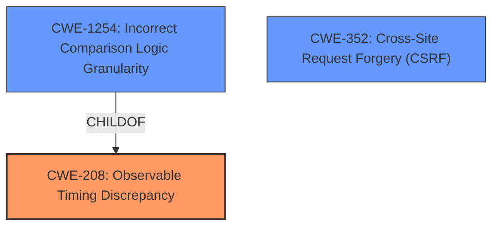

# Analysis Report for CVE-2021-31403

# Vulnerability Analysis Report: CVE-2021-31403

## Description


## Analysis (with Relationship Data)

# Summary
| CWE ID    | CWE Name                                                                  | Confidence | CWE Abstraction Level | CWE Vulnerability Mapping Label | CWE-Vulnerability Mapping Notes |
| :-------- | :------------------------------------------------------------------------ | :--------- | :-------------------- | :------------------------------ | :------------------------------ |
| CWE-208   | Observable Timing Discrepancy                                             | 1.0        | Base                  | Primary CWE                     | Allowed                       |
| CWE-1254  | Incorrect Comparison Logic Granularity                                    | 0.8        | Base                  | Secondary Candidate             | Allowed                       |
| CWE-352   | Cross-Site Request Forgery (CSRF)                                       | 0.5        | Compound              | Secondary Candidate             | Allowed                       |

## Evidence and Confidence

*   **Confidence Score:** 0.9
*   **Evidence Strength:** HIGH

## Relationship Analysis
The primary CWE selected is CWE-208 **Observable Timing Discrepancy**, which directly addresses the **non-constant-time comparison** of CSRF tokens. CWE-1254 **Incorrect Comparison Logic Granularity** is a child of CWE-208 and represents a finer-grained explanation of the timing discrepancy. However, the description of the vulnerability focuses on the observable timing difference rather than the specifics of the comparison logic itself. CWE-352 **Cross-Site Request Forgery (CSRF)** is related, but the core issue is the timing side channel that allows an attacker to guess the CSRF token, not necessarily the absence of CSRF protection.



## Vulnerability Chain
The vulnerability chain starts with the **non-constant-time comparison** of CSRF tokens (CWE-208), leading to an **observable timing discrepancy**. This allows an attacker to **guess a security token**, ultimately potentially leading to Cross-Site Request Forgery (CWE-352) if the attacker successfully uses the guessed token to perform actions on behalf of a legitimate user.

## Summary of Analysis
The initial analysis identified CWE-208 **Observable Timing Discrepancy** as the most appropriate primary CWE based on the **root cause** "**Non-constant-time comparison of CSRF tokens**" and the resulting ability for an "**attacker to guess a security token via timing attack**". This is directly supported by the Vulnerability Description Key Phrases and CVE Reference Links Content Summary. The Retriever Results also ranked CWE-208 with the highest similarity score.

The analysis also considered CWE-1254 **Incorrect Comparison Logic Granularity**, which is a child of CWE-208. While relevant, CWE-1254 focuses on the granularity of the comparison logic, which is not the primary focus of the vulnerability description. The description emphasizes the observable timing difference, making CWE-208 a more accurate representation of the vulnerability.

CWE-352 **Cross-Site Request Forgery (CSRF)** was also considered. However, the core weakness is the timing side channel that allows an attacker to obtain a valid CSRF token. While a successful attack could lead to CSRF, the root cause is the timing discrepancy.

The final decision to select CWE-208 as the primary CWE is based on the evidence from the vulnerability description, the retriever results, and the CWE specifications. CWE-208 is at the Base level of abstraction, which is preferred, and accurately represents the **root cause** of the vulnerability. The MITRE mapping guidance supports the use of CWE-208 in this context.

Other CWEs considered but not used:

*   CWE-79 **Improper Neutralization of Input During Web Page Generation ('Cross-site Scripting')**: Not applicable as the vulnerability is not related to XSS.
*   CWE-22 **Improper Limitation of a Pathname to a Restricted Directory ('Path Traversal')**: Not applicable as the vulnerability is not related to path traversal.
*   CWE-73 **External Control of File Name or Path**: Not applicable as the vulnerability is not related to file path manipulation.
*   CWE-613 **Insufficient Session Expiration**: While related to session management, the primary issue is the timing attack on CSRF tokens, not session expiration.

Relevant CWE Information:

# Enhanced Context (25 CWEs)
The following CWEs were identified as potentially relevant to this vulnerability:

## CWE-208: Observable Timing Discrepancy
**Abstraction Level**: Base
**Similarity Score**: 0.74
**Source**: dense

**Description**:
Two separate operations in a product require different amounts of time to complete, in a way that is observable to an actor and reveals security-relevant information about the state of the product, such as whether a particular operation was successful or not.

**Mapping Guidance**:
- Usage: Allowed
- Rationale: This CWE entry is at the Base level of abstraction, which is a preferred level of abstraction for mapping to the root causes of vulnerabilities.

## CWE-1254: Incorrect Comparison Logic Granularity
**Abstraction Level**: Base
**Similarity Score**: 5864.52
**Source**: sparse

**Description**:
The product's comparison logic is performed over a series of steps rather than across the entire string in one operation. If there is a comparison logic failure on one of these steps, the operation may be vulnerable to a timing attack that can result in the interception of the process for nefarious purposes.

**Mapping Guidance**:
- Usage: Allowed
- Rationale: This CWE entry is at the Base level of abstraction, which is a preferred level of abstraction for mapping to the root causes of vulnerabilities.

## CWE-352: Cross-Site Request Forgery (CSRF)
**Abstraction Level**: Compound
**Status:** Stable

**Description**:
The web application does not, or can not, sufficiently verify whether a well-formed, valid, consistent request was intentionally provided by the user who submitted the request.

**Mapping Guidance**:
- Usage: Allowed
- Rationale: This is a well-known Composite of multiple weaknesses that must all occur simultaneously, although it is attack-oriented in nature.


## CWE Relationship Analysis

Current CWEs represent these abstraction levels: .


### Vulnerability Chain Analysis

**Chain starting from CWE-79:**
- 79 (Improper Neutralization of Input During Web Page Generation ('Cross-site Scripting')) - ROOT


**Chain starting from CWE-1254:**
- 1254 (Incorrect Comparison Logic Granularity) - ROOT


### CWE Relationship Diagram

```mermaid
graph TD
    classDef primary fill:#f96,stroke:#333,stroke-width:2px
    classDef secondary fill:#69f,stroke:#333
    classDef tertiary fill:#9e9,stroke:#333
```


*Report generated on 2025-04-02 17:18:59*
