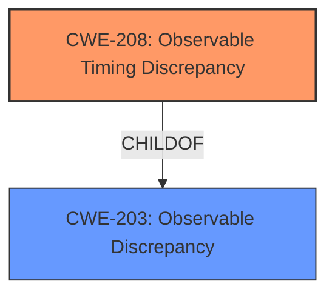

# Analysis for CVE-2021-31404

# Summary
| CWE ID | CWE Name | Confidence | CWE Abstraction Level | CWE Vulnerability Mapping Label | CWE-Vulnerability Mapping Notes |
|---|---|---|---|---|---|
| CWE-208 | Observable Timing Discrepancy | 1 | Base | Allowed | Primary CWE |

## Evidence and Confidence

*   **Confidence Score:** 1
*   **Evidence Strength:** HIGH

## Relationship Analysis
The primary CWE identified is CWE-208 (Observable Timing Discrepancy), which is a Base-level CWE. It is related to CWE-203 (Observable Discrepancy) as its child.

## Vulnerability Chain
The vulnerability chain starts with the **non-constant-time comparison of CSRF tokens**, which leads to an **observable timing discrepancy**, allowing an attacker to **guess a security token**.

## Summary of Analysis
The analysis is primarily based on the provided evidence, especially the **Vulnerability Description Key Phrases** and **CVE Reference Links Content Summary**. The **rootcause** is the **non-constant-time comparison of CSRF tokens**, which directly leads to an **observable timing discrepancy** that can be exploited by attackers to **guess a security token** through timing attacks.

The selection of CWE-208 is based on the following evidence:
- The **Vulnerability Description** explicitly mentions "**Non-constant-time comparison of CSRF tokens**... allows attacker to guess a security token via timing attack."
- The **CVE Reference Links Content Summary** states, "The primary vulnerability is the use of a non-constant time comparison algorithm for CSRF tokens. This allows an attacker to potentially deduce information about the token by observing the time it takes for the server to reject an invalid token." It also explicitly mentions "**Observable Timing Discrepancy (CWE-208)**: This timing discrepancy forms a side channel that can be exploited."
- The **Retriever Results** lists CWE-208 as the top match, with a score of 0.803.
- The description for CWE-208 is "Two separate operations in a product require different amounts of time to complete, in a way that is observable to an actor and reveals security-relevant information about the state of the product, such as whether a particular operation was successful or not." This perfectly matches the vulnerability where the comparison of CSRF tokens takes different amounts of time based on the input, allowing an attacker to infer information.

Other CWEs Considered:

- CWE-1295 (Debug Messages Revealing Unnecessary Information): While potentially relevant as side-channel information, the primary weakness here is the timing discrepancy itself, not the debug messages.
- CWE-613 (Insufficient Session Expiration): Session expiration is not the core issue; it's the timing attack that allows token guessing.
- CWE-1254 (Incorrect Comparison Logic Granularity): Similar to CWE-208, but it more specifically related to comparison logic at a finer granularity. But since we are talking about side channel vulnerabilities, CWE-208 is more appropriate.
- CWE-385 (Covert Timing Channel): While related, CWE-208 is more direct and appropriate. CWE-385 involves conveying information by modulating system behavior over time. While that's happening, CWE-208 is more appropriate for describing the vulnerability.

The selected CWE is at the optimal level of specificity because it directly addresses the **observable timing discrepancy** caused by the **non-constant-time comparison**, which is the root cause of the vulnerability.