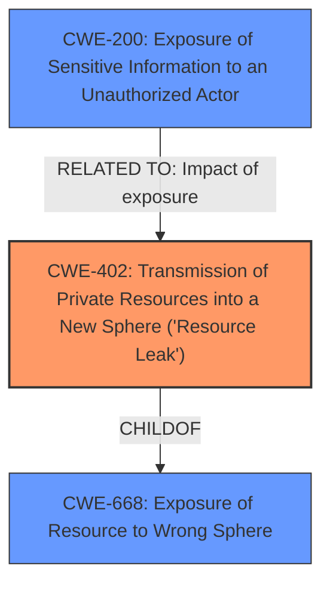

# Enhanced Analysis for CVE-2021-31407

# Summary
| CWE ID | CWE Name | Confidence | CWE Abstraction Level | CWE Vulnerability Mapping Label | CWE-Vulnerability Mapping Notes |
|---|---|---|---|---|---|
| CWE-402 | Transmission of Private Resources into a New Sphere ('Resource Leak') | 0.9 | Class | Allowed-with-Review | Primary CWE |
| CWE-668 | Exposure of Resource to Wrong Sphere | 0.7 | Class | Discouraged | Secondary Candidate |
| CWE-200 | Exposure of Sensitive Information to an Unauthorized Actor | 0.6 | Class | Discouraged | Secondary Candidate |

## Evidence and Confidence

*   **Confidence Score:** 0.8
*   **Evidence Strength:** HIGH

## Relationship Analysis
The primary CWE selected is CWE-402, which is a child of CWE-668. This indicates a hierarchical relationship where CWE-402 is a more specific instance of the broader resource exposure issue described by CWE-668. While CWE-668 could be considered, CWE-402 provides a more precise classification. CWE-200, Exposure of Sensitive Information, is related as it describes the impact of the exposed resources.



## Vulnerability Chain
The vulnerability chain starts with the OSGi integration and how it allows resources within a bundle to be accessible through the ServletContext. Then, the VaadinServlet exposes these ServletContext resources via HTTP without proper restriction. This leads to the exposure of private resources, potentially including class files and sensitive configuration data.

Root Cause: OSGi integration behavior + VaadinServlet resource exposure
Weakness: **Unintended resource exposure** due to **lack of proper restriction** within VaadinServlet when used in an OSGi environment
Impact: **Exposure of sensitive information**, including Java class files and configuration files.

## Summary of Analysis
The analysis is primarily based on the provided CVE Reference Links Content Summary, which clearly outlines the root cause and impact of the vulnerability.

The vulnerability arises from the combination of OSGi's behavior of making all resources accessible through `ServletContext` and VaadinServlet's exposure of these resources via HTTP. This leads to an **unintended resource exposure**, where private resources like Java class files and configuration files become accessible through crafted HTTP requests.

The primary CWE selected is CWE-402, "Transmission of Private Resources into a New Sphere ('Resource Leak')", as it best describes the root cause of the vulnerability: the **exposure of private resources** (application classes and resources) to an unauthorized sphere (attackers). The vulnerability description states that the attacker can "access application classes and resources on the server via crafted HTTP request." The CVE Reference Links Content Summary confirms that "private resources (like Java class files, configuration files, and other sensitive assets) within the application bundle are exposed to the public web, leading to a resource leak." The confidence score is high (0.9) because there is a clear match between the vulnerability description and the CWE description.

CWE-668, "Exposure of Resource to Wrong Sphere," was also considered, as CWE-402 is a child of CWE-668. However, CWE-402 is more specific and accurately captures the resource leak aspect of the vulnerability. Using CWE-668 would be a higher-level, less precise mapping.

CWE-200, "Exposure of Sensitive Information to an Unauthorized Actor," was considered as a potential secondary CWE to represent the impact of the vulnerability, but it is generally discouraged as it's a high-level impact rather than the root cause. The actual weakness is the resource exposure, not the information exposure itself.

The selection of CWE-402 is at the optimal level of specificity, as it directly addresses the root cause of the vulnerability (resource leak) without being overly broad (like CWE-668) or focusing solely on the impact (like CWE-200). The evidence strongly supports this classification, and the relationship analysis confirms that it is the most appropriate CWE for this vulnerability.


## CWE Relationship Analysis

Current CWEs represent these abstraction levels: .


### Vulnerability Chain Analysis

**Chain starting from CWE-402:**
- 402 (Transmission of Private Resources into a New Sphere ('Resource Leak')) - ROOT


**Chain starting from CWE-668:**
- 668 (Exposure of Resource to Wrong Sphere) - ROOT


### CWE Relationship Diagram

```mermaid
graph TD
    classDef primary fill:#f96,stroke:#333,stroke-width:2px
    classDef secondary fill:#69f,stroke:#333
    classDef tertiary fill:#9e9,stroke:#333
```