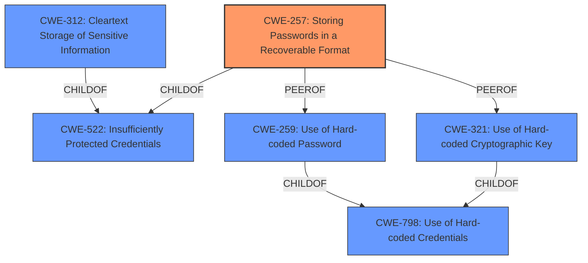

# Raw Analyzer Response for CVE-2021-3141

# Summary
| CWE ID | CWE Name | Confidence | CWE Abstraction Level | CWE Vulnerability Mapping Label | CWE-Vulnerability Mapping Notes |
|---|---|---|---|---|---|
| CWE-257 | Storing Passwords in a Recoverable Format | 1.0 | Base | Allowed | Primary CWE. The **Keycloak password is stored in recoverable format**. |
| CWE-798 | Use of Hard-coded Credentials | 0.6 | Base | Allowed | Secondary CWE. While not explicitly stated as "hard-coded", the **password stored in recoverable format** could imply the use of default credentials. |
| CWE-312 | Cleartext Storage of Sensitive Information | 0.5 | Base | Allowed | Secondary CWE. The vulnerability mentions that the **Keycloak password is stored in a recoverable format** which could mean cleartext storage. |

## Evidence and Confidence

*   **Confidence Score:** 0.8
*   **Evidence Strength:** HIGH

## Relationship Analysis
The primary CWE is CWE-257, which has a parent-child relationship with CWE-522 (Insufficiently Protected Credentials). CWE-257 is also a peer of CWE-259 (Use of Hard-coded Password) and CWE-321 (Use of Hard-coded Cryptographic Key), all of which are related to credential management issues.

## Vulnerability Chain
The vulnerability chain starts with the **root cause** which is the **Keycloak password stored in a recoverable format** (CWE-257). This allows a local attacker to gain access to the Management Server, ultimately leading to the ability to change the Stealth configuration.
  - CWE-257 (Root Cause): Storing Passwords in a Recoverable Format
  - Impact: Gain access to Management Server and change Stealth configuration.

## Summary of Analysis
The initial assessment based on the vulnerability description and key phrases is that the primary weakness is related to storing the Keycloak password in a **recoverable format**. The Retriever Results and Complete CWE Specifications support this assessment, with CWE-257 being the top result.

The evidence from the vulnerability description is: "In Unisys Stealth (core) before 6.0.025.0, the **Keycloak password is stored in a recoverable format** that might be accessible by a local attacker, who could gain access to the Management Server and change the Stealth configuration."

The graph relationships show that CWE-257 is related to other credential management issues like using **hard-coded passwords** (CWE-259, CWE-798) or cryptographic keys (CWE-321). This influenced the decision to also consider CWE-798 as a secondary candidate, though the primary issue remains the **recoverable format**.

CWE-257 is at the Base level of abstraction, which is the preferred level for mapping root causes. It accurately represents the specific weakness of storing passwords in a way that allows them to be recovered, leading to potential unauthorized access.

CWE-312 was also considered, as "recoverable format" could imply that the password is in cleartext.

I am confident in assigning CWE-257 as the primary CWE, with CWE-798 and CWE-312 as secondary considerations. The final selection is based on the provided evidence, relationship analysis, and adherence to mapping guidance.

Relevant CWE Information:
# Enhanced Context (25 CWEs)
The following CWEs were identified as potentially relevant to this vulnerability:

## CWE-1391: Use of Weak Credentials
**Abstraction Level**: Class
**Similarity Score**: 0.80
**Source**: dense

**Description**:
The product uses weak credentials (such as a default key or hard-coded password) that can be calculated, derived, reused, or guessed by an attacker.

**Mapping Guidance**:
- Usage: Allowed-with-Review
- Rationale: This CWE entry is a Class and might have Base-level children that would be more appropriate

## CWE-257: Storing Passwords in a Recoverable Format
**Abstraction Level**: Base
**Similarity Score**: 0.79
**Source**: dense

**Description**:
The storage of passwords in a recoverable format makes them subject to password reuse attacks by malicious users. In fact, it should be noted that recoverable encrypted passwords provide no significant benefit over plaintext passwords since they are subject not only to reuse by malicious attackers but also by malicious insiders. If a system administrator can recover a password directly, or use a brute force search on the available information, the administrator can use the password on other accounts.

**Mapping Guidance**:
- Usage: Allowed
- Rationale: This CWE entry is at the Base level of abstraction, which is a preferred level of abstraction for mapping to the root causes of vulnerabilities.

## CWE-312: Cleartext Storage of Sensitive Information
**Abstraction Level**: Base
**Similarity Score**: 0.78
**Source**: dense

**Description**:
The product stores sensitive information in cleartext within a resource that might be accessible to another control sphere.

**Mapping Guidance**:
- Usage: Allowed
- Rationale: This CWE entry is at the Base level of abstraction, which is a preferred level of abstraction for mapping to the root causes of vulnerabilities.

## CWE-798: Use of Hard-coded Credentials
**Abstraction Level**: Base
**Similarity Score**: 0.78
**Source**: dense

**Description**:
The product contains hard-coded credentials, such as a password or cryptographic key.

**Mapping Guidance**:
- Usage: Allowed
- Rationale: This CWE entry is at the Base level of abstraction, which is a preferred level of abstraction for mapping to the root causes of vulnerabilities.

## CWE-303: Incorrect Implementation of Authentication Algorithm
**Abstraction Level**: Base
**Similarity Score**: 0.77
**Source**: dense

**Description**:
The requirements for the product dictate the use of an established authentication algorithm, but the implementation of the algorithm is incorrect.

**Mapping Guidance**:
- Usage: Allowed
- Rationale: This CWE entry is at the Base level of abstraction, which is a preferred level of abstraction for mapping to the root causes of vulnerabilities.

## CWE-1390: Weak Authentication
**Abstraction Level**: Class
**Similarity Score**: 0.77
**Source**: dense

**Description**:
The product uses an authentication mechanism to restrict access to specific users or identities, but the mechanism does not sufficiently prove that the claimed identity is correct.

**Mapping Guidance**:
- Usage: Allowed-with-Review
- Rationale: This CWE entry is a Class and might have Base-level children that would be more appropriate

## CWE-807: Reliance on Untrusted Inputs in a Security Decision
**Abstraction Level**: Base
**Similarity Score**: 0.77
**Source**: dense

**Description**:
The product uses a protection mechanism that relies on the existence or values of an input, but the input can be modified by an untrusted actor in a way that bypasses the protection mechanism.

**Mapping Guidance**:
- Usage: Allowed
- Rationale: This CWE entry is at the Base level of abstraction, which is a preferred level of abstraction for mapping to the root causes of vulnerabilities.

## CWE-319: Cleartext Transmission of Sensitive Information
**Abstraction Level**: Base
**Similarity Score**: 0.76
**Source**: dense

**Description**:
The product transmits sensitive or security-critical data in cleartext in a communication channel that can be sniffed by unauthorized actors.

**Mapping Guidance**:
- Usage: Allowed
- Rationale: This CWE entry is at the Base level of abstraction, which is a preferred level of abstraction for mapping to the root causes of vulnerabilities.

## CWE-916: Use of Password Hash With Insufficient Computational Effort
**Abstraction Level**: Base
**Similarity Score**: 0.76
**Source