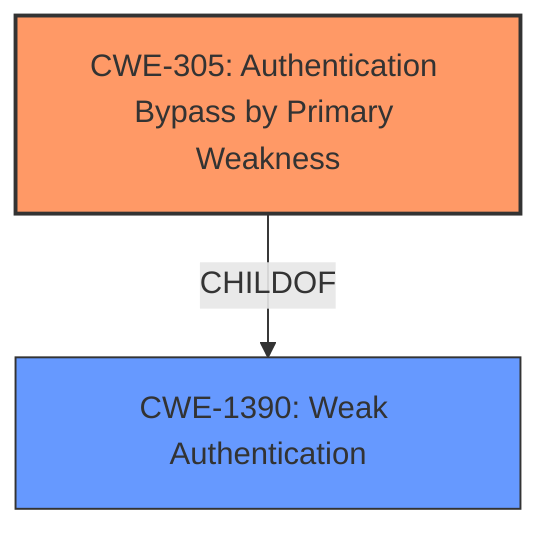

# Raw Analyzer Response for CVE-2021-3145

# Summary
| CWE ID | CWE Name | Confidence | CWE Abstraction Level | CWE Vulnerability Mapping Label | CWE-Vulnerability Mapping Notes |
|---|---|---|---|---|---|
| CWE-305 | Authentication Bypass by Primary Weakness | 0.8 | Base | Allowed | Primary CWE |

## Evidence and Confidence

*   **Confidence Score:** 0.8
*   **Evidence Strength:** MEDIUM

## Relationship Analysis
The primary CWE is CWE-305, which is a base-level CWE. It is related to CWE-1390 (Weak Authentication) as a child. The vulnerability description indicates a bypass of biometric authentication, suggesting that the primary weakness lies in how the authentication mechanism is implemented or configured, allowing for a bypass.

## Vulnerability Chain
The vulnerability chain starts with a **primary weakness** that allows a local root attacker to bypass biometric authentication. The final impact is the **bypass of biometric authentication**, which enables unauthorized access.

## Summary of Analysis
The initial analysis identified several potential CWEs, with CWE-305 (Authentication Bypass by Primary Weakness) and CWE-1390 (Weak Authentication) being strong candidates.

The description "local root attacker on an Android device can **bypass biometric authentication**" indicates that the authentication mechanism itself has a **primary weakness**. This bypass leads directly to the ability to circumvent biometric authentication.

CWE-305 (Authentication Bypass by Primary Weakness) aligns well with this scenario, as it describes a situation where the authentication algorithm is sound, but the implemented mechanism can be bypassed due to a separate, **primary weakness**.

CWE-1390 (Weak Authentication) is a more general class that could also apply, but CWE-305 provides a more precise description of the vulnerability. Therefore, CWE-305 is at the optimal level of specificity.

The evidence directly supports the selection of CWE-305. The vulnerability description indicates a direct bypass, suggesting a **fundamental flaw** in the implementation, not merely a weak algorithm (CWE-1390).

Relevant CWE Information:

# Enhanced Context (25 CWEs)
The following CWEs were identified as potentially relevant to this vulnerability:

## CWE-305: Authentication Bypass by Primary Weakness
**Abstraction Level**: Base
**Similarity Score**: 0.75
**Source**: dense

**Description**:
The authentication algorithm is sound, but the implemented mechanism can be bypassed as the result of a separate weakness that is primary to the authentication error.

**Mapping Guidance**:
- Usage: Allowed
- Rationale: This CWE entry is at the Base level of abstraction, which is a preferred level of abstraction for mapping to the root causes of vulnerabilities.

## CWE-1390: Weak Authentication
**Abstraction Level**: Class
**Similarity Score**: 0.77
**Source**: dense

**Description**:
The product uses an authentication mechanism to restrict access to specific users or identities, but the mechanism does not sufficiently prove that the claimed identity is correct.

**Mapping Guidance**:
- Usage: Allowed-with-Review
- Rationale: This CWE entry is a Class and might have Base-level children that would be more appropriate

### CWEs Considered But Not Used

*   **CWE-306 (Missing Authentication for Critical Function)**: This CWE was not selected because the vulnerability involves bypassing existing authentication, not the absence of it.
*   **CWE-502 (Deserialization of Untrusted Data)**: Deserialization is not mentioned in the vulnerability description.
*   **CWE-267 (Privilege Defined With Unsafe Actions)**: This CWE does not fit the bypass of authentication, which is the core issue.
*   **CWE-290 (Authentication Bypass by Spoofing)**: Spoofing is not mentioned.
*   **CWE-613 (Insufficient Session Expiration)**: Session management is not the focus.
*   **CWE-287 (Improper Authentication)**: This is a broader category, and CWE-305 is more specific.
*   **CWE-732 (Incorrect Permission Assignment for Critical Resource)** and **CWE-863 (Incorrect Authorization)**: These are authorization issues, not authentication bypasses.