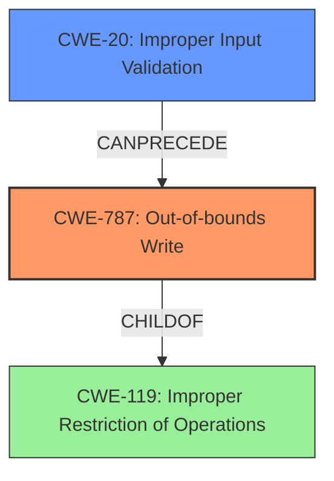

# Analysis for CVE-2021-31472

# Summary
| CWE ID  | CWE Name                      | Confidence | CWE Abstraction Level | CWE Vulnerability Mapping Label | CWE-Vulnerability Mapping Notes |
|---------|-------------------------------|------------|-----------------------|---------------------------------|-----------------------------------|
| CWE-787 | Out-of-bounds Write           | 1.0        | Base                  | Primary                          | Allowed                           |
| CWE-20  | Improper Input Validation     | 0.7        | Class                 | Secondary                        | Discouraged                     |

## Evidence and Confidence

*   **Confidence Score:** 0.9
*   **Evidence Strength:** HIGH

## Relationship Analysis
The primary CWE is CWE-787 (**Out-of-bounds Write**), a **Base** level CWE which is a child of CWE-119 (**Improper Restriction of Operations within the Bounds of a Memory Buffer**). The vulnerability description clearly states a **write past the end of an allocated data structure**, which directly corresponds to CWE-787. CWE-20 (**Improper Input Validation**) is included as a secondary weakness because the root cause is a **lack of proper validation of user-supplied data**. However, CWE-20 is a **Class** level CWE and is often misused when more specific CWEs are available. Therefore, CWE-787 is more descriptive of the actual vulnerability.



## Vulnerability Chain
The vulnerability chain starts with a **lack of proper validation of user-supplied data** (CWE-20), which leads to a **write past the end of an allocated data structure** (CWE-787). This out-of-bounds write allows an attacker to execute arbitrary code.

## Summary of Analysis
The initial analysis correctly identifies the **lack of proper validation of user-supplied data** as a root cause and the **write past the end of an allocated data structure** as a weakness. The analysis concludes that CWE-787 (**Out-of-bounds Write**) is the primary CWE because it accurately describes the vulnerability's technical details. The selection of CWE-787 is further supported by the "CVE Reference Links Content Summary" section that states: "The vulnerability is caused by a lack of proper validation of user-supplied data when handling U3D objects in PDF files, which results in a **write past the end of an allocated data structure**." The "Top CWEs" also lists CWE-787 as a highly relevant CWE. The evidence from the vulnerability description and the retriever results strongly support the choice of CWE-787 as the primary CWE. The analysis also considered CWE-20, which is a parent of CWE-787, and is listed as a secondary CWE.

Relevant CWE Information:

# Enhanced Context (25 CWEs)
The following CWEs were identified as potentially relevant to this vulnerability:

## CWE-131: Incorrect Calculation of Buffer Size
**Abstraction Level**: Base
**Similarity Score**: 0.74
**Source**: dense

**Description**:
The product does not correctly calculate the size to be used when allocating a buffer, which could lead to a buffer overflow.

**Mapping Guidance**:
- Usage: Allowed
- Rationale: This CWE entry is at the Base level of abstraction, which is a preferred level of abstraction for mapping to the root causes of vulnerabilities.

## CWE-805: Buffer Access with Incorrect Length Value
**Abstraction Level**: Base
**Similarity Score**: 0.74
**Source**: dense

**Description**:
The product uses a sequential operation to read or write a buffer, but it uses an incorrect length value that causes it to access memory that is outside of the bounds of the buffer.

**Mapping Guidance**:
- Usage: Allowed
- Rationale: This CWE entry is at the Base level of abstraction, which is a preferred level of abstraction for mapping to the root causes of vulnerabilities.

## CWE-404: Improper Resource Shutdown or Release
**Abstraction Level**: Class
**Similarity Score**: 0.74
**Source**: dense

**Description**:
The product does not release or incorrectly releases a resource before it is made available for re-use.

**Mapping Guidance**:
- Usage: Allowed-with-Review
- Rationale: This CWE entry is a Class and might have Base-level children that would be more appropriate

## CWE-1289: Improper Validation of Unsafe Equivalence in Input
**Abstraction Level**: Base
**Similarity Score**: 0.74
**Source**: dense

**Description**:
The product receives an input value that is used as a resource identifier or other type of reference, but it does not validate or incorrectly validates that the input is equivalent to a potentially-unsafe value.

**Mapping Guidance**:
- Usage: Allowed
- Rationale: This CWE entry is at the Base level of abstraction, which is a preferred level of abstraction for mapping to the root causes of vulnerabilities.

## CWE-653: Improper Isolation or Compartmentalization
**Abstraction Level**: Class
**Similarity Score**: 0.74
**Source**: dense

**Description**:
The product does not properly compartmentalize or isolate functionality, processes, or resources that require different privilege levels, rights, or permissions.

**Mapping Guidance**:
- Usage: Allowed
- Rationale: This CWE entry is at the Base level of abstraction, which is a preferred level of abstraction for mapping to the root causes of vulnerabilities.

## CWE-125: Out-of-bounds Read
**Abstraction Level**: Base
**Similarity Score**: 0.73
**Source**: dense

**Description**:
The product reads data past the end, or before the beginning, of the intended buffer.

**Mapping Guidance**:
- Usage: Allowed
- Rationale: This CWE entry is at the Base level of abstraction, which is a preferred level of abstraction for mapping to the root causes of vulnerabilities.

## CWE-788: Access of Memory Location After End of Buffer
**Abstraction Level**: Base
**Similarity Score**: 0.73
**Source**: dense

**Description**:
The product reads or writes to a buffer using an index or pointer that references a memory location after the end of the buffer.

**Mapping Guidance**:
- Usage: Discouraged
- Rationale: The CWE entry might be misused when lower-level CWE entries might be available. It also overlaps existing CWE entries and might be deprecated in the future.

## CWE-191: Integer Underflow (Wrap or Wraparound)
**Abstraction Level**: Base
**Similarity Score**: 0.73
**Source**: dense

**Description**:
The product subtracts one value from another, such that the result is less than the minimum allowable integer value, which produces a value that is not equal to the correct result.

**Mapping Guidance**:
- Usage: Allowed
- Rationale: This CWE entry is at the Base level of abstraction, which is a preferred level of abstraction for mapping to the root causes of vulnerabilities.

## CWE-124: Buffer Underwrite ('Buffer Underflow')
**Abstraction Level**: Base
**Similarity Score**: 0.73
**Source**: dense

**Description**:
The product writes to a buffer using an index or pointer that references a memory location prior to the beginning of the buffer.

**Mapping Guidance**:
- Usage: Allowed
- Rationale: This CWE entry is at the Base level of abstraction, which is a preferred level of abstraction for mapping to the root causes of vulnerabilities.

## CWE-226: Sensitive Information in Resource Not Removed Before Reuse
**Abstraction Level**: Base
**Similarity Score**: 0.73
**Source**: dense

**Description**:
The product releases a resource such as memory or a file so that it can be made available for reuse, but it does not clear or "zeroize" the information contained in the resource before the product performs a critical state transition or makes the resource available for reuse by other entities.

**Mapping Guidance**:
- Usage: Allowed
- Rationale: This CWE entry is at the Base level of abstraction, which is a preferred level of abstraction for mapping to the root causes of vulnerabilities.

## CWE-125: Out-of-bounds Read
**Abstraction Level**: Base
**Similarity Score**: 7676.67
**Source**: sparse

**Description**:
The product reads data past the end, or before the beginning, of the intended buffer.

**Mapping Guidance**:
- Usage: Allowed
- Rationale: This CWE entry is at the Base level of abstraction, which is a preferred level of abstraction for mapping to the root causes of vulnerabilities.

## CWE-190: Integer Overflow or Wraparound
**Abstraction Level**: Base
**Similarity Score**: 750

# Enhanced Query for CVE-2021-31472

## Vulnerability Description
This vulnerability allows remote attackers to execute arbitrary code on affected installations of Foxit Reader 10.1.1.37576. User interaction is required to exploit this vulnerability in that the target must visit a malicious page or open a malicious file. The specific flaw exists within the handling of U3D objects in PDF files. The issue results from the **lack of proper validation of user-supplied data**, which can result in a **write past the end of an allocated data structure**. An attacker can leverage this vulnerability to execute code in the context of the current process. Was ZDI-CAN-13011.

### Vulnerability Description Key Phrases
- **rootcause:** **lack of proper validation of user-supplied data**
- **weakness:** **write past the end of an allocated data structure**
- **impact:** execute arbitrary code
- **vector:** malicious page or file
- **attacker:** remote attackers
- **product:** Foxit Reader
- **version:** 10.1.1.37576
- **component:** U3D objects in PDF files

### CWE for similar CVE Descriptions
### Primary CWE Match
CWE-125

#### Top CWEs
- CWE-125 (Count: 257)
- CWE-787 (Count: 233)
- CWE-416 (Count: 222)

## CVE Reference Links Content Summary
```
{
  "guid": "CVE-2021-31472",
  "related_cves": [
     "CVE-2024-12751",
     "CVE-2024-12752",
     "CVE-2024-12753",
     "CVE-2024-49576",
     "CVE-2024-47810",
     "CVE-2024-28888",
     "CVE-2024-7725",
     "CVE-2024-9254",
    "CVE-2024-7722",
    "CVE-2024-7723",
    "CVE-2024-7724",
     "CVE-2024-9243",
    "CVE-2024-9246",
    "CVE-2024-9250",
    "CVE-2024-9252",
    "CVE-2024-9253",
    "CVE-2024-9251",
    "CVE-2024-9255",
    "CVE-2024-9256",
    "CVE-2024-9245",
    "CVE-2024-9244",
    "CVE-2024-38393",
    "CVE-2024-48618",
    "CVE-2024-9247",
    "CVE-2024-9249",
    "CVE-2024-9248",
    "CVE-2024-41605",
    "CVE-2024-7722",
      "CVE-2024-25938",
    "CVE-2024-25648",
      "CVE-2024-25575",
    "CVE-2024-30324",
    "CVE-2024-30327",
    "CVE-2024-30328",
    "CVE-2024-30331",
    "CVE-2024-30336",
    "CVE-2024-30342",
    "CVE-2024-30343",
    "CVE-2024-30344",
    "CVE-2024-30345",
    "CVE-2024-30346",
    "CVE-2024-30351",
    "CVE-2024-30357",
    "CVE-2024-30348",
    "CVE-2024-30363",
        "CVE-2024-30361",
    "CVE-2024-30362",
     "CVE-2024-30354",
    "CVE-2024-30365",
    "CVE-2024-30366",
    "CVE-2024-25858",
      "CVE-2024-30322",
      "CVE-2024-30325",
      "CVE-2024-30326",
      "CVE-2024-30329",
      "CVE-2024-30330",
      "CVE-2024-30332",
      "CVE-2024-30333",
      "CVE-2024-30334",
      "CVE-2024-30335",
    "CVE-2024-30337",
      "CVE-2024-30338",
        "CVE-2024-30339",
    "CVE-2024-30340",
      "CVE-2024-30347",
    "CVE-2024-30350",
        "CVE-2024-30352",
    "CVE-2024-30353",
      "CVE-2024-30355",
          "CVE-2024-30358",
        "CVE-2024-30349",
      "CVE-2024-30364",
     "CVE-2024-30367",
    "CVE-2024-30371",
       "CVE-2024-30323",
    "CVE-2024-30360",
    "CVE-2024-32488",
    "CVE-2024-30356",
   "CVE-2023-51549",
      "CVE-2023-51550",
    "CVE-2023-51552",
    "CVE-2023-51554",
       "CVE-2023-51553",
    "CVE-2023-32616",
     "CVE-2023-41257",
    "CVE-2023-38573",
     "CVE-2023-51555",
    "CVE-2023-51556",
    "CVE-2023-51557",
    "CVE-2023-51558",
      "CVE-2023-51559",
    "CVE-2023-51551",
    "CVE-2023-51562",
    "CVE-2023-40194",
    "CVE-2023-35985",
    "CVE-2023-51560",
      "CVE-2023-42089",
        "CVE-2023-42090",
          "CVE-2023-42091",
      "CVE-2023-42092",
      "CVE-2023-42093",
        "CVE-2023-42094",
        "CVE-2023-42095",
          "CVE-2023-42096",
        "CVE-2023-42097",
        "CVE-2023-42098",
     "CVE-2023-39542",
         "CVE-2023-51561",
            "CVE-2023-27363",
     "CVE-2023-27364",
    "CVE-2023-27365",
    "CVE-2023-27366",
        "CVE-2024-29072",
    "CVE-2024-30324",
        "CVE-2024-30327",
    "CVE-2024-30328",
    "CVE-2024-30331",
    "CVE-2024-30336",
    "CVE-2024-30342",
    "CVE-2024-30343",
    "CVE-2024-30344",
    "CVE-2024-30345",
    "CVE-2024-30346",
    "CVE-2024-30351",
    "CVE-2024-30357",
    "CVE-2024-30348",
    "CVE-2024-30363",
        "CVE-2024-30361",
    "CVE-2024-30362",
     "CVE-2024-30354",
    "CVE-2024-30365",
    "CVE-2024-30366",
     "CVE-2024-30322",
      "CVE-2024-30325",
      "CVE-2024-30326",
      "CVE-2024-30329",
      "CVE-2024-30330",
      "CVE-2024-30332",
      "CVE-2024-30333",
      "CVE-2024-30334",
      "CVE-2024-30335",
        "CVE-2024-30337",
        "CVE-2024-30338",
        "CVE-2024-30339",
            "CVE-2024-30340",
        "CVE-2024-30341",
            "CVE-2024-30347",
    "CVE-2024-30350",
        "CVE-2024-30352",
    "CVE-2024-30353",
      "CVE-2024-30355",
      "CVE-2024-30357",
    "CVE-2024-30348",
      "CVE-2024-30358",
        "CVE-2024-30349",
    "CVE-2024-30360",
          "CVE-2024-30364",
        "CVE-2024-30367",
    "CVE-2024-30371",
  "CVE-2023-38105",
   "CVE-2023-38106",
  "CVE-2023-38108",
    "CVE-2023-38116",
    "CVE-2023-38119",
    "CVE-2023-38118",
        "CVE-2023-28744",
    "CVE-2023-38111",
    "CVE-2023-38107",
    "CVE-2023-38109",
     "CVE-2023-38113",
    "CVE-2023-38114",
      "CVE-2023-38112",
      "CVE-2023-38110",
        "CVE-2023-38115",
      "CVE-2023-38117",
    "CVE-2023-27379",
    "CVE-2023-33866",
   "CVE-2023-32664",
   "CVE-2023-33876",
   "CVE-2024-25938",
   "CVE-2024-25648",
   "CVE-2024-25575",
       "CVE-2024-25858",
   "CVE-2024-30322",
    "CVE-2024-30324",
     "CVE-2024-30325",
        "CVE-2024-30326",
        "CVE-2024-30327",
    "CVE-2024-30328",
    "CVE-2024-30329",
        "CVE-2024-30330",
     "CVE-2024-30331",
     "CVE-2024-30332",
     "CVE-2024-30333",
     "CVE-2024-30334",
      "CVE-2024-30335",
    "CVE-2024-30336",
    "CVE-2024-30337",
     "CVE-2024-30338",
      "CVE-2024-30339",
     "CVE-2024-30340",
    "CVE-2024-30342",
        "CVE-2024-30343",
    "CVE-2024-30344",
    "CVE-2024-30345",
        "CVE-2024-30346",
     "CVE-2024-30347",
    "CVE-2024-30350",
      "CVE-2024-30351",
     "CVE-2024-30352",
    "CVE-2024-30353",
     "CVE-2024-30355",
     "CVE-2024-30357",
    "CVE-2024-30348",
    "CVE-2024-30358",
     "CVE-2024-30349",
    "CVE-2024-30363",
     "CVE-2024-30364",
    "CVE-2024-30367",
      "CVE-2024-30371",
            "CVE-2024-30323",
        "CVE-2024-30360",
         "CVE-2024-30361",
     "CVE-2024-30362",
    "CVE-2024-30341",
     "CVE-2024-30354",
       "CVE-2024-30359",
    "CVE-2024-30365",
    "CVE-2024-30366",
   "CVE-2024-25938",
   "CVE-2024-25648",
    "CVE-2024-25575",
  "CVE-2024-29072",
  "CVE-2024-28888",
      "CVE-2024-7722",
    "CVE-2024-7723",
    "CVE-2024-7724",
     "CVE-2024-7725",
   "CVE-2024-9243",
    "CVE-2024-9246",
    "CVE-2024-9250",
        "CVE-2024-9252",
    "CVE-2024-9253",
    "CVE-2024-9251",
        "CVE-2024-9254",
    "CVE-2024-9255",
    "CVE-2024-9256",
     "CVE-2024-9245",
    "CVE-2024-9244",
     "CVE-2024-38393",
    "CVE-2024-48618",
   "CVE-2024-9247",
      "CVE-2024-9249",
    "CVE-2024-9248",
     "CVE-2024-41605",
      "CVE-2024-12751",
     "CVE-2024-12752",
    "CVE-2024-49576",
        "CVE-2024-47810",
      "CVE-2024-12753"


  ],
  "root_cause": "The vulnerability is caused by a lack of proper validation of user-supplied data when handling U3D objects in PDF files, which results in a write past the end of an allocated data structure.",
  "vulnerabilities": [
    "Out-of-Bounds Write"
  ],
  "impact": "An attacker can leverage this vulnerability to execute code in the context of the current process.",
  "attack_vectors": [
    "The target must visit a malicious page or open a malicious file."
  ],
  "attacker_capabilities": "The attacker needs to craft a malicious PDF file with a malformed U3D object.",
  "additional_information": "Foxit has issued an update to correct this vulnerability. More details can be found at:"
}
```

## Retriever Results

### Top Combined Results

| Rank | CWE ID | Name | Abstraction | Usage  | Retrievers | Individual Scores |
|------|--------|------|-------------|-------|------------|-------------------|
| 1 | 787 | Out-of-bounds Write | Base | Allowed | sparse | 0.746 |
| 2 | 20 | Improper Input Validation | Class | Discouraged | sparse | 0.705 |
| 3 | 1284 | Improper Validation of Specified Quantity in Input | Base | Allowed | sparse | 0.643 |
| 4 | 122 | Heap-based Buffer Overflow | Variant | Allowed | sparse | 0.639 |
| 5 | 121 | Stack-based Buffer Overflow | Variant | Allowed | sparse | 0.629 |
| 6 | 356 | Product UI does not Warn User of Unsafe Actions | Base | Allowed | dense | 0.562 |
| 7 | 125 | Out-of-bounds Read | Base | Allowed | graph | 0.002 |
| 8 | 732 | Incorrect Permission Assignment for Critical Resource | Class | Allowed-with-Review | sparse | 0.614 |
| 9 | 119 | Improper Restriction of Operations within the Bounds of a Memory Buffer | Class | Discouraged | sparse | 0.611 |
| 10 | 788 | Access of Memory Location After End of Buffer | Base | Discouraged | sparse | 0.597 |


# Complete CWE Specifications


## CWE-787: Out-of-bounds Write
**Abstraction:** Base
**Status:** Draft

### Description
The product writes data past the end, or before the beginning, of the intended buffer.

### Extended Description
Not provided

### Alternative Terms
Memory Corruption: Often used to describe the consequences of writing to memory outside the bounds of a buffer, or to memory that is otherwise invalid.

### Relationships
ChildOf -> CWE-119
ChildOf -> CWE-119
ChildOf -> CWE-119
ChildOf -> CWE-119

### Mapping Guidance
**Usage:** Allowed
**Rationale:** This CWE entry is at the Base level of abstraction, which is a preferred level of abstraction for mapping to the root causes of vulnerabilities.
**Comments:** Carefully read both the name and description to ensure that this mapping is an appropriate fit. Do not try to 'force' a mapping to a lower-level Base/Variant simply to comply with this preferred level of abstraction.
**Reasons:**
- Acceptable-Use


### Observed Examples
- **CVE-2023-1017:** The reference implementation code for a Trusted Platform Module does not implement length checks on data, allowing for an attacker to write 2 bytes past the end of a buffer.
- **CVE-2021-21220:** Chain: insufficient input validation (CWE-20) in browser allows heap corruption (CWE-787), as exploited in the wild per CISA KEV.
- **CVE-2021-28664:** GPU kernel driver allows memory corruption because a user can obtain read/write access to read-only pages, as exploited in the wild per CISA KEV.


## CWE-20: Improper Input Validation
**Abstraction:** Class
**Status:** Stable

### Description
The product receives input or data, but it does
        not validate or incorrectly validates that the input has the
        properties that are required to process the data safely and
        correctly.

### Extended Description


Input validation is a frequently-used technique for checking potentially dangerous inputs in order to ensure that the inputs are safe for processing within the code, or when communicating with other components. When software does not validate input properly, an attacker is able to craft the input in a form that is not expected by the rest of the application. This will lead to parts of the system receiving unintended input, which may result in altered control flow, arbitrary control of a resource, or arbitrary code execution.


Input validation is not the only technique for processing input, however. Other techniques attempt to transform potentially-dangerous input into something safe, such as filtering (CWE-790) - which attempts to remove dangerous inputs - or encoding/escaping (CWE-116), which attempts to ensure that the input is not misinterpreted when it is included in output to another component. Other techniques exist as well (see CWE-138 for more examples.)


Input validation can be applied to:


  - raw data - strings, numbers, parameters, file contents, etc.

  - metadata - information about the raw data, such as headers or size

Data can be simple or structured. Structured data can be composed of many nested layers, composed of combinations of metadata and raw data, with other simple or structured data.

Many properties of raw data or metadata may need to be validated upon entry into the code, such as:


  - specified quantities such as size, length, frequency, price, rate, number of operations, time, etc.

  - implied or derived quantities, such as the actual size of a file instead of a specified size

  - indexes, offsets, or positions into more complex data structures

  - symbolic keys or other elements into hash tables, associative arrays, etc.

  - well-formedness, i.e. syntactic correctness - compliance with expected syntax 

  - lexical token correctness - compliance with rules for what is treated as a token

  - specified or derived type - the actual type of the input (or what the input appears to be)

  - consistency - between individual data elements, between raw data and metadata, between references, etc.

  - conformance to domain-specific rules, e.g. business logic 

  - equivalence - ensuring that equivalent inputs are treated the same

  - authenticity, ownership, or other attestations about the input, e.g. a cryptographic signature to prove the source of the data

Implied or derived properties of data must often be calculated or inferred by the code itself. Errors in deriving properties may be considered a contributing factor to improper input validation. 

Note that "input validation" has very different meanings to different people, or within different classification schemes. Caution must be used when referencing this CWE entry or mapping to it. For example, some weaknesses might involve inadvertently giving control to an attacker over an input when they should not be able to provide an input at all, but sometimes this is referred to as input validation.


Finally, it is important to emphasize that the distinctions between input validation and output escaping are often blurred, and developers must be careful to understand the difference, including how input validation is not always sufficient to prevent vulnerabilities, especially when less stringent data types must be supported, such as free-form text. Consider a SQL injection scenario in which a person's last name is inserted into a query. The name "O'Reilly" would likely pass the validation step since it is a common last name in the English language. However, this valid name cannot be directly inserted into the database because it contains the "'" apostrophe character, which would need to be escaped or otherwise transformed. In this case, removing the apostrophe might reduce the risk of SQL injection, but it would produce incorrect behavior because the wrong name would be recorded.


### Alternative Terms
None

### Relationships
ChildOf -> CWE-707
PeerOf -> CWE-345
CanPrecede -> CWE-22
CanPrecede -> CWE-41
CanPrecede -> CWE-74
CanPrecede -> CWE-119
CanPrecede -> CWE-770

### Mapping Guidance
**Usage:** Discouraged
**Rationale:** CWE-20 is commonly misused in low-information vulnerability reports when lower-level CWEs could be used instead, or when more details about the vulnerability are available [REF-1287]. It is not useful for trend analysis. It is also a level-1 Class (i.e., a child of a Pillar).
**Comments:** Consider lower-level children such as Improper Use of Validation Framework (CWE-1173) or improper validation involving specific types or properties of input such as Specified Quantity (CWE-1284); Specified Index, Position, or Offset (CWE-1285); Syntactic Correctness (CWE-1286); Specified Type (CWE-1287); Consistency within Input (CWE-1288); or Unsafe Equivalence (CWE-1289).
**Reasons:**
- Frequent Misuse
**Suggested Alternatives:**
- CWE-1284: Specified Quantity
- CWE-1285: Specified Index, Position, or Offset
- CWE-1286: Syntactic Correctness
- CWE-1287: Specified Type
- CWE-1288: Consistency within Input
- CWE-1289: Unsafe Equivalence
- CWE-116: Improper Encoding or Escaping of Output


### Additional Notes
**[Relationship]** 

CWE-116 and CWE-20 have a close association because, depending on the nature of the structured message, proper input validation can indirectly prevent special characters from changing the meaning of a structured message. For example, by validating that a numeric ID field should only contain the 0-9 characters, the programmer effectively prevents injection attacks.


**[Maintenance]** As of 2020, this entry is used more often than preferred, and it is a source of frequent confusion. It is being actively modified for CWE 4.1 and subsequent versions.

**[Maintenance]** Concepts such as validation, data transformation, and neutralization are being refined, so relationships between CWE-20 and other entries such as CWE-707 may change in future versions, along with an update to the Vulnerability Theory document.

**[Maintenance]** Input validation - whether missing or incorrect - is such an essential and widespread part of secure development that it is implicit in many different weaknesses. Traditionally, problems such as buffer overflows and XSS have been classified as input validation problems by many security professionals. However, input validation is not necessarily the only protection mechanism available for avoiding such problems, and in some cases it is not even sufficient. The CWE team has begun capturing these subtleties in chains within the Research Concepts view (CWE-1000), but more work is needed.

**[Terminology]** 

The "input validation" term is extremely common, but it is used in many different ways. In some cases its usage can obscure the real underlying weakness or otherwise hide chaining and composite relationships.


Some people use "input validation" as a general term that covers many different neutralization techniques for ensuring that input is appropriate, such as filtering, canonicalization, and escaping. Others use the term in a more narrow context to simply mean "checking if an input conforms to expectations without changing it." CWE uses this more narrow interpretation.


### Observed Examples
- **CVE-2024-37032:** Large language model (LLM) management tool does not validate the format of a digest value (CWE-1287) from a private, untrusted model registry, enabling relative path traversal (CWE-23), a.k.a. Probllama
- **CVE-2022-45918:** Chain: a learning management tool debugger uses external input to locate previous session logs (CWE-73) and does not properly validate the given path (CWE-20), allowing for filesystem path traversal using "../" sequences (CWE-24)
- **CVE-2021-30860:** Chain: improper input validation (CWE-20) leads to integer overflow (CWE-190) in mobile OS, as exploited in the wild per CISA KEV.


## CWE-1284: Improper Validation of Specified Quantity in Input
**Abstraction:** Base
**Status:** Incomplete

### Description
The product receives input that is expected to specify a quantity (such as size or length), but it does not validate or incorrectly validates that the quantity has the required properties.

### Extended Description


Specified quantities include size, length, frequency, price, rate, number of operations, time, and others. Code may rely on specified quantities to allocate resources, perform calculations, control iteration, etc. When the quantity is not properly validated, then attackers can specify malicious quantities to cause excessive resource allocation, trigger unexpected failures, enable buffer overflows, etc.


### Alternative Terms
None

### Relationships
ChildOf -> CWE-20
ChildOf -> CWE-20
CanPrecede -> CWE-789

### Mapping Guidance
**Usage:** Allowed
**Rationale:** This CWE entry is at the Base level of abstraction, which is a preferred level of abstraction for mapping to the root causes of vulnerabilities.
**Comments:** Carefully read both the name and description to ensure that this mapping is an appropriate fit. Do not try to 'force' a mapping to a lower-level Base/Variant simply to comply with this preferred level of abstraction.
**Reasons:**
- Acceptable-Use


### Additional Notes
**[Maintenance]** This entry is still under development and will continue to see updates and content improvements.


### Observed Examples
- **CVE-2022-21668:** Chain: Python library does not limit the resources used to process images that specify a very large number of bands (CWE-1284), leading to excessive memory consumption (CWE-789) or an integer overflow (CWE-190).
- **CVE-2008-1440:** lack of validation of length field leads to infinite loop
- **CVE-2008-2374:** lack of validation of string length fields allows memory consumption or buffer over-read


## CWE-122: Heap-based Buffer Overflow
**Abstraction:** Variant
**Status:** Draft

### Description
A heap overflow condition is a buffer overflow, where the buffer that can be overwritten is allocated in the heap portion of memory, generally meaning that the buffer was allocated using a routine such as malloc().

### Extended Description
Not provided

### Alternative Terms
None

### Relationships
ChildOf -> CWE-788
ChildOf -> CWE-787

### Mapping Guidance
**Usage:** Allowed
**Rationale:** This CWE entry is at the Variant level of abstraction, which is a preferred level of abstraction for mapping to the root causes of vulnerabilities.
**Comments:** Carefully read both the name and description to ensure that this mapping is an appropriate fit. Do not try to 'force' a mapping to a lower-level Base/Variant simply to comply with this preferred level of abstraction.
**Reasons:**
- Acceptable-Use


### Additional Notes
**[Relationship]** Heap-based buffer overflows are usually just as dangerous as stack-based buffer overflows.


### Observed Examples
- **CVE-2021-43537:** Chain: in a web browser, an unsigned 64-bit integer is forcibly cast to a 32-bit integer (CWE-681) and potentially leading to an integer overflow (CWE-190). If an integer overflow occurs, this can cause heap memory corruption (CWE-122)
- **CVE-2007-4268:** Chain: integer signedness error (CWE-195) passes signed comparison, leading to heap overflow (CWE-122)
- **CVE-2009-2523:** Chain: product does not handle when an input string is not NULL terminated (CWE-170), leading to buffer over-read (CWE-125) or heap-based buffer overflow (CWE-122).


## CWE-121: Stack-based Buffer Overflow
**Abstraction:** Variant
**Status:** Draft

### Description
A stack-based buffer overflow condition is a condition where the buffer being overwritten is allocated on the stack (i.e., is a local variable or, rarely, a parameter to a function).

### Extended Description
Not provided

### Alternative Terms
Stack Overflow: "Stack Overflow" is often used to mean the same thing as stack-based buffer overflow, however it is also used on occasion to mean stack exhaustion, usually a result from an excessively recursive function call. Due to the ambiguity of the term, use of stack overflow to describe either circumstance is discouraged.

### Relationships
ChildOf -> CWE-788
ChildOf -> CWE-787

### Mapping Guidance
**Usage:** Allowed
**Rationale:** This CWE entry is at the Variant level of abstraction, which is a preferred level of abstraction for mapping to the root causes of vulnerabilities.
**Comments:** Carefully read both the name and description to ensure that this mapping is an appropriate fit. Do not try to 'force' a mapping to a lower-level Base/Variant simply to comply with this preferred level of abstraction.
**Reasons:**
- Acceptable-Use


### Additional Notes
**[Other]** Stack-based buffer overflows can instantiate in return address overwrites, stack pointer overwrites or frame pointer overwrites. They can also be considered function pointer overwrites, array indexer overwrites or write-what-where condition, etc.


### Observed Examples
- **CVE-2021-35395:** Stack-based buffer overflows in SFK for wifi chipset used for IoT/embedded devices, as exploited in the wild per CISA KEV.


## CWE-356: Product UI does not Warn User of Unsafe Actions
**Abstraction:** Base
**Status:** Incomplete

### Description
The product's user interface does not warn the user before undertaking an unsafe action on behalf of that user. This makes it easier for attackers to trick users into inflicting damage to their system.

### Extended Description
Product systems should warn users that a potentially dangerous action may occur if the user proceeds. For example, if the user downloads a file from an unknown source and attempts to execute the file on their machine, then the application's GUI can indicate that the file is unsafe.

### Alternative Terms
None

### Relationships
ChildOf -> CWE-221

### Mapping Guidance
**Usage:** Allowed
**Rationale:** This CWE entry is at the Base level of abstraction, which is a preferred level of abstraction for mapping to the root causes of vulnerabilities.
**Comments:** Carefully read both the name and description to ensure that this mapping is an appropriate fit. Do not try to 'force' a mapping to a lower-level Base/Variant simply to comply with this preferred level of abstraction.
**Reasons:**
- Acceptable-Use


### Additional Notes
**[Relationship]** Often resultant, e.g. in unhandled error conditions.

**[Relationship]** Can overlap privilege errors, conceptually at least.


### Observed Examples
- **CVE-1999-1055:** Product does not warn user when document contains certain dangerous functions or macros.
- **CVE-1999-0794:** Product does not warn user when document contains certain dangerous functions or macros.
- **CVE-2000-0277:** Product does not warn user when document contains certain dangerous functions or macros.


## CWE-125: Out-of-bounds Read
**Abstraction:** Base
**Status:** Draft

### Description
The product reads data past the end, or before the beginning, of the intended buffer.

### Extended Description
Not provided

### Alternative Terms
OOB read: Shorthand for "Out of bounds" read

### Relationships
ChildOf -> CWE-119
ChildOf -> CWE-119
ChildOf -> CWE-119
ChildOf -> CWE-119

### Mapping Guidance
**Usage:** Allowed
**Rationale:** This CWE entry is at the Base level of abstraction, which is a preferred level of abstraction for mapping to the root causes of vulnerabilities.
**Comments:** Carefully read both the name and description to ensure that this mapping is an appropriate fit. Do not try to 'force' a mapping to a lower-level Base/Variant simply to comply with this preferred level of abstraction.
**Reasons:**
- Acceptable-Use


### Observed Examples
- **CVE-2023-1018:** The reference implementation code for a Trusted Platform Module does not implement length checks on data, allowing for an attacker to read 2 bytes past the end of a buffer.
- **CVE-2020-11899:** Out-of-bounds read in IP stack used in embedded systems, as exploited in the wild per CISA KEV.
- **CVE-2014-0160:** Chain: "Heartbleed" bug receives an inconsistent length parameter (CWE-130) enabling an out-of-bounds read (CWE-126), returning memory that could include private cryptographic keys and other sensitive data.


## CWE-732: Incorrect Permission Assignment for Critical Resource
**Abstraction:** Class
**Status:** Draft

### Description
The product specifies permissions for a security-critical resource in a way that allows that resource to be read or modified by unintended actors.

### Extended Description
When a resource is given a permission setting that provides access to a wider range of actors than required, it could lead to the exposure of sensitive information, or the modification of that resource by unintended parties. This is especially dangerous when the resource is related to program configuration, execution, or sensitive user data. For example, consider a misconfigured storage account for the cloud that can be read or written by a public or anonymous user.

### Alternative Terms
None

### Relationships
ChildOf -> CWE-285
ChildOf -> CWE-668

### Mapping Guidance
**Usage:** Allowed-with-Review
**Rationale:** While the name itself indicates an assignment of permissions for resources, this is often misused for vulnerabilities in which "permissions" are not checked, which is an "authorization" weakness (CWE-285 or descendants) within CWE's model [REF-1287].
**Comments:** Closely analyze the specific mistake that is allowing the resource to be exposed, and perform a CWE mapping for that mistake.
**Reasons:**
- Frequent Misuse


### Additional Notes
**[Maintenance]** The relationships between privileges, permissions, and actors (e.g. users and groups) need further refinement within the Research view. One complication is that these concepts apply to two different pillars, related to control of resources (CWE-664) and protection mechanism failures (CWE-693).


### Observed Examples
- **CVE-2022-29527:** Go application for cloud management creates a world-writable sudoers file that allows local attackers to inject sudo rules and escalate privileges to root by winning a race condition.
- **CVE-2009-3482:** Anti-virus product sets insecure "Everyone: Full Control" permissions for files under the "Program Files" folder, allowing attackers to replace executables with Trojan horses.
- **CVE-2009-3897:** Product creates directories with 0777 permissions at installation, allowing users to gain privileges and access a socket used for authentication.


## CWE-119: Improper Restriction of Operations within the Bounds of a Memory Buffer
**Abstraction:** Class
**Status:** Stable

### Description
The product performs operations on a memory buffer, but it reads from or writes to a memory location outside the buffer's intended boundary. This may result in read or write operations on unexpected memory locations that could be linked to other variables, data structures, or internal program data.

### Extended Description
Not provided

### Alternative Terms
Buffer Overflow: This term has many different meanings to different audiences. From a CWE mapping perspective, this term should be avoided where possible. Some researchers, developers, and tools intend for it to mean "write past the end of a buffer," whereas others use the same term to mean "any read or write outside the boundaries of a buffer, whether before the beginning of the buffer or after the end of the buffer." Others could mean "any action after the end of a buffer, whether it is a read or write." Since the term is commonly used for exploitation and for vulnerabilities, it further confuses things.
buffer overrun: Some prominent vendors and researchers use the term "buffer overrun," but most people use "buffer overflow." See the alternate term for "buffer overflow" for context.
memory safety: Generally used for techniques that avoid weaknesses related to memory access, such as those identified by CWE-119 and its descendants. However, the term is not formal, and there is likely disagreement between practitioners as to which weaknesses are implicitly covered by the "memory safety" term.

### Relationships
ChildOf -> CWE-118
ChildOf -> CWE-20

### Mapping Guidance
**Usage:** Discouraged
**Rationale:** CWE-119 is commonly misused in low-information vulnerability reports when lower-level CWEs could be used instead, or when more details about the vulnerability are available.
**Comments:** Look at CWE-119's children and consider mapping to CWEs such as CWE-787: Out-of-bounds Write, CWE-125: Out-of-bounds Read, or others.
**Reasons:**
- Frequent Misuse


### Additional Notes
**[Applicable Platform]** 

It is possible in any programming languages without memory management support to attempt an operation outside of the bounds of a memory buffer, but the consequences will vary widely depending on the language, platform, and chip architecture.


### Observed Examples
- **CVE-2021-22991:** Incorrect URI normalization in application traffic product leads to buffer overflow, as exploited in the wild per CISA KEV.
- **CVE-2020-29557:** Buffer overflow in Wi-Fi router web interface, as exploited in the wild per CISA KEV.
- **CVE-2009-2550:** Classic stack-based buffer overflow in media player using a long entry in a playlist


## CWE-788: Access of Memory Location After End of Buffer
**Abstraction:** Base
**Status:** Incomplete

### Description
The product reads or writes to a buffer using an index or pointer that references a memory location after the end of the buffer.

### Extended Description
This typically occurs when a pointer or its index is incremented to a position after the buffer; or when pointer arithmetic results in a position after the buffer.

### Alternative Terms
None

### Relationships
ChildOf -> CWE-119
ChildOf -> CWE-119
ChildOf -> CWE-119

### Mapping Guidance
**Usage:** Discouraged
**Rationale:** The CWE entry might be misused when lower-level CWE entries might be available. It also overlaps existing CWE entries and might be deprecated in the future.
**Comments:** If the "Access" operation is known to be a read or a write, then investigate children of entries such as CWE-787: Out-of-bounds Write and CWE-125: Out-of-bounds Read.
**Reasons:**
- Potential Deprecation
- Frequent Misuse


### Observed Examples
- **CVE-2009-2550:** Classic stack-based buffer overflow in media player using a long entry in a playlist
- **CVE-2009-2403:** Heap-based buffer overflow in media player using a long entry in a playlist
- **CVE-2009-0689:** large precision value in a format string triggers overflow

