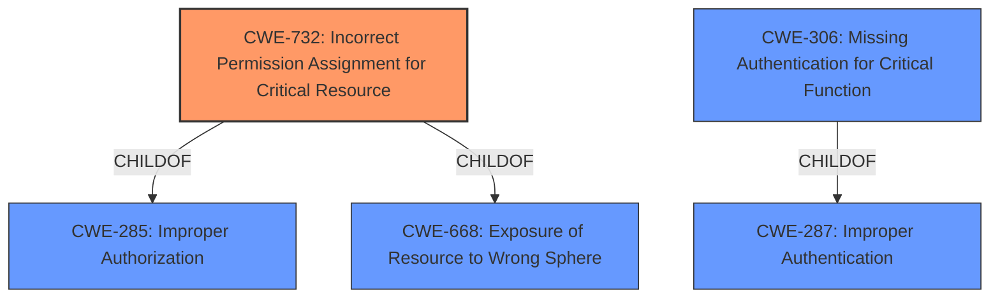

# Raw Analyzer Response for CVE-2021-31475

# Summary
| CWE ID  | CWE Name                                                      | Confidence | CWE Abstraction Level | CWE Vulnerability Mapping Label | CWE-Vulnerability Mapping Notes |
| :-------- | :------------------------------------------------------------ | :--------- | :---------------------- | :------------------------------ | :------------------------------ |
| CWE-732   | Incorrect Permission Assignment for Critical Resource       | 0.9        | Class                   | Allowed-with-Review             | Primary CWE                     |
| CWE-863   | Incorrect Authorization                                       | 0.7        | Class                   | Allowed-with-Review             | Secondary Candidate             |
| CWE-306   | Missing Authentication for Critical Function                | 0.6        | Base                    | Allowed                         | Secondary Candidate             |

## Evidence and Confidence

*   **Confidence Score:** 0.8
*   **Evidence Strength:** HIGH

## Relationship Analysis
The primary CWE is CWE-732, which is a child of CWE-285 (Improper Authorization) and CWE-668 (Exposure of Resource to Wrong Sphere). This indicates that the vulnerability is related to authorization and resource management. CWE-863 is also related to authorization, making it a relevant consideration. CWE-306 (Missing Authentication for Critical Function) is also a child of CWE-287 (Improper Authentication), suggesting a potential authentication-related aspect. However, since the vulnerability description mentions "unprivileged users" accessing a resource rather than a complete lack of authentication, CWE-732 is a more precise match.

## Vulnerability Chain
The vulnerability chain starts with an **insecure WCF service configuration**, leading to **unprivileged users gaining access to critical resources**. This leads to the **ability to execute arbitrary code with administrator privileges**, resulting in a **full system compromise**.
  - Root Cause: **Insecure WCF service configuration**
  - Weakness: **Incorrect permission assignment** (CWE-732)
  - Impact: **Remote code execution**

## Summary of Analysis
The initial assessment strongly pointed towards CWE-732 as the primary weakness, supported by the vulnerability description stating that the **"WCF service configuration allows access to critical resource by unprivileged users."** The description in the "CVE Reference Links Content Summary" reinforces this by highlighting **"improper authorization: The WCF service configuration permits access to critical resources by unprivileged users."**

CWE-732 (Incorrect Permission Assignment for Critical Resource) aligns well with the root cause: The **WCF service configuration allows a critical resource to be accessed by unprivileged users.** This maps directly to the CWE description: "The product specifies permissions for a security-critical resource in a way that allows that resource to be read or modified by unintended actors."

The other CWEs from **Complete CWE Specifications** were considered but not used as follows:

*   CWE-285 (Improper Authorization): Considered because CWE-732 is a child of CWE-285. However, CWE-732 provides a more specific description of the issue than the more general CWE-285, so CWE-732 is a better fit. The Mapping Guidance for CWE-285 suggests considering mapping to CWE-732 or other children.
*   CWE-321 (Use of Hard-coded Cryptographic Key) and CWE-259 (Use of Hard-coded Password): These are less relevant because the vulnerability does not directly involve hard-coded credentials.
*   CWE-306 (Missing Authentication for Critical Function): Considered because the issue involves unauthorized access. However, the problem isn't a complete lack of authentication but rather incorrect permissions granted to authenticated users.
*   CWE-269 (Improper Privilege Management): This is a high-level class and not specific enough to describe the vulnerability.
*   CWE-250 (Execution with Unnecessary Privileges): This describes a slightly different scenario where code is executed with higher privileges than required. In this case, the vulnerability is about the misconfiguration of access control that leads to privilege escalation.
*   CWE-20 (Improper Input Validation): Not applicable as the vulnerability is not related to input validation.
*   CWE-284 (Improper Access Control): This is too broad; CWE-732 provides a more precise description.
*   CWE-367 (Time-of-check Time-of-use (TOCTOU) Race Condition): While race conditions can lead to privilege escalation, there's no direct evidence of a TOCTOU condition in the vulnerability description.

The final selection of CWE-732 is at the optimal level of specificity, providing a clear and accurate representation of the vulnerability based on the provided evidence.