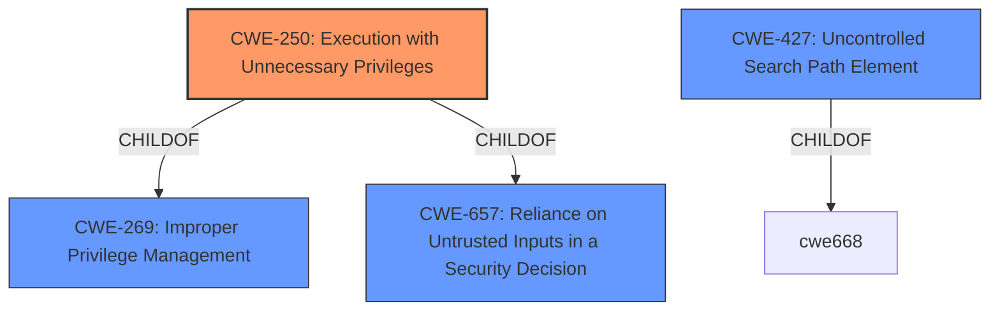

# Raw Analyzer Response for CVE-2021-31523

# Summary
| CWE ID | CWE Name | Confidence | CWE Abstraction Level | CWE Vulnerability Mapping Label | CWE-Vulnerability Mapping Notes |
|---|---|---|---|---|---|
| CWE-250 | Execution with Unnecessary Privileges | 0.9 | Base | Allowed | Primary CWE |
| CWE-427 | Uncontrolled Search Path Element | 0.7 | Base | Allowed | Secondary Candidate |

## Evidence and Confidence

*   **Confidence Score:** 0.8
*   **Evidence Strength:** HIGH

## Relationship Analysis
The primary CWE identified is CWE-250, which falls under the broader categories of CWE-269 (Improper Privilege Management) and CWE-657 (Reliance on Untrusted Inputs in a Security Decision). CWE-250 represents the specific issue of running an application with more privileges than necessary, exacerbating potential vulnerabilities. CWE-427 (Uncontrolled Search Path Element) is considered as a related weakness where the application might load resources from untrusted locations due to its elevated privileges, but is not the primary weakness.

## Vulnerability Chain
The vulnerability chain starts with the **root cause** of `cap_net_raw` being **enabled for the /usr/libexec/xscreensaver/sonar file**. This leads to **Execution with Unnecessary Privileges (CWE-250)**, which allows local users to gain elevated privileges. If the application were to load libraries or other resources, this could potentially lead to **Uncontrolled Search Path Element (CWE-427)** exploitation, but that is only a possibility. The final impact is the potential for local users to gain privileges, such as creating raw sockets or capturing network traffic.

## Summary of Analysis
The analysis strongly supports the classification of this vulnerability as **CWE-250 Execution with Unnecessary Privileges**. The vulnerability description explicitly states that the **root cause** is **"cap_net_raw enabled for the /usr/libexec/xscreensaver/sonar file"**, which directly implies that the program is running with elevated privileges that are not required. The evidence from the CVE Reference Links Content Summary confirms that the `sonar` executable has the `cap_net_raw` capability, which is unnecessary for its intended function and allows unprivileged users to perform privileged actions. This unnecessary capability directly matches the definition of CWE-250, where a product performs an operation at a higher privilege level than required.

The Retriever Results also list CWE-250 as the top candidate with the highest score. The MITRE mapping guidance for CWE-250 indicates that it is at the Base level of abstraction, which is preferred for mapping root causes, and that it is acceptable to use if the name and description accurately fit the vulnerability, which is the case here.

CWE-427 (Uncontrolled Search Path Element) was considered because elevated privileges could lead to loading resources from unintended locations. However, the primary issue is the unnecessary privilege itself, not necessarily the exploitation of search paths. Thus, CWE-427 is a secondary consideration.

The selected CWE is at the optimal level of specificity because it directly addresses the **root cause** of the vulnerability: the `sonar` executable running with unnecessary `cap_net_raw` privileges. This is a base-level weakness that accurately represents the coding error and its potential security implications.

Relevant CWE Information:

# Enhanced Context (25 CWEs)

## CWE-41: Improper Resolution of Path Equivalence
**Abstraction Level**: Base
**Similarity Score**: 0.74
**Source**: dense

**Description**:
The product is vulnerable to file system contents disclosure through path equivalence. Path equivalence involves the use of special characters in file and directory names. The associated manipulations are intended to generate multiple names for the same object.

**Mapping Guidance**:
- Usage: Allowed
- Rationale: This CWE entry is at the Base level of abstraction, which is a preferred level of abstraction for mapping to the root causes of vulnerabilities.

## CWE-1289: Improper Validation of Unsafe Equivalence in Input
**Abstraction Level**: Base
**Similarity Score**: 0.73
**Source**: dense

**Description**:
The product receives an input value that is used as a resource identifier or other type of reference, but it does not validate or incorrectly validates that the input is equivalent to a potentially-unsafe value.

**Mapping Guidance**:
- Usage: Allowed
- Rationale: This CWE entry is at the Base level of abstraction, which is a preferred level of abstraction for mapping to the root causes of vulnerabilities.

## CWE-653: Improper Isolation or Compartmentalization
**Abstraction Level**: Class
**Similarity Score**: 0.73
**Source**: dense

**Description**:
The product does not properly compartmentalize or isolate functionality, processes, or resources that require different privilege levels, rights, or permissions.

**Mapping Guidance**:
- Usage: Allowed
- Rationale: This CWE entry is at the Base level of abstraction, which is a preferred level of abstraction for mapping to the root causes of vulnerabilities.

## CWE-73: External Control of File Name or Path
**Abstraction Level**: Base
**Similarity Score**: 0.73
**Source**: dense

**Description**:
The product allows user input to control or influence paths or file names that are used in filesystem operations.

**Mapping Guidance**:
- Usage: Allowed
- Rationale: This CWE entry is at the Base level of abstraction, which is a preferred level of abstraction for mapping to the root causes of vulnerabilities.

## CWE-184: Incomplete List of Disallowed Inputs
**Abstraction Level**: Base
**Similarity Score**: 0.73
**Source**: dense

**Description**:
The product implements a protection mechanism that relies on a list of inputs (or properties of inputs) that are not allowed by policy or otherwise require other action to neutralize before additional processing takes place, but the list is incomplete.

**Mapping Guidance**:
- Usage: Allowed
- Rationale: This CWE entry is at the Base level of abstraction, which is a preferred level of abstraction for mapping to the root causes of vulnerabilities.

## CWE-59: Improper Link Resolution Before File Access ('Link Following')
**Abstraction Level**: Base
**Similarity Score**: 0.73
**Source**: dense

**Description**:
The product attempts to access a file based on the filename, but it does not properly prevent that filename from identifying a link or shortcut that resolves to an unintended resource.

**Mapping Guidance**:
- Usage: Allowed
- Rationale: This CWE entry is at the Base level of abstraction, which is a preferred level of abstraction for mapping to the root causes of vulnerabilities.

## CWE-23: Relative Path Traversal
**Abstraction Level**: Base
**Similarity Score**: 0.72
**Source**: dense

**Description**:
The product uses external input to construct a pathname that should be within a restricted directory, but it does not properly neutralize sequences such as ".." that can resolve to a location that is outside of that directory.

**Mapping Guidance**:
- Usage: Allowed
- Rationale: This CWE entry is at the Base level of abstraction, which is a preferred level of abstraction for mapping to the root causes of vulnerabilities.

## CWE-138: Improper Neutralization of Special Elements
**Abstraction Level**: Class
**Similarity Score**: 0.72
**Source**: dense

**Description**:
The product receives input from an upstream component, but it does not neutralize or incorrectly neutralizes special elements that could be interpreted as control elements or syntactic markers when they are sent to a downstream component.

**Mapping Guidance**:
- Usage: Discouraged
- Rationale: This CWE entry is a level-1 Class (i.e., a child of a Pillar). It might have lower-level children that would be more appropriate

## CWE-668: Exposure of Resource to Wrong Sphere
**Abstraction Level**: Class
**Similarity Score**: 0.72
**Source**: dense

**Description**:
The product exposes a resource to the wrong control sphere, providing unintended actors with inappropriate access to the resource.

**Mapping Guidance**:
- Usage: Discouraged
- Rationale: CWE-668 is high-level and is often misused as a catch-all when lower-level CWE IDs might be applicable. It is sometimes used for low-information vulnerability reports [REF-1287]. It is a level-1 Class (i.e., a child of a Pillar). It is not useful for trend analysis.

## CWE-