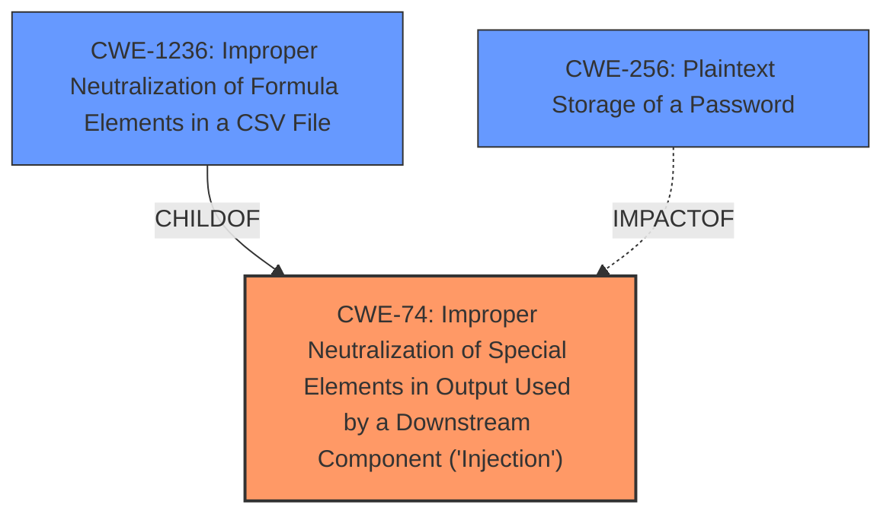

# Analysis Report for CVE-2021-3154

# Vulnerability Analysis Report: CVE-2021-3154

## Description


## Analysis (with Relationship Data)

# Summary

| CWE ID | CWE Name | Confidence | CWE Abstraction Level | CWE Vulnerability Mapping Label | CWE-Vulnerability Mapping Notes |
|---|---|---|---|---|---|
| CWE-74 | Improper Neutralization of Special Elements in Output Used by a Downstream Component ('Injection') | 0.8 | Class | Allowed | Primary CWE |
| CWE-1236 | Improper Neutralization of Formula Elements in a CSV File | 0.6 | Base | Allowed | Secondary Candidate |
| CWE-256 | Plaintext Storage of a Password | 0.5 | Base | Allowed | Secondary Candidate |

## Evidence and Confidence

*   **Confidence Score:** 0.8
*   **Evidence Strength:** MEDIUM

## Relationship Analysis
The primary CWE selected is CWE-74, which is a class-level CWE. While normally a more specific Base or Variant CWE would be preferred, the retriever results and vulnerability description point to a generic injection issue. CWE-1236 is a child of CWE-74 and represents CSV injection. The vulnerability does involve a macro injection, so CWE-1236 is a reasonable candidate. The impact of the vulnerability is retrieving cleartext passwords, so CWE-256 is also a reasonable candidate.



## Vulnerability Chain
The vulnerability involves **macro injection**, leading to the retrieval of cleartext passwords.

Root Cause: **Macro Injection** (CWE-74).
Impact: Retrieval of cleartext passwords.

## Summary of Analysis
The initial analysis focused on identifying the **root cause** of the vulnerability, which is **macro injection**. The vulnerability description and the CVE Reference Links Content Summary both point to this. The primary CWE selected is CWE-74, as it represents a broad class of injection vulnerabilities. Although the vulnerability is described as a **macro injection**, the CWE-1236 is a more specific CWE which describes CSV injection, which is a form of formula injection, also known as Excel **Macro Injection**, so CWE-1236 is a reasonable candidate. The impact of the vulnerability is the retrieval of cleartext passwords, so CWE-256 is also considered.

The selection of CWE-74 is based on the evidence of **macro injection**, as stated in the "Vulnerability Description Key Phrases" and "CVE Reference Links Content Summary". The confidence level is 0.8, reflecting the direct evidence and clear relationship between the vulnerability and the CWE description.

CWE-74 is at the optimal level of specificity, given the information provided. While more specific CWEs exist for different types of injection, the description does not provide enough detail to narrow it down further.

# Relevant CWE Information:

## CWE-23: Relative Path Traversal
CWE-23 was considered but not selected because the vulnerability does not involve path traversal.

## CWE-41: Improper Resolution of Path Equivalence
CWE-41 was considered but not selected because the vulnerability does not involve path equivalence.

## CWE-74: Improper Neutralization of Special Elements in Output Used by a Downstream Component ('Injection')
CWE-74 is selected as the primary CWE because it represents the **root cause** of the vulnerability which is **macro injection**. The product does not properly neutralize special elements, allowing an attacker to inject malicious code. This could allow an unauthenticated attacker to dump user passwords in cleartext. The security implication is a complete compromise of user credentials.
This is a class-level CWE.
The official MITRE mapping guidance discourages the use of CWE-74 when lower-level weaknesses are more appropriate. However, given the limited information provided, this is the most accurate representation of the vulnerability.

## CWE-73: External Control of File Name or Path
CWE-73 was considered but not selected because the vulnerability does not involve file name or path manipulation.

## CWE-59: Improper Link Resolution Before File Access ('Link Following')
CWE-59 was considered but not selected because the vulnerability does not involve link following.

## CWE-36: Absolute Path Traversal
CWE-36 was considered but not selected because the vulnerability does not involve path traversal.

## CWE-138: Improper Neutralization of Special Elements
CWE-138 was considered but not selected because it is a high-level class and CWE-74 is a more appropriate fit.

## CWE-184: Incomplete List of Disallowed Inputs
CWE-184 was considered but not selected because the vulnerability is not directly related to an incomplete list of disallowed inputs.

## CWE-1289: Improper Validation of Unsafe Equivalence in Input
CWE-1289 was considered but not selected because the vulnerability does not involve validation of unsafe equivalence in input.

## CWE-24: Path Traversal: '../filedir'
CWE-24 was considered but not selected because the vulnerability does not involve path traversal.

## CWE-916: Use of Password Hash With Insufficient Computational Effort
CWE-916 was considered but not selected because the **root cause** of the vulnerability is not related to password hashing. The impact of the vulnerability is the retrieval of cleartext passwords, but the **weakness** is not insufficient computational effort.

## CWE-22: Improper Limitation of a Pathname to a Restricted Directory ('Path Traversal')
CWE-22 was considered but not selected because the vulnerability does not involve path traversal.

## CWE-116: Improper Encoding or Escaping of Output
CWE-116 was considered but not selected because there is no mention of encoding or escaping of output in the vulnerability description.

## CWE-23: Relative Path Traversal
CWE-23 was considered but not selected because the vulnerability does not involve path traversal.

## CWE-138: Improper Neutralization of Special Elements
CWE-138 was considered but not selected because the vulnerability description is more specific to injection.

## CWE-613: Insufficient Session Expiration
CWE-613 was considered but not selected because the vulnerability is not related to session expiration.

## CWE-94: Improper Control of Generation of Code ('Code Injection')
CWE-94 was considered but not selected because the vulnerability does not directly involve code injection.

## CWE-625: Permissive Regular Expression
CWE-625 was considered but not selected because the vulnerability does not involve regular expressions.

## CWE-78: Improper Neutralization of Special Elements used in an OS Command ('OS Command Injection')
CWE-78 was considered but not selected because the vulnerability does not involve OS command injection.

## CWE-73: External Control of File Name or Path
CWE-73 was considered but not selected because the vulnerability does not involve file name or path manipulation.

## CWE-89: Improper Neutralization of Special Elements used in an SQL Command ('SQL Injection')
CWE-89 was considered but not selected because the vulnerability does not involve SQL injection.

## CWE-184: Incomplete List of Disallowed Inputs
CWE-184 was considered but not selected because the vulnerability does not involve an incomplete list of disallowed inputs.

## CWE-41: Improper Resolution of Path Equivalence
CWE-41 was considered but not selected because the vulnerability does not involve path equivalence.

## CWE-59: Improper Link Resolution Before File Access ('Link Following')
CWE-59 was considered but not selected because the vulnerability does not involve link following.

## CWE-1236: Improper Neutralization of Formula Elements in a CSV File
CWE-1236 was considered as a secondary CWE because the vulnerability does involve a **macro injection**, so CWE-1236 is a reasonable candidate since it describes CSV injection, which is a form of formula injection, also known as Excel **Macro Injection**.

## CWE-256: Plaintext Storage of a Password
CWE-256 was considered as a secondary CWE because the impact of the vulnerability is the retrieval of cleartext passwords, so CWE-256 is a reasonable candidate.


## CWE Relationship Analysis

Current CWEs represent these abstraction levels: .


### Vulnerability Chain Analysis

**Chain starting from CWE-36:**
- 36 (Absolute Path Traversal) - ROOT


**Chain starting from CWE-116:**
- 116 (Improper Encoding or Escaping of Output) - ROOT


### CWE Relationship Diagram

```mermaid
graph TD
    classDef primary fill:#f96,stroke:#333,stroke-width:2px
    classDef secondary fill:#69f,stroke:#333
    classDef tertiary fill:#9e9,stroke:#333
```


*Report generated on 2025-04-02 06:05:17*
